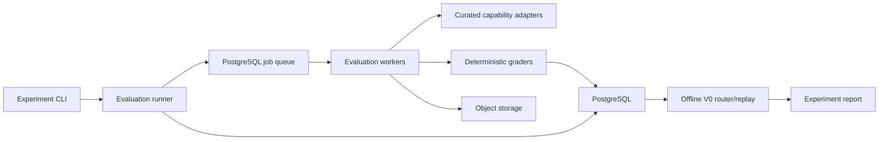
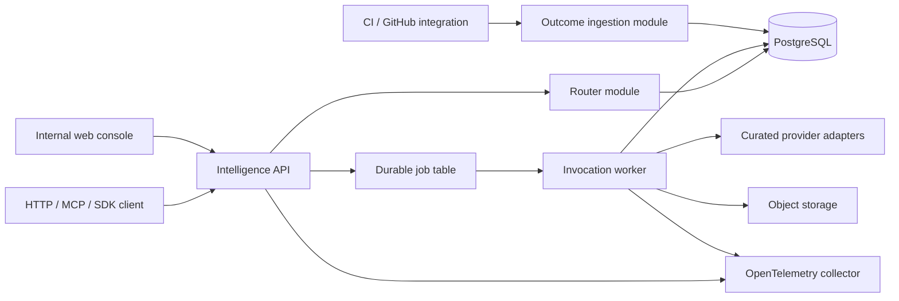

# Capability Intelligence Exchange — Implementation Plan

**Status:** Proposed execution plan

**Source:** `capability_intelligence_exchange_revised_technical_plan.md`

**Planning posture:** Staff-level implementation scope

**Initial platform release:** MCP Registry Alpha (`MCP_REGISTRY_ALPHA_IMPLEMENTATION_PLAN.md`)

**First evaluation workload after the registry foundation:** Swift/iOS concurrency pull-request review

**Primary delivery posture:** Build the registry and execution foundation first, then add comparison, outcomes, and task-aware routing

---

## 1. Executive decision

### Sequencing update — September 3, 2026

The first implementation milestone is now the closed **MCP Registry Alpha** defined in `MCP_REGISTRY_ALPHA_IMPLEMENTATION_PLAN.md`. It delivers protocol-neutral capability identity, MCP server registration and live discovery, immutable tool versions, safe invocation, a run ledger, and a basic operator UI. It precedes the evaluation/router work below and supplies reusable control-plane and execution foundations for it.

The registry is not treated as the product moat or as a replacement for the official MCP Registry. Routing evidence and attributable outcomes remain the long-term differentiators. The immediate sequencing is:

```text
M1 Registry Alpha
  -> M2 capability comparison and human feedback
  -> M3 task-aware routing and first reference vertical
```

Sections below retain the detailed evaluation and router plan for those follow-on milestones. Where their original Phase 0/Phase 1 sequence conflicts with the dedicated Milestone 1 plan, the Milestone 1 plan governs the first release.

After the Registry Alpha foundation, build the intelligence layer as two concurrent workstreams with separate release gates:

1. **Evaluation and router calibration:** a reproducible benchmark that ranks capabilities, establishes quality/cost/latency evidence, and determines when task-aware selection is safe to activate.
2. **Productization:** a closed routing API built from day one that executes curated capabilities, captures trustworthy outcomes, and can later support third-party supply.

Do not start by implementing the six logical planes as independently deployed services. For Phase 0 and the closed alpha, use a modular monolith plus workers, PostgreSQL, and object storage. Preserve domain boundaries in code and extract services only when scale, security isolation, or independent release cadence requires it.

The immediate post-registry deliverable is a closed capability comparison and routing loop with an evidence-backed selection policy. The calibration question is:

> Can pre-execution task features select a capability that improves review success over the strongest static default on unseen tasks without an unacceptable increase in cost per successful review?

The answer must come from a preregistered, held-out evaluation. If task-aware routing does not yet beat the strongest static reviewer, ship the closed alpha with the strongest eligible static quality policy, keep task-aware selection in shadow mode, and use production outcomes to improve it. Calibration controls policy activation; it does not block the platform foundation.

### Evidence update — September 3, 2026

External evidence is sufficient to retire the category-level question of whether specialized models can outperform frontier generalists. A [Shopify product-review slide shared by Tobi Lütke](https://x.com/tobi/status/2094808564355191249) reports a fine-tuned 0.8B model scoring 84.6 against GPT-5.6 Sol xhigh at 83.0 on a specialized buyer-profile task, while reducing its system prompt from 9.1K to 1.1K tokens and increasing throughput from 2M to 72M profiles per day. [Shopify's published Flow case study](https://shopify.engineering/fine-tuning-agent-shopify-flow) separately reports a fine-tuned agent that is 2.2x faster, 68% cheaper, and more accurate than the closed model it replaced, with a production feedback flywheel.

This evidence validates the strategic premise: narrow capabilities plus proprietary evaluation and outcome data can outperform general defaults. It does not remove the need to calibrate capability selection for Swift/iOS PR review or to validate the production outcome loop. Those are now treated as product quality and rollout concerns, not existential company-thesis gates.

---

## 2. Product and architecture understanding

The product is a task-level decision system, not a model router or an MCP catalog. Its proprietary loop is:

```text
Task features
  -> eligible capability versions
  -> predicted utility
  -> immutable routing decision
  -> execution
  -> attributable outcome
  -> version-specific performance history
  -> better routing
```

The implementation must preserve five invariants:

1. A capability version and its executable source are immutable.
2. A routing decision records every candidate, filter, score, input feature, and model/policy version used.
3. Benchmark results and production outcomes remain separate and carry provenance.
4. A production outcome is never attached without authorization and invocation lineage.
5. Features used to route are available before execution; ground-truth or post-execution data cannot leak into routing evaluation.

Supporting systems—provider adapters, hosted runtimes, Tangle, payments, creator tools, and public discovery—exist to supply or exercise the router. They are not prerequisites for calibrating its first policy. MCP registration and invocation are intentionally implemented first as the platform substrate described in the dedicated Registry Alpha plan; that sequencing does not make catalog breadth the product moat.

---

## 3. Required changes to the source plan

| Area | Implementation decision |
|---|---|
| Initial task | Use one canonical task ID: `software.code-review.concurrency`, constrained to Swift. Do not create a parallel `swift.*` taxonomy branch. Language and platform are task dimensions. |
| Swift execution | Include realistic UIKit/SwiftUI and iOS-shaped source in Phase 0. Make source-level review the authoritative task, so an Xcode build is not required for the routing gate. Keep a buildable Swift Package Manager subset for deterministic tooling and treat optional Xcode/macOS validation as a separately reported stratum. macOS execution cannot be treated like the proposed Linux container runtime. |
| Review grading | Use seeded or independently labeled concurrency defects with normalized finding spans and categories. Compile/test grading applies only when a capability returns a patch; it cannot by itself grade review text. |
| Success probability | V0 may return an empirical benchmark estimate and uncertainty, not a calibrated `success_probability`. Use the latter only after calibration is measured on held-out production-like data. |
| Service topology | Implement logical planes as modules in three deployables: API, worker, and web dashboard. Do not create 12–15 network services in V1. |
| Search | Use taxonomy and structured PostgreSQL filters first. Add full-text search when creator supply expands; add pgvector only after measuring structured-retrieval recall. |
| Queue | Use a PostgreSQL-backed durable job table for the experiment and alpha. Adopt Redis or Temporal only when measured throughput or orchestration needs justify it. |
| Tangle | Treat Tangle as a post-calibration challenger and optional adapter. It is not part of the initial eight-candidate matrix or on the critical path for the closed alpha. |
| Payments | Use free alpha quotas or non-cash test credits. A double-entry ledger becomes mandatory when credits have monetary value or provider liabilities exist. |
| Hosted execution | Curated platform-owned adapters only through Phase 1. Do not accept arbitrary seller containers until isolation, scanning, policy, and incident response are production-ready. |
| Learned routing | Require enough labeled, representative production outcomes and a shadow evaluation before enabling ML or online exploration. Calendar phase alone is not an entry criterion. |

---

## 4. Planning assumptions

This plan assumes:

- A core team of four engineers for Phase 0 and Phase 1: two backend/platform, one evaluation/data, and one product/full-stack. A Swift domain expert is available at least part time.
- The project owner will serve as primary Swift concurrency reviewer, and a second qualified iOS engineer is available for blinded calibration and adjudication.
- A product owner can resolve taxonomy, user-policy, and go/no-go decisions within one business day.
- The initial calibration corpus uses non-confidential public, licensed, synthetic, or explicitly sanitized cases so every candidate is eligible. Raw internally owned repositories form a separate controlled-infrastructure stratum.
- No controlled GPU infrastructure or approved private-code model-provider agreement is currently available. Phase 0 therefore does not execute model-based capabilities against raw private repositories.
- Eight curated capability implementations can be invoked through model APIs, command-line tools, or local adapters.
- Secrets for external model providers are available through a managed secret store in deployed environments and local environment injection during development.
- The first alpha is single-region and has no contractual enterprise availability requirement.
- PostgreSQL and S3-compatible object storage are managed services in non-local environments.
- All time estimates are elapsed engineering time for the assumed team, not commitments. A team of one or two should expect roughly two to three times the elapsed duration.

---

## 5. Scope and stage gates

### Phase 0: evaluation foundation and router calibration

**In scope**

- One task family and controlled task dimensions
- Versioned benchmark corpus and hidden holdout
- Five to eight curated capabilities
- Common input/output contracts
- Reproducible evaluation runner and graders
- Deterministic task-aware routing
- Static baselines and offline replay
- Cost, latency, reliability, and outcome capture
- Internal experiment report/dashboard

**Out of scope**

- Public APIs, marketplace, creator onboarding, billing, payouts
- Arbitrary external providers or containers
- General semantic discovery
- Tangle Studio
- Production learning or contextual bandits
- Private customer repositories

### Phase 1: closed coding router

**In scope**

- Authenticated `route_task` and `run_task` interfaces over HTTP and MCP
- Curated provider execution
- Asynchronous invocation lifecycle
- Automatic and explicit outcome reporting
- Idempotency, quotas, audit trails, traces, and operational dashboards
- Shadow and canary routing policies
- A small group of design partners

**Out of scope**

- Self-service seller publishing
- Cash-equivalent credits, provider settlement, or crypto
- Unreviewed containers
- Learned routing in the live path

### Gate G0 — corpus readiness

Proceed to the full experiment only when:

- every case has source/license provenance and a reproducible repository snapshot;
- every private/internal case has data-owner approval, a classification, a retention policy, and an explicit provider-processing policy;
- the corpus includes clean controls, single-defect PRs, and multi-defect or cross-file PRs;
- the primary domain reviewer labels every case, while a second qualified reviewer independently labels a stratified 20% sample and every disputed high/critical finding;
- measured inter-rater agreement reaches at least 0.80 Cohen's kappa on the stratified sample before label freeze; otherwise refine the rubric and expand dual review;
- train, validation, and hidden test groups are split by source repository and defect family to prevent near-duplicate leakage;
- the harness reproduces the same deterministic grading result in at least 98% of reruns;
- every candidate used for authoritative comparison has an immutable platform-controlled version or an attested remote implementation revision; unverified mutable remotes are excluded from G1 evidence;
- no candidate capability has received hidden labels or hidden-case artifacts.

### Gate G1 — task-aware policy activation

Enable task-aware selection in the live request path only when, on the fresh universally eligible G1 activation holdout, the quality-first policy produces at least 5 percentage points higher task success than the strongest static capability, with no more than 20% higher cost per successful task. A paired, repository-grouped bootstrap that resamples repositories and preserves paired task results within each sampled repository must show a 95% confidence interval that excludes no improvement in task success. Before freezing or executing that holdout, preregister a simulation-based power analysis using that exact resampling procedure, observed group-size distribution, and a conservative calibration-derived bound on candidate discordance. The holdout must provide at least 90% power for that confidence-interval test to detect a true five-percentage-point lift; the observed five-point threshold remains a separate activation requirement. If the available corpus is smaller than the calculated sample, expand it or keep task-aware routing in shadow mode. This holdout contains no case whose candidate outputs or labels were revealed in the initial calibration report.

A value-oriented policy should still be reported as secondary analysis, including whether it achieves at least 20% lower cost per successful task while remaining non-inferior within a 2 percentage-point success margin. It cannot substitute for the quality-first activation gate. Report all baselines and all attempted policy variants, including failures. If G1 does not pass, the closed alpha uses the strongest eligible static quality policy while task-aware decisions run in shadow mode.

### Gate G2 — closed-alpha readiness

Proceed to design partners only when:

- tenant authorization, idempotency, audit logs, data retention, and secret handling have passed review;
- the invocation SLO and recovery tests in Section 15 pass in staging;
- at least 90% of alpha-eligible invocations can receive an automatic or attributable explicit outcome;
- route decisions are replayable from stored feature and candidate snapshots;
- provider disablement and policy rollback complete without a redeploy.

Any alpha use of private repositories additionally requires either controlled model infrastructure or an approved provider agreement covering no training, zero retention, security, and incident obligations.

### Gate G3 — creator platform readiness

Open supply only after the closed alpha demonstrates sustained buyer demand, useful outcome density, and operational stability. Minimum evidence should include eight consecutive weeks of usage, at least 5,000 attributable invocations, and no unresolved critical isolation or cross-tenant findings.

### Gate G4 — learned-routing readiness

Enable learned routing in shadow mode only when each trained segment has adequate support, temporal holdout performance exceeds V0, predictions are calibrated, and drift/rollback controls exist. A practical starting threshold is 10,000 high-confidence production outcomes overall and at least 500 outcomes in every segment used directly by the model; the data review may raise these thresholds.

---

## 6. Delivery architecture

### 6.1 Phase 0 topology



The evaluation runner executes every eligible capability against the same versioned task inputs. The router consumes completed results for train/validation groups and is evaluated against unseen test-group outcomes. There is no production request path in Phase 0.

### 6.2 Phase 1 topology



Deployables:

- `api`: authentication, route and invocation endpoints, control-plane administration, outcome ingestion.
- `worker`: benchmark and production invocation jobs with separate queues and concurrency limits.
- `web`: experiment results and internal operations console.

Logical modules:

- `taxonomy`
- `capabilities`
- `routing`
- `evaluation`
- `invocations`
- `outcomes`
- `providers`
- `artifacts`
- `identity`
- `telemetry`

Modules communicate through typed in-process interfaces and persisted domain events. They must not query another module's tables through ad hoc joins from application code. This preserves future extraction without paying distributed-system costs now.

### 6.3 Extraction triggers

Create an independent network service only when one of these is true:

- it needs a different trust boundary, such as untrusted execution;
- its scaling unit differs by more than an order of magnitude from the API;
- it needs an independent deployment or availability target;
- it has a distinct data-governance boundary;
- measured contention cannot be fixed with worker pools, indexes, or database partitioning.

The likely first extractions are the runtime sandbox and evaluation workers. The router should remain a versioned library/module until independent scaling or release cadence is demonstrated.

### 6.4 Initial repository structure

```text
modall/
├── apps/
│   ├── api/                       # FastAPI application
│   ├── worker/                    # Evaluation and invocation workers
│   └── web/                       # Internal console
├── packages/
│   ├── domain/                    # IDs, enums, domain events, state machines
│   ├── taxonomy/                  # Versioned task ontology and feature extraction
│   ├── manifests/                 # Capability manifest schema and validation
│   ├── routing/                   # Candidate filtering, policies, replay
│   ├── evaluation/                # Suites, graders, statistics
│   ├── providers/                 # Adapter protocol and curated adapters
│   ├── persistence/               # SQLAlchemy models, repositories, migrations
│   ├── telemetry/                 # OTel and structured logging
│   ├── python-sdk/
│   ├── typescript-sdk/
│   └── mcp-server/
├── benchmarks/
│   ├── public/                    # Shareable case definitions
│   └── tooling/                   # Corpus build and validation tools
├── capabilities/                  # Curated adapter configurations/manifests
├── schemas/                       # JSON Schema and generated OpenAPI artifacts
├── infrastructure/
│   ├── local/
│   ├── terraform/
│   └── kubernetes/                # Add when needed; not required for Phase 0
├── docs/
│   ├── adr/
│   ├── runbooks/
│   └── experiments/
└── tests/
    ├── contract/
    ├── integration/
    ├── replay/
    └── end_to_end/
```

Use Python, FastAPI, Pydantic, SQLAlchemy, Alembic, PostgreSQL, and OpenTelemetry as proposed. Use object storage for repository bundles and large results; never place large source archives or raw model transcripts directly in PostgreSQL.

---

## 7. Canonical domain contracts

### 7.1 Identity and versioning

Use sortable opaque IDs, such as UUIDv7 or ULID, for records. Human-readable slugs are mutable aliases and must not be foreign keys.

A routable implementation identity is the tuple:

```text
capability_id
capability_version_id
deployment_id
source_digest
adapter_version
```

Publishing freezes the capability version, schemas, task claims, price policy, required permissions, and source digest. Operational deployment fields such as health and capacity may change, but changes are audited.

### 7.2 Task contract

```json
{
  "taxonomy": "software.code-review.concurrency",
  "taxonomy_version": "1.0.0",
  "intent": "Review this Swift change for concurrency defects",
  "attributes": {
    "language": "swift",
    "platform": "ios",
    "change_size": "medium",
    "context_requirement": "multi_file",
    "toolchain": "swift-6.x",
    "data_classification": "confidential",
    "allowed_execution_zones": ["controlled", "approved_zero_retention"]
  },
  "inputs": {
    "repository_snapshot_uri": "artifact://...",
    "base_revision": "...",
    "head_revision": "...",
    "diff_uri": "artifact://..."
  }
}
```

Persist both the normalized task and the original request. Feature extraction produces an immutable `task_feature_snapshot` tied to an extractor version.

### 7.3 Capability input and output

Every Phase 0 capability receives an immutable repository snapshot, diff, task metadata, execution budget, and trace context. GitHub URLs are never the authoritative benchmark input because their content can change.

The normalized review output is:

```json
{
  "findings": [
    {
      "category": "data_race",
      "severity": "high",
      "path": "Sources/App/Store.swift",
      "start_line": 42,
      "end_line": 48,
      "message": "...",
      "confidence": 0.91
    }
  ],
  "summary": "...",
  "patch": null
}
```

Adapter-specific raw output first enters the Registry Alpha quarantine and classification path. Retain it as an encrypted restricted artifact only when policy allows; ordinary APIs expose only the validated normalized output or a safe quarantine placeholder. Normalization failures count against reliability and are not silently repaired by the platform unless the repair step is declared as part of the capability version.

### 7.4 Routing decision

A routing decision is append-only and includes:

- request and workspace policy IDs;
- taxonomy and feature-extractor versions;
- all discovered candidates;
- filter pass/fail results and reason codes;
- expected quality, cost, latency, and uncertainty for each eligible candidate;
- routing policy and router version;
- selected exact implementation and deterministic tie-break input;
- exploration flag and experiment assignment;
- quote/estimate expiry;
- correlation and trace IDs.

The V0 API response calls its quality field `benchmark_success_estimate` and includes `sample_size`, `confidence_interval`, and `estimate_kind`. Rename it to `success_probability` only after a calibration gate.

### 7.5 Invocation lifecycle

```text
Invocation
accepted -> queued -> preparing -> running
accepted | queued | preparing -> cancelled
running -> fallback_queued -> running
fallback_queued -> cancelled
running -> execution_succeeded | execution_failed | execution_timed_out
running -> cancelled | indeterminate

Attempt
created -> dispatch_fenced -> awaiting_result
created -> cancelled
dispatch_fenced | awaiting_result -> succeeded | failed | timed_out | cancelled | indeterminate

Outcome (orthogonal to invocation execution state)
not_expected
pending -> finalized | unavailable
```

Every transition is an append-only event guarded by an allowed-transition table. The current state is a materialized projection. Duplicate worker delivery must be safe.

An attempt failure or timeout does not by itself authorize fallback. The orchestrator may enter `fallback_queued` and create a child attempt linked by `parent_attempt_id` only when durable evidence proves the prior attempt did not execute, or when every candidate in the fallback chain honors the same tested end-to-end idempotency key for the external operation. A failure response alone is not proof of non-execution. Any post-fence timeout or lost response with uncertain acceptance moves the invocation to `indeterminate` with `reconciliation_required`; it never creates a fallback attempt. When the fallback guard fails or eligible fallback is exhausted, the invocation moves to the corresponding execution-terminal state.

Execution status and outcome status are separate projections. Execution reaches a terminal state regardless of whether downstream outcome evidence arrives. At execution completion, an eligible invocation receives an outcome record with `pending` plus a fixed `evidence_due_at`; it transitions to `finalized` when adequate evidence arrives or `unavailable` when the deadline expires. An ineligible invocation receives terminal `not_expected`. Late evidence creates a superseding outcome version without reopening execution state.

Before any provider network send, persist `dispatch_fenced` in the same transaction that records the attempt ownership. Record an evidence-backed execution disposition of `not_executed`, `executed`, or `unknown` separately from transport status. A recovered `created` attempt is safe to dispatch. A recovered `dispatch_fenced` or `awaiting_result` attempt without a durable terminal response has disposition `unknown` and must not be sent again or fall back: persist any available provider receipt and move it to `indeterminate` with `reconciliation_required`. This deliberately prefers manual reconciliation to duplicating an external side effect.

### 7.6 Outcome contract and truth hierarchy

Outcome evidence is ranked:

1. Reproducible hidden tests, build, or static checks tied to the returned artifact
2. Signed CI/GitHub integration events
3. Downstream automation with invocation correlation
4. Buyer or agent explicit report
5. Passive signals such as no retry

Store evidence separately from the derived label. An outcome label contains labeler/version, confidence, evidence IDs, timestamp, and supersession lineage. Conflicting evidence produces `disputed`, not a silent overwrite. Provider self-reports cannot create high-confidence success labels.

---

## 8. Evaluation and router-calibration specification

### 8.1 Hypothesis

Swift concurrency-review implementations have heterogeneous performance across observable task characteristics, and a deterministic router using only pre-execution features can exploit that heterogeneity on unseen tasks.

### 8.2 Budget-calibration pilot

Before producing the official train/validation/test matrix, run every candidate on a separate set of 20 representative non-confidential PRs under generous emergency safety limits. These PRs are permanently excluded from official benchmark splits and routing-lift calculations. Raw internal PRs cannot enter this pilot because no third-party provider is currently approved to process private source.

The pilot measures complete end-to-end cost, latency, context volume, output volume, tool usage, timeout behavior, and successful-review rates. Use it to establish:

- the global maximum allowed cost per review;
- the global wall-clock deadline;
- controlled-cohort token and tool budgets;
- capability-specific concurrency and resource limits;
- output and artifact size limits;
- the definition of a billable/chargeable failed attempt.

For the hidden experiment, set cost and latency ceilings to the observed p95 of successful pilot runs for the strongest-quality candidate plus 20% headroom, unless that would exceed a separately approved safety ceiling. Apply the resulting global ceilings to every candidate. Record exclusions caused by the ceilings as failures or ineligibility according to the preregistered protocol; do not silently increase limits after viewing hidden results.

### 8.3 Corpus

Start with a 75–100-case universally eligible, non-confidential calibration suite to calibrate graders, candidate behavior, feature extraction, and the static production policy. This suite has its own grouped split:

- 60% training
- 20% validation
- 20% locked calibration test

The calibration test remains hidden until the initial report, then is permanently marked revealed and cannot contribute to the G1 activation holdout.

Continue expanding to a separate activation benchmark while the router alpha is built, using 200–300 cases as the first authoring tranche rather than a fixed cap. Before allocating groups, preregister the G1 power calculation defined in the gate: simulate the exact paired, repository-grouped bootstrap with the planned group distribution and a conservative calibration-derived discordance bound, and choose a fresh activation-holdout size that gives the confidence-interval test at least 90% power to detect a true five-percentage-point lift. Freeze that many newly added grouped cases and their labels before final policy selection; do not run candidates on them or reveal any artifact until the static baseline and task-aware policy are frozen. Previously revealed calibration-test cases may enter a later training pool with explicit provenance but never the activation holdout. Expand beyond 300 total cases whenever the preregistered calculation requires it; an underpowered result cannot activate task-aware routing.

Split by repository and defect archetype group, not by individual diff, so close variants cannot cross groups. Keep the test labels encrypted or access-controlled from capability authors and router development.

Each case contains:

- immutable source snapshot and license/provenance;
- base/head revisions and canonical diff;
- zero or more labeled concurrency defects plus an explicit `clean` or `defective` case kind;
- allowed category aliases and span tolerances;
- case-specific false-positive limit, with clean cases defaulting to zero;
- task dimensions computable before execution;
- pinned Swift toolchain and environment image/runner label;
- public setup metadata and private grading metadata;
- expected runtime class and resource limits;
- contamination and duplication notes.

Use realistic iOS-shaped repositories and PRs, including UIKit and SwiftUI code. Source-level defect detection is the primary evaluation path and must be reproducible without compiling the app. Maintain a buildable Swift Package Manager subset for analyzers that benefit from compiler context. Any Xcode build/test evidence runs on pinned macOS images as a separate stratum and is reported independently from the primary routing gate.

Target this case composition:

- 25% clean PRs with no labeled concurrency defect;
- 45% single-defect PRs;
- 30% multi-defect, cross-file, or context-dependent PRs.

The clean controls are mandatory because a reviewer that flags every concurrency pattern must not score well. Defect families should include actor isolation, `Sendable` violations, unsafe shared state, task cancellation, continuation misuse, main-actor violations, reentrancy, and detached-task misuse.

Use two separate data strata.

**Primary universal-eligibility corpus**

- 55% licensed public iOS repositories and controlled mutations of them;
- 30% purpose-built realistic iOS fixtures;
- 15% defect patterns re-authored from internal experience only when a data owner confirms that the resulting code is non-confidential and cannot reconstruct the original source.

Every candidate in both cohorts must be eligible for every case in this corpus. Gate G1 is calculated only on the fresh activation holdout in the universal-eligibility stratum. The initial 75–100 cases support calibration and shadow routing; their revealed test cases never count as unseen G1 evidence. The expanded, adequately powered activation benchmark supports live task-aware activation.

**Private generalization corpus**

- during Phase 0, inventory and label approximately 20 representative historical PRs from internally owned repositories to validate taxonomy and grading realism;
- do not send their code, diffs, embeddings, or derived source artifacts to third-party model providers;
- CPU-only deterministic tooling may be exercised inside controlled machines for harness validation, but those results are not evidence of routing lift;
- after initial calibration and once secure model execution becomes available, expand toward 50–100 verified historical PRs and controlled mutations;
- execute the expanded corpus solely with eligible controlled or contractually approved capabilities;
- report results separately and never aggregate them into the universal candidate comparison.

Source mix and defect composition are independent dimensions. Private snapshots remain denied to every third-party provider because no processing agreement is currently in place. If approved no-training and zero-retention agreements are established later, eligibility changes apply only to new evaluation runs and never rewrite historical candidate sets.

### 8.4 Initial capability set

Test two explicit cohorts under the same task input and normalized finding-output contracts.

**Cohort A — controlled model baselines**

1. OpenAI `gpt-5.6-sol` through the Responses API
2. Anthropic `claude-opus-5` through the Messages API
3. Google `gemini-3.8-flash` through the Gemini API

OpenAI and Anthropic API access and billing are confirmed. Gemini API access must be established before the budget-calibration pilot. These selections are frozen as of September 2, 2026, subject only to an availability check before pilot execution. If a selected model becomes unavailable, choose and document a replacement before any official matrix run; never substitute a model silently or midway through a benchmark version.

These three candidates use the same semantic system prompt, context assembly, tool contract, retry policy, maximum output, and output normalizer. Provider wrappers may translate message and tool schemas but cannot add hidden prompting or repair stages. Use a preregistered provider-native reasoning tier and omit sampling parameters that a provider does not support; do not pretend unlike reasoning controls are numerically equivalent. Enforce the same pilot-derived cost and wall-clock ceilings and record actual input, reasoning, cached, and output usage where exposed. This cohort measures model-selection lift while minimizing workflow confounding.

**Cohort B — differentiated capabilities**

4. Codex CLI reviewer with pinned client, configuration, tools, and model selection
5. Claude Code reviewer with pinned client, configuration, tools, and model selection
6. Deterministic SwiftSyntax-based concurrency analyzer
7. SwiftSyntax/static-analysis plus model hybrid reviewer
8. Specialized Swift-concurrency review agent

Differentiated candidates may use distinct prompts, tools, stages, and runtimes, but must receive equivalent authoritative task inputs and return the shared normalized schema. Their declared version includes every workflow dependency. Total end-to-end cost and latency include all internal stages and model calls.

Grok, Muse, multi-agent orchestration, and Tangle are explicitly deferred from the initial matrix. They may enter as post-calibration challengers through the same adapter contract and evaluation process; none is a dependency of the closed alpha.

The primary router selects across both cohorts. The strongest static baseline is the best single candidate from either cohort, selected on the applicable validation data and frozen before each hidden test. The experiment report must also show Cohort A alone, Cohort B alone, and the combined set so model-routing lift and full capability-routing lift are distinguishable.

The preceding comparison applies to the universal-eligibility corpus. Model-based routing on the private generalization corpus is deferred until controlled GPU infrastructure or approved provider processing is available. CPU-only deterministic runs are harness diagnostics, not a substitute for a multi-candidate routing experiment.

Pin model identifiers, prompts, tool definitions, supported sampling/reasoning configuration or explicit omission, maximum output, adapter code, and provider routing settings. If the upstream provider cannot pin a model revision, record that limitation and the exact execution timestamp.

Run stochastic capabilities at least three times per task/capability pair. Treat repeated runs as nested observations, not independent tasks, in confidence intervals.

### 8.5 Grading

Match findings to labels using category compatibility, file identity, and configured line-span overlap. Record:

- weighted defect recall;
- precision and false-positive count;
- critical-defect recall;
- schema validity;
- tool/runtime failure;
- wall-clock latency;
- provider-reported and platform-calculated cost;
- optional patch build/test result.

A task-level binary success should be fixed before the hidden run. Defective and clean cases use separate, total definitions so recall is never evaluated with a zero denominator.

For a defective case:

```text
all critical defects found
AND weighted recall >= 0.80
AND no more than the case-specific false-positive limit
AND output schema valid
AND no execution failure
```

For a clean case:

```text
false-positive count <= the case-specific limit (default 0)
AND output schema valid
AND no execution failure
```

A false positive is a reportable candidate finding that does not match a label after the frozen matching and adjudication rules. Weighted and critical-defect recall are recorded as not applicable for clean cases, not as zero or one. Aggregate recall is calculated over defective cases; the overall task-success rate includes both clean and defective cases.

Use a blinded human adjudication queue only for ambiguous matches. Freeze adjudication rules before test evaluation and report human-review frequency.

The project owner is the primary Swift concurrency reviewer and labels every case against the frozen rubric. A second qualified reviewer, blinded to candidate identity and the primary label during independent review, covers a stratified 20% sample across clean/single/complex cases and defect families plus every disputed high/critical candidate finding. If the two reviewers cannot resolve a material disagreement, use a third reviewer or exclude the case under a preregistered rule; the primary reviewer cannot unilaterally break ties after seeing candidate outputs.

### 8.6 V0 routing

Candidate filtering is hard and ordered:

1. exact taxonomy support;
2. compatible language, platform, toolchain, input, and output schemas;
3. permission and data-handling compatibility;
4. healthy deployment and capacity;
5. price and latency ceilings;
6. minimum evidence threshold.

For sparse feature buckets, estimate quality with empirical-Bayes shrinkage toward the capability's global result rather than using raw small-sample rates. Phase 0 uses lexicographic quality-first ranking:

```text
1. reject candidates below the validation-derived critical-recall floor;
2. reject candidates above the validation-derived false-positive ceiling;
3. rank by uncertainty-adjusted task-specific quality estimate;
4. when candidates are within a preregistered quality-equivalence band, prefer lower cost;
5. use latency and deterministic implementation identity as final tie-breakers.
```

Cost cannot compensate for a material quality deficit. Normalize cost and latency only for the equivalence-band tie-break and for secondary `best_value` analysis. That secondary policy may rank using:

```text
utility = quality_weight * quality_estimate
        - cost_weight * normalized_cost
        - latency_weight * normalized_latency
        - risk_weight * uncertainty_penalty
```

Quality floors, uncertainty penalties, the equivalence band, secondary-policy weights, priors, minimum sample sizes, missing-value behavior, and tie-breaking are configuration under an immutable router version. The final test run may not tune them.

Required baselines:

- strongest static capability selected on validation data;
- cheapest eligible capability;
- highest global validation success rate;
- oracle upper bound that selects the successful candidate after observing results—reported only to measure routing headroom;
- random eligible candidate as a diagnostic.

### 8.7 Analysis

Report:

- task success and paired difference versus every baseline;
- cost per successful task;
- latency per successful task;
- capability failure and invalid-output rates;
- selection share by capability and feature segment;
- controlled-model, differentiated-capability, and combined-cohort routing results;
- an ablation showing the incremental lift from adding differentiated capabilities to the controlled model set;
- universal and private-stratum results reported separately, with candidate eligibility made explicit;
- paired bootstrap confidence intervals grouped by repository, with paired task results and nested stochastic reruns preserved within each resampled repository;
- sensitivity to policy weights and missing features;
- oracle headroom;
- train/validation/test divergence;
- all excluded or disputed cases with reasons.

The final report is generated from committed result snapshots and a versioned analysis program. A second engineer must reproduce it from scratch.

### 8.8 Phase 0 work breakdown

| Epic | Deliverable | Acceptance criteria | Owner profile |
|---|---|---|---|
| P0-01 Protocol | Preregistered calibration and activation gate | Metrics, split, baselines, success definition, exclusions, and statistics approved before hidden runs | Staff/data |
| P0-02 Taxonomy | Versioned task and feature schema | JSON Schema validation; feature provenance; no post-outcome fields | Backend/domain |
| P0-03 Corpus | 75–100-case calibration suite plus an activation benchmark whose first authoring tranche is 200–300 cases and whose final size follows the preregistered power calculation | Initial revealed test is excluded from G1; expanded version passes G0 and reserves a fresh untouched grouped holdout giving the CI test at least 90% power to detect a true five-point lift | Swift/evaluation |
| P0-04 Harness | Durable execution and artifact capture | Resumable, idempotent matrix runs; pinned environment; per-run cost/latency | Platform |
| P0-04A Budget pilot | Separate 20-PR candidate matrix and frozen limits | Pilot cases excluded from official splits; cost/latency/resource ceilings approved before official matrix | Platform/product |
| P0-05 Adapter SDK | Common adapter protocol and eight candidates | Contract suite passes; policy-permitted raw artifacts are quarantined/restricted and normalized outputs retained | Backend/AI |
| P0-06 Graders | Deterministic matching and adjudication queue | Golden tests include empty-label clean cases and false-positive failures; rerun agreement >=98%; versioned rules | Evaluation |
| P0-07 Router V0 | Filter/rank/reason implementation | Deterministic replay from snapshots; no hidden data access | Backend/data |
| P0-08 Analysis | Baseline comparison and confidence intervals | Reproducible report; the same paired repository-grouped bootstrap used for G1 sizing and activation; sensitivity analysis | Data/full-stack |
| P0-09 Policy decision | Written static-versus-task-aware release review | Evidence, limitations, shadow plan, and policy recommendation signed off | Tech/product leads |

### 8.9 Post-registry Phase 0 schedule

This schedule begins only after the MCP Registry Alpha release gate passes. With the assumed follow-on team, target three elapsed weeks for initial calibration while the post-registry Phase 1 routing foundations start in parallel:

- **Post-registry Week 1:** ADRs, contracts, corpus rubric, harness skeleton, extensions to the existing API/persistence foundation
- **Post-registry Week 2:** first adapters and graders, 20-PR budget pilot, frozen execution limits, first 40–50 cases
- **Post-registry Week 3:** all eight adapters, 75–100-case initial matrix, strongest static policy, router shadow policy, reproducible report

After Week 3, activation-benchmark authoring and shadow evaluation continue as an evaluation workstream alongside productization. Treat 200–300 cases as an initial tranche, run the preregistered grouped-pair power calculation, and expand until a fresh untouched activation holdout gives the confidence-interval test at least 90% power to detect a true five-point lift. Pass G1 on that holdout before task-aware selection controls live traffic. Do not compress by reusing the revealed calibration test or weakening power, holdout, label-quality, or reproducibility requirements.

---

## 9. Phase 1 closed-alpha implementation

Begin Phase 1 routing foundations in post-registry Week 1 rather than waiting for G1. This work reuses the Registry Alpha identity, capability, invocation, artifact, job, and audit modules. Target router closed-alpha readiness eight to ten weeks after the Registry Alpha gate, with evaluation and routing streams running in parallel. G1 determines whether the router alpha uses task-aware selection or the strongest eligible static policy; G2 determines whether that alpha is operationally safe to release.

### 9.1 API and identity

Endpoints:

- `POST /v1/artifact-uploads` — authorize metadata and return a short-lived, workspace-scoped, create-only target for a unique object key or storage version
- `POST /v1/artifact-uploads/{id}/complete` — close the upload, verify the exact storage version's digest, size, content type, and scan status, then mint the authoritative `artifact://` URI
- `GET /v1/artifacts/{id}` — return authorized metadata, readiness, and exact immutable storage-version/digest identity, never ambient object-store credentials
- `POST /v1/artifacts/{id}/access-grants` — authorize the current subject, workspace, classification, and retention state, then mint an audited short-lived single-use grant bound to the exact artifact version
- `GET /v1/artifacts/{id}/content?grant=` — require ordinary authentication plus the subject-bound grant and stream the exact artifact version through an isolated viewer/download path with no-store, nosniff, sandbox CSP, and cross-origin isolation headers
- `POST /v1/routes` — create and persist a route-only decision
- `POST /v1/run` — route, authorize, enqueue, and return `202 Accepted`
- `GET /v1/invocations/{id}` — current state and normalized result metadata
- `POST /v1/invocations/{id}/cancel` — best-effort cancellation
- `POST /v1/invocations/{id}/outcomes` — attributable outcome evidence
- `GET /v1/capabilities/{id}/versions/{version}` — exact public/authorized metadata

Generate OpenAPI and SDK types from one schema source. Require an `Idempotency-Key` for mutating client calls. Scope API credentials to workspace, environment, action, and optional spending/quota policy. All errors use stable machine codes and correlation IDs.

Routing and run requests accept only finalized, unexpired artifacts owned by the same workspace and allowed by the request/provider data policy. Each upload uses a unique non-overwritable object key or versioned-bucket write. Completion closes the upload, verifies a client-declared digest and length against the exact storage version, detects archive expansion/path traversal, applies malware and secret policy, and records that immutable storage version plus digest in the authoritative artifact version. Consumption reauthorizes the artifact and reads only that pinned version, verifying its digest or an integrity-equivalent storage checksum; a still-valid upload credential cannot replace finalized content. HTTP/SDK clients upload through the presigned target; the MCP facade exposes `create_artifact_upload` so an agent can obtain the same bounded workflow without direct object-store credentials. Large or retained non-text results use the same immutable artifact and authorized-access contract, so the console never reads object storage directly.

Acceptance criteria:

- identical idempotent requests produce one route/invocation;
- cross-workspace access tests fail closed;
- unfinalized, expired, overwritten, wrong-version, digest-mismatched, unsafe, and cross-workspace artifacts are rejected before routing, enqueue, viewing, or download;
- an authorized subject can view safe text/JSON or download other content only through an unexpired subject-bound grant for the exact immutable artifact version and required isolation headers;
- p95 route-only latency is under 300 ms with 100 curated versions, excluding external task-artifact upload;
- compatibility and constraint failures expose safe reason codes without private provider data.

### 9.2 Routing service module

Implement taxonomy classification, feature extraction, structured candidate retrieval, hard filters, V0 policy ranking, reason codes, and fallback planning. Explicit taxonomy supplied by an authorized client takes precedence; free-text classification returns confidence and may require clarification rather than inventing a task type.

Acceptance criteria:

- every response references an immutable router version and feature snapshot;
- route replay returns the same selection from the same candidate/health snapshot;
- no-candidate and all-candidates-unhealthy paths are tested;
- provider disable, workspace denylist, and policy rollback take effect without deployment.

### 9.3 Invocation and provider runtime

Use curated HTTP/model/CLI adapters behind one async interface. Separate benchmark and production worker pools. Enforce per-provider concurrency, circuit breaking, retry budgets, absolute deadlines, and result-size limits. Persist a dispatch fence before every provider network send and record an evidence-backed execution disposition separately from transport status. Fallback is allowed only when durable evidence proves the preceding attempt did not execute, or when all candidates share a tested end-to-end idempotency contract for the external operation. A fenced attempt with uncertain provider acceptance becomes `indeterminate` and can neither retry nor fall back. Every result passes the Registry Alpha quarantine, classification, redaction, and artifact policy before ordinary persistence or display; scanner failure fails closed.

Acceptance criteria:

- worker termination before the dispatch fence safely requeues; termination at or after the fence without a durable result produces `indeterminate` plus `reconciliation_required` rather than an automatic repeat;
- fault injection covers termination before send, after send, after provider receipt, and before response persistence;
- deadline and cancellation propagate where the provider supports them;
- circuit breaker removes a degraded deployment from new candidate snapshots;
- permitted fallback creates a new child attempt linked to the original invocation and route; fault tests prove that post-fence timeout, lost response, and ambiguous failure paths never fall back.

### 9.4 Outcome collection

Ship Python and TypeScript `reportOutcome` support plus one signed CI/GitHub integration. Validate that the reporter owns the invocation or holds a scoped integration credential. Derive labels asynchronously from evidence.

Acceptance criteria:

- duplicate outcome evidence is deduplicated;
- conflicting evidence is retained and marks the label disputed;
- manual reports cannot overwrite deterministic CI evidence;
- outcome coverage and confidence distribution are visible by client and capability.

### 9.5 Operations console

Build only internal workflows needed to operate the alpha:

- invocation search and timeline;
- route candidates, filters, and reason codes;
- provider health and disable control;
- benchmark and production performance kept in separate views;
- outcome coverage and dispute queue;
- workspace quotas and access;
- router/capability version rollback.

### 9.6 Phase 1 epics

| Epic | Scope | Depends on | Exit condition |
|---|---|---|---|
| P1-01 Identity | Workspaces, workspace memberships, API keys, RBAC, audit log | Registry Alpha identity | Authorization test matrix passes |
| P1-01A Artifacts | Non-overwritable presigned ingestion, completion validation, scanning, immutable workspace artifact URI, and subject-bound read grants | Identity, object storage | Authorized upload-to-route/view contract passes without direct store credentials; overwrite and wrong-version tests fail closed |
| P1-02 Routing API | `/routes`, schemas, idempotency | P0 router, P1-01A | Replayable decision under latency target |
| P1-03 Run API | `/run`, job creation, state API | Identity, artifacts, jobs | End-to-end curated invocation passes |
| P1-04 Runtime | Adapter pools, deadlines, evidence-gated fallback, circuit breakers | P0 adapters | Fault injection proves fallback only after definitive non-execution or tested end-to-end idempotency |
| P1-05 Outcomes | Evidence API, SDKs, CI integration, label derivation | Invocation lineage | >=90% expected alpha coverage in staging trial |
| P1-06 MCP | Seven meta-tools, including `create_artifact_upload`, mapped to API | Stable HTTP contracts | MCP contract and auth tests pass |
| P1-07 Console | Operations and experiment views | Core APIs | On-call can diagnose/disable/replay without SQL |
| P1-08 Telemetry | Traces, logs, metrics, cost reconciliation | All request paths | Correlated trace/span-link chain covers route, terminal execution, and later outcome |
| P1-09 Security | Threat model, retention, secret flow, dependency scans | Runtime/API | G2 security checks pass |
| P1-10 Alpha rollout | Shadow, canary, design partners | All above | G2 approved and runbook exercised |

---

## 10. Later roadmap

Durations below begin only after the preceding gate.

### Phase 2 — evaluation platform, 6–8 weeks

Build suite and case administration, immutable benchmark versions, scheduled regression runs, executable graders, judge registry, tournaments, pairwise results, performance frontiers, and benchmark-to-production correlation reports.

Exit criteria:

- a new curated capability version can be evaluated and compared without code changes;
- hidden assets are access-separated from providers and general operators;
- benchmark regression alerts have measured false-positive behavior;
- production and benchmark results can be compared by task segment without merging their labels.

### Phase 3 — creator platform, 8–10 weeks

Build creator identity, draft manifests, validation, immutable publishing, external HTTP/MCP registration, deployment health, security review workflow, analytics, eligibility states, and limited exploration allocation.

Keep execution allowlisted. Publication does not imply routing eligibility.

Exit criteria:

- the publisher state machine is transactional and recoverable;
- every routable version has provenance, benchmark evidence, health, permissions, and a kill switch;
- gaming, self-dealing, benchmark leakage, and abusive pricing have an initial policy and audit controls;
- support can suspend a creator, version, or deployment independently.

### Phase 4 — paid marketplace, 8–12 weeks

Build quotes, monetary credits, double-entry ledger, usage reconciliation, refunds, provider payable balances, spending controls, tax/compliance integrations, payouts, and later a payment-rail adapter such as x402.

Payment adapters post balanced ledger transactions; blockchain or card events are evidence, not the source of computed balances.

Exit criteria:

- every invocation charge reconciles to quote, actual usage, refund state, and provider liability;
- ledger invariants and replay pass independent review;
- negative-balance, partial-failure, duplicate-webhook, chargeback, and payout-reversal paths are tested;
- required legal, tax, sanctions, and money-movement reviews are complete.

### Phase 5 — capability studio, 8–12 weeks

Integrate Tangle for compose/test/benchmark/deploy/publish. Use the existing publisher, evaluation, identity, and deployment contracts. Tangle-specific identifiers remain inside the adapter boundary.

Exit criteria:

- a graph digest resolves to an immutable capability source;
- Studio-created and externally hosted capabilities enter the same evaluation and eligibility pipeline;
- failure or replacement of Tangle does not invalidate marketplace domain records.

### Phase 6 — learned routing, data-gated

Implement offline feature pipelines, point-in-time-correct training data, model registry, calibration, temporal evaluation, shadow inference, drift detection, fairness/concentration analysis, guarded exploration, and rollback.

Roll out in this order:

1. shadow predictions with V0 still selecting;
2. analyst comparison and calibration monitoring;
3. 1% canary on low-risk tasks;
4. gradual segment-by-segment exposure;
5. bounded contextual exploration;
6. optional ensembles and validator capabilities.

Never train directly from mutable production tables. Materialize versioned datasets with label cutoff time, feature availability time, inclusion policy, and lineage.

---

## 11. Data implementation

### 11.1 Phase 0 tables

- `task_types`, `task_type_versions`
- `benchmark_suites`, `benchmark_suite_versions`
- `benchmark_cases`, `benchmark_case_versions`, `benchmark_case_assets`
- `capabilities`, `capability_versions`, `capability_task_claims`
- `deployments`, `deployment_health_snapshots`
- `evaluation_runs`, `evaluation_attempts`, `evaluation_results`, `grader_results`
- `routing_models`, `routing_model_versions`
- `routing_decisions`, `routing_candidates`, `routing_feature_snapshots`
- `artifacts`

### 11.2 Phase 1 additions

- `users`, `workspaces`, `workspace_memberships`, `api_credentials`
- `permission_grants`, `workspace_policies`
- `task_instances`
- `invocations`, `invocation_attempts`, `invocation_events`, `invocation_artifacts`
- `artifact_uploads`, `artifact_versions`, `artifact_access_grants`
- `outcome_evidence`, `outcome_labels`, `outcome_label_history`
- `idempotency_records`
- `provider_usage_records`
- `audit_events`

### 11.3 Data rules

- All mutable entities use optimistic concurrency or explicit state-transition locks.
- Event and decision tables are append-only; corrections supersede prior records.
- Timestamps are UTC and server-assigned for security/audit events.
- Money is stored as integer minor units plus currency, never floating point.
- Raw request, source, model transcript, and output retention is separate from operational metadata retention.
- Sensitive artifact access uses audited, short-lived, single-use grants bound to the authenticated subject, workspace, and exact immutable artifact version; possession does not bypass the ordinary authorization check.
- JSONB is appropriate for immutable snapshots and provider-specific metadata; fields used in constraints, joins, or policy are normalized and indexed.
- Schema migrations are forward-compatible during rolling deployment and tested against production-sized fixtures.

---

## 12. Security and privacy plan

The initial threat model must cover malicious repository content, prompt injection in source code, provider data exfiltration, poisoned outputs, stolen OAuth tokens, cross-tenant artifact access, replayed outcome events, and cost-amplification attacks.

### Phase 0 controls

- public, synthetic, or data-owner-approved internal fixtures only;
- encrypted private snapshots with access logs and explicit retention/deletion dates;
- third-party processing of private source denied at repository level because no provider agreement is currently approved;
- no named provider allowlists until approved no-training and zero-retention terms are established;
- no model-based private-repository execution until controlled GPU infrastructure or an approved provider agreement exists;
- hard router filtering by data classification, execution zone, and provider policy;
- allowlisted providers and adapters;
- no third-party containers;
- least-privilege provider keys;
- default-deny tool access with a capability-version allowlist for every file, process, shell, and network tool;
- outbound traffic restricted to declared provider and tool destinations through an enforced allowlist;
- provider credentials isolated from tool-capable CLI subprocesses and never inherited by child processes unless the exact adapter contract requires a named, least-privilege secret;
- isolated working directories, resource and process limits, and no ambient host credentials;
- dependency and secret scanning in CI;
- hidden-label access separated from adapter development.

### Phase 1 controls

- short-lived repository credentials scoped to required repositories;
- encryption in transit and at rest;
- artifact authorization independent of grant or signed-URL possession, with subject/workspace binding and safe isolated response headers;
- log and trace redaction with tests;
- request, artifact, and output size limits;
- presigned upload expiry, unique non-overwritable keys or pinned storage versions, declared digest/length verification at completion and consumption, archive traversal/expansion protection, malware scanning, and finalized-artifact state before routing;
- outbound destination allowlists for workers;
- signed integration webhooks with replay protection;
- workspace-level data retention and deletion jobs;
- per-credential rate, concurrency, and spend/quota controls;
- prompt-injection-aware agent instructions and separation of code data from platform control messages.

### Before third-party hosted execution

Require a dedicated sandbox boundary, non-root/read-only images, seccomp, default-deny egress, resource and process limits, immutable image digests, SBOMs, vulnerability/malware scans, ephemeral workspaces, short-lived secrets, and incident containment. Select gVisor, Kata, Firecracker, or a managed sandbox through a measured security and operability evaluation; do not make that choice during Phase 0.

---

## 13. Test strategy

### Unit

- manifest and API schema validation;
- taxonomy and feature extraction;
- filter reason codes and deterministic tie-breaking;
- state transitions;
- grader matching and thresholds;
- monetary/cost calculations;
- outcome-label derivation.

### Contract

- every provider adapter passes one shared success, invalid output, timeout, cancellation, and idempotency suite;
- generated Python, TypeScript, and MCP interfaces match OpenAPI semantics;
- persisted domain events validate against versioned schemas.

### Integration

- PostgreSQL transactions and migrations;
- object upload/download authorization;
- durable job recovery;
- provider circuit breakers and health snapshots;
- webhook verification and deduplication;
- OpenTelemetry propagation.

### Replay and evaluation

- golden route decisions replay exactly;
- historical candidate sets can be scored by a new router without mutating history;
- benchmark reports reproduce from a clean database and artifact snapshot;
- temporal training/evaluation queries reject future leakage.

### End to end

- artifact upload, completion, authoritative URI issuance, authorized viewer/download grants, and rejection of unsafe, mutable/overwritten, wrong-version, digest-mismatched, unfinalized, expired, or cross-workspace artifacts;
- route-only success and no-candidate paths;
- run through terminal result and outcome;
- retry, timeout, evidence-gated fallback, ambiguous post-fence execution, cancellation, and provider degradation;
- workspace isolation;
- version disable and router rollback.

### Non-functional

- API and worker load tests;
- job-backlog recovery;
- fault injection for provider errors, database failover, and object-store latency;
- static analysis, dependency scanning, secret scanning, and periodic penetration testing;
- cost-budget tests that prevent unbounded retry or ensemble execution.

No merge is releasable with failing migration, contract, replay, or workspace-isolation tests.

---

## 14. Observability and experiment integrity

One correlation chain must connect the following stages. Propagate trace context through short asynchronous work and use span links plus immutable invocation/outcome IDs for evidence that arrives after the original trace lifetime; do not hold a span open while awaiting downstream outcome evidence.

```text
request -> classification -> features -> candidates -> filters -> selection
        -> quote/estimate -> job -> provider attempt -> normalization
        -> result -> outcome evidence -> derived label
```

Required metrics:

- route latency and candidate counts;
- filter counts by reason;
- selections by capability version and workspace;
- predicted/estimated versus actual cost and latency;
- provider success, timeout, schema failure, and circuit state;
- task success, cost per success, retry, fallback, and correction;
- outcome coverage, evidence type, confidence, age, and dispute rate;
- benchmark versus production performance by task segment;
- policy concentration and exploration allocation;
- artifact bytes and retention backlog.

Do not place raw source, prompts, outputs, secrets, or customer identifiers in metric labels. High-cardinality IDs belong in traces or restricted logs.

---

## 15. Reliability targets and runbooks

Phase 1 alpha targets:

- route-only API availability: 99.5% monthly;
- p95 route-only latency: <300 ms for 100 curated capability versions;
- accepted jobs durably recorded: 99.99%;
- terminal invocation status eventually recorded: 99.9%;
- duplicate billable provider attempt caused by platform retry: <0.1%;
- outcome ingestion availability: 99.5%;
- routing-decision replay completeness: 100% for retained decisions.

Create and exercise runbooks for:

- provider outage or latency spike;
- incorrect capability version or manifest;
- bad router rollout;
- growing job backlog;
- outcome webhook replay/forgery;
- artifact exposure or secret in logs;
- runaway spend;
- database migration failure;
- hidden benchmark leakage.

Capability disable, deployment disable, and router rollback must be separate controls. A route already issued must retain its historical meaning after any rollback.

---

## 16. Rollout plan

1. **Offline calibration:** establish the strongest static policy and validate the initial harness/corpus.
2. **Internal route shadowing:** record what task-aware V0 would select while the static policy controls execution.
3. **Internal route-only:** expose explanations and alternatives to internal users; humans may override selection.
4. **Internal execution:** route curated, non-sensitive tasks with the static policy until G1 passes, then canary task-aware selection.
5. **Design-partner shadowing:** collect feature distributions and eligibility without executing.
6. **Design-partner canary:** enable low-risk repositories and strict quotas for 5% of eligible tasks.
7. **Closed alpha:** expand by workspace and task segment when success, cost, outcome coverage, and incident metrics remain within bounds.

Use feature flags at workspace, task type, policy, capability version, and deployment levels. Every rollout step has an owner, start/end time, comparison cohort, abort threshold, and rollback procedure.

---

## 17. Delivery dependencies and estimates

The two initial workstreams converge at the closed alpha:

```text
Evaluation: contracts -> initial corpus -> static ranking -> shadow router -> G1 activation

Product:    API/runtime -> outcome capture -> security/reliability -> G2 closed alpha

After alpha: production outcomes -> G3 creator supply -> economics -> Studio/learning
```

The closed alpha does not depend on G1 because it can use the strongest eligible static quality policy. Evaluation still cannot be skipped: it establishes the initial ranking, safe constraints, regression detection, and evidence needed to activate task-aware routing. Creator, payment, and learned-routing investments remain gated by observed demand, outcome quality, and operational readiness.

Rough order-of-magnitude estimates for the assumed team and scope:

| Phase | Elapsed time | Engineering effort | Confidence | Main uncertainty |
|---|---:|---:|---|---|
| 0 — Initial calibration | 3 weeks, overlapping Phase 1 | 10–12 person-weeks | Medium | Corpus authoring and grading agreement |
| 1 — Closed alpha | 8–10 weeks from kickoff | 28–36 person-weeks | Medium | Provider reliability and outcome integration |
| 2 — Evaluation platform | 6–8 weeks | 22–30 person-weeks | Low/medium | Judge and tournament workflow complexity |
| 3 — Creator platform | 8–10 weeks | 30–40 person-weeks | Low | Security review and provider variability |
| 4 — Paid marketplace | 8–12 weeks | 34–50 person-weeks plus legal/finance | Low | Compliance, reconciliation, and payout rails |
| 5 — Capability Studio | 8–12 weeks | 26–40 person-weeks | Low | Tangle integration depth and UX scope |
| 6 — Learned routing | 8–12 weeks for first canary, then ongoing | 30–45 person-weeks initially | Low | Label quality, segment support, and drift |

These ranges exclude time waiting on external compliance, payment-provider, Apple/macOS infrastructure, or design-partner approvals. Re-estimate at every gate using observed throughput and incident data. Do not present the multi-quarter estimates as one committed launch date.

---

## 18. Staffing and ownership

### Phase 0/1 team

- **Technical lead/staff engineer:** architecture, routing protocol, ADRs, cross-stream integration, gate recommendation
- **Evaluation/data engineer:** corpus, grader validity, statistics, replay analysis
- **Backend/platform engineer:** persistence, jobs, provider adapters, runtime reliability
- **Product/full-stack engineer:** API/SDK integration, MCP, operations console
- **Project owner / primary Swift reviewer:** defect taxonomy, fixture authoring, labels, and grading-rubric ownership
- **Part-time secondary Swift reviewer:** blinded 20% calibration sample, all disputed high/critical findings, and adjudication support
- **Part-time security reviewer:** Phase 1 threat model and G2 review

One directly responsible individual owns each epic and each go/no-go gate. Product decides value tradeoffs; engineering owns measurement integrity, reliability, security, and whether evidence supports the gate.

Plan approximately 25–50 hours of primary-reviewer effort for the initial 75–100 cases and 100–150 hours cumulatively as the corpus grows toward 300, separate from repository preparation and mutation authoring. Reserve approximately 10–15 hours of secondary review for initial calibration and 25–40 hours cumulatively. Measure actual review throughput on the first ten gold cases and revise the corpus schedule at the Day 10 checkpoint.

### Later team growth

- Evaluation Platform can become its own team after Phase 1.
- Runtime/Security must become a dedicated ownership area before third-party containers.
- Marketplace/Economics needs backend, finance operations, legal/compliance, and security ownership before real money.
- Routing/Data owns feature pipelines and ML only after G4.

---

## 19. Open-source, proprietary, and data boundaries

Keep the repository private through initial calibration so the team can change contracts quickly and ensure hidden evaluation assets never enter public history.

Candidates for later open-source extraction:

- task and capability manifest schemas;
- provider adapter protocol and conformance tests;
- Python and TypeScript SDKs;
- MCP server facade;
- local development stack;
- benchmark runner framework and selected public cases;
- Tangle adapter after its contract stabilizes.

Keep private:

- hidden case assets and labels;
- corpus provenance details that expose hidden cases;
- production task inputs, outputs, outcomes, and feature snapshots;
- routing estimates, policies, models, and exploration allocation;
- benchmark-to-production correlations;
- provider fraud, gaming, and contamination signals;
- commercial performance and economic analytics.

Public packages must not import private packages or require private data to run their contract tests. Add a CI check for dependency direction and a secret/history scan before any repository is made public. Publishing a runner must not publish the authoritative hidden suite, scoring thresholds, or access credentials.

---

## 20. Principal risks

| Risk | Early signal | Mitigation |
|---|---|---|
| No exploitable capability heterogeneity in the initial corpus | Oracle headroom is small | Ship the static quality policy, keep task-aware routing in shadow, revise task segments/features/candidates, and continue collecting outcomes |
| Router overfits benchmark | Validation gains disappear on grouped test | Grouped splits, hidden test, preregistration, versioned analysis |
| Review labels are subjective | Low reviewer agreement and high adjudication | Narrow defect definitions; prefer seeded defects; report ambiguity |
| Swift/iOS infrastructure blocks reproducibility | Xcode/macOS queue and version failures | Make source review authoritative; retain an SPM subset; keep optional Xcode evidence in a separate macOS stratum and budget |
| Provider/model drift invalidates results | Same version changes over time | Record timestamp/config, monitor sentinels, rerun anchors, flag unpinned sources |
| Outcome data is sparse or biased | Reports concentrate among failures or one client | CI integrations, evidence confidence, missingness dashboards, no naive training |
| Benchmark gaming/contamination | Sudden benchmark lift without production lift | Hidden cases, rotating suites, provenance, production correlation, audits |
| Cold-start capabilities cannot compete | Incumbents receive all traffic | Shrinkage, minimum evidence, controlled exploration after safety threshold |
| Prompt injection or data exfiltration | Unexpected tools/network destinations | Treat repo as untrusted data, strict tool policy, egress controls, redaction |
| Microservice overhead slows proof | Contract and deployment work exceeds experiment work | Modular monolith and explicit extraction triggers |
| Cost variance breaks user constraints | Provider charge exceeds estimate | Hard token/time budgets, quote expiry, reconciliation, abort thresholds |
| Marketplace fraud/self-dealing | Synthetic outcomes or circular traffic | Provenance, confidence weighting, anomaly detection, payout holds |
| Payment/compliance scope dominates | Engineering blocked on money movement | Delay real settlement until buyer demand and accounting requirements are demonstrated |

---

## 21. Architecture decision records required before implementation

Create and approve these ADRs in Week 1:

1. Canonical task taxonomy and versioning policy
2. Calibration success definition and task-aware activation gate
3. Source-level iOS review versus optional Xcode/macOS validation boundary
4. Immutable capability/deployment identity
5. Benchmark artifact and hidden-label access model
6. Provider adapter and normalized review-output contract
7. PostgreSQL durable-job semantics and idempotency
8. V0 score normalization, shrinkage, and tie-breaking
9. Outcome evidence hierarchy and label supersession
10. Data classification, retention, and deletion
11. Authentication and workspace isolation for the alpha
12. Build-versus-buy decision for sandboxing before third-party execution

ADRs 1–9 block authoritative benchmark runs and task-aware activation, but not API/runtime scaffolding. ADRs 10–11 block the closed alpha. ADR 12 blocks hosted third-party publishing, not earlier phases.

---

## 22. Definition of done

### Initial calibration is done when

- the protocol and code are versioned;
- the initial 75–100-case corpus passes the applicable G0 quality checks;
- the complete candidate matrix is captured with provenance;
- the hidden result is reproducible by a second engineer;
- the strongest static quality policy and task-aware shadow policy are versioned;
- a written policy recommendation and corpus-expansion plan are approved.

### Phase 1 is done when

- an authorized client can ingest a repository snapshot and diff, receive finalized workspace-scoped `artifact://` identifiers pinned to immutable object versions, and retrieve permitted artifacts through subject-bound short-lived access without direct object-store credentials;
- an authorized HTTP or MCP client can route and execute a supported task idempotently;
- the exact decision, version, attempts, costs, artifacts, and evidence are traceable;
- evidence-gated fallback and provider disablement work under fault injection, while uncertain fenced execution never falls back;
- outcome coverage and trust are measurable;
- security, isolation, replay, migration, and SLO tests pass;
- the closed-alpha rollout and rollback runbooks have been exercised.

### The broader platform is not done merely when features exist

Creator, payment, Studio, and learned-routing phases are complete only when their stated evidence gates and operational controls pass. Listing count, integration count, or payment volume are not substitutes for routing lift and task outcomes.

---

## 23. First ten working days after Registry Alpha

This schedule starts only after Milestone 1 satisfies its release definition of done. Registry implementation follows `MCP_REGISTRY_ALPHA_IMPLEMENTATION_PLAN.md`; no corpus, model-adapter, or routing work below is on the Milestone 1 critical path.

### Days 1–2

- Assign epic owners and approve planning assumptions.
- Confirm the allowed UIKit/SwiftUI frameworks, minimum deployment targets, and optional macOS validation subset.
- Inventory internal repositories, assign data owners, and record provider-processing and retention policies before snapshotting code.
- Write ADRs 1–4.
- Freeze the Phase 0 task contract and finding schema.

### Days 3–5

- Preregister the quality-first objective, cost guardrail, success definition, baselines, split, and statistics.
- Extend the Registry Alpha workspace, CI, PostgreSQL, object storage, migrations, and test conventions for evaluation data.
- Implement manifest/task schemas and the provider adapter contract.
- Produce the first ten gold benchmark cases and grader golden tests.

### Days 6–8

- Extend the existing job leasing, heartbeat, retry-policy, and artifact modules for benchmark execution.
- Integrate the strong-default and low-cost model capabilities.
- Add static-analysis and hybrid adapter skeletons.
- Run reproducibility and reviewer-agreement checks on the pilot corpus.

### Days 9–10

- Execute an initial ten-case by three-capability harness dry run; these cases cannot enter the official corpus.
- Review invalid outputs, grader disagreements, cost attribution, latency, context usage, and trace completeness.
- Approve or revise the corpus production rubric.
- Re-estimate Phase 0 using measured case-authoring and execution throughput.

The Day 10 review is the first schedule checkpoint. It should change estimates if the corpus, runner environment, or candidate adapters are materially harder than assumed; it must not weaken the evidence standard to preserve a date.

---

## 24. Source-plan traceability

| Source concern | Implementation coverage |
|---|---|
| Intelligence and routing plane | Sections 6–9, 11, 14, and 16 |
| Evaluation plane and tournaments | Sections 5, 8, 10, 13, and 14 |
| Outcome plane and performance graph | Sections 2, 7.4–7.6, 9.4, 11, and 14 |
| Control plane and publisher | Sections 6, 9.1, 9.5, and Phase 3 in Section 10 |
| Runtime classes, gateway, and artifacts | Sections 6, 7.3, 9.3, 11, 12, and 15 |
| Economic plane and royalties | Required deferral in Section 3 and Phase 4 in Section 10; component royalties remain outside this plan until the ledger and dependency-attribution prerequisites exist |
| Capability taxonomy and manifest | Sections 3, 7.1–7.3, 8.3, and ADRs in Section 21 |
| MCP, HTTP, and SDK interfaces | Sections 9.1 and 9.6 |
| Tangle and Capability Studio | Phase 5 in Section 10 |
| Search and candidate retrieval | Sections 3, 6, 8.6, and 9.2 |
| Security, secrets, and hostile execution | Sections 5, 12, 13, and 15 |
| Observability and routing versioning | Sections 7.4, 13, 14, and 15 |
| Initial vertical and first experiment | Sections 3, 5, and 8 |
| Repository and technology stack | Sections 6.4 and 11 |
| Open-source/proprietary boundary | Section 19 |
| Marketplace and creator incentives | Phases 3–5 in Section 10 |
| Learned routing and online exploration | G4 in Section 5 and Phase 6 in Section 10 |

This traceability does not imply every source feature is approved for implementation. It records where each concern is either implemented, gated, or explicitly deferred.
