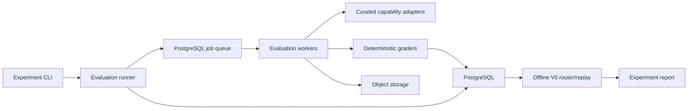
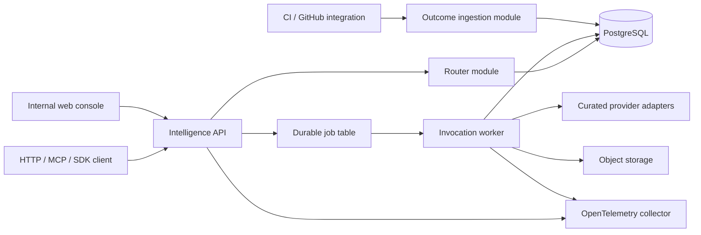

# Capability Intelligence Exchange — Implementation Plan

**Status:** Proposed execution plan

**Source:** `capability_intelligence_exchange_revised_technical_plan.md`

**Planning posture:** Staff-level implementation scope

**Initial platform release:** MCP Registry Alpha (`MCP_REGISTRY_ALPHA_IMPLEMENTATION_PLAN.md`)

**First evaluation workload after the registry foundation:** Swift/iOS concurrency pull-request review

**Primary delivery posture:** Build the registry and execution foundation first, then add comparison, outcomes, and task-aware routing

---

## 1. Executive decision

### Sequencing update — September 3, 2026

The first implementation milestone is now the closed **MCP Registry Alpha** defined in `MCP_REGISTRY_ALPHA_IMPLEMENTATION_PLAN.md`. It delivers protocol-neutral capability identity, MCP server registration and live discovery, immutable tool versions, safe invocation, a run ledger, and a basic operator UI. It precedes the evaluation/router work below and supplies reusable control-plane and execution foundations for it.

The registry is not treated as the product moat or as a replacement for the official MCP Registry. Routing evidence and attributable outcomes remain the long-term differentiators. The immediate sequencing is:

```text
M1 Registry Alpha
  -> M2 capability comparison and human feedback
  -> M3 task-aware routing and first reference vertical
```

Sections below retain the detailed evaluation and router plan for those follow-on milestones. Where their original Phase 0/Phase 1 sequence conflicts with the dedicated Milestone 1 plan, the Milestone 1 plan governs the first release.

After the Registry Alpha foundation, build the intelligence layer as two concurrent workstreams with separate release gates:

1. **Evaluation and router calibration:** a reproducible benchmark that ranks capabilities, establishes quality/cost/latency evidence, and determines when task-aware selection is safe to activate.
2. **Productization:** a closed routing API built from day one that executes curated capabilities, captures trustworthy outcomes, and can later support third-party supply.

Do not start by implementing the six logical planes as independently deployed services. For Phase 0 and the closed alpha, use a modular monolith plus workers, PostgreSQL, and object storage. Preserve domain boundaries in code and extract services only when scale, security isolation, or independent release cadence requires it.

The immediate post-registry deliverable is a closed capability comparison and routing loop with an evidence-backed selection policy. The calibration question is:

> Can pre-execution task features select a capability that improves review success over the strongest static default on unseen tasks without an unacceptable increase in cost per successful review?

The answer must come from a preregistered, held-out evaluation. If task-aware routing does not yet beat the strongest static reviewer, ship the closed alpha with the strongest eligible static quality policy, keep task-aware selection in shadow mode, and use production outcomes to improve it. Calibration controls policy activation; it does not block the platform foundation.

### Evidence update — September 3, 2026

External evidence is sufficient to retire the category-level question of whether specialized models can outperform frontier generalists. A [Shopify product-review slide shared by Tobi Lütke](https://x.com/tobi/status/2094808564355191249) reports a fine-tuned 0.8B model scoring 84.6 against GPT-5.6 Sol xhigh at 83.0 on a specialized buyer-profile task, while reducing its system prompt from 9.1K to 1.1K tokens and increasing throughput from 2M to 72M profiles per day. [Shopify's published Flow case study](https://shopify.engineering/fine-tuning-agent-shopify-flow) separately reports a fine-tuned agent that is 2.2x faster, 68% cheaper, and more accurate than the closed model it replaced, with a production feedback flywheel.

This evidence validates the strategic premise: narrow capabilities plus proprietary evaluation and outcome data can outperform general defaults. It does not remove the need to calibrate capability selection for Swift/iOS PR review or to validate the production outcome loop. Those are now treated as product quality and rollout concerns, not existential company-thesis gates.

---

## 2. Product and architecture understanding

The product is a task-level decision system, not a model router or an MCP catalog. Its proprietary loop is:

```text
Task features
  -> eligible capability versions
  -> predicted utility
  -> immutable routing decision
  -> execution
  -> attributable outcome
  -> version-specific performance history
  -> better routing
```

The implementation must preserve five invariants:

1. A capability version and its executable source are immutable.
2. A routing decision records every candidate, filter, score, input feature, and model/policy version used while retention permits, with every task-conditioned value inside the task's encrypted erasable snapshot and only content-blind selection evidence outside it.
3. Benchmark results and production outcomes remain separate and carry provenance.
4. A production outcome is never attached without authorization and invocation lineage.
5. Features used to route are available before execution; ground-truth or post-execution data cannot leak into routing evaluation.

Supporting systems—provider adapters, hosted runtimes, Tangle, payments, creator tools, and public discovery—exist to supply or exercise the router. They are not prerequisites for calibrating its first policy. MCP registration and invocation are intentionally implemented first as the platform substrate described in the dedicated Registry Alpha plan; that sequencing does not make catalog breadth the product moat.

---

## 3. Required changes to the source plan

| Area | Implementation decision |
|---|---|
| Initial task | Use one canonical task ID: `software.code-review.concurrency`, constrained to Swift. Do not create a parallel `swift.*` taxonomy branch. Language and platform are task dimensions. |
| Swift execution | Include realistic UIKit/SwiftUI and iOS-shaped source in Phase 0. Make source-level review the authoritative task, so an Xcode build is not required for the routing gate. Keep a buildable Swift Package Manager subset for deterministic tooling and treat optional Xcode/macOS validation as a separately reported stratum. macOS execution cannot be treated like the proposed Linux container runtime. |
| Review grading | Use seeded or independently labeled concurrency defects with normalized finding spans and categories. Compile/test grading applies only when a capability returns a patch; it cannot by itself grade review text. |
| Success probability | V0 may return an empirical benchmark estimate and uncertainty, not a calibrated `success_probability`. Use the latter only after calibration is measured on held-out production-like data. |
| Service topology | Implement logical planes as modules in three deployables: API, worker, and web dashboard. Do not create 12–15 network services in V1. |
| Search | Use taxonomy and structured PostgreSQL filters first. Add full-text search when creator supply expands; add pgvector only after measuring structured-retrieval recall. |
| Queue | Use a PostgreSQL-backed durable job table for the experiment and alpha. Adopt Redis or Temporal only when measured throughput or orchestration needs justify it. |
| Tangle | Treat Tangle as a post-calibration challenger and optional adapter. It is not part of the initial eight-candidate matrix or on the critical path for the closed alpha. |
| Payments | Use free alpha quotas or non-cash test credits. A double-entry ledger becomes mandatory when credits have monetary value or provider liabilities exist. |
| Hosted execution | Curated platform-owned adapters only through Phase 1. Do not accept arbitrary seller containers until isolation, scanning, policy, and incident response are production-ready. |
| Learned routing | Require enough labeled, representative production outcomes and a shadow evaluation before enabling ML or online exploration. Calendar phase alone is not an entry criterion. |

---

## 4. Planning assumptions

This plan assumes:

- A core team of four engineers for Phase 0 and Phase 1: two backend/platform, one evaluation/data, and one product/full-stack. A Swift domain expert is available at least part time.
- The project owner will serve as primary Swift concurrency reviewer, and a second qualified iOS engineer is available for blinded calibration and complete independent G1 scoring. A distinct third qualified Swift reviewer is not yet staffed and is a hard dependency before any G1 holdout is revealed: they must accept the blinded-adjudicator role, complete rubric calibration, and have reserved capacity for every material disagreement. Until then, G1 execution remains blocked and task-aware routing remains shadow-only; this does not block the Registry Alpha or static-policy closed alpha.
- A product owner can resolve taxonomy, user-policy, and go/no-go decisions within one business day.
- The initial calibration corpus uses non-confidential public, licensed, synthetic, or explicitly sanitized cases so every candidate is eligible. Raw internally owned repositories form a separate controlled-infrastructure stratum.
- No controlled GPU infrastructure or approved private-code model-provider agreement is currently available. Phase 0 therefore does not execute model-based capabilities against raw private repositories.
- Eight curated capability implementations can be invoked through model APIs, command-line tools, or local adapters.
- Secrets for external model providers are available through a managed secret store in deployed environments and local environment injection during development.
- The first alpha is single-region and has no contractual enterprise availability requirement.
- PostgreSQL and S3-compatible object storage are managed services in non-local environments.
- All time estimates are elapsed engineering time for the assumed team, not commitments. A team of one or two should expect roughly two to three times the elapsed duration.

---

## 5. Scope and stage gates

### Phase 0: evaluation foundation and router calibration

**In scope**

- One task family and controlled task dimensions
- Versioned benchmark corpus and hidden holdout
- Five to eight curated capabilities
- Common input/output contracts
- Reproducible evaluation runner and graders
- Deterministic task-aware routing
- Static baselines and offline replay
- Cost, latency, reliability, and outcome capture
- Internal experiment report/dashboard

**Out of scope**

- Public APIs, marketplace, creator onboarding, billing, payouts
- Arbitrary external providers or containers
- General semantic discovery
- Tangle Studio
- Production learning or contextual bandits
- Private customer repositories

### Phase 1: closed coding router

**In scope**

- Authenticated `route_task` and `run_task` interfaces over HTTP and MCP
- Curated provider execution
- Asynchronous invocation lifecycle
- Automatic and explicit outcome reporting
- Idempotency, quotas, audit trails, traces, and operational dashboards
- Shadow and canary routing policies
- A small group of design partners

**Out of scope**

- Self-service seller publishing
- Cash-equivalent credits, provider settlement, or crypto
- Unreviewed containers
- Learned routing in the live path

### Gate G0 — corpus readiness

Proceed to the full experiment only when:

- every case has source/license provenance and a reproducible repository snapshot;
- every private/internal case has data-owner approval, a classification, a retention policy, and an explicit provider-processing policy;
- the corpus includes clean controls, single-defect PRs, and multi-defect or cross-file PRs;
- the primary domain reviewer labels every case, while a second qualified reviewer independently labels a stratified 20% base sample, then adds candidate-blind targeted units until every canonical defect family used in scoring has at least 10 dual-reviewed `present` and 10 dual-reviewed `absent` case×family units, plus every disputed high/critical finding;
- every defect label includes a frozen mechanism ID, required causal/impact facts, and disqualifying contradictions that can distinguish a correct explanation from a category/span guess;
- measured inter-rater agreement reaches at least 0.80 Cohen's kappa both on the fixed flattened rating matrix and separately for every defect family used in scoring before label freeze; a family that misses support or agreement blocks G0 until the rubric is revised and a fresh blinded reliability sample passes, or is frozen as exploratory and excluded—together with cases whose success depends on it—from all activation scoring;
- train, validation, and hidden test groups are split by a frozen composite `correlation_cluster_id` that preserves both source-repository and controlled-mutation/archetype lineage dependence;
- the harness reproduces the same deterministic grading result in at least 98% of reruns;
- every candidate used for authoritative comparison has an immutable platform-controlled version or an attested remote implementation revision; unverified mutable remotes are excluded from G1 evidence;
- no candidate capability has received hidden labels or hidden-case artifacts.

Before any split, build `correlation_cluster_id` as the connected component of a graph whose cases are linked when they share a source repository or the same controlled-mutation/archetype lineage, including a seeded template or near-duplicate variant applied across repositories. A broad defect-family label alone is not a lineage edge. Freeze repository and lineage IDs plus the resulting components before allocation; every component stays in one split and is the resampling unit for G1 sizing and activation. If a giant component or too few independent components makes either interval underpowered or imprecise, expand/rebalance the corpus or remain in shadow mode.

For the kappa gate, the base rating units are fixed before either reviewer labels the stratified sample: every sampled case crossed with every canonical defect family in the frozen taxonomy, including an explicit `other` family. Each reviewer independently assigns exactly one binary category, `present` or `absent`, to every case×family unit; a clean case is therefore all absent. Before seeing either reviewer's decisions, an independent sampling procedure may select additional known-positive/known-negative authoring strata to meet the 10/10 per-family floor; both reviewers then label every added case×family unit blindly. Compute Cohen's kappa over the flattened common matrix as a secondary global gate and separately for every family as mandatory primary family gates; prevalence-dominated agreement in other families cannot compensate for a family below 0.80 or without both support classes. If a family fails, adjudicate existing disagreements only to correct labels, revise/version the rubric, and evaluate reliability on fresh blinded units not used to tune it. A family that cannot pass before freeze is marked exploratory and removed before splitting, along with every case whose task-success result could depend on that family; it contributes no weight, recall, or activation authority. Every concrete finding must map to one family and carry the revision-aware location from Section 7.3. An unrecognized but asserted finding maps to `other`/present rather than disappearing; a finding asserted by only one reviewer is a present/absent disagreement. Multiple same-family findings do not create extra kappa units: count, span, severity, and category-alias agreement are reported separately with deterministic bipartite span matching, and every count/location disagreement for high or critical findings enters adjudication before label freeze. The protocol versions the family map, unit matrix, targeted-support sampling rule, alias rules, unmatched treatment, and span tolerance before annotation.

### Gate G1 — task-aware policy activation

G1 is an activation decision for one immutable `evaluation_stratum_id`, not a global router approval. That identifier freezes at least data classification, source-ownership/trust stratum (`universal` versus `private_internal`), task segment, provider-processing policy, and candidate-eligibility universe. A passing holdout authorizes task-aware selection only for request strata explicitly represented by that holdout and preregistered before reveal; the initial universal, non-confidential G1 can never authorize private/internal traffic. Unknown, changed, or unvalidated strata use their strongest eligible static policy while task-aware decisions remain shadow-only. Each additional stratum needs its own fresh representative holdout and a preregistered slice of the system-wide G1 sequential alpha budget; evidence, alpha spend, and revealed components are never pooled across strata. Routing feature flags and decisions persist the exact approved `evaluation_stratum_id` and gate evidence version.

Enable task-aware selection for an `evaluation_stratum_id` only when, on its fresh representative G1 activation holdout, the quality-first policy's observed task-success lift over the strongest static capability eligible throughout that stratum is greater than 5 percentage points and the one-sided lower confidence bound at confidence `1-alpha^S_t` for preregistered attempt `t` (never below 95%) is also strictly greater than 5 percentage points. Its cost per successful task must be no more than 20% higher. For each policy, cost per successful task is total platform-attributed primary-attempt cost across all holdout tasks, including costs from unsuccessful tasks, divided by the number of successful primary tasks. Activation additionally requires both an observed task-aware/static cost ratio no greater than 1.20 and a one-sided upper confidence bound at confidence `1-alpha^C_t` (never below 95%) no greater than 1.20 under the same paired `correlation_cluster_id` bootstrap. A zero-success arm in the observed holdout fails the gate.

Bootstrap boundary draws are retained, never silently omitted and never treated as a one-draw veto. For the observed sample and each draw, define the task-aware/static ratio on the extended nonnegative reals: a draw with zero task-aware successes is `+infinity`; a draw with zero static successes but at least one task-aware success is `0`; if both arms have zero successes it is `+infinity`. When both arms have successes but the static cost per success is zero, the ratio is `1` if task-aware cost per success is also zero and `+infinity` otherwise. The upper bound is the preregistered empirical `1-alpha^C_t` percentile of all finite and infinite draw values for activation attempt `t`. Fix the bootstrap seed, draw count, quantile convention, and Monte Carlo error rule before revealing results; use exact correlation-cluster resample enumeration when tractable, and otherwise declare the gate inconclusive unless the conservative Monte Carlo error bound leaves the upper limit at or below 1.20. Isolated boundary draws therefore contribute their tail probability rather than vetoing activation based on whether any one draw occurred.

The paired task outcome is the preregistered primary-attempt estimand defined in Section 8.4; diagnostic repeats never change it. A paired cluster bootstrap that resamples frozen `correlation_cluster_id` components and preserves all paired task outcomes and costs within each sampled component must produce the preregistered one-sided `1-alpha^S_t` lower confidence bound for task-success lift, and that bound must be strictly greater than the five-percentage-point activation margin. Before freezing or executing that holdout, preregister the success and cost-ratio estimators, charge attribution, exact provider-rate/usage representation, settlement-boundary rounding/residual allocation, and one base ISO currency plus an immutable `fx_rate_set_version` covering every candidate currency. That set records authoritative source/revision, observation and valid-at timestamps, exact base/quote orientation and decimal/rational factor, and is frozen for the entire activation attempt; missing currency coverage makes the attempt ineligible. Observed costs, every bootstrap draw, and reruns use the stored provider-native charge and this same frozen factor—never a latest rate. Also preregister boundary handling, confidence construction, and joint simulation sizing using those exact estimands/resampling procedures, observed composite-cluster distribution, conservative candidate-discordance bound, and joint pilot success/cost distribution. The default planning alternative is a true eight-percentage-point success lift and a true cost ratio of 1.10; changing either value requires a documented rationale before any activation data is revealed, and the success alternative must remain strictly above five points while the cost alternative remains strictly below 1.20. For attempt `t`, choose the smallest sample whose conservative simulation shows at least 90% probability of satisfying the complete gate simultaneously: observed lift strictly greater than five points, the `1-alpha^S_t` lower bound strictly greater than five points, nonzero successes in both arms, observed cost ratio at most 1.20, and the `1-alpha^C_t` upper bound at most 1.20. Require the one-sided Monte Carlo lower confidence bound for that joint pass probability to be at least 90%, or exact enumeration when tractable. A true lift at or below five points is the quality null and cannot be used as a 90%-power planning alternative; under a calibrated level-`alpha^S_t` test its probability of clearing the lower-bound gate at the five-point boundary is at most the allocated type-I error, subject to the preregistered conservative simulation/Monte Carlo rule. Before any result is revealed, an undersized holdout may be expanded and re-frozen; after reveal, it may not be extended or pooled. This holdout contains no case—and no correlation component linked to a case—whose candidate outputs or labels were previously revealed.

Treat G1 activation across all `evaluation_stratum_id` values as one system-wide family of sequential decisions with two co-primary requirements: the quality null is task-success lift at or below five percentage points, and the cost null is a task-aware/static cost-per-success ratio above 1.20. Before the first activation run, preregister the allowed strata, maximum attempts per stratum, and allocations `alpha^S_{s,t}` and `alpha^C_{s,t}` whose combined sum across both requirement types, every stratum `s`, and every attempt `t` is at most 0.05; every allocation is therefore at most 0.05, so each attempt-specific confidence level is at least 95%. A later stratum can test only with unused preregistered alpha or a new explicitly versioned release family that does not retroactively authorize prior traffic. Because any false activation must reject at least one true quality or cost null, the combined Bonferroni budget controls the probability of any false activation across mixed nulls, repeated looks, and strata at 0.05. Freeze the exact stratum definition, router/policy/candidate versions, and a wholly fresh set of representative correlation components for each attempt. As soon as any candidate output, label, aggregate, or interim statistic from an attempt is revealed, permanently mark all of its components `g1_revealed`; they can be reported or used for later training with provenance but never pooled into or reused by any activation claim. A failed or inconclusive attempt can proceed only with the relevant remaining preregistered alpha, a newly frozen policy version where changed, and an entirely fresh holdout sized for the tighter bounds. When the assigned attempt limit or applicable combined alpha budget is exhausted, that stratum's task-aware routing remains in shadow mode.

A value-oriented policy should still be reported as secondary analysis, including whether it achieves at least 20% lower cost per successful task while remaining non-inferior within a 2 percentage-point success margin. It cannot substitute for the quality-first activation gate. Report all baselines and all attempted policy variants, including failures. In every stratum where G1 has not passed—including private/internal strata after only the universal gate passes—the closed alpha uses that stratum's strongest eligible static quality policy while task-aware decisions run in shadow mode.

### Gate G2 — closed-alpha readiness

Proceed to design partners only when:

- tenant authorization—including the Registry Alpha end-to-end 60-second IdP propagation/lookup/cache freshness budget and authoritative cache bypass for privileged actions—idempotency, audit logs, data retention, and secret handling have passed review;
- the invocation SLO and recovery tests in Section 15 pass in staging;
- concurrent dispatch proves every fence atomically owns sufficient worst-case quota/budget reservation, and indeterminate liabilities remain reserved until reconciled;
- queued-run tests prove price/FX quote expiry, provider price-version or live FX-selector change, and missing attempt-frozen FX coverage are detected under the fence locks before reservation/send and require fresh user-approved routing where applicable;
- artifact-upload qualification proves targets use only the sealed encryption gateway, bind subject/workspace/human authorization epoch and any exact admitting API-credential projection, and are minted only after one atomic aggregate reservation of maximum ingress/storage bytes, concurrency, and worst-case spend against the workspace and optional credential accounts. Every target/write binds that reservation, replay never reserves twice, concurrent creates cannot overcommit, and cleanup cannot release capacity while ciphertext can still materialize. Uploads reauthorize current permission plus credential scope at first byte/each bounded interval/precommit/completion within the inherited 60-second budget, fence leases on either authorization change, never place plaintext or source provenance identity/signature in ordinary durable storage, give each upload separate externally erasable content and source-identity hierarchies, fit late-write cleanup within 15 minutes, and require destruction evidence for both hierarchies before abandoned/revoked/retention-forbidden terminal states; unsupported backends or MCP hosts fail closed;
- at least 90% of alpha-eligible invocations can receive an automatic or attributable explicit outcome through the strict typed/scanned envelope or an authorized encrypted evidence artifact, with no raw integration payload retained;
- route decisions whose task-content hierarchy remains active and current are replayable from the encrypted feature and candidate snapshots; after policy-forbidden erasure, the historical selection remains auditable but replay deterministically returns `routing_replay_unavailable_erased` rather than reconstructing deleted inputs;
- provider disablement and policy rollback complete without a redeploy.

Any alpha use of private repositories additionally requires either controlled model infrastructure or an approved provider agreement covering no training, zero retention, security, and incident obligations. Satisfying that infrastructure/contract gate permits eligible static execution and shadow evaluation only; task-aware live selection for private/internal requests also requires a separate representative private/internal G1 pass under the scoped rule above.

### Gate G3 — creator platform readiness

Open supply only after the closed alpha demonstrates sustained buyer demand, useful outcome density, and operational stability. Minimum evidence should include eight consecutive weeks of usage, at least 5,000 attributable invocations, and no unresolved critical isolation or cross-tenant findings.

### Gate G4 — learned-routing readiness

Enable learned routing in shadow mode only when each trained segment has adequate support, temporal holdout performance exceeds V0, predictions are calibrated, and drift/rollback controls exist. A practical starting threshold is 10,000 high-confidence production outcomes overall and at least 500 outcomes in every segment used directly by the model; the data review may raise these thresholds.

---

## 6. Delivery architecture

### 6.1 Phase 0 topology



The evaluation runner executes every eligible capability against the same versioned task inputs. The router consumes completed results for train/validation groups and is evaluated against unseen test-group outcomes. There is no production request path in Phase 0.

### 6.2 Phase 1 topology



Deployables:

- `api`: authentication, route and public run endpoints, control-plane administration, outcome ingestion.
- `worker`: benchmark and production invocation jobs with separate queues and concurrency limits.
- `web`: experiment results and internal operations console.

Logical modules:

- `taxonomy`
- `capabilities`
- `routing`
- `evaluation`
- `runs` (the internal Invocation aggregate over the Registry run ledger)
- `outcomes`
- `providers`
- `artifacts`
- `identity`
- `telemetry`

Modules communicate through typed in-process interfaces and persisted domain events. They must not query another module's tables through ad hoc joins from application code. This preserves future extraction without paying distributed-system costs now.

### 6.3 Extraction triggers

Create an independent network service only when one of these is true:

- it needs a different trust boundary, such as untrusted execution;
- its scaling unit differs by more than an order of magnitude from the API;
- it needs an independent deployment or availability target;
- it has a distinct data-governance boundary;
- measured contention cannot be fixed with worker pools, indexes, or database partitioning.

The likely first extractions are the runtime sandbox and evaluation workers. The router should remain a versioned library/module until independent scaling or release cadence is demonstrated.

### 6.4 Initial repository structure

```text
modall/
├── apps/
│   ├── api/                       # FastAPI application
│   ├── worker/                    # Evaluation and invocation workers
│   └── web/                       # Internal console
├── packages/
│   ├── domain/                    # IDs, enums, domain events, state machines
│   ├── taxonomy/                  # Versioned task ontology and feature extraction
│   ├── manifests/                 # Capability manifest schema and validation
│   ├── routing/                   # Candidate filtering, policies, replay
│   ├── evaluation/                # Suites, graders, statistics
│   ├── providers/                 # Adapter protocol and curated adapters
│   ├── persistence/               # SQLAlchemy models, repositories, migrations
│   ├── telemetry/                 # OTel and structured logging
│   ├── python-sdk/
│   ├── typescript-sdk/
│   └── mcp-server/
├── benchmarks/
│   ├── public/                    # Shareable case definitions
│   └── tooling/                   # Corpus build and validation tools
├── capabilities/                  # Curated adapter configurations/manifests
├── schemas/                       # JSON Schema and generated OpenAPI artifacts
├── infrastructure/
│   ├── local/
│   ├── terraform/
│   └── kubernetes/                # Add when needed; not required for Phase 0
├── docs/
│   ├── adr/
│   ├── runbooks/
│   └── experiments/
└── tests/
    ├── contract/
    ├── integration/
    ├── replay/
    └── end_to_end/
```

Use Python, FastAPI, Pydantic, SQLAlchemy, Alembic, PostgreSQL, and OpenTelemetry as proposed. Use object storage for repository bundles and large results; never place large source archives or raw model transcripts directly in PostgreSQL.

---

## 7. Canonical domain contracts

### 7.1 Identity and versioning

Use sortable opaque IDs, such as UUIDv7 or ULID, for records. Human-readable slugs are mutable aliases and must not be foreign keys.

A routable implementation identity is the tuple:

```text
capability_id
capability_version_id
execution_binding_kind
server_connection_version_id XOR deployment_version_id
source_digest
adapter_version
```

Publishing freezes the capability version, schemas, task claims, price policy, required permissions, and source digest. A `deployment` is a stable operational identity; each immutable `deployment_version` freezes the provider/model revision or local CLI/static-analysis implementation, adapter version, environment, policy, and source/image digest used by an attempt. Operational deployment fields such as current health, capacity, and active version may change, but changes are audited. MCP implementations instead bind to the existing immutable `server_connection_version`; one run/attempt can never carry both target kinds.

### 7.2 Task contract

```json
{
  "taxonomy": "software.code-review.concurrency",
  "taxonomy_version": "1.0.0",
  "intent": "Review this Swift change for concurrency defects",
  "attributes": {
    "language": "swift",
    "platform": "ios",
    "change_size": "medium",
    "context_requirement": "multi_file",
    "toolchain": "swift-6.x",
    "data_classification": "private_internal",
    "allowed_execution_zones": ["controlled", "approved_zero_retention"]
  },
  "inputs": {
    "repository_snapshot_uri": "artifact://...",
    "base_revision": "...",
    "head_revision": "...",
    "diff_uri": "artifact://..."
  }
}
```

Persist the normalized task, original request, and source-derived routing features only as encrypted task content. Before any durable content write, prepare one unique short-lived provisional external per-task hierarchy with purpose-separated encryption and fingerprint subkeys for the original request, normalized task, feature/candidate snapshots, serialized dispatch content, and derived usage dimensions; encrypt and fingerprint those values with the provisional hierarchy, then atomically persist only ciphertext/keyed references, the opaque handle in `provisional`, exact current-policy attestations, the task/route/idempotency rows, an optional blocked queue row, and one activation outbox record. Only the idempotent post-commit handler may activate the hierarchy and mark the task usable. Rollback, uniqueness loss, or missing commit leaves no owner and lets the short-lived provisional hierarchy self-destruct; no reader, replay, post-commit routing selection, runnable-queue consumer, dispatch, analysis, or training path may use it. A committed activation job retries only until the immutable provisional expiry. Failure or expiry makes the task and every unfenced routed run non-dispatchable, enters monotonic `task_erasure_pending`, destroys/verifies every task subkey and ciphertext/cache reference, and reaches `task_erased` plus a stable terminal route/run failure only after destruction evidence; it never creates a replacement hierarchy or re-encrypts from unavailable plaintext. Phase 0 evaluation executions and Phase 1 routed Runs reference the activated authority and never copy those bytes into a second per-run envelope. Raw request bytes exist only in bounded no-capture scan/normalization memory, and feature extraction produces an immutable encrypted `task_feature_snapshot` tied to exact extractor, feature-schema, input-scan-policy, and feature-policy versions.

The durable plaintext task/routing allowlist is deliberately content-blind: opaque task/workspace IDs; hierarchy and lifecycle state; policy, schema, extractor, router, candidate, health, stratum, and gate-evidence version IDs; effective classification/execution-zone enums; selected capability/deployment IDs; bounded locally authored decision/reason enums; and timestamps. Original or normalized strings, repository/artifact URIs, paths, revisions, identifiers, counts, buckets, hashes, digests, embeddings, and any other request- or source-derived value are never durable plaintext even when they appear low sensitivity. `task_instances` and `routing_feature_snapshots` contain only ciphertext/opaque references, purpose-separated keyed fingerprints, current-policy attestations, and that safe envelope. Queues, caches, events, audit, telemetry, WAL, replicas, backups, and training manifests obey the same rule.

Every route, replay, dispatch, analysis, or training read requires an active hierarchy and an attestation matching the locked current input and feature-policy pointers. A pointer or classification change immediately suppresses those uses and enters rescan or monotonic `task_erasure_pending`. If retention is forbidden, destroy every original-request, normalized-task, and feature encryption/fingerprint subkey across active and recovery copies, purge caches and materialized-dataset membership, replace active identities with generic non-comparable tombstones, and reach `task_erased` only after destruction evidence. Any derived training dataset is invalidated immediately; a model version whose lineage consumed the task is ineligible for new activation or dispatch until an approved deletion/unlearning procedure produces evidence or the model is retired. The route may retain its content-blind historical selection and reason codes, but cannot claim deterministic feature replay after erasure.

### 7.3 Capability input and output

Every Phase 0 capability receives an immutable repository snapshot, diff, task metadata, execution budget, and trace context. GitHub URLs are never the authoritative benchmark input because their content can change.

The normalized review output is:

```json
{
  "findings": [
    {
      "category": "data_race",
      "severity": "high",
      "revision": "head",
      "diff_side": "right",
      "path": "Sources/App/Store.swift",
      "start_line": 42,
      "end_line": 48,
      "mechanism": "Unsynchronized mutation races with the detached task read.",
      "message": "...",
      "confidence": 0.91
    }
  ],
  "summary": "...",
  "patch": null
}
```

Every finding location and bounded causal `mechanism` explanation is mandatory and revision-aware. `revision` is `base` or `head` and resolves to the corresponding immutable task revision; `diff_side` is respectively `left` or `right`, and `path` plus line coordinates are interpreted in that tree. Deleted-line findings use `base`/`left`; added-line findings use `head`/`right`. Renames and moves use the path on the declared side. Labels use the same convention and also freeze a mechanism ID, required causal/impact facts, and disqualifying contradictions. Adapters that cannot produce a valid location or substantive mechanism return invalid output rather than guessing.

Adapter-specific raw output first enters the Registry Alpha quarantine and classification path. Retain it as an encrypted restricted artifact only when policy allows; ordinary APIs expose only the validated normalized output or a safe quarantine placeholder. Normalization failures count against reliability and are not silently repaired by the platform unless the repair step is declared as part of the capability version.

### 7.4 Routing decision

A routing decision is append-only and includes:

- opaque task-instance and workspace-policy IDs;
- opaque taxonomy-schema/version lineage plus feature-schema/policy and feature-extractor version IDs; the task-selected taxonomy literal and every taxonomy-derived feature remain only inside the per-task encrypted normalized/feature snapshots and are never copied into decision, audit, event, analytics, or index columns;
- an encrypted task-hierarchy-bound candidate snapshot containing all discovered candidates, task-conditioned filter results, scores, expected quality/cost/latency/uncertainty, and deterministic tie-break inputs, without item-level relational rows or observable cardinality;
- routing policy and router version;
- selected exact implementation plus a bounded locally authored reason enum; the task-conditioned tie-break input remains in the encrypted snapshot;
- exploration flag and safe experiment version; task-conditioned assignment inputs remain encrypted;
- inside the encrypted candidate snapshot, every candidate's quote/estimate expiry, immutable provider price-version ID, provider-native exact amount, workspace/evaluation base currency, immutable FX-rate-set/version and exact conversion factor when currencies differ, normalized exact amount, and worst-case reservation vector; outside it, only the selected accepted quote/reservation lineage;
- correlation and trace IDs.

The candidate/feature snapshot is append-only ciphertext, but its usability is not permanent: it inherits the per-task current-policy and erasure lifecycle in Section 7.2. The selected taxonomy literal, taxonomy-derived features, candidate identities, row count, filter outcomes, scores, and individualized estimates that depend on request/source features cannot be duplicated into ordinary decision, event, audit, index, or analytics columns. After task erasure, only the selected exact implementation, opaque schema/version lineage that cannot be expanded through the task record, locally authored reason, accepted quote/reservation lineage, and generic unavailable tombstone remain; the task category is no longer recoverable from the task/route rows.

The V0 API response calls its quality field `benchmark_success_estimate` and includes `sample_size`, `confidence_interval`, and `estimate_kind`. Rename it to `success_probability` only after a calibration gate.

### 7.5 Invocation lifecycle

```text
Invocation
accepted -> queued -> preparing -> running
accepted | queued | preparing -> cancelled
accepted | queued | preparing -> execution_failed
running -> fallback_queued -> running
fallback_queued -> cancelled
fallback_queued -> execution_failed | execution_timed_out | indeterminate
running -> execution_succeeded | execution_failed | execution_timed_out
running -> cancelled | indeterminate

Attempt
created -> dispatch_fenced -> awaiting_result
created -> cancelled | failed
dispatch_fenced | awaiting_result -> succeeded | failed | timed_out | cancelled | indeterminate

Outcome (orthogonal to invocation execution state)
not_expected
pending -> finalized | unavailable
```

These Invocation states are internal orchestration phases, not additions to the public `Run.status` enum. The shared API preserves the Registry Alpha enum and projects internal state as follows:

| Internal Invocation state | Public `Run.status` |
|---|---|
| `accepted`, `queued`, `preparing` | `queued` |
| `running`, `fallback_queued` | `running` |
| `execution_succeeded` | `succeeded` |
| `execution_failed` | `failed` |
| `execution_timed_out` | `timed_out` |
| `cancelled` | `cancelled` |
| `indeterminate` | `indeterminate` |

List filters and terminal checks operate on this public projection. Phase 1 detail is exposed only through additive optional reason/phase metadata and the forward-compatible event envelope; it never leaks a new value into the closed Alpha status enum or makes status regress from `running` to `queued` during fallback.

Every transition is an append-only event guarded by an allowed-transition table. The current state is a materialized projection. Duplicate worker delivery must be safe.

The pre-running transition to `execution_failed`, and any corresponding `created -> failed` attempt transition, is legal only for a definitive pre-dispatch failure while no attempt has a dispatch fence, including request-key activation failure, completed security erasure, expired quote, or rejected reservation/eligibility. Security reclassification cannot take that edge until the inherited content and fingerprint states are attested `erased` and non-comparable. Any possibility that a provider send occurred uses the running/attempt evidence rules and may require `indeterminate`; it never uses this shortcut.

An attempt failure or timeout does not by itself authorize fallback. The orchestrator may enter `fallback_queued` and create a child attempt linked by `parent_attempt_id` only when durable evidence proves the prior attempt did not execute, or when every candidate in the fallback chain honors the same tested end-to-end idempotency key for the external operation. A failure response alone is not proof of non-execution. Any post-fence timeout or lost response with uncertain acceptance moves the invocation to `indeterminate` with `reconciliation_required`; it never creates a fallback attempt. Recheck the execution-disposition guard and candidate eligibility after entering `fallback_queued` and before creating the child attempt. If no eligible candidate remains or the chain is exhausted, transition to `execution_failed` or `execution_timed_out` according to the last definitive attempt and record `fallback_unavailable` or `fallback_exhausted`; if the prior disposition has become unknown, transition to `indeterminate` with reconciliation required. No path may remain terminally parked in `fallback_queued`.

Execution status and outcome status are separate projections. Execution reaches a terminal state regardless of whether downstream outcome evidence arrives. At execution completion, an eligible invocation receives an outcome record with `pending` plus a fixed `evidence_due_at`; it transitions to `finalized` when adequate evidence arrives or `unavailable` when the deadline expires. An ineligible invocation receives terminal `not_expected`. Late evidence creates a superseding outcome version without reopening execution state.

Before any provider network send, persist `dispatch_fenced` in the same transaction that records the attempt ownership. Record an evidence-backed execution disposition of `not_executed`, `executed`, or `unknown` separately from transport status. A recovered `created` attempt is safe to dispatch. A recovered `dispatch_fenced` or `awaiting_result` attempt without a durable terminal response has disposition `unknown` and must not be sent again or fall back: persist any available provider receipt and move it to `indeterminate` with `reconciliation_required`. This deliberately prefers manual reconciliation to duplicating an external side effect.

Cancellation is a request event, not proof of execution state. A `created` attempt may become `cancelled` before its dispatch fence. After fencing, emit `cancellation_requested` and propagate best effort, but allow `cancelled` only when definitive provider evidence proves that execution did not occur or was fully rolled back. Otherwise keep awaiting a definitive terminal response; an unsupported request, lost acknowledgement, or deadline with uncertain external execution becomes `indeterminate` with `reconciliation_required`. The parent invocation can be `cancelled` only when every attempt has a definitive non-execution/cancelled disposition.

### 7.6 Outcome contract and truth hierarchy

Outcome evidence is ranked:

1. Reproducible hidden tests, build, or static checks tied to the returned artifact
2. Signed CI/GitHub integration events
3. Downstream automation with invocation correlation
4. Buyer or agent explicit report
5. Passive signals such as no retry

Store evidence separately from the derived label. An outcome label contains labeler/version, confidence, evidence IDs, timestamp, and supersession lineage. Conflicting evidence produces `disputed`, not a silent overwrite. Provider self-reports cannot create high-confidence success labels.

Outcome ingress accepts only a versioned, bounded allowlist: evidence-type/source enums, opaque external event ID, exact run/attempt/artifact IDs, booleans or bounded numeric measurements, server-validated timestamp, and enumerated correction/reason codes. It rejects unknown fields, arbitrary provider metadata, logs, diffs, failure output, stack traces, and free-form correction text. Signed webhook bytes live only in a size-bounded no-capture buffer long enough to verify signature/replay identity and parse the allowlist, then are destroyed before canonicalization, idempotency, audit, or persistence; every retained string passes the typed control-text secret/PII boundary. Evidence content that cannot fit the allowlist must arrive first through the encrypted artifact-upload gateway, complete provenance/classification/malware/secret/PII scanning, and be referenced by exact authorized `artifact://` version—never embedded or fetched from a caller URL. Label derivation may read such an artifact only through a classification-qualified internal role and current attestation/key check, emits no source excerpt, and records the evidence artifact/policy versions. Later artifact quarantine/erasure supersedes any label whose support is no longer available and atomically invalidates every materialized dataset version that included it. Dataset-to-model lineage then makes each dependent model version immediately ineligible for activation, shadow/live inference, or dispatch until an approved deletion/unlearning rebuild produces evidence; otherwise retire it. Neither an invalid label nor a model trained from it remains in operations or training surfaces.

---

## 8. Evaluation and router-calibration specification

### 8.1 Hypothesis

Swift concurrency-review implementations have heterogeneous performance across observable task characteristics, and a deterministic router using only pre-execution features can exploit that heterogeneity on unseen tasks.

### 8.2 Budget-calibration pilot

Before producing the official train/validation/test matrix, run every candidate on a separate set of 20 representative non-confidential PRs under generous emergency safety limits. These PRs are permanently excluded from official benchmark splits and routing-lift calculations. Raw internal PRs cannot enter this pilot because no third-party provider is currently approved to process private source.

The pilot measures complete end-to-end cost, latency, context volume, output volume, tool usage, timeout behavior, and successful-review rates. Use it to establish:

- the global maximum allowed cost per review;
- the global wall-clock deadline;
- controlled-cohort token and tool budgets;
- capability-specific concurrency and resource limits;
- output and artifact size limits;
- the definition of a billable/chargeable failed attempt.

For the hidden experiment, set cost and latency ceilings to the observed p95 of successful pilot runs for the strongest-quality candidate plus 20% headroom, unless that would exceed a separately approved safety ceiling. Apply the resulting global ceilings to every candidate. Record exclusions caused by the ceilings as failures or ineligibility according to the preregistered protocol; do not silently increase limits after viewing hidden results.

### 8.3 Corpus

Start with a 75–100-case universally eligible, non-confidential calibration suite to calibrate graders, candidate behavior, feature extraction, and the static production policy. This suite has its own grouped split:

- 60% training
- 20% validation
- 20% locked calibration test

The calibration test remains hidden until the initial report, then is permanently marked revealed and cannot contribute to the G1 activation holdout.

Continue expanding to a separate activation benchmark while the router alpha is built, using 200–300 cases as the first authoring tranche rather than a fixed cap. Before allocating groups, preregister the complete G1 joint-pass simulation defined in the gate: use the exact paired composite-cluster bootstrap, planned `correlation_cluster_id` distribution, conservative calibration-derived discordance, joint pilot success/cost behavior, default eight-point/1.10 planning alternative, maximum activation attempts, and separate success/cost alpha-spending schedules. For each attempt, choose a wholly fresh holdout whose conservative joint-pass probability has a one-sided Monte Carlo lower bound of at least 90% under that attempt's allocations. Freeze its newly added clustered cases and labels before final policy selection; do not run candidates on them or reveal any artifact until the static baseline and task-aware policy are frozen. An undersized attempt may expand beyond 300 total cases only while every component remains hidden. At the first reveal, permanently mark the attempt's components `g1_revealed`; they may enter a later training/reporting pool with provenance but can never be extended, pooled into a later attempt, or reused for activation. No activation component may connect to any previously revealed case. An underpowered, cost-imprecise, or joint-underpowered attempt cannot activate task-aware routing.

Split by the frozen composite correlation components, not by individual diff, repository alone, or archetype alone, so same-repository and cross-repository lineage variants cannot cross groups. Keep the test labels encrypted or access-controlled from capability authors and router development.

Each case contains:

- immutable source snapshot and license/provenance;
- immutable `source_repository_id`, nullable controlled-mutation/archetype-lineage ID, frozen `correlation_cluster_id`, and cluster-graph version;
- base/head revisions and canonical diff;
- zero or more labeled concurrency defects plus an explicit `clean` or `defective` case kind;
- allowed category aliases and span tolerances;
- case-specific false-positive limit, with clean cases defaulting to zero;
- task dimensions computable before execution;
- pinned Swift toolchain and environment image/runner label;
- public setup metadata and private grading metadata;
- expected runtime class and resource limits;
- contamination and duplication notes.

Use realistic iOS-shaped repositories and PRs, including UIKit and SwiftUI code. Source-level defect detection is the primary evaluation path and must be reproducible without compiling the app. Maintain a buildable Swift Package Manager subset for analyzers that benefit from compiler context. Any Xcode build/test evidence runs on pinned macOS images as a separate stratum and is reported independently from the primary routing gate.

Target this case composition:

- 25% clean PRs with no labeled concurrency defect;
- 45% single-defect PRs;
- 30% multi-defect, cross-file, or context-dependent PRs.

The clean controls are mandatory because a reviewer that flags every concurrency pattern must not score well. Defect families should include actor isolation, `Sendable` violations, unsafe shared state, task cancellation, continuation misuse, main-actor violations, reentrancy, and detached-task misuse.

Use two separate data strata.

**Primary universal-eligibility corpus**

- 55% licensed public iOS repositories and controlled mutations of them;
- 30% purpose-built realistic iOS fixtures;
- 15% defect patterns re-authored from internal experience only when a data owner confirms that the resulting code is non-confidential and cannot reconstruct the original source.

Every candidate in both cohorts must be eligible for every case in this corpus. The initial Gate G1 is calculated only on a fresh activation holdout whose frozen `evaluation_stratum_id` is universal, non-confidential, and matches the represented task/provider/candidate scope. The initial 75–100 cases support calibration and shadow routing; their revealed test cases never count as unseen G1 evidence. The expanded, adequately powered activation benchmark can authorize live task-aware routing only for matching universal requests.

**Private generalization corpus**

- during Phase 0, inventory and label approximately 20 representative historical PRs from internally owned repositories to validate taxonomy and grading realism;
- do not send their code, diffs, embeddings, or derived source artifacts to third-party model providers;
- CPU-only deterministic tooling may be exercised inside controlled machines for harness validation, but those results are not evidence of routing lift;
- after initial calibration and once secure model execution becomes available, expand toward 50–100 verified historical PRs and controlled mutations;
- execute the expanded corpus solely with eligible controlled or contractually approved capabilities;
- report results separately and never aggregate them into the universal candidate comparison;
- keep private/internal live requests on their strongest eligible static policy and task-aware shadowing until a wholly fresh, representative private/internal activation holdout passes its own scoped G1 family.

Source mix and defect composition are independent dimensions. Private snapshots remain denied to every third-party provider because no processing agreement is currently in place. If approved no-training and zero-retention agreements are established later, eligibility changes apply only to new evaluation runs and never rewrite historical candidate sets.

### 8.4 Initial capability set

Test two explicit cohorts under the same task input and normalized finding-output contracts.

**Cohort A — controlled model baselines**

1. OpenAI `gpt-5.6-sol` through the Responses API
2. Anthropic `claude-opus-5` through the Messages API
3. Google `gemini-3.8-flash` through the Gemini API

OpenAI and Anthropic API access and billing are confirmed. Gemini API access must be established before the budget-calibration pilot. These selections are frozen as of September 2, 2026, subject only to an availability check before pilot execution. If a selected model becomes unavailable, choose and document a replacement before any official matrix run; never substitute a model silently or midway through a benchmark version.

These three candidates use the same semantic system prompt, context assembly, tool contract, retry policy, maximum output, and output normalizer. Provider wrappers may translate message and tool schemas but cannot add hidden prompting or repair stages. Use a preregistered provider-native reasoning tier and omit sampling parameters that a provider does not support; do not pretend unlike reasoning controls are numerically equivalent. Enforce the same pilot-derived cost and wall-clock ceilings and record actual input, reasoning, cached, and output usage where exposed. This cohort measures model-selection lift while minimizing workflow confounding.

**Cohort B — differentiated capabilities**

4. Codex CLI reviewer with pinned client, configuration, tools, and model selection
5. Claude Code reviewer with pinned client, configuration, tools, and model selection
6. Deterministic SwiftSyntax-based concurrency analyzer
7. SwiftSyntax/static-analysis plus model hybrid reviewer
8. Specialized Swift-concurrency review agent

Differentiated candidates may use distinct prompts, tools, stages, and runtimes, but must receive equivalent authoritative task inputs and return the shared normalized schema. Their declared version includes every workflow dependency. Total end-to-end cost and latency include all internal stages and model calls.

Grok, Muse, multi-agent orchestration, and Tangle are explicitly deferred from the initial matrix. They may enter as post-calibration challengers through the same adapter contract and evaluation process; none is a dependency of the closed alpha.

The primary router selects across both cohorts. The strongest static baseline is the best single candidate from either cohort, selected on the applicable validation data and frozen before each hidden test. The experiment report must also show Cohort A alone, Cohort B alone, and the combined set so model-routing lift and full capability-routing lift are distinguishable.

The preceding comparison and its initial G1 authorization apply only to the universal-eligibility corpus. Model-based routing on the private generalization corpus is deferred until controlled GPU infrastructure or approved provider processing is available. Those prerequisites do not transfer universal G1 evidence: private/internal task-aware activation still requires a separately sized, fresh, representative holdout with a preregistered slice of the system-wide alpha family. CPU-only deterministic runs are harness diagnostics, not a substitute for a multi-candidate routing experiment.

Pin model identifiers, prompts, tool definitions, supported sampling/reasoning configuration or explicit omission, maximum output, adapter code, and provider routing settings. An official comparison candidate must expose one immutable model revision or provider-attested deployment revision that remains identical across its entire randomized matrix. A provider alias plus timestamps is insufficient: such a candidate is diagnostic-only and excluded from static-baseline selection, routing training, G1, and official cost/quality comparisons. If an attested revision changes mid-matrix, invalidate that candidate's results for the benchmark version and rerun its full matrix only after freezing a new candidate version; never combine revisions in one estimate.

Before execution, assign every candidate/task pair a primary attempt slot and randomize matrix execution order. G1, policy comparisons, task success, and gated cost/latency use exactly that primary attempt: success is the deterministic grader result for the slot, while timeout, failed, invalid, or missing execution counts as failure under the preregistered exclusion rules and its incurred cost remains charged. A policy's per-task outcome is the primary result of the capability it selected; when two policies select the same capability they reuse the same primary result. This produces exactly one paired outcome and one cost/latency observation per policy/task.

Run stochastic capabilities in two additional diagnostic slots, for three attempts total; deterministic capabilities may remain at one after the pilot verifies their determinism. Diagnostic repeats estimate within-capability variance and reliability using nested models, but they never vote, average, replace a failed primary, change policy selection, or enter the G1 activation estimand or its cost denominator. Report diagnostic execution cost separately. The protocol freezes slot assignment, failure handling, and aggregation before hidden execution, and the power simulation uses this same primary-attempt Bernoulli estimand.

### 8.5 Grading

Match findings to labels using category compatibility, declared base/head revision and diff side, file identity in that revision, configured line-span overlap, frozen severity compatibility, and semantic correctness against the label's frozen mechanism checklist. Reject inconsistent revision/side pairs before scoring. Freeze the ordered severity lattice and aliases before hidden execution. A provisional pair earns label credit only when the reported severity is at least the label severity, its explanation asserts the required causal/impact facts, and it contains no disqualifying contradiction. Under-classification leaves the label missed and the reportable finding false-positive; in particular a critical label counts toward critical recall and task success only when reported as critical. Over-classification may retain defect-match credit but is separately reported as severity calibration error under preregistered limits.

- weighted defect recall;
- precision and false-positive count;
- critical-defect recall;
- schema validity;
- tool/runtime failure;
- wall-clock latency;
- provider-reported and platform-calculated cost;
- optional patch build/test result.

A task-level binary success should be fixed before the hidden run. Defective and clean cases use separate, total definitions so recall is never evaluated with a zero denominator.

For a defective case:

```text
all critical defects found
AND weighted recall >= 0.80
AND severity under-classification count = 0
AND no more than the case-specific false-positive limit
AND output schema valid
AND no execution failure
```

For a clean case:

```text
false-positive count <= the case-specific limit (default 0)
AND output schema valid
AND no execution failure
```

A false positive is a reportable candidate finding that does not receive both structural and semantic match credit after the frozen matching and blinded adjudication rules below. A broad-category/span overlap with a vacuous, causally wrong, or contradictory mechanism is a false positive and leaves the label missed. Weighted and critical-defect recall are recorded as not applicable for clean cases, not as zero or one. Aggregate recall is calculated over defective cases; the overall task-success rate includes both clean and defective cases.

Before hidden execution, freeze the per-label semantic checklist, severity lattice/alias and under-classification rule, explanation-completeness threshold, reviewer form, tie rule, and one-to-one pairing algorithm. Strip candidate/provider/policy identity from every provisional match and mix in blinded correct, vacuous, category-correct-but-mechanism-wrong, and correctly-explained-but-under-classified controls. For calibration, the primary reviewer evaluates every provisional pair and the second reviewer independently covers the preregistered stratified sample plus every high/critical or uncertain pair. For a G1 activation attempt, two qualified reviewers independently judge every provisional pair and every substantive unmatched finding; disagreement receives no credit until a third blinded adjudicator resolves it. No learned semantic judge may award activation credit unless separately validated and preregistered, and human reviewers remain blinded to aggregate policy results.

Send every substantive unmatched finding, including findings in nominally clean cases, to a label-gap queue before final scoring. Define `substantive` before hidden evaluation using candidate-blind minimum severity, confidence, location validity, and explanation-completeness rules. Strip candidate, provider, policy, and aggregate-result identity; mix findings with blinded negative controls; and have two qualified reviewers independently decide whether each is a genuine rubric-covered defect using only the frozen source and rubric. A rejected finding becomes a false positive. For calibration/training data, a genuine omitted defect marks the case `label_incomplete`; never patch frozen labels in place, and publish a new benchmark version with the added label before uniformly rescoring immutable outputs or rerunning candidates.

For any G1 activation attempt whose candidate output has been revealed, one genuine omitted defect or unresolved material label dispute makes the entire attempt inconclusive—not merely that case. Immediately mark every component in that attempt `g1_revealed`, retire the complete holdout from activation, and prohibit subset exclusion, remaining-sample power recomputation, extension, pooling, or corrected-output rescoring for any activation claim. The revealed attempt remains available only for transparent reporting or later training with provenance. After correcting and freezing a new benchmark version, a later attempt must consume its preregistered remaining alpha allocation and use a wholly fresh representative holdout with no connected component from any revealed attempt. Report queue frequency, controls, decisions, whole-attempt retirements, and version lineage.

The project owner is the primary Swift concurrency reviewer and labels every case against the frozen rubric. During pre-freeze label authoring and calibration, a second qualified reviewer—blinded to candidate identity and the primary label—covers the stratified 20% base sample, every candidate-blind targeted support unit needed for each family's 10-present/10-absent floor, and every disputed high/critical finding. During G1 scoring, that reviewer instead covers every provisional semantic match and substantive unmatched finding as required above. A third blinded reviewer resolves material disagreement; adjudication corrects labels but cannot substitute for a failed reliability gate, which requires a revised rubric and fresh sample. After reveal, an unresolved label dispute retires the whole G1 attempt. The primary reviewer cannot unilaterally break ties after seeing candidate outputs.

### 8.6 V0 routing

Candidate filtering is hard and ordered:

1. exact taxonomy support;
2. compatible language, platform, toolchain, input, and output schemas;
3. permission and data-handling compatibility;
4. healthy deployment and capacity;
5. price and latency ceilings;
6. minimum evidence threshold.

For sparse feature buckets, estimate quality with empirical-Bayes shrinkage toward the capability's global result rather than using raw small-sample rates. Phase 0 uses lexicographic quality-first ranking:

```text
1. reject candidates below the validation-derived critical-recall floor;
2. reject candidates above the validation-derived false-positive ceiling;
3. rank by uncertainty-adjusted task-specific quality estimate;
4. when candidates are within a preregistered quality-equivalence band, prefer lower cost;
5. use latency and deterministic implementation identity as final tie-breakers.
```

Cost cannot compensate for a material quality deficit. Normalize cost and latency only for the equivalence-band tie-break and for secondary `best_value` analysis. That secondary policy may rank using:

```text
utility = quality_weight * quality_estimate
        - cost_weight * normalized_cost
        - latency_weight * normalized_latency
        - risk_weight * uncertainty_penalty
```

Quality floors, uncertainty penalties, the equivalence band, secondary-policy weights, priors, minimum sample sizes, missing-value behavior, and tie-breaking are configuration under an immutable router version. The final test run may not tune them.

Required baselines:

- strongest static capability selected on validation data;
- cheapest eligible capability;
- highest global validation success rate;
- oracle upper bound that selects the successful candidate after observing results—reported only to measure routing headroom;
- random eligible candidate as a diagnostic.

### 8.7 Analysis

Report:

- task success and paired difference versus every baseline;
- cost per successful task for every policy, the observed task-aware/static ratio, and its one-sided composite-correlation-cluster bootstrap upper bound at the preregistered attempt-specific confidence level;
- latency per successful task;
- capability failure and invalid-output rates;
- selection share by capability and feature segment;
- controlled-model, differentiated-capability, and combined-cohort routing results;
- an ablation showing the incremental lift from adding differentiated capabilities to the controlled model set;
- universal and private-stratum results reported separately, with candidate eligibility and live/static/shadow authorization made explicit;
- `evaluation_stratum_id`, G1 attempt ID, above-threshold planning alternative, simulated complete-gate joint pass probability and Monte Carlo bound, stratum-specific maximum attempts, success/cost alpha allocations and cumulative spend, frozen policy/candidate versions, base currency and immutable FX rate-set/source/revision/timestamp/factor lineage, retired `g1_revealed` component IDs, observed success lift plus its one-sided lower bound against the five-point margin, and cost-ratio upper bound grouped by frozen `correlation_cluster_id` using exactly one primary outcome and attributed native plus normalized cost per policy/task, plus separately labeled nested-repeat variability intervals that cannot affect activation;
- sensitivity to policy weights and missing features;
- oracle headroom;
- train/validation/test divergence;
- all excluded or disputed cases with reasons.

The final report is generated from committed result snapshots and a versioned analysis program. A second engineer must reproduce it from scratch.

### 8.8 Phase 0 work breakdown

| Epic | Deliverable | Acceptance criteria | Owner profile |
|---|---|---|---|
| P0-01 Protocol | Preregistered calibration and stratum-scoped activation gate | Immutable classification/source/task/provider/candidate `evaluation_stratum_id`; quality null of lift <=5 points with observed lift and one-sided LCB both >5, cost/UCB gate, metrics, composite clusters, rating units, pairing, boundary rules, per-stratum attempts within system-wide alpha schedules, permanent post-reveal retirement, and statistics approved before hidden runs | Staff/data |
| P0-02 Taxonomy | Versioned task and feature schema plus Phase 0 task-content/key authority | JSON Schema validation; feature provenance; no post-outcome fields; one provisional hierarchy encrypts original/normalized/features/candidate content before persistence, commits with its activation outbox, activates only after commit, and makes rollback/activation-failure ciphertext undecryptable and unusable | Backend/domain |
| P0-03 Corpus | 75–100-case calibration suite plus fresh per-attempt representative activation holdouts whose first universal tranche is 200–300 cases and final size follows the complete joint-gate simulation | Each scored family has >=10 dual-reviewed present and absent units and per-family/global kappa >=0.80; labels freeze mechanisms; post-reveal gaps retire the attempt; each holdout has >=90% conservative probability of clearing the success LCB >5-point and complete cost gate under the above-margin planning alternative, and cannot authorize unrepresented/private traffic | Swift/evaluation |
| P0-04 Harness | Durable execution and restricted artifact capture | Resumable, idempotent matrix runs; zero-null legacy visibility/binding backfill precedes atomic RLS activation; exclusive exact MCP/provider binding; evaluation-only domain enforced below repositories; hidden data absent from ordinary/Alpha-compat APIs; pinned primary slots and environment | Platform |
| P0-04A Budget pilot | Separate 20-PR matrix, exact usage/rate/FX attribution, and frozen limits | Excluded from official splits; sub-minor costs, settlement residuals, native/normalized amounts, immutable sourced FX set, and cost/latency/resource ceilings verified before matrix | Platform/product |
| P0-05 Adapter SDK | Common adapter protocol and eight candidates | Official candidates attest one revision across the full matrix; aliases are diagnostic-only; contract suite requires revision-aware findings and safe normalized outputs | Backend/AI |
| P0-06 Graders | Per-family reliability gates, structural pairing, blinded mechanism scoring, and label-gap adjudication | Fixtures prevent prevalence masking, enforce 10/10 support and >=0.80 per-family/global kappa, and require fresh reliability samples after rubric changes; semantic, dual-review, holdout-retirement, lineage, and rerun-agreement tests pass; a named distinct third qualified Swift reviewer has calibrated on blinded controls and reserved adjudication capacity before G1 reveal | Evaluation |
| P0-07 Router V0 | Filter/rank/reason implementation | Deterministic replay from active/current encrypted task snapshots; no hidden data access; erased tasks retain only content-blind non-replay tombstones | Backend/data |
| P0-08 Analysis | Baseline comparison, exact-cost/FX joint power, and stratum-scoped sequential bounds | Report proves observed lift and its one-sided bound exceed five points, preserves native/sub-minor costs, and uses one frozen immutable FX set for every observed/bootstrap value; sizing has >=90% joint lower bound under an above-margin alternative; no component/evidence reuse | Data/full-stack |
| P0-09 Policy decision | Written per-stratum static-versus-task-aware release review | Exact activated strata/evidence, static/shadow fallbacks for every other stratum, limitations, and policy recommendation signed off | Tech/product leads |

### 8.9 Post-registry Phase 0 schedule

This schedule begins only after the MCP Registry Alpha release gate passes. With the assumed follow-on team, target three elapsed weeks for initial calibration while the post-registry Phase 1 routing foundations start in parallel:

- **Post-registry Week 1:** ADRs, contracts, corpus rubric, harness skeleton, extensions to the existing API/persistence foundation
- **Post-registry Week 2:** first adapters and graders, 20-PR budget pilot, frozen execution limits, first 40–50 cases
- **Post-registry Week 3:** all eight adapters, 75–100-case initial matrix, strongest static policy, router shadow policy, reproducible report

After Week 3, activation-benchmark authoring and shadow evaluation continue as an evaluation workstream alongside productization. Treat 200–300 universal cases as an initial tranche and, before any reveal, run the preregistered complete joint-gate simulation for that attempt's alpha allocations and above-threshold planning alternative; expand only while the holdout is untouched until the conservative joint-pass probability reaches 90%. G1 readiness additionally requires three named qualified Swift reviewers: the primary and secondary accept complete independent scoring, while the distinct third accepts blinded tie adjudication, passes the frozen control calibration, and reserves capacity sized from the pilot's observed disagreement rate plus a 25% contingency. Missing or lost adjudicator capacity blocks execution/reveal rather than weakening the tie rule. Pass every G1 threshold on one wholly fresh attempt before task-aware selection controls live traffic in that exact `evaluation_stratum_id`. A revealed attempt is permanently retired from activation, and any allowed later attempt consumes that stratum's remaining preregistered alpha and uses new correlation components. Private/internal and any other unrepresented strata remain static/shadow-only pending their own holdout; do not reuse or pool evidence across strata or weaken clustering, power, cost uncertainty, label quality, or reproducibility requirements.

---

## 9. Phase 1 closed-alpha implementation

Begin Phase 1 routing foundations in post-registry Week 1 rather than waiting for G1. This work reuses the Registry Alpha identity, capability, invocation, artifact, job, and audit modules. Target router closed-alpha readiness eight to ten weeks after the Registry Alpha gate, with evaluation and routing streams running in parallel. A stratum-specific G1 determines whether matching requests use task-aware selection or their strongest eligible static policy; G2 determines whether the alpha is operationally safe to release.

### 9.1 API and identity

Phase 1 inherits the Registry Alpha authorization-freshness contract without resetting any timer: the conservative provider propagation bound `P`, qualified-source lookup allowance `R`, server snapshot TTL/poll interval `L`, and safety margin `M` must satisfy `P + R + L + M <= 60 seconds`. Privileged mutations, every initial/fallback dispatch fence, artifact grant mint/replay/redemption, and every `read_artifact` chunk synchronously bypass the shared authorization cache and require `P + R + M <= 60 seconds`; timeout or incomplete source data fails closed. Upload-target mint, replay, the encryption-gateway pre-first-byte and pre-ciphertext-commit checks, periodic checks, and completion do the same; a stream lasting beyond a configured authorization interval `U` pauses for another qualified check, with `P + R + U + M <= 60 seconds`. Each run, upload, access grant, and derived bearer token binds its originating actor and admitted human authorization epoch plus the exact admitting API-credential projection when one is used. A dispatch fence requires a fresh qualified lookup plus locked current membership/execution-role/unchanged-epoch check, an upload-write check requires current membership/upload permission, unchanged human epoch, unchanged active API-credential version/revocation epoch/upload scope when present, active upload/content/source hierarchies, and an unfenced lease, and every access-grant operation requires current artifact-read permission plus the unchanged bound human/API-credential projections. Any human or bound API-credential authorization change cancels unfenced execution, atomically enqueues fencing/abort of every affected open upload lease, and makes affected grant replay/redemption fail on its next locked check; gateway mismatch aborts the multipart/ciphertext commit, advances cleanup, destroys every upload-content and source-identity subkey, and returns no artifact. Server-authored snapshot/stream authorization expiry propagates to clients and gateways so caching cannot add another freshness interval. Phase 1 also preserves Registry Alpha's immutable MCP binding identity: negotiated protocol revision participates in every MCP capability-version digest, and a protocol switch creates a fresh `pending_review` version before routing or execution can use the changed wire contract.

Admission through an API credential additionally binds the exact credential ID/version and its current revocation epoch, action scopes, workspace/environment scope, and applicable spending/quota ceiling into every route, run, artifact upload/target, and artifact access grant/token. Before every MCP session-initialization lease mint/redemption/proof publication, every initial/fallback dispatch fence, every upload-target mint/replay, first-byte, periodic, ciphertext-precommit, and completion check, and every access-grant mint/replay/redemption, the qualified authorization path locks that credential's current projection and requires it to remain active, unexpired, and authorized for the admitted action, workspace, environment, and at-least-as-permissive applicable ceilings. Phase 1 extends the Alpha `mcp_session_initialization_leases` and live-session proofs with the nullable exact admitting API-credential ID/version/revocation epoch/scopes/ceilings for both direct and routed MCP runs. The pre-session transaction performs the fresh human lookup, locks both human and API-credential projections in the shared identity class, and refuses to mint/redeem a lease on any mismatch before retrieving the server credential or writing initialization bytes. API-credential mutation invalidates affected unredeemed leases and closes/cancels transports whose lease already redeemed; a session proof publishes only by compare-and-set against the still-current credential projection and the later dispatch fence consumes/rechecks the same binding. Revocation, rotation without explicit continuity, expiry, or scope reduction therefore cancels unfenced runs, fences every open upload lease, and denies every access-grant replay/redemption admitted by that credential with `api_credential_authorization_changed`, even when the human subject's membership epoch is unchanged. A precommit token may prove that ciphertext commit was authorized before a later credential mutation, but completion still rechecks the credential and returns no artifact after the mutation; cleanup destroys both upload hierarchies. Credential mutations, session initialization, upload checks, grant checks, and dispatch fences share the same lock order.

Endpoints:

- `POST /v1/artifact-uploads` — synchronously reauthorize current membership/upload permission and, when API-credential authenticated, lock/revalidate that exact credential's active version/revocation epoch plus `artifact_upload:create` workspace/environment scope and applicable ceiling; bind the originating subject/workspace, current human authorization epoch, and nullable exact API-credential identity/epoch/scopes/ceilings into the upload and target together with an immutable server-derived source-classification floor/provenance-attestation version whose signed content identity/manifest is expected for this exact upload. Under the shared quota lock order, atomically reserve the declared maximum ingress bytes, prospective stored bytes, one upload-concurrency slot, and worst-case gateway/storage spend against both workspace and credential accounts before committing the upload; insufficient aggregate capacity creates no upload or target. Provision/activate both (a) a unique external per-upload content hierarchy and (b) a distinct unique external per-upload source-identity hierarchy, each with purpose-separated encryption/fingerprint subkeys, and return one dedicated short-lived `EphemeralUploadTarget` for the service-controlled streaming encryption gateway scoped to that reservation and a unique create-only ciphertext object/version. Before the database commit, encrypt the complete upload-specific connector/data-owner provenance envelope—including repository identity, visibility, commit, expected canonical identity/manifest, and signature—under the source hierarchy; ordinary rows retain only safe authority/classification/policy versions, ciphertext/opaque references, and keyed identity. A reusable logical source authorization is cloned into a fresh encrypted envelope for each upload and never supplies a shared content-identity key. A client declaration may raise but never lower the floor, and no target is minted before both hierarchies are active and the reservation is durable
- `POST /v1/artifact-uploads/{id}/complete` — synchronously reauthorize the bound subject/upload permission/unchanged human epoch and, when present, the bound API credential's exact active version/revocation epoch plus `artifact_upload:complete` workspace/environment scope and applicable ceiling. Then under the shared identity/provenance/artifact/policy lock order require server time strictly before `expires_at`, active upload and source-identity hierarchies, and exactly one consumed `ciphertext_commit_fenced` token whose final qualified human/API-credential checks are within `U` and whose committed object/version/size/integrity receipt matches; an active/unconsumed lease is invalid. Close the upload, verify the gateway receipt plus ephemeral client integrity proof and plaintext size/type, decrypt the source envelope and uploaded bytes only into bounded scan quarantine, transiently verify the signature/connector evidence and compare the computed canonical identity with its expected identity, then wipe both and persist only purpose-keyed identities and a safe comparison result. Require an attestation against the current source-retention, output/artifact, and MIME-profile policies. Derive effective classification as the maximum of the immutable source floor, client declaration, and detector/profile result; if retention is allowed, the finalized artifact inherits the upload hierarchy and its dedicated source-identity envelope and mints the authoritative `artifact://` URI without a plaintext rewrite. Human or API-credential authorization loss, provenance/token mismatch, or scope reduction stays quarantined, returns no artifact, and enters cleanup that destroys both hierarchies. Sensitive/failed content whose policy forbids retention enters `upload_erasure_pending`, returns no artifact, and becomes `upload_erased` only after every upload-content and source-identity subkey is destroyed and ciphertext cleanup is attested; an expired `open` row atomically moves to `cleanup_pending` with the same dual-hierarchy destruction requirement even if the sweeper is late
- `GET /v1/artifacts/{id}` — return authorized metadata, current trusted source-floor and policy/profile scan eligibility/readiness, exact immutable ciphertext storage-version identity, and a clean-content digest only when policy permits; the digest is computed transiently during authorized decryption and never persisted. Stale provenance/scan/key state reports safe reclassification/`rescan_required|erasure_pending|erased` metadata and no viewer mode, never a keyed plaintext fingerprint or ambient object-store credential
- `POST /v1/artifacts/{id}/access-grants` — authorize the current subject, workspace, trusted source floor/effective classification, retention, integrity, and exact current output/artifact scan attestation before mint or replay. When API-credential authenticated, lock/revalidate and bind that exact credential ID/version/revocation epoch plus `artifact:read` workspace/environment scope and applicable ceilings. Mint the sealed Alpha `ArtifactAccessGrantToken` bound to the subject, human authorization epoch, exact artifact version, and nullable admitting API-credential projection/scope; stale provenance/scans or either authorization mismatch returns no token, ordinary replay storage retains only a non-secret reference/HMAC verifier plus safe binding IDs, and the encrypted token envelope remains replayable through exact grant expiry and becomes logically unreadable then
- `POST /v1/artifact-access-grants/{grant_id}/revoke` — append the inherited idempotent grant-revocation event and advance its active/revoked/expired projection; revoke suppresses token replay immediately and schedules envelope erasure
- `GET /v1/artifacts/{id}/content` — require ordinary authentication plus the subject/workspace/version/human-authorization-epoch and nullable API-credential-projection-bound grant in a redacted header and, on every redemption, reauthorize current membership/role, epoch, visibility, trusted source floor/effective classification, retention, integrity, and exact current output/artifact-scan-policy plus MIME-profile attestation. If an API credential admitted the grant, the current request must authenticate as the same credential and the locked exact version/revocation epoch must remain active with `artifact:read` workspace/environment scope and at-least-as-permissive applicable ceilings before streaming through the isolated no-store path
- `POST /v1/routes` — scan in bounded no-capture memory, prepare a short-lived provisional per-task external hierarchy, encrypt the original request, normalized task, and extracted feature snapshot before their first durable write, then atomically persist the content-blind route decision, opaque provisional handle, current attestations, idempotency state, and activation outbox; the route is unusable until post-commit activation, and rollback/activation failure self-destructs or explicitly destroys the hierarchy without replacement
- `POST /v1/routed-runs` — perform the same provisional task-content admission or reference an authorized active task hierarchy, atomically route, authorize, create the canonical Run resource without copying task bytes into a per-run envelope, enqueue, and return `202 Accepted`; a job referencing a newly committed provisional hierarchy remains nondispatchable until activation, and activation failure terminally fails unfenced work only after task-key destruction is attested
- `GET /v1/runs/{id}` — current state and normalized result metadata for either a direct Registry run or routed run; a stale inline-result scan attestation returns only safe `rescan_required` metadata and no content
- `POST /v1/runs/{id}/cancel` — best-effort cancellation
- `POST /v1/runs/{id}/outcomes` — attributable evidence through the strict versioned safe envelope; signature/replay/ownership and typed secret/PII checks occur before persistence, arbitrary content/unknown metadata is rejected, and any content-bearing evidence must reference an already finalized encrypted/current-attested artifact version
- `GET /v1/capabilities/{id}/versions/{version}` — exact public/authorized metadata

Upload hierarchy ordering uses the prepare/commit/activate protocol and is normative over the endpoint shorthand above: create both hierarchies only as short-lived provisional handles with orphan expiry, encrypt the upload-specific source envelope, and atomically persist ciphertext references, both handles, and activation outbox rows with the upload/source-attestation transaction. Rollback, uniqueness loss, or missing commit lets both provisional hierarchies self-destruct. Only the idempotent post-commit handler activates both; no upload target is minted/replayed and no bytes are accepted until activation is confirmed. Activation failure enters dual-hierarchy destruction cleanup rather than leaving decryptable orphan ciphertext.

Upload quota reservation is part of that same idempotency/upload transaction. After locking the workspace and optional API-credential quota accounts in the global order, create one `upload_quota_reservation` bound to the upload, target, lease, exact maximum bytes/concurrency, and immutable gateway/storage price plus FX versions used for worst-case spend. Concurrent creates serialize on those accounts and cannot each spend the same remaining capacity; an idempotent replay references the original reservation and never reserves twice. The gateway accepts no byte beyond the reservation and precommit binds the consumed byte count to it. Successful completion commits actual ingestion spend, releases unused ingress, prospective-storage, and spend capacity plus the concurrency slot, and converts actual retained bytes into a durable artifact-storage allocation that remains charged until artifact erasure/deletion. Failure, expiry, authorization loss, or activation failure moves the reservation to `cleanup_holding`: do not release byte/concurrency capacity merely because an abort was requested. Reconcile known incurred spend, then release remaining capacity only after both upload hierarchies are destroyed, every lease is closed/hard-expired, and the late-write quiescence/absence check through `W + C` passes. Reservation recovery is idempotent and can neither create a second reservation nor release capacity while ciphertext can still materialize.

Completion is valid only after precommit has consumed the former open upload lease into exactly one `ciphertext_commit_fenced` token and the gateway has materialized the exact object/version, byte count, and integrity bound to that token. Completion validates this consumed commit token and its final qualified authorization evidence; an `active unfenced` lease is rejected. A token/object mismatch, absent commit receipt, replayed token, or any bytes accepted after fencing enters cleanup and cannot finalize an artifact.

Generate OpenAPI and SDK types from one schema source. Require an `Idempotency-Key` for mutating client calls. After bounded input scanning, retain the workspace-keyed HMAC tombstone used to locate that client key for the workspace lifetime. Ordinary non-content mutations may retain a separately domain-separated workspace-keyed request fingerprint while replay is supported; run arguments instead use the Registry Alpha unique per-run erasable fingerprint subkey. While a clean ordinary response exists, the same key/fingerprint returns it. Once run content is reclassified, its encryption and fingerprint subkeys are destroyed, active state becomes a generic non-comparable no-replay tombstone, and every same-key request fails without testing candidate plaintext; the lookup HMAC alone prevents re-execution. Every credential-bearing response inherits Registry Alpha's recoverable envelope protocol: durably prepare the encrypted fixed-expiry envelope before database commit, make it logically readable through the credential's exact immutable expiry but never after it, atomically persist only its non-secret resource/reference plus an activation outbox with the domain mutation, then idempotently promote and return the same envelope after commit. The backing store may delete later but never earlier. Rollback/uniqueness-loser envelopes remain inaccessible and expire, while a committed missing/prematurely evicted envelope fails closed without reminting. After response/envelope expiry, replay fails with `idempotency_replay_expired`; a different comparable fingerprint conflicts, and a non-comparable run tombstone always rejects, so delayed retry never executes again. Lookup tries current and retained retired idempotency-key versions; older lookup keys remain encrypted/non-retirable until protected workspaces are hard-deleted, while destroyed per-run fingerprint keys are never retained. Scope API credentials to workspace, environment, action, and optional spending/quota policy. All errors use stable machine codes and correlation IDs.

Every API money, provider-rate, FX-factor, reservation, and usage-cost field is an exact decimal string or explicit rational—not a JSON floating-point number. Native and normalized amounts carry ISO currency, billing unit, immutable provider-price version, immutable FX-rate-set/rate version when conversion occurs, base/quote orientation, authoritative source and observed/valid-at timestamps, and provider settlement scope/rounding rule so SDKs cannot silently round or substitute a later rate.

`EphemeralUploadTarget` is a sealed outbound secret-capability type, not a `SafeUrl` or an ordinary URL-valued API field. It contains an upload ID, method, credential-bearing target, required headers, expiry, maximum bytes, plaintext checksum constraints, and no read/list or encryption-key authority; its verifier is bound to the originating subject, workspace, admitted human authorization epoch, exact upload, and nullable exact API-credential ID/version/revocation epoch/scopes/ceilings. The service provisions the separate external upload-content and source-identity hierarchies first, then mints the target only from the configured validated service-controlled streaming encryption-gateway origin for an exact downstream non-overwritable ciphertext key/version, with a maximum five-minute TTL and no redirects. Before first byte, at every server-authored `upload_authorization_expires_at` no more than `U` later during a long stream, and immediately before ciphertext commit/materialization, the gateway calls the qualified cache-bypassing authorization path and under the identity/API-credential/upload locks requires current membership, upload permission, matching human epoch, and—when credential-authenticated—the exact credential still active/unexpired at the admitted revocation epoch with the required upload action/workspace/environment scope and at-least-as-permissive applicable ceiling, plus both hierarchies active, active upload, and unfenced lease. It durably records only safe check time/epochs/result, pauses while checking, and on timeout/mismatch fences and aborts the lease, transitions cleanup, destroys every subkey in both hierarchies, and cannot commit or complete an artifact. Human identity/permission and API-credential mutations also enqueue lease fencing under the same lock order. While authorized, the gateway streams through bounded non-swappable memory, computes the purpose-separated keyed plaintext fingerprint, emits chunk-authenticated ciphertext directly to an uncommitted multipart/version, and wipes buffers; it never spools plaintext to disk, queues, logs, traces, crash dumps, or caches. Direct browser/object-store presigned plaintext upload is not allowed. The target appears only in the authorized creation response or a same-key/same-fingerprint idempotency replay with `Cache-Control: no-store`; replay reauthorizes the same subject/human epoch and exact API-credential projection before returning the existing envelope, and its encrypted exact-lifetime envelope follows the inherited prepare/commit/promotion protocol without a content key. A backend qualifies only if its gateway/storage path supplies a conservative maximum post-expiry or post-authorization-fence in-flight materialization window `W` plus read-after-write/list visibility bound `C`, supports lease cancellation/hard deadline and precommit authorization, and guarantees `W + C` plus cleanup retry fits the 15-minute deletion SLO.

The target verifier also binds the exact active `upload_quota_reservation` ID/version and its byte/concurrency/spend ceilings. Target mint/replay and every gateway authorization check lock that reservation after identity/upload and quota-account locks, require it to remain reserving at least the target's authority, and reject/fence on missing, released, mismatched, or exhausted capacity. Client fields cannot raise the reserved maximum.

The precommit authorization transaction is the write linearization point: while holding the human-identity/API-credential/upload locks it atomically consumes the open write lease and records one `ciphertext_commit_fenced` token bound to the current human authorization epoch, nullable exact API-credential version/revocation epoch/scopes/ceilings, exact object/version, integrity, byte count, and authorization check. The gateway may perform the external ciphertext commit only with that token and accepts no later bytes. A human or API-credential authorization mutation locking first prevents the token; one locking afterward observes that ciphertext commit was already authorized but still marks the upload non-finalizable, so completion returns no artifact and key-destroying cleanup removes any materialized ciphertext. Lease recovery can never create or replay a second commit token.

Ordinary durable records retain only the opaque upload ID, bound originating subject/workspace/admitted human authorization epoch, nullable exact API-credential ID/version/revocation epoch and admitted scopes/ceilings, last qualified human/API-credential authorization check/expiry and safe decision, safe gateway/origin identifier, never-reused ciphertext key/version scope, opaque upload-content and source-identity hierarchy handles/states, their purpose-keyed fingerprints, ciphertext integrity, safe provenance authority/classification/policy versions, lifecycle state `open|completed|cleanup_pending|upload_erasure_pending|upload_erased|deleted`, expiry, qualified `W`/`C`, authorization/write-fence/active-lease evidence, cleanup attempts, quiescence deadline, and key/deletion attestations—never plaintext, a content key, raw identity response, source payload/signature, repository/commit/manifest identity, publicly verifiable digest, or ordinary plaintext digest. A gateway/provider event or ciphertext HEAD restricted to that key records the actual version even when the client never calls completion; create-only policy permits at most one version. Human or API-credential authorization mutation, gateway check failure, completion, and expiry cleanup lock the same identity/credential/upload subsequence and compare database server time. Completion may finalize only an `open` row with `now < expires_at`, unchanged current human authorization epoch, current upload permission, an unchanged active API-credential projection when one admitted the upload, a fresh successful gateway check, and both hierarchies active/current; expiry or either authorization loss atomically enters `cleanup_pending`, fences/cancels writes, and returns no artifact. The sweeper destroys every upload-content and source-identity encryption/fingerprint subkey, aborts the session, and repeatedly deletes their exact ciphertext versions through all leases and at least the later applicable expiry/fence time plus `W + C`; an object appearing during the interval restarts verification. `cleanup_pending -> deleted` requires attested destruction of both hierarchies, a closed/hard-expired lease set, elapsed quiescence, and provider-consistent absence. Completion-time retention rejection follows `open -> upload_erasure_pending -> upload_erased`, with immediate read/finalization/source-comparison suppression and terminal state only after both hierarchies are destroyed; ciphertext deletion continues independently and failure remains alerted. A late object after terminal attestation triggers delete plus incident but is already undecryptable. A completed artifact can enter only its separate policy-reclassification erasure path, which couples artifact-content and source-identity destruction, never abandoned cleanup. Application/proxy/CDN/browser/MCP-host capture is disabled or redacted. Browser and MCP clients stream directly to the non-navigating gateway primitive with no ambient cookies/referrer and immediate buffer disposal; unsupported MCP hosts receive no target. The target credential never enters generic URL/DOM/model/resource/database/audit/error/history/analytics/log/trace surfaces.

`Run` is the sole public production execution resource and maps one-to-one to the internal Invocation aggregate. Registry Alpha's plural `/v1/runs` family remains backward compatible for direct capability execution; Phase 1 adds `/v1/routed-runs` only as a creation command and returns the same Run schema and ID. Phase 0 evaluation executions reuse the physical run/attempt/event ledger and status schema but are not public Run resources: the ordinary `/v1/runs` list/get/event/cancel/outcome paths and artifact grant/read paths deny `evaluation_restricted` rows below the repository layer, including to ordinary workspace Admins. Dedicated internal evaluation APIs use separate service identities and explicit campaign/stage-scoped `EvaluationRunner`, `EvaluationReviewer`, or `EvaluationOperator` grants; adapter-development identities are incompatible with those grants, and hidden-holdout assets/results remain inaccessible except to the runner and preregistered blinded reviewers. The previously planned singular `/v1/run` and `/v1/invocations/*` paths are replaced before implementation and never ship as aliases. Generated OpenAPI/SDK mappings are `createRun` for direct execution, `createRoutedRun` for routed execution, and `getRun`, `cancelRun`, and `createRunOutcome` for the shared public resource paths. The MCP meta-tool name `get_invocation` is a protocol compatibility name that calls `getRun`; it does not create a second HTTP resource. Contract tests reject accidental legacy routes, compile both existing direct-run and new routed-run clients against the checked schema, and prove evaluation IDs cannot be enumerated or dereferenced through them.

The shared `Run.status` representation remains exactly `queued|running|succeeded|failed|timed_out|cancelled|indeterminate` for direct, evaluation, and routed rows, while evaluation rows remain internal-only under the visibility boundary above. Phase 1 internal states use the projection in Section 7.5, and public run-event types use the Alpha forward-compatible known-or-unknown string representation so new routed/fallback details cannot break an already generated Alpha client.

Artifact source sensitivity is independent of malware/secret/PII scanning and uses the ordered policy lattice `public < non_confidential < private_internal < restricted_sensitive`. Upload creation resolves a trusted `source_classification_floor` from either (a) a server-side repository connector attesting exact repository identity, visibility, commit, and canonical bundle/manifest digest, or (b) an approved immutable repository-source attestation signed by the designated data owner over the expected canonical artifact identity and classification version. The entire exact upload-specific signed/connector provenance payload is content: encrypt it before its first durable write under the separate per-upload source-identity hierarchy. Never persist its raw signature, repository identity, commit, manifest, ordinary digest, or publicly verifiable candidate oracle outside that ciphertext; only safe authority/key/classification/policy version IDs may remain in the ordinary envelope. Completion independently computes the uploaded content identity and requires an exact transient match; a caller cannot attach a public attestation to different bytes. An arbitrary, mismatched, or unverifiable upload has no trusted public provenance and inherits the workspace's `unverified_upload_floor`, which defaults to `private_internal`; a claimed attestation mismatch fails/quarantines completion rather than silently granting its lower floor. Only a service identity or subject holding the dedicated `artifact_provenance:attest` permission may create/change a source attestation, and the action is audited without its content. The uploading client can declare a more restrictive class but cannot write the floor, provenance authority, or effective class. Completion derives `effective_artifact_classification = max(source_classification_floor, client_declared_classification, detector_or_content_profile_classification)`. A clean detector never proves public ownership or lowers proprietary source. The upload target, final artifact, route snapshot, and every attempt retain only the exact safe provenance/content/classification version references. If a source or workspace floor is later raised, current-pointer comparison immediately blocks grant replay/redemption, read, routing, and unfenced dispatch until the artifact is reclassified under the new floor; no earlier universal/non-confidential eligibility survives. If current policy forbids retaining the artifact or its source identity, atomically enter source erasure with artifact/upload erasure, suppress every comparison and use, destroy every source encryption/fingerprint subkey and recovery copy, and retain only a generic non-comparable tombstone. Artifact/upload terminal erasure cannot precede attested destruction of both its content hierarchy and its dedicated source-identity hierarchy.

Routing and run requests accept only finalized, unexpired artifacts owned by the same workspace, allowed by request/provider data policy, carrying an active external content hierarchy and an append-only scan attestation over the exact immutable keyed identity that matches the locked current output/artifact-scan-policy version and applicable MIME-profile version. Every upload reaches object storage only as authenticated ciphertext at a unique non-overwritable key/version through the encryption gateway; neither the gateway nor application spools plaintext. Completion verifies the client/gateway proof and length against that exact version, decrypts only into bounded no-network quarantine, detects archive expansion/path traversal, and applies the Registry Alpha malware/type plus per-MIME extraction, all-page/frame render/OCR, secret/PII classification, and complete-coverage policy; a type without a complete tested profile remains quarantined. All uploaded inputs retain only ciphertext integrity and a purpose-separated keyed plaintext fingerprint, never an ordinary persistent plaintext digest. Activating a changed policy/profile immediately makes older attestations `rescan_required` and blocks key use, grants, reads, routing, and dispatch. A durable job may decrypt for quarantine rescan only when commit-time locks prove the same keyed identity/hierarchy and current policy/profile. If policy still permits retention it appends a superseding attestation; if policy forbids retention it enters erasure pending, destroys encryption/fingerprint subkeys before terminal erasure, and deletes ciphertext best effort, leaving historical versions/replicas/backups unrecoverable even if physical deletion lags. Consumption reauthorizes and reads only that pinned ciphertext version with current attestation and active hierarchy. HTTP/SDK clients upload through the gateway target; the MCP facade exposes both upload controls only through the non-recording channel above. Large results use the same immutable artifact authorization contract, so the console never reads object storage directly.

Result classification also inherits the Registry Alpha independent-output rule: `effective_output_classification` is the maximum of the request/input class, immutable connection or deployment minimum output class, and detector/content-profile class. Detector-clean proprietary output from a capability with confidential data access therefore remains restricted and can never receive an ordinary digest or inline/public result representation; missing/ambiguous minimum output class blocks dispatch.

Every retained provider/MCP result—whether presented logically inline or represented as an artifact—inherits Registry Alpha's unique per-result external hierarchy and is envelope-encrypted before its first durable write. Durable stores receive only ciphertext or an opaque object reference, ciphertext integrity, a purpose-separated keyed fingerprint, opaque key handle, activation state, and exact scan attestation; an authorized current-policy read decrypts in bounded memory and may compute a response-only clean digest. Output-policy/profile activation blocks decryption immediately. Rescan occurs only in quarantine; if current policy still permits retention it appends a current attestation without weakening encryption, while retention-forbidden reclassification enters `result_erasure_pending`, destroys both encryption/fingerprint subkeys across active and recovery copies, purges active references/caches, and reaches `result_erased` only after destruction evidence makes database/object/WAL/replica/backup ciphertext unrecoverable and keyed bits non-enumerable. Delayed destruction remains unreadable, quarantined, and alerted.

For result consumption without REST credentials, `read_artifact(artifact_uri, offset, max_bytes)` uses the authenticated MCP session to obtain a qualified current authorization snapshot and, under the shared provenance/artifact/policy lock order, recheck subject, workspace membership/role, authorization epoch, artifact visibility, current trusted source floor/effective classification, retention, exact immutable version/kind-appropriate integrity state, active result-key state when applicable, and an attestation matching the current output/artifact-scan-policy plus applicable MIME-profile versions on every call. It returns at most 256 KiB per chunk with total length, detected content type, a transient clean-content digest only when policy permits, and the next offset; keyed plaintext fingerprints remain internal. Safe text/JSON uses typed content, and only explicitly allowlisted bytes that completed their full current content-aware profile use base64. Repeated bounded calls can consume a large result, while stale/incomplete authorization or provenance, `rescan_required`, result erasure, active, encrypted/uninspectable, unknown, unsupported, type-mismatched, coverage-incomplete, quarantined, expired, cross-workspace, integrity-failed, or policy-forbidden content fails closed. The tool never returns an ambient object-store URL or credential.

Acceptance criteria:

- identical idempotent requests produce one route/invocation;
- cross-workspace access tests fail closed;
- unfinalized, expired, overwritten, wrong-version, integrity-mismatched, stale-scan, unsafe, and cross-workspace artifacts are rejected before routing, enqueue, viewing, or download;
- an incomplete upload becomes permanently non-completable at expiry or human/API-credential authorization loss, every upload-content and source-identity subkey is attested destroyed, and its exact ciphertext object/version plus encrypted provenance envelope is verified deleted within 15 minutes; create/replay, first-byte, periodic, precommit, and completion checks require current upload permission plus the bound human authorization epoch and exact active API-credential upload scopes/epoch when present, while either mutation fences outstanding leases. Completion checks database server time under the same row lock, so an expired/revoked `open` row enters/stays on cleanup even when completion beats a delayed sweeper; authorization/completion/cleanup and late-materialization races have one safe winner, and cleanup failures remain retryable, visible, unreadable, and alerted without touching finalized artifacts;
- concurrent upload creation reserves maximum ingress/storage bytes, one concurrency slot, and worst-case spend atomically against workspace and optional API-credential accounts; aggregate overcommit fails before target mint, replay never reserves twice, the gateway cannot exceed the reservation, completion converts actual retained bytes into an artifact-storage allocation, and cleanup releases remaining capacity only after dual-key destruction plus late-write quiescence;
- a currently authorized subject can view safe text/JSON or download other content only through an active, unexpired subject/workspace/artifact-version/human-epoch-bound grant that also binds the nullable exact admitting API-credential projection and `artifact:read` scope, an exact current scan attestation, and required isolation headers; individual revocation, admitting-credential mutation, or post-mint access/policy/retention/output-scan/MIME-profile change denies token replay and bytes immediately on the next authoritative check until new authorization or a successful current-version rescan permits a new grant;
- an eligible MCP control-plane client can create an upload, transfer bytes through a host-enforced non-recording channel to the bounded encryption-gateway `EphemeralUploadTarget` so only authenticated ciphertext reaches storage, call `complete_artifact_upload`, and use the returned authoritative URI without REST credentials; an ineligible host fails closed without disclosing the target;
- an MCP-only result client can consume safe text/JSON or bounded base64 chunks through `read_artifact` using only its MCP session, with the same authorization and integrity decisions as HTTP retrieval;
- p95 route-only latency is under 300 ms with 100 curated versions, excluding external task-artifact upload;
- compatibility and constraint failures expose safe reason codes without private provider data.

### 9.2 Routing service module

Implement taxonomy classification, feature extraction, structured candidate retrieval, hard filters, V0 policy ranking, reason codes, and fallback planning. Explicit taxonomy supplied by an authorized client takes precedence; free-text classification returns confidence and may require clarification rather than inventing a task type.

Routing admission scans raw input and normalizes/extracts features in bounded no-capture quarantine, prepares a short-lived provisional per-task hierarchy, encrypts all content classes, and atomically commits only their ciphertext/keyed references, the provisional handle, task/route/idempotency rows, current attestations, and activation outbox. The hierarchy activates only through the idempotent post-commit handler; rollback/uniqueness loss self-destructs, and activation failure/expiry blocks every consumer and follows attested task erasure without replacement. The router decrypts a snapshot only from an `active` hierarchy into a single-use bounded `ScannedTaskLease` after checking its keyed identity and exact current input/feature-policy attestation, then wipes it after selection. Durable candidate and selection rows store only the content-blind allowlist from Section 7.2. Policy drift blocks route replay, dispatch, analysis, and training until a same-content rescan/re-extraction commits a current attestation; retention-forbidden content takes the whole task hierarchy through erasure.

Acceptance criteria:

- every response references an immutable router version and opaque encrypted feature snapshot; it never serializes a source-derived feature, identity, digest, or fingerprint;
- every response records the current immutable `evaluation_stratum_id`, selected gate-evidence version if any, and `task_aware|static|shadow_only` disposition; task-aware selection is impossible unless the request exactly matches a passing stratum;
- while the task hierarchy and attestations remain active/current, route replay returns the same selection from the same decrypted feature and candidate/health snapshots; erased or stale task content fails closed with a stable no-content code and cannot enter dispatch, analysis, or training;
- no-candidate and all-candidates-unhealthy paths are tested;
- provider disable, workspace denylist, stratum change, and policy rollback take effect without deployment and fail task-aware traffic back to the strongest currently eligible static policy.

### 9.3 Invocation and provider runtime

Use curated HTTP/model/CLI adapters behind one async interface. Separate benchmark and production worker pools. Enforce per-provider concurrency, circuit breaking, retry budgets, absolute deadlines, and result-size limits. Every fenced side-effecting HTTP/MCP execution disables automatic redirects: any 3xx response is never followed or rewritten, sends no body to `Location`, becomes `indeterminate` because the original receiver may have acted, and suspends that target for reverification. Before canonical request persistence, apply the Registry Alpha bounded fail-closed input secret/PII scan; raw credentials are accepted only through opaque adapter secret bindings. Before a direct or routed MCP run initializes its server session, the inherited pre-session lease/proof path additionally binds and revalidates the admitting API-credential projection when present; mutation invalidates the lease/proof and cancels its transport before later initialization/tool-call traffic. A direct Registry run persists retained clean arguments only through its inherited unique per-run external hierarchy. A routed run instead references the unique per-task hierarchy from Section 7.2 for original, normalized, feature, and serialized dispatch content and never duplicates those values into a per-run envelope. Both use purpose-separated encryption/fingerprint subkeys and ciphertext/keyed envelopes; queues, replay state, caches, WAL, replicas, and backups never receive plaintext or key material. For every initial or fallback fence, decrypt once into the inherited single-use `ScannedArgumentLease`, re-scan and bind its exact hierarchy-keyed fingerprint/current input and feature policies in the fence, retain that same in-memory lease and serialization buffers until the transport reports the full request body written or definitive zero-byte failure, and then wipe them; never decrypt again after fencing. A partial write or post-fence crash follows no-retry indeterminate recovery. If a newer policy rejects previously queued content, inherit the applicable Alpha/task erasure state machine: immediately suppress reads/replay/dispatch/comparison/analysis/training, enter erasure pending, verify irreversible destruction of every content and fingerprint subkey for all durable copies, replace active identities with generic non-comparable tombstones, purge caches/references/derived-dataset membership, and only then finalize rejection; historical keyed bits in WAL/backups remain untestable, and delay/failure remains quarantined/non-comparable/non-dispatchable. A persisted route is content-blind historical selection evidence, not continuing dispatch authorization or proof that erased features remain replayable.

Phase 1 extends the Alpha shared lock-plan helper while preserving the relative order of every common class. A fence performs its qualified-source network lookup before taking database locks. After an API idempotency lock when applicable, coordinated transactions acquire: (1) actor user, workspace membership, current authorization-epoch projection, and the admitting API-credential current projection when present, ordered by workspace, subject, then credential ID; (2) provider current-price and FX-rate-set/selectors; (3) stable server-connection or deployment rows; (4) exact/current target configuration and MCP discovery pointers/snapshots; (5) capability-status projections; (6) source-provenance/repository-classification and workspace unverified-upload-floor pointers; (7) artifact and artifact-upload rows; (8) current schema-scan-policy, input-scan-policy, task-feature-policy, and output/artifact-scan-policy plus MIME-profile pointers/versions, ordered by policy kind then MIME; (9) workspace/provider/data/destination policy rows; (10) quota/budget accounts ordered by scope, currency, and unit; and (11) task hierarchy, route, run, attempt, job, and reservation rows in that order. IDs within a class are sorted. Fence workers release lease/job locks before starting this transaction; human/API-credential identity, price/FX, disable, provenance/classification, artifact upload/publication/access/rescan, task-content rescan/erasure, scan-policy/profile activation, other policy, and quota mutations use only the same relevant subsequence. Advancing a provenance/classification or scan-policy/profile pointer atomically invalidates older eligibility/attestations, so activation never requires locking every artifact or task. Reverse-order input and opposite worker/control start tests fail on any timeout, deadlock, raw coordinated lock outside the helper, or order inversion.

Encryption-gateway authorization performs its qualified identity lookup without database locks, then uses the same helper subsequence for actor/membership/epoch, upload/artifact/key/lease rows, current artifact policies, and job cleanup state. Target mint/replay, first-byte/periodic/precommit validation, completion, and authorization-epoch/permission mutation all serialize through that order. A mutation that commits first marks every matching open upload non-writable and enqueues gateway lease cancellation; a gateway check that locks second observes the changed epoch/permission and cannot accept/commit bytes. A periodic check is valid only until its server-authored `upload_authorization_expires_at <= checked_at + U`; no later chunk crosses that deadline. Precommit instead consumes the lease into one non-replayable `ciphertext_commit_fenced` token under the same current-authorization locks. If that fence wins first, only its exact ciphertext commit may materialize, but a later authorization change still prevents artifact completion and triggers key-destroying cleanup; if the mutation wins first, no fence/commit is possible.

The immutable route quote and execution ceilings determine an approved worst-case reservation vector across every enforced dimension, including exact provider-native and normalized decimal/rational currency, calls, tokens/tool usage, and workspace/provider limits. Every converted quote binds base/quote ISO currencies, exact factor, immutable FX source/rate/set version and timestamps, and `live_quote|evaluation_attempt` context. Immediately before each initial/fallback fence, the worker obtains qualified current actor authorization without database locks, then the helper locks actor/epoch, provider price and FX selectors, target/configuration, capability, provenance/artifacts, scan policies/profiles, policies, quota/budget accounts, and attempt/reservation state in order. Reconcile authorization; require current membership/role and admitted epoch; recheck artifact floor/attestations, server time before quote expiry, and exact current provider price. A live quote additionally requires its FX quote unexpired and current selector unchanged; an evaluation route instead must reference the immutable `fx_rate_set_version` frozen on that activation attempt, and native-currency limits remain independently enforced. Actor/artifact failure sends nothing. Expired/changed price or live FX terminates unfenced work with `quote_expired|price_version_changed|fx_quote_expired|fx_version_changed`; missing attempt-set coverage uses `fx_rate_missing`. All require a new authorized route/confirmation where applicable and never silently reprice, reconvert, or use a latest rate. Only a valid quote checks limits net of outstanding reservations, appends one `usage_reservation` containing native amount, normalized amount, exact factor/version, and rounding context, atomically reserves the whole vector, and writes the fence. No complete native-and-normalized reservation means no send.

Provider reconciliation is the only path from reserved liability to a terminal accounting disposition. Definitive actual usage commits the exact provider-native amount and its normalized value under the reservation's immutable FX version, then releases the proven remainder; a later market rate or financial-settlement adjustment is a separate append-only event and never rewrites routing/G1 cost. Definitive non-execution releases the full reservation. An uncertain fenced attempt retains its worst-case native and normalized liability while `indeterminate` until provider evidence or manual reconciliation resolves it; an age policy may escalate or block new work but cannot release an amount that might still be billed. A fallback child gets a new reservation only under the remaining immutable run ceiling and only after the prior attempt is proven not executed and its reservation is released, unless a tested end-to-end provider idempotency contract gives one shared charge identity and reservation lineage. Any provider usage above the reserved ceiling is a fail-closed billing incident that blocks further dispatch for the affected account until reconciled. Record execution disposition separately from transport status. Fallback is allowed only when durable evidence proves the preceding attempt did not execute, or when all candidates share a tested end-to-end idempotency contract for the external operation. A fenced attempt with uncertain provider acceptance becomes `indeterminate` and can neither retry nor fall back. Every successful result and upstream provider/MCP error message/data/body passes the Registry Alpha quarantine, classification, redaction, and artifact policy and stores only ciphertext/key handle plus exact policy/profile scan attestation before any durable representation or display; scanner failure exposes only a stable locally authored safe error envelope. Raw upstream error text never enters events, audit, telemetry, or ordinary APIs. A later policy/profile change immediately suppresses decryption and all logical-inline/error-artifact reads until a current-version quarantine rescan succeeds, or the retention-forbidden erasure workflow destroys both result subkeys and tombstones active references.

Acceptance criteria:

- worker termination before the dispatch fence safely requeues; termination at or after the fence without a durable result produces `indeterminate` plus `reconciliation_required` rather than an automatic repeat;
- argument-bearing initial and fallback attempts consume the exact pre-fence-scanned `ScannedArgumentLease` once, never decrypt after fencing, retain/wipe it through full-body write or proven zero-byte failure, and classify partial write or post-fence crash as indeterminate rather than reconstructing the lease;
- disabling the selected deployment/capability, revoking workspace/provider policy, or invalidating an artifact after enqueue but before the initial fence produces `dispatch_eligibility_revoked` and zero provider sends;
- removing/changing the originating actor's membership, execution role, or authorization epoch after admission causes the next initial/fallback fence's qualified lookup and locked comparison to cancel the unfenced work with zero provider sends;
- a provider/MCP 3xx after a fenced request produces no redirected second send, records `indeterminate` plus reconciliation evidence, and suspends the target for reverification;
- a sensitive/scanner-failed provider input creates no persisted request, normalized task, feature, or dispatch. A scan/feature-policy change before a fence forces a fresh decision, immediately suppresses route replay, request/feature reads, dispatch, analysis, training, and fingerprint comparison, and reaches terminal rejection only after attested destruction of every applicable direct-run or routed-task encryption/fingerprint subkey makes all historical ciphertext and low-entropy keyed values unrecoverable and installs generic no-replay tombstones, with zero provider sends;
- every retained logical-inline result and result artifact is encrypted from first write under its own externally erasable hierarchy and releasable only under an attestation matching the current output/artifact scan policy and MIME profile; activation immediately blocks decryption, only a same-content current-version rescan can restore readiness, and forbidden retention cannot finalize erasure before both result subkeys are destroyed;
- fault injection covers termination before send, after send, after provider receipt, and before response persistence;
- deadline and cancellation propagate where the provider supports them; post-fence cancellation becomes `cancelled` only with definitive non-execution/rollback evidence and otherwise remains awaiting or becomes `indeterminate`;
- circuit breaker removes a degraded deployment from new candidate snapshots, and the fence transaction blocks a stale queued selection after degradation;
- permitted fallback creates a new child attempt linked to the original invocation and route; fault tests prove that post-fence timeout, lost response, and ambiguous failure paths never fall back, and that no-candidate, exhausted-chain, and guard-race paths leave `fallback_queued` through the specified terminal edge.
- a barrier test starts more concurrently eligible attempts than the remaining limit permits and proves the fence-plus-worst-case-reservation transaction admits only the bounded subset; no negative available balance or unreserved fenced attempt is possible;
- fake-clock price/FX races prove a queued live run whose quote expires or whose current provider-price/FX selector changes cannot reserve, fence, or send and cannot be silently repriced/reconverted; evaluation runs require their attempt-frozen FX set even after the market selector changes;
- reconciliation tests prove successful usage commits exact provider-native cost plus normalization under the stored FX version and releases only the remainder, later settlement FX is a separate event, definitive non-execution releases all, indeterminate execution keeps both worst-case liabilities, and fallback cannot exceed the immutable run ceiling.

### 9.4 Outcome collection

Ship Python and TypeScript `reportOutcome` support plus one signed CI/GitHub integration. Validate that the reporter owns the invocation or holds a scoped integration credential, process raw webhook bodies only in bounded no-capture verification memory, and persist only the strict outcome envelope or authorized exact artifact reference described in Section 7.6. Derive labels asynchronously through a classification-qualified worker; operations and training receive only bounded derived fields and evidence IDs, never raw integration payloads or artifact excerpts.

Acceptance criteria:

- duplicate outcome evidence is deduplicated;
- conflicting evidence is retained and marks the label disputed;
- manual reports cannot overwrite deterministic CI evidence;
- secret/PII/private-source values in any allowlisted string reject before evidence/idempotency/audit persistence, unknown fields and inline logs/provider metadata reject, and content-bearing evidence is accepted only through an encrypted finalized artifact whose provenance/classification/current scan and key state authorize the label worker;
- artifact reclassification, quarantine, or erasure supersedes labels that no longer have qualifying evidence, invalidates every containing dataset, and makes every dependent model version ineligible for activation/inference/dispatch until an evidenced deletion/unlearning rebuild or retirement;
- outcome coverage and confidence distribution are visible by client and capability.

### 9.5 Operations console

Build only internal workflows needed to operate the alpha:

- invocation search and timeline;
- route candidates, filters, and reason codes;
- provider health and disable control;
- benchmark and production performance kept in separate views;
- outcome coverage and dispute queue;
- workspace quotas and access;
- router/capability version rollback.

### 9.6 Phase 1 epics

| Epic | Scope | Depends on | Exit condition |
|---|---|---|---|
| P1-01 Identity | Workspaces, memberships, API keys, RBAC, authorization epochs, audit | Registry Alpha identity | End-to-end 60-second/cache-bypass matrix passes; run/session/upload/grant derivatives bind exact admitting human/API-credential projections; any membership/role/human-or-credential epoch/scope change blocks their next privileged use with no unauthorized send/bytes |
| P1-01A Artifacts | Human/API-credential-bound encryption-gateway ingestion and grants, atomic upload quota reservations, periodic/precommit authorization, separate per-upload content/source-identity erasable hierarchies, non-overwritable ciphertext, trusted source floors, quiescent cleanup, scan/rescan/erasure, immutable URI, revocable grant | Identity, object storage | Human/API auth loss fences upload leases and denies grant replay/redemption within the 60-second budget; concurrent target mint cannot overcommit aggregate workspace/credential byte, concurrency, or spend limits; completion/cleanup reconciles safely; neither upload plaintext nor provenance identity/signature reaches ordinary durable storage; client cannot lower floor; expired/revoked/sensitive paths destroy both hierarchies before terminal state; drift blocks grant/read/dispatch |
| P1-02 Routing API | `/routes`, schemas, prepare/commit/activate per-task request/normalized-task/feature hierarchy, idempotency, stratum-scoped activation evidence | P0 router, P1-01A | Task ciphertext and its provisional handle/outbox commit atomically; no consumer runs before post-commit activation; rollback/uniqueness/activation failures leave no decryptable active orphan; current retained decisions replay and record exact `evaluation_stratum_id`; policy drift blocks use and erasure destroys every content/fingerprint copy while retaining only a content-blind audit tombstone; unvalidated/changed/private strata cannot consume a universal activation flag |
| P1-03 Run API | `/routed-runs`, shared `/runs` projection, exclusive execution binding, ordered in-place migration, version-scoped DB compatibility roles/policies, job creation | Identity, artifacts, jobs | Current clients share one ledger; every attempt has one exact target; pre-RLS backfill has no null window; Alpha/down-level roles can read/write only direct workspace MCP rows, and rollback leaves routed/evaluation rows invisible, immutable, and inert |
| P1-04 Runtime | Input/result erasure, attested output, pools, exact price/FX quotes, dispatch authorization, native/normalized reservation, deadlines, fallback, breakers, no redirects | P0 adapters | Forbidden content erases its keys; no result plaintext persists; fences reauthorize/recheck price+FX/reserve atomically; 3xx never resends; fractional native/normalized costs replay exactly |
| P1-05 Outcomes | Strict typed/scanned evidence API, encrypted evidence-artifact references, SDKs, signed CI integration, label derivation | Invocation lineage | Raw webhooks/content never persist inline; unsafe/unknown evidence rejects; artifact validity gates labels/training; >=90% expected alpha coverage in staging |
| P1-06 MCP | Nine meta-tools—`route_task`, `run_task`, `search_capabilities`, `get_capability`, `get_invocation`, `report_outcome`, `create_artifact_upload`, `complete_artifact_upload`, and `read_artifact`—mapped to API/services | Stable HTTP and artifact contracts | A host with a tested non-recording secret-result channel transfers the sealed target only to the encryption-gateway primitive; unsupported hosts fail closed, outcome fields remain strictly typed/artifact-referenced, and result reads use only bounded MCP chunks; contract/auth/leakage tests pass |
| P1-07 Console | Operations and experiment views | Core APIs | On-call can diagnose/disable/replay without SQL |
| P1-08 Telemetry | Traces, logs, metrics, execution and upload quota, exact-rate/FX reservation and reconciliation | All request paths | Trace chain covers route/outcome; immutable sourced FX versions preserve reproducible native/normalized sub-minor costs and residuals; concurrent upload/execution accounts cannot overcommit; stale liabilities or cleanup-held upload capacity alert |
| P1-09 Security | Threat model, retention, secret flow, dependency scans | Runtime/API | G2 security checks pass |
| P1-10 Alpha rollout | Shadow, canary, design partners | All above | G2 approved and runbook exercised |

---

## 10. Later roadmap

Durations below begin only after the preceding gate.

### Phase 2 — evaluation platform, 6–8 weeks

Build suite and case administration, immutable benchmark versions, scheduled regression runs, executable graders, judge registry, tournaments, pairwise results, performance frontiers, and benchmark-to-production correlation reports.

Exit criteria:

- a new curated capability version can be evaluated and compared without code changes;
- hidden assets are access-separated from providers and general operators;
- benchmark regression alerts have measured false-positive behavior;
- production and benchmark results can be compared by task segment without merging their labels.

### Phase 3 — creator platform, 8–10 weeks

Build creator identity, draft manifests, validation, immutable publishing, external HTTP/MCP registration, deployment health, security review workflow, analytics, eligibility states, and limited exploration allocation.

Keep execution allowlisted. Publication does not imply routing eligibility.

Exit criteria:

- the publisher state machine is transactional and recoverable;
- every routable version has provenance, benchmark evidence, health, permissions, and a kill switch;
- gaming, self-dealing, benchmark leakage, and abusive pricing have an initial policy and audit controls;
- support can suspend a creator, version, or deployment independently.

### Phase 4 — paid marketplace, 8–12 weeks

Build quotes, monetary credits, double-entry ledger, usage reconciliation, refunds, provider payable balances, spending controls, tax/compliance integrations, payouts, and later a payment-rail adapter such as x402.

Payment adapters post balanced ledger transactions; blockchain or card events are evidence, not the source of computed balances.

Exit criteria:

- every invocation charge reconciles to quote, actual usage, refund state, and provider liability;
- ledger invariants and replay pass independent review;
- negative-balance, partial-failure, duplicate-webhook, chargeback, and payout-reversal paths are tested;
- required legal, tax, sanctions, and money-movement reviews are complete.

### Phase 5 — capability studio, 8–12 weeks

Integrate Tangle for compose/test/benchmark/deploy/publish. Use the existing publisher, evaluation, identity, and deployment contracts. Tangle-specific identifiers remain inside the adapter boundary.

Exit criteria:

- a graph digest resolves to an immutable capability source;
- Studio-created and externally hosted capabilities enter the same evaluation and eligibility pipeline;
- failure or replacement of Tangle does not invalidate marketplace domain records.

### Phase 6 — learned routing, data-gated

Implement offline feature pipelines, point-in-time-correct training data, model registry, calibration, temporal evaluation, shadow inference, drift detection, fairness/concentration analysis, guarded exploration, and rollback.

Roll out in this order:

1. shadow predictions with V0 still selecting;
2. analyst comparison and calibration monitoring;
3. 1% canary on low-risk tasks;
4. gradual segment-by-segment exposure;
5. bounded contextual exploration;
6. optional ensembles and validator capabilities.

Never train directly from mutable production tables. Materialize versioned datasets with label cutoff time, feature availability time, inclusion policy, and lineage.

---

## 11. Data implementation

The released Registry Alpha schema is the migration baseline, not a parallel subsystem. Every follow-on migration extends its tenant, capability, job, run, attempt, event, artifact, idempotency, and audit rows in place; the names below distinguish genuinely new tables from extensions to that existing authority.

### 11.1 Phase 0 tables and extensions

- `task_types`, `task_type_versions`
- `task_instances` containing only the content-blind envelope, ciphertext/opaque references for original request and normalized task, hierarchy-keyed identities, current-policy attestation, and `activation_pending|active|rescan_required|task_erasure_pending|task_erased` lifecycle; `task_content_keys` contains the unique external hierarchy handle plus purpose/version, immutable provisional expiry, `provisional|active|destruction_pending|destroyed` state, activation/destruction outbox evidence, and recovery-copy destruction attestation for distinct original-request, normalized-task, feature, candidate, dispatch, usage-dimension, and fingerprint subkeys. The task/route/idempotency transaction commits the provisional handle and activation outbox atomically; only post-commit activation permits use, while rollback or activation failure cannot leave an active orphan or mint a replacement. Phase 0 creates this authority for its first calibration route; Phase 1 extends and reuses it for production routed Runs rather than copying task content
- `benchmark_suites`, `benchmark_suite_versions`
- `evaluation_strata` plus `benchmark_cases`, `benchmark_case_versions`, and `benchmark_case_assets`, including frozen classification/source-ownership/task/provider-policy/candidate-eligibility scope, repository/archetype-lineage graph provenance, `correlation_cluster_id`, and irreversible `g1_revealed_at`/attempt provenance
- `g1_activation_attempts`, `g1_alpha_allocations`, and immutable attempt-component assignments keyed by exact `evaluation_stratum_id`, recording per-stratum maximum-attempt policy, separate success/cost alpha spend, frozen policy/candidate versions, one base ISO currency plus immutable complete `fx_rate_set_version`, reveal status, and terminal decision
- `capability_task_claims` plus additive evaluation metadata on the existing `capabilities` and `capability_versions` rows
- `deployments`, immutable `deployment_versions` including required minimum output classification, immutable `provider_price_versions`, immutable sourced/timestamped exact `fx_rate_sets`/`fx_rate_versions`, and `deployment_health_snapshots`; routing candidates freeze exact deployment/classification, native price/amount, base currency, FX version/factor, normalized amount, quote expiry, and worst-case reservation vector
- the inherited `mcp_session_initialization_leases` and live-session proofs gain nullable exact admitting API-credential ID/version/revocation epoch/scopes/ceilings. Direct and routed MCP session initialization must compare those fields at lease mint, redemption, proof publication, and dispatch consumption; credential mutation invalidates leases and transports through the shared locks
- `evaluation_visibility_domains` and campaign/stage-scoped `evaluation_access_grants`, with mutually exclusive runner/reviewer/operator versus adapter-developer roles and immutable access/audit provenance
- `evaluation_runs`, `evaluation_attempts`, `evaluation_results`, `grader_results`; after the execution-binding and visibility migration below, Phase 0 writes evaluation executions as `run_kind=evaluation`, `run_visibility_scope=evaluation_restricted`, an exact visibility-domain ID, and an exact immutable `deployment_version_id`, then references those authoritative `runs`/`run_attempts` rows rather than duplicating dispatch state
- `routing_training_dataset_versions`, `routing_models`, and `routing_model_versions`, with immutable outcome-label/evidence lineage, eligibility projection, and deletion/unlearning or retirement evidence; invalidating any source label atomically invalidates every containing dataset and dependent model before further activation/inference/dispatch
- `routing_decisions`, `routing_candidates`, `routing_feature_snapshots`, with every live decision bound to the exact evaluated stratum and approved gate-evidence version or explicitly marked static/shadow-only. `routing_candidates` is one opaque encrypted/padded snapshot reference per decision, not item-level rows whose identities/count leak task-conditioned eligibility; the selected taxonomy literal, taxonomy-derived features, candidate membership, filters, scores, individualized estimates, and every source-derived feature value are ciphertext under the task hierarchy, with only keyed identity and opaque exact extractor/schema/input/feature-policy lineage outside. The decision envelope contains only selected implementation, safe policy/health/reason/version IDs, accepted quote/reservation lineage, and erasure state. Each allowed price record stores provider-native amount, base currency, immutable FX rate-set/rate/source/revision/timestamps, exact oriented factor, normalized amount, and quote context/expiry
- visibility-inheriting references to the existing immutable `artifacts` rows; no evaluation-specific artifact store, and ordinary artifact metadata/grant/content paths cannot authorize an evaluation-restricted reference

### 11.2 Phase 1 additions and in-place run-ledger migration

- `api_credentials` with immutable credential version, current active/revoked/expired projection, revocation epoch, action/workspace/environment scopes, spending/quota ceiling, and rotation-continuity lineage; admitted routes/runs bind the exact version/epoch/scopes. The existing `users`, `workspaces`, and `workspace_memberships` remain canonical
- `permission_grants`, including dedicated audited `artifact_provenance:attest`, and `workspace_policies` with a versioned `unverified_upload_floor`
- the additive `routed` value for the existing `run_kind` constraint, nullable `routing_decision_id`/`task_instance_id`, and routing lineage on existing `runs`
- additive exclusive execution-target binding, parent-attempt, execution-disposition, and fallback lineage on existing `run_attempts`; each initial/fallback attempt points to exactly one immutable `server_connection_version` or `deployment_version`
- new routed/fallback event detail strings in existing `run_events`; the public known-or-unknown event wrapper remains compatible, and event ordering/projection replay remain one stream per run
- one immutable per-upload `artifact_source_attestations` row containing safe authority/key/classification/policy version IDs, an encrypted connector/data-owner provenance envelope reference, source-hierarchy-keyed identity, `provisional|active|source_erasure_pending|source_erased` state, and audit lineage—never plaintext repository identity/visibility/commit, expected bundle/manifest identity, raw signature, ordinary digest, or publicly verifiable candidate oracle. `source_identity_content_keys` carries only its unique external hierarchy handle, purpose/version, activation/destruction outbox evidence, and recovery-copy destruction attestation; even reused logical source authorization is copied into a fresh upload-scoped encrypted envelope. `run_artifacts` is a visibility-domain/role-qualified link to immutable encrypted `artifacts` and append-only exact-content scan/current-erasure projections. `artifact_uploads` stores only opaque upload ID, originating subject/workspace/admitted human authorization epoch, nullable admitting API-credential ID/version/revocation epoch plus scopes/ceilings, last qualified human/API-credential authorization check/expiry and safe decision, safe encryption-gateway/origin ID, unique ciphertext key/version, upload/source-key references, exact upload-quota-reservation ID/version, keyed plaintext identity, ciphertext integrity, client declaration, trusted source-attestation/floor version, constraints, `open|completed|cleanup_pending|upload_erasure_pending|upload_erased|deleted` state, expiry, qualified `U`/`W`/`C`, authorization/write-fence/lease/cleanup/quiescence evidence, and dual-hierarchy key/deletion attestations—never plaintext, raw identity response/keys, an ordinary digest, or an `EphemeralUploadTarget` credential. `upload_content_keys` carries only its separate opaque external hierarchy handle, purpose/version, `provisional|active|destruction_pending|destroyed` state, activation/destruction outbox evidence, and recovery-copy destruction attestation. Target and access-grant rows contain only non-secret metadata/HMAC verifiers plus bound subject/human epoch and nullable exact admitting API-credential ID/version/revocation epoch/scopes/ceilings; upload-target rows additionally bind the exact reservation ID/version and ceilings. Inherited grant events/projections and exact-lifetime encrypted envelopes retain only non-secret tombstones after expiry/erasure
- `upload_quota_reservations` linked one-to-one with an artifact upload and its target/lease, carrying workspace and nullable API-credential account IDs, exact reserved ingress/storage bytes, concurrency units, worst-case gateway/storage spend with immutable price/FX lineage, actual/reconciled amounts, artifact-storage allocation linkage, and `reserved|commit_fenced|artifact_allocated|cleanup_holding|reconciled|released` state. It contains no upload content. Reservation/account events are append-only; locked current balances prevent aggregate overcommit, and cleanup cannot release capacity until dual-key destruction plus late-write quiescence is attested
- append-only execution `usage_reservations` linked one-to-one with a dispatch fence/attempt, distinct from upload quota reservations, plus exact provider-native and normalized decimal/rational reservation/commit/release/reconciliation events, immutable provider-price and FX-set/rate references, base/quote currencies, factors/timestamps, settlement rules/residuals, and workspace/provider quota-budget balances. Raw token/tool/context/size or other task-derived usage dimensions live only inside a purpose-separated ciphertext envelope under the routed task hierarchy (or direct run hierarchy), never in the accounting row; erasure destroys/tombstones them while required monetary settlement totals and non-content invoice/event IDs survive
- `outcome_evidence` containing only the versioned bounded allowlist, signature/replay/ownership evidence, safe typed values, and optional authorized exact artifact-version reference plus its classification/scan/key versions; `outcome_labels` and `outcome_label_history` retain only bounded derived fields, evidence IDs, validity/supersession lineage, and no raw webhook/provider payload or content excerpt
- `provider_usage_records`
- inherited `result_content_keys` and result ciphertext/keyed-fingerprint/activation/erasure fields on existing attempts/artifacts are reused for routed provider outputs; no parallel result store or plaintext inline column is introduced
- extensions to existing `idempotency_records` and `audit_events`; no second idempotency or audit ledger

The Phase 0 rolling migration first adds nullable `run_kind`, `run_visibility_scope`, `evaluation_visibility_domain_id`, `execution_binding_kind`, and `deployment_version_id` to existing `runs` and `run_attempts`, plus database defaults/guarded insert logic that stamps every concurrent legacy Alpha write as `direct`, `workspace`, no evaluation domain, and `mcp_connection` from its required server-connection binding. No evaluation writer or row is allowed yet. Deploy expand-compatible readers/workers, then use the existing application roles to backfill legacy parent and visibility-inheriting child rows in bounded resumable batches; the insert guard closes the concurrent-write tail. Readers may interpret null legacy values as direct MCP only during this explicitly measured phase, while unknown non-null kinds remain non-readable and non-dispatchable. Verify zero null/orphan/mismatched rows and exercise production-sized migration/rollback fixtures before changing access enforcement.

After that backfill succeeds, drain every old binary that could bypass the new policies and revoke its broad role credentials. In one fail-closed cutover transaction, recheck the zero-null invariant, install and force row-level security, grant only the constrained current and version-scoped compatibility roles, revoke broad base-table privileges, validate non-null/visibility/binding constraints, and publish the new schema epoch. The ordinary current API role can select/mutate only `workspace` rows and their visibility-inheriting events/artifacts; the `registry_alpha_compat` role is narrower and accepts only direct workspace MCP-bound rows; internal evaluation roles require an explicit campaign/stage grant. Null or unknown visibility is denied after cutover except to a time-bounded audited repair role that cannot serve application traffic. The constraints require `evaluation` to use `evaluation_restricted` plus a domain, `direct` to use `workspace` without one, and exactly one execution target whose column agrees with `execution_binding_kind=mcp_connection|deployment`. Only after policy/role probes and compatibility tests pass may the `evaluation` allowed value and evaluation writers be enabled; model, CLI, and static-analysis executions use an immutable `deployment_version_id` and never fabricate an MCP connection.

Phase 1 uses the same expand/contract sequence to add nullable routing columns and the `routed` allowed value. Before routed writes begin, retain and revalidate the version-scoped `registry_alpha_compat` database role/policy (or security-barrier updatable compatibility views) whose run predicate permits only `run_kind=direct AND run_visibility_scope=workspace AND execution_binding_kind=mcp_connection` with a non-null server-connection version and no deployment/routing/evaluation binding. Its event, job, attempt, idempotency, and artifact access is constrained through the same visible direct parent, and its insert/update/delete checks reject routed, evaluation, deployment-bound, unknown, or null-kind rows. Current-version ordinary roles may access direct and routed workspace rows; evaluation roles remain grant-scoped. Compatibility probes run the actual down-level Alpha binary against this role before the feature flag can enable routed creation.

Routed creation then writes `run_kind=routed`, `run_visibility_scope=workspace`, its routing foreign key, and its initial exclusive target into the same transaction/ledger, while every fallback attempt records its own exact target and inherits visibility. Existing run IDs, attempts, events, artifacts, lifecycle projections, idempotency records, and API results are never copied or renamed. Shared maintenance repositories require an explicit visibility domain; public query/cancel/event/artifact repositories are workspace-only, and evaluation repositories are campaign/stage-grant-only rather than relying on an optional caller filter. Rollback first disables new evaluation/routed admission, atomically cancels every unfenced routed attempt/job, drains or reconciles fenced work under the current binary, and revokes current worker leases before any down-level process starts. Down-level binaries connect only through `registry_alpha_compat`, so retained routed/evaluation/unknown rows and all their children are invisible, immutable, and non-dispatchable until the current binary is restored. Columns, policies, roles, allowed values, and compatibility views are not removed until the compatibility window and exercised rollback evidence close.

### 11.3 Data rules

- All mutable entities use optimistic concurrency or explicit state-transition locks.
- Event and decision tables are append-only; corrections supersede prior records.
- Every run/attempt has one exact execution binding enforced by a database XOR constraint: an immutable MCP `server_connection_version_id` or immutable provider/local `deployment_version_id`, never both or neither. An MCP attempt also references the exact capability version whose immutable binding includes the negotiated protocol revision; protocol drift creates a new pending version and cannot inherit enablement.
- Every run retains its originating actor ID and admitted authorization epoch. Every initial/fallback fence reconciles a fresh cache-bypassing qualified-source result under the actor/membership/epoch locks and requires current execution permission plus exact epoch equality; missing/stale authorization or any change cancels unfenced work and cannot send.
- A run admitted through an API credential also retains its credential ID/version/revocation epoch and admitted scopes/ceilings. For MCP targets, the same binding is required on the pre-session lease and live-session proof: mint, redemption immediately before server-credential retrieval/initialization bytes, proof publication, and dispatch consumption all lock and revalidate the current active projection. Every initial/fallback fence does the same and requires action/workspace/environment scopes and spending/quota authority to remain at least as permissive. Revoke, expiry, unapproved rotation, or scope reduction invalidates affected leases/proofs, closes/cancels initialized transports, and cancels unfenced work with zero later initialization or tool-call sends independent of actor membership state.
- An artifact upload admitted through an API credential retains the same exact credential lineage and its admitted upload action/workspace/environment scopes and applicable ceilings in the upload, target verifier, every periodic authorization record, and `ciphertext_commit_fenced` token. Target mint/replay, first-byte, interval, precommit, and completion transactions lock and revalidate that projection; credential mutation fences open leases, and even a mutation after precommit makes completion non-finalizable and starts dual-hierarchy cleanup.
- An artifact access grant admitted through an API credential retains the exact credential ID/version/revocation epoch and admitted `artifact:read` workspace/environment scope/ceilings in its grant projection, HMAC-bound bearer token, and encrypted replay envelope. Mint replay and every redemption require ordinary authentication as the same subject and API credential, lock both current projections, and reject revoke/expiry/rotation/scope reduction independently of the human authorization epoch. The derived token never outlives or bypasses its admitting credential.
- Every routed task is encrypted before first persistence under one unique short-lived provisional external hierarchy with purpose-separated encryption/fingerprint subkeys for the original request, normalized task including the selected taxonomy literal, source-derived feature snapshot, and serialized dispatch arguments. The same transaction persists its opaque provisional handle and activation outbox with the ciphertext/task/route/idempotency rows; only idempotent post-commit activation changes it to `active`, rollback/uniqueness loss self-destructs, and committed activation failure/expiry enters attested erasure and terminally fails unfenced work without replacement. A routed Run references that hierarchy and cannot copy content into run, route, job, event, audit, index, cache, training-manifest, or telemetry fields. The only durable plaintext task/routing fields are the fixed content-blind allowlist in Section 7.2; the taxonomy literal and every count, bucket, identifier, URI, revision, string, hash, digest, and embedding derived from input/source belong in ciphertext. Route/replay/dispatch/analysis/training requires active keys and an exact current input/feature-policy attestation. Policy drift immediately suppresses every use. Retention-forbidden change enters `task_erasure_pending`, invalidates derived dataset/model lineage, destroys all content/fingerprint subkeys and recovery copies, purges caches/materializations, installs non-comparable tombstones, and reaches `task_erased` only with destruction evidence; retained route selection metadata is not replay authority.
- Raw usage dimensions—including prompt/context/output-token counts, tool-call counts, file/object counts, and size/structure buckets—are task-derived content, not permanent accounting metadata. Store them only encrypted under a purpose-separated subkey in the routed task hierarchy or direct run hierarchy; reconciliation may transiently decrypt them while current/authorized. Task/run erasure destroys and tombstones these dimensions across reservations, usage records, exports, WAL, replicas, and backups. Exact provider-native/normalized charged, reserved, committed, released, and reconciled monetary amounts, immutable price/FX/rounding lineage, and opaque invoice/event IDs remain append-only for financial integrity but contain no raw dimension or reconstructable content-size surrogate beyond the billed amount itself.
- Every execution binding supplies an immutable minimum output classification. The run records input, binding-minimum, detector/profile, and effective classifications, with constraints requiring the effective class to be their lattice maximum; restricted output cannot have an ordinary digest or inline representation.
- Every upload is encrypted by the controlled gateway before first object-store persistence under a unique upload-content hierarchy, and its complete upload-specific source provenance is encrypted before first database persistence under a separate unique source-identity hierarchy. Durable systems retain only ciphertext, ciphertext integrity, opaque handle/state, purpose-keyed fingerprints, safe authority/classification/policy versions, and safe authorization-check evidence. The target and rows bind originating subject/workspace/admitted human epoch plus the exact admitting API-credential projection when present. Before first byte, no later than every `U` during streaming, before ciphertext commit, on target replay, and at completion, a qualified cache-bypassing lookup plus locked comparison requires current membership/upload permission, unchanged human epoch, an unchanged active credential version/revocation epoch with current upload action/workspace/environment scopes and applicable ceilings when present, both required hierarchies active, and an unfenced lease; `P + R + U + M <= 60 seconds`. Human identity/permission and API-credential mutations fence/cancel open leases through the same lock order. Every finalized artifact stores only the immutable opaque trusted source-attestation ID/version and server-derived classification floor; completion decrypts and transiently verifies expected versus computed canonical identity. Ordinary expected/computed identities, repository/commit/manifest fields, raw signatures, plaintext digests, and publicly verifiable candidate oracles are not retained. A claimed attestation is usable only on exact byte identity. Effective classification is the maximum of floor, client declaration, and detector/profile result; missing provenance uses the workspace floor defaulting to `private_internal`. Client fields cannot lower policy, and current floor/attestation changes invalidate prior eligibility.
- Upload creation locks workspace and optional admitting-credential quota accounts and atomically reserves maximum ingress bytes, prospective storage bytes, one concurrency unit, and worst-case gateway/storage spend in the same transaction as the upload/idempotency/target reference. The target and every write check bind the exact reservation; concurrent creates cannot overcommit an account, replay cannot double-reserve, and the gateway cannot exceed it. Completion commits actual spend, releases unused ingress/prospective-storage/spend capacity and concurrency, and converts retained bytes to an artifact-storage allocation. Failed/expired/revoked uploads hold their reservation through key destruction, lease expiry, and `W + C` quiescent absence; only then reconcile incurred cost and release remaining capacity.
- Upload authorization failure, completion, content/source-identity erasure, and expiry cleanup use one locked monotonic state machine and database server time. `open -> completed` requires `now < expires_at`, current bound authorization, a fresh successful precommit check, current clean source/output/profile attestations and retention permission, and both hierarchies active. Authorization loss, provenance mismatch, or expiry performs/preserves `open -> cleanup_pending`, permanently forbids completion, fences/cancels gateway writes, destroys every upload-content and source-identity encryption/fingerprint subkey, and repeatedly deletes only the exact ciphertext versions. `cleanup_pending -> deleted` requires attested destruction of both hierarchies, closed/hard-expired leases, the later applicable authorization-fence/expiry time plus `W + C`, and provider-consistent absence. Retention-forbidden completion or later artifact/source reclassification uses coupled `upload_erasure_pending`/`source_erasure_pending` transitions; all reads/finalization/comparison stop at the first transition, and `upload_erased` requires every subkey in both hierarchies destroyed even if ciphertext deletion is delayed. Cleanup/key failures remain retryable, visible, unreadable, and alerted; a completed artifact cannot enter abandoned cleanup.
- Artifact-grant mint, revoke, expiry, replay, and redemption use the inherited append-only event/current-projection authority. Grant rows/tokens carry the nullable exact admitting API-credential ID/version/revocation epoch plus required artifact-read scopes/ceilings. Individual revocation atomically advances to `revoked`, suppresses credential-envelope replay before asynchronous erasure, and every later replay/redemption requires both the grant `active` projection and unchanged current human/API-credential authorization; a bearer token or delayed cleanup cannot override either projection.
- Every retained result/result artifact is ciphertext under a unique external result hierarchy and stores an append-only attestation over its immutable keyed content identity, exact output/artifact-scan-policy version, applicable MIME-profile version, classification, and coverage. Release checks require an active hierarchy and compare the attestation with locked current pointers before decryption; any mismatch is immediately `rescan_required` and denies logical-inline reads, grants, artifact bytes, routing, and dispatch until a same-content current-version rescan commits. Policy/profile activation advances only its pointer under the shared lock order. Retention-forbidden reclassification is monotonic through `result_erasure_pending -> result_erased`; terminal erasure requires attested destruction of encryption/fingerprint subkeys and generic tombstoning, while failure remains unreadable and quarantined.
- Outcome evidence rows accept only the versioned bounded safe schema and optional exact artifact-version reference. Raw signed bodies are never durable; unknown/free-form/provider payload fields reject, typed strings are scanned before idempotency/audit, and content is accepted only through an encrypted current-attested artifact authorized for the label worker. Labels retain only bounded derived values and exact evidence/policy lineage. Evidence quarantine/erasure invalidates or supersedes dependent labels before operations, training, or G1 use, invalidates all materialized datasets containing them, and follows mandatory dataset-to-model lineage to mark every dependent model version non-activatable/non-inferable/non-dispatchable until an evidenced deletion/unlearning rebuild; absent that evidence, the model is retired.
- Run, event, result, job, idempotency, and artifact visibility inherits one non-null domain and parent kind. PostgreSQL row-level policy plus separate database roles—not an optional repository predicate—prevents ordinary API identities and workspace roles from enumerating, reading, cancelling, granting, or downloading `evaluation_restricted` data; internal evaluation access requires a compatible campaign/stage grant, and adapter-development roles cannot hold one. The version-scoped Alpha compatibility role is stricter than the current ordinary role: both read and write checks admit only direct workspace MCP-bound parents and their children, so routed/deployment/evaluation/unknown kinds remain invisible and immutable during rollback.
- A run's initial attempt must match its stored initial binding; every fallback child records its own binding, references an eligible candidate in the immutable route/fallback snapshot, and cannot rewrite the parent run's historical selection.
- Internal run phases project through the fixed Alpha public status enum; database/API constraints reject any unmapped phase, and public list filters use only the projected value.
- G1 reveal state and alpha spend are monotonic and stratum-scoped: a revealed component can never be assigned to another activation attempt, an attempt cannot claim more than its preregistered allocation or that stratum family's remaining budget, and no activation evidence or flag authorizes a different classification/source/provider/candidate stratum.
- Dispatch fencing locks the relevant quota/budget accounts and atomically moves the approved worst-case amount from available to reserved; reconciliation commits actual usage and releases only the proven remainder through append-only reservation events.
- A fence can reference only a quote with immutable provider-price and normalization context. Live quotes require unexpired price/FX quotes and matching locked current selectors; evaluation quotes require the exact `fx_rate_set_version` frozen on the activation attempt plus independent native-currency ceilings. Repricing or FX refresh appends new versions and never mutates historical routes, attempts, reservations, usage, or analysis inputs.
- Timestamps are UTC and server-assigned for security/audit events.
- A monetary value uses exact fixed-scale `NUMERIC(38,18)` major-currency storage when exactly representable at that scale; otherwise it uses a normalized arbitrary-precision numerator/denominator representation. Both carry ISO currency and a representation discriminator and serialize as decimal strings or explicit rationals, never binary floating point; conversion between forms may not round. Immutable provider prices retain exact rate/unit/settlement rules. Every currency conversion references an immutable FX rate/set with authoritative source/revision, observation/valid-at timestamps, base/quote currencies, exact oriented factor, and normalization context. Native amount, factor, normalized amount, and IDs are stored together on route, attempt, reservation, reconciliation, and evaluation snapshots. Usage accumulates without per-invocation rounding; only provider settlement rounds, with deterministic residuals. G1/bootstrap replay uses the attempt-frozen FX set, while live budgets use the accepted unexpired route quote; neither may query a latest rate during replay.
- Raw request, source, model transcript, and output retention is separate from operational metadata retention.
- Retained run arguments inherit the Registry Alpha per-run external key hierarchy: only ciphertext/keyed bits/references may enter durable storage, queues, caches, WAL, replicas, or backups. Security reclassification monotonically enters `erasure_pending`, blocks reads/dispatch/fingerprint comparison, and becomes `erased` only after verified irreversible destruction of encryption and fingerprint subkeys, generic no-compare tombstoning, and cache cleanup; delayed destruction remains quarantined and non-comparable.
- Sensitive artifact access uses audited, short-lived grants bound to the authenticated subject, workspace, human authorization epoch, exact immutable artifact version, and nullable exact admitting API-credential projection plus `artifact:read` scopes/ceilings; every mint/replay/redemption rechecks current membership/role, the same credential when present, visibility, classification, retention, integrity, and exact current policy/profile scan attestation, so possession does not bypass or outlive human/API-credential authorization or scanner-policy changes.
- Mutating-call idempotency retains a minimal workspace-HMAC idempotency-key tombstone/key version until workspace hard deletion even after replay expires. Ordinary mutation fingerprints may retain separate workspace-key versions; content-bearing run fingerprints use only the erasable per-run subkey and become generic non-comparable tombstones after reclassification, so lookup still prevents execution without retaining a low-entropy oracle. Credential-bearing responses use encrypted envelopes plus non-secret resource/grant references; the envelope is available through the credential's exact expiry, never readable after it, and never expires prematurely. Retired lookup/comparison keys remain only while their permitted live records require them; missing key material fails closed, and destroyed per-run keys are not retained.
- JSONB is appropriate for immutable snapshots and provider-specific metadata; fields used in constraints, joins, or policy are normalized and indexed.
- Schema migrations are forward-compatible during rolling deployment and tested against production-sized fixtures.

---

## 12. Security and privacy plan

The initial threat model must cover malicious repository content, prompt injection in source code, provider data exfiltration, poisoned outputs, stolen OAuth tokens, cross-tenant artifact access, replayed outcome events, and cost-amplification attacks.

### Phase 0 controls

- public, synthetic, or data-owner-approved internal fixtures only;
- encrypted private snapshots and their source/task-derived identities and features with access logs, external erasure hierarchies, and explicit retention/deletion dates;
- third-party processing of private source denied at repository level because no provider agreement is currently approved;
- no named provider allowlists until approved no-training and zero-retention terms are established;
- no model-based private-repository execution until controlled GPU infrastructure or an approved provider agreement exists;
- hard router filtering by data classification, execution zone, and provider policy;
- allowlisted providers and adapters;
- no third-party containers;
- least-privilege provider keys;
- default-deny tool access with a capability-version allowlist for every file, process, shell, and network tool;
- outbound traffic restricted to declared provider and tool destinations through an enforced allowlist;
- provider credentials isolated from tool-capable CLI subprocesses and never inherited by child processes unless the exact adapter contract requires a named, least-privilege secret;
- isolated working directories, resource and process limits, and no ambient host credentials;
- dependency and secret scanning in CI;
- hidden-case inputs, labels, candidate outputs, run events, and artifacts use the evaluation-restricted visibility domain; PostgreSQL policies and campaign/stage grants separate runner/blinded-reviewer access from adapter development and ordinary workspace administration, and every human access is audited.

### Phase 1 controls

- short-lived repository credentials scoped to required repositories;
- encryption in transit and at rest;
- artifact authorization independent of grant or signed-URL possession, with subject/workspace binding, event-backed individual grant revocation, and safe isolated response headers;
- log and trace redaction with tests;
- request, artifact, and output size limits;
- sealed `EphemeralUploadTarget` delivery only to the service-controlled streaming encryption gateway after its separate per-upload content and source-identity hierarchies activate, bound to originating subject/workspace/human authorization epoch and nullable exact admitting API-credential version/revocation epoch/scopes/ceilings, with five-minute maximum expiry, exact create-only non-overwritable ciphertext key/version and size/type/checksum scope, no redirects/read/list/key authority, cache-bypassing qualified human/API-credential authorization at mint/replay, first byte, intervals `U`, precommit, and completion under `P + R + U + M <= 60`, either identity's change fencing the lease, a qualified gateway write fence plus bounded post-expiry/revocation materialization/visibility window, bounded non-swappable plaintext memory with immediate wiping and no spool, no-store/non-recording transfer, query/form/header redaction, only exact-lifetime encrypted secret-store replay with no premature eviction, and no plaintext, provenance identity/signature, raw identity response, or credential in application/object-storage metadata, database, queue, transcript, history, referrer, DOM, audit, error, log, trace, cache, backup, or analytics capture;
- sealed `ArtifactAccessGrantToken` mint/replay with subject/human-epoch/artifact-version plus nullable exact admitting API-credential version/revocation-epoch/`artifact:read`-scope binding, versioned HMAC verifier, append-only revoke/expire events plus active projection, immediate replay suppression on grant or credential revocation, exact-lifetime encrypted secret-store envelope with no premature eviction, same-subject/same-credential ordinary-authentication requirement, redacted header redemption, and no full token in application/idempotency rows, audit, telemetry, browser surfaces, or caches;
- inherited bounded typed/scanned control fields ensure names, tags, notes, and audit reasons cannot carry secrets/PII into domain rows or append-only audit storage;
- gateway-attested ciphertext version plus ephemeral client integrity-proof/length verification, transient expected-versus-computed provenance comparison with only purpose-keyed identities/ciphertext-integrity persistence, separate per-upload content and encrypted source-identity hierarchies, destruction of both hierarchies before abandoned or retention-forbidden terminal state, archive traversal/expansion protection, malware/type scanning, and versioned per-MIME metadata/embedded-content extraction plus all-page/frame render/OCR secret/PII classification with complete coverage before finalization/routing;
- outbound destination allowlists for workers;
- signed integration webhooks with replay protection, raw-body capture disabled, a strict bounded typed evidence schema, typed-string secret/PII scanning, and content accepted only by exact encrypted current-attested artifact reference;
- workspace-level data retention and deletion jobs;
- per-credential rate, concurrency, and spend/quota controls;
- prompt-injection-aware agent instructions and separation of code data from platform control messages.

### Before third-party hosted execution

Require a dedicated sandbox boundary, non-root/read-only images, seccomp, default-deny egress, resource and process limits, immutable image digests, SBOMs, vulnerability/malware scans, ephemeral workspaces, short-lived secrets, and incident containment. Select gVisor, Kata, Firecracker, or a managed sandbox through a measured security and operability evaluation; do not make that choice during Phase 0.

---

## 13. Test strategy

### Unit

- the canonical task fixture validates with `data_classification=private_internal`, and generated schemas accept only the fixed ordered lattice `public|non_confidential|private_internal|restricted_sensitive` with no undeclared aliases;
- manifest and API schema validation;
- taxonomy and feature extraction;
- deterministic correlation-component construction and leakage checks across repository and cross-repository mutation/archetype lineages;
- per-family dual-review support counts and Cohen's-kappa gates, including absent-dominated matrices that pass globally but fail a rare family;
- filter reason codes and deterministic tie-breaking;
- state transitions;
- structural grader matching, frozen mechanism checklists, semantic-credit/tie rules, and thresholds;
- exact decimal/rational monetary, provider-rate, settlement-rounding/residual, currency-normalization, and cost-ratio calculations, including sub-minor charges;
- immutable FX-rate-set validation, exact orientation/conversion, missing-pair rejection, and proof that reruns/bootstrap never consult a latest rate;
- execution quota/budget reservation, reconciliation, and conservative indeterminate-liability calculations;
- upload-quota reservation state transitions and exact aggregate accounting across workspace and optional API-credential byte, concurrency, and spend accounts, including replay-without-double-reserve, actual-storage conversion, cleanup-held capacity, and idempotent release;
- output/artifact scan-attestation state, current policy/profile matching, per-result encryption/fingerprint key lifecycle, `rescan_required` invalidation, and retention-forbidden erasure ordering;
- upload hierarchy/gateway state transitions; target subject/workspace/human-epoch plus optional exact API-credential projection binding; `P + R + U + M` authorization expiry; first-byte/periodic/precommit/completion checks; human/API-credential permission-change lease fencing; ciphertext-integrity/keyed-fingerprint verification; and key-destruction-before-erasure/cleanup ordering;
- artifact source-floor derivation and lattice maximum prove client declarations/detectors can raise but never lower trusted provenance or workspace defaults;
- strict outcome-envelope bounds/unknown-field rejection, typed-string scanning, evidence-artifact eligibility, and outcome-label derivation/invalidation.

### Contract

- every provider adapter passes one shared success, invalid output, timeout, cancellation, and idempotency suite;
- official-matrix admission rejects alias-only models, and an attested mid-matrix revision change invalidates rather than mixes that candidate's results;
- matrix protocol tests prove primary-slot failures cannot be replaced or outvoted by diagnostic repeats and produce one paired policy/task outcome;
- blinded grading fixtures prove a location/category overlap receives no credit for a vacuous, wrong, or contradictory mechanism; every G1 provisional match receives two independent blinded decisions, and controls/ties follow the frozen rule;
- severity fixtures prove a correctly located/explained critical defect reported below critical remains missed, counts as a false positive, fails critical recall/task success, and cannot pass G1; frozen aliases/lattice and over-classification reporting are deterministic;
- reliability fixtures require at least 10 dual-reviewed present and absent units plus kappa >=0.80 for every scored family and globally; a rare/unsupported or low-agreement family blocks G0, adjudication alone cannot pass it, and rubric revision requires fresh blinded units;
- label-gap fixtures prove a genuine or unresolved material gap after any activation output is revealed retires every component in that attempt, never salvages a subset or recomputes power, and permits only a new benchmark version plus wholly fresh holdout under remaining alpha;
- generated Python, TypeScript, and MCP interfaces match OpenAPI semantics, including decimal/rational money and immutable FX-version fields, subject/human-epoch plus optional exact API-credential-bound sealed encryption-gateway upload/access-grant handling, strict outcome envelopes/artifact references, unsupported-host failure, and bounded `read_artifact` parity;
- upload contracts expose client declaration plus opaque authorized provenance/content-hierarchy/source-hierarchy references and a sealed subject/workspace/human-epoch target carrying an optional exact API-credential projection and exact server-owned upload-quota reservation version/ceilings, but never client-writable quota authority, content keys, direct object-store/plaintext targets, raw identity responses, source payload/signature/repository/commit/manifest identity, client-writable source floor/effective class, publicly verifiable identity oracle, or ordinary plaintext digests; absent, released/exhausted/mismatched-reservation, cross-workspace, human/API-credential epoch-mismatched, permission/scope-revoked, stale, unauthorized, or non-gateway paths fail closed, and abandoned/revoked/retention-forbidden terminal representations require destruction evidence for both hierarchies;
- task/route contracts expose only the content-blind envelope and opaque encrypted task/feature references; generated clients cannot receive original/normalized task content, source-derived fields, keyed fingerprints, or hierarchy handles, and replay after task erasure returns the stable unavailable code rather than a partial reconstruction;
- inherited MCP capability fixtures prove a negotiated-protocol change creates a distinct pending-review capability version even when schemas and implementation revision are unchanged;
- a client generated from the Registry Alpha schema deserializes list/get/event responses for every public Phase 1 state; public status never leaves the Alpha enum, unknown event detail strings remain readable, and evaluation-restricted IDs remain nonexistent through ordinary list/get/event/cancel/outcome/artifact operations;
- persisted domain events validate against versioned schemas.

### Integration

- PostgreSQL transactions and migrations;
- G1 sizing/analysis fixtures prove repository-only and archetype-only resampling are rejected, the frozen composite cluster preserves every linked case, attempt-specific confidence uses preregistered alpha, and the complete quality/cost rule is jointly simulated with a >=90% Monte Carlo lower bound. Passing requires observed success lift and its one-sided `1-alpha^S_t` lower bound both strictly above five percentage points plus the complete cost gate; a true exact-five-point alternative is treated as the quality null and cannot be mislabeled 90%-powered. A post-reveal label gap/dispute retires the entire attempt with no case deletion, subset salvage, repowering, extension, reuse, or pooling; a passing universal/non-confidential gate activates only matching requests, while private/internal, changed-policy, changed-candidate-universe, and unknown strata remain static/shadow until their own representative G1 passes;
- upgrades from a populated Registry Alpha ledger keep evaluation/routed writers disabled, install legacy-write defaults/guards, backfill direct MCP kind/visibility/binding plus child inheritance under existing roles, and prove zero null/orphan/mismatch rows before one atomic RLS/role/constraint cutover. Concurrent old writes cannot reopen the null tail; bypass roles are drained/revoked first. Current ordinary APIs cannot access evaluation rows, while the actual down-level Alpha binary through `registry_alpha_compat` can read/write only direct workspace MCP parents/children and cannot enumerate, mutate, cancel, grant, or dispatch routed/deployment/evaluation/unknown rows. Rollback cancels unfenced routed work and drains/reconciles fenced work before switching binaries, without a parallel ledger or fabricated MCP connection;
- encryption-gateway upload/download authorization plus fake-clock cleanup: plaintext and decrypted provenance exist only in bounded gateway/scan memory, while object storage, database, WAL, replica, backup, queue, log, trace, and cache inspection sees ciphertext/keyed identity/opaque handle plus safe policy metadata only. Target mint/replay, first-byte, every `U`, precommit, and completion checks bind the originating subject/workspace/human epoch, current upload permission, and optional exact API-credential projection/scopes under `P + R + U + M <= 60`; deterministic barriers remove human permission, advance either revocation epoch, rotate the credential, or reduce its scope before/during/after a chunk and on either side of precommit. A mutation winning before the one-shot commit fence prevents commit; a fence winning first permits only its exact ciphertext commit, accepts no more bytes, but later human/API-credential auth loss prevents artifact finalization and enters one cleanup path. Expiry/auth loss always returns no artifact, and a late ciphertext write cannot orphan. Cleanup destroys every upload-content and source-identity subkey, repeatedly deletes through the applicable fence/expiry plus `W + C`, survives worker/key-service failure, and reaches `deleted` within 15 minutes only after dual-hierarchy destruction and quiescent absence; retention-forbidden content reaches `upload_erased` only after both hierarchies are destroyed, with restored artifact and provenance ciphertext undecryptable and keyed identities non-enumerable even if deletion lags;
- upload provenance fixtures show a malicious or mistaken client declaration cannot lower the server-derived source floor: verified public repository/commit and data-owner-approved records retain their exact encrypted attestation while allowed, arbitrary uploads default to the workspace `private_internal` floor, detector-clean proprietary source stays private, and later floor elevation blocks grants, reads, routing, and unfenced dispatch. Low-entropy repository/commit/manifest candidates cannot be tested from database/backups; retention-forbidden completion or later artifact/source reclassification suppresses comparison immediately and cannot reach terminal erasure until the upload-specific source hierarchy and all recovery copies are attested destroyed;
- upload completion fixtures prove precommit consumes the open lease exactly once, completion accepts only the resulting `ciphertext_commit_fenced` token plus its exact committed object/version/size/integrity receipt, and an active/unconsumed lease, replayed token, post-fence bytes, or mismatched receipt cannot finalize;
- concurrent upload-creation fixtures set tight workspace and API-credential byte, concurrency, and spend ceilings, then start reverse-ordered creates and prove only the fitting subset commits a target/reservation. Balances never become negative; same-key retries return the original reservation without another charge; the gateway rejects bytes above the exact reserved maximum; completion converts only actual retained bytes into artifact-storage allocation and releases unused ingress/prospective-storage/spend capacity plus concurrency once; and failure/crash cleanup neither double-releases nor frees capacity before dual-key destruction, closed/hard-expired leases, and the `W + C` quiescence check;
- Phase 0 evaluation and Phase 1 routed-task restore fixtures inspect database, WAL, replicas, backups, queues, caches, events, audit, telemetry, and training manifests and find no plaintext original/normalized request, artifact/repository/path/revision, source-derived count/bucket/string/hash/digest/embedding, or reusable fingerprint oracle. Input/feature-policy drift blocks route replay, dispatch, analysis, and training immediately; retention-forbidden reclassification destroys every task encryption/fingerprint subkey and recovery copy, removes derived-dataset membership, invalidates dependent model lineage, and leaves restored ciphertext undecryptable plus the route's content-blind selection tombstone non-replayable;
- allowlisted image/PDF/archive fixtures with visible, metadata, OCR, or embedded secrets/PII follow restricted/discard policy, while encrypted, unsupported, truncated, timed-out, or coverage-incomplete content remains quarantined;
- barriers between inline/artifact result read, grant mint/replay/redemption, route/initial/fallback fence, rescan commit, and output/artifact scan-policy or MIME-profile activation prove every operation linearized after activation rejects an old attestation. Only a successful rescan of the same immutable content under still-current versions restores readiness; missing bytes, scanner failure, or a second policy change remains quarantined/discarded;
- retained-result restore fixtures prove initially clean logical-inline and artifact results leave only ciphertext, keyed fingerprints, opaque handles, and safe attestations in PostgreSQL, object storage, WAL, replicas, jobs/events/idempotency state, backups, and caches. A policy that newly forbids low-entropy content blocks reads immediately, destroys both result subkeys before terminal erasure, and leaves restored ciphertext undecryptable and fingerprints non-enumerable; activation/rollback crashes preserve one hierarchy, and delayed destruction remains quarantined and alerted;
- detector-clean proprietary outputs from restricted connection/deployment fixtures remain restricted under the maximum-class lattice and cannot acquire an ordinary digest or inline/public representation; missing minimum output classification blocks dispatch;
- concurrent dispatch fences cannot over-reserve a workspace/provider quota or budget; terminal actual usage commits and releases the remainder, definitive non-execution releases all, and indeterminate execution retains the conservative liability until reconciled;
- fractional-minor provider rates remain nonzero through native/normalized reservation, attribution, settlement, frozen-FX conversion, bootstrap, and cost-per-success ratios; exact provider rounding/residuals reconcile, and replay after the FX source publishes a new rate reproduces the original G1 ratio from stored factor/version rather than changing the 1.20 decision;
- fake-clock and concurrent provider-price/FX-update tests prove stale live quotes create neither reservation nor fence and require a new confirmed route; missing FX pairs fail closed, while evaluation routes continue to use only their complete attempt-frozen FX set plus independent native ceilings;
- reverse-ordered IDs and opposite fence/control start orders prove Phase 1 actor/epoch, price, execution-target, source-provenance, artifact, scan/feature-policy, quota, task-hierarchy, and run/reservation locks preserve the shared class order without timeout or deadlock;
- idempotency replay lookup across HMAC-key rotation and fail-closed behavior when a retired key required for lookup is unavailable;
- durable job recovery;
- provider circuit-breaker and health-generation barriers prove every initial and fallback fence rechecks the locked current target as `active`, breaker `closed`, and dispatch-eligible, and a breaker opened after admission produces zero provider sends;
- queued-run barriers remove/change the originating actor's group, membership, role, or authorization epoch before initial/fallback fencing and prove the fresh qualified lookup plus locked admitted-epoch check sends nothing; timeout/incomplete authorization also fails closed;
- API-credential barriers revoke, expire, rotate without continuity, or reduce action/workspace/environment/applicable-ceiling scope after run, upload, or access-grant admission while leaving actor membership unchanged. For direct and routed MCP targets, interleave each mutation before/after session-lease mint, redemption immediately before server-credential retrieval/first initialization byte, proof publication, and dispatch consumption; a mutation winning first emits no later initialization/tool-call bytes, while one winning after redemption cancels the transport and prevents a stale proof/fence. Every initial/fallback dispatch fence; upload target mint/replay, first-byte, periodic, precommit, and completion check; and access-grant mint/replay/redemption locks the current credential projection. A mutation before upload precommit permits no further bytes/commit; a mutation after precommit returns no artifact and enters dual-hierarchy cleanup; any mutation before grant replay/redemption returns no token or bytes even when the human epoch and grant projection are unchanged;
- a fenced HTTP/MCP adapter 307/308 fixture proves the original receiver sees at most one body, `Location` sees none, execution becomes indeterminate/reconciliation-required, and the target is suspended for reverification;
- provider/MCP error fixtures inject credentials/PII/private content into JSON-RPC/HTTP/model/CLI error message/data/body fields and prove only stable local codes/safe typed evidence reach attempts, events, audit, telemetry, APIs, or the console; any retained error content is encrypted/current-attested and follows result rescan/erasure rather than the operational timeline;
- signed webhook verification/deduplication uses bounded no-capture raw bytes and persists only the strict outcome envelope; fixtures inject secrets/PII/private source into every string plus inline logs, correction text, unknown provider metadata, and content URLs and prove rejection before evidence/idempotency/audit/training state. Content succeeds only as an authorized encrypted exact artifact version; later quarantine/erasure supersedes dependent labels, invalidates containing datasets, and immediately disables every dependent model version until evidenced deletion/unlearning rebuild or retirement;
- private routed usage fixtures prove token/tool/file/count/size dimensions exist only in task-hierarchy ciphertext and disappear into generic tombstones on erasure across accounting records, exports, WAL, replicas, and backups, while exact monetary settlement totals and immutable price/FX/rounding lineage still reconcile;
- per-task hierarchy crash and uniqueness matrices stop before/after provisional preparation, encryption, task/route/idempotency/blocked-queue commit, activation-outbox commit, and external activation. A rollback or losing writer leaves only an inaccessible expiring provisional hierarchy; a committed route remains `activation_pending`, and its blocked queue row cannot be claimed while no reader, replay, dispatch, analysis, or training consumer may use content until the idempotent handler activates the exact handle. Missing/expired activation enters one destruction workflow, terminally fails unfenced work only after attestation, and never remints a hierarchy or leaves captured database/WAL/MVCC ciphertext decryptable;
- private-task erasure fixtures place distinct low-entropy taxonomy literals in otherwise identical tasks, then inspect task/route/candidate/index/event/audit/analytics rows and restored WAL/replicas/backups after erasure. Only opaque schema/version lineage survives; no literal, taxonomy-derived feature, joinable task-type selector, or task-category oracle remains outside destroyed task-hierarchy ciphertext;
- OpenTelemetry propagation.

### Replay and evaluation

- golden route decisions replay exactly while their encrypted task hierarchy and current attestations remain eligible; erased decisions return `routing_replay_unavailable_erased` and expose only content-blind historical selection metadata;
- historical candidate sets can be scored by a new router without mutating history;
- benchmark reports reproduce from a clean database and artifact snapshot;
- temporal training/evaluation queries reject future leakage.
- ordinary Viewer/Operator/Admin/API and down-level-reader matrices cannot enumerate or dereference evaluation run, event, result, case, or artifact IDs; campaign/stage grants expose only the intended slice to runner/blinded-reviewer/operator roles, adapter-developer combinations are rejected, and access attempts are audited.

### End to end

- artifact upload through the service encryption gateway with separate unique erasable upload-content and source-identity hierarchies, trusted source floor, current-policy/profile-attested completion, authoritative URI issuance, authorized viewer/download grants, and rejection of underclassified, unsafe, mutable/overwritten, wrong-version, integrity-mismatched, stale-scan, unfinalized, expired, direct-object-store, or cross-workspace artifacts; durable-store/restore inspection proves plaintext provenance/artifact identity is absent and every sensitive/abandoned content/source key is destroyed before terminal state;
- artifact grants are carried only in redacted headers and never appear in URLs, access logs, traces, history, or referrers;
- access-grant and upload-target mint/replay crash and fake-clock matrices prove the encrypted envelope is durably prepared before the domain/idempotency/outbox commit, same-key recovery reauthorizes the bound subject/human epoch and exact admitting API-credential projection when present before promoting/replaying exactly that credential at `expires_at - epsilon`, either authorization's loss/epoch mismatch returns no derived credential (and fences an upload lease when applicable), the envelope becomes logically unreadable at expiry, backing storage never evicts it prematurely, rollback/uniqueness orphans expire inaccessible, and missing committed or expired envelopes fail without reminting; ordinary rows retain only HMAC verifiers/non-secret references and safe binding IDs;
- fake-clock IdP propagation and lookup races prove cached authorization plus frontend display expires within the single inherited 60-second budget, and mutations, every initial/fallback fence, grant mint/redemption, and each `read_artifact` chunk bypass the shared cache and fail closed on source timeout/incompleteness or admitted epoch mismatch;
- individual grant revocation advances the event-backed projection, suppresses mint replay, and denies every later redemption even if envelope erasure is delayed. Human membership/role removal or authorization-epoch change; admitting API-credential revoke, expiry, rotation, environment/workspace or `artifact:read` scope reduction; visibility/classification/retention-policy revocation; output/artifact scan-policy or MIME-profile change; quarantine; or integrity-state change likewise denies token replay and artifact bytes with an otherwise valid grant until the relevant current authorization/attestation is restored through a new grant or allowed rescan;
- HTTP upload targets point only to the service encryption gateway and are returned only on authorized creation or matching reauthorized idempotency replay with no-store; tests prove subject/workspace/human-epoch plus nullable exact API-credential version/revocation-epoch/scope binding, current upload permission and credential scope at first byte/each `U`/precommit/completion, immediate lease fencing on either authorization loss, exact-lifetime replay availability at `expires_at - epsilon` only while both remain authorized, immediate denial at auth/expiry boundary, no premature envelope eviction, no direct plaintext/object-store path, both per-upload content/source hierarchy activations before first byte, ciphertext-only durable writes, and credential/plaintext/provenance redaction or disabled capture across app, proxy, CDN, object-store audit, database/WAL/replica/backup, queues, logs, traces, browser navigation/referrers/history/DOM, errors, caches, and analytics. Redirect, expiry, API-credential revoke/rotation/scope reduction, human epoch mismatch, overwrite, over-size, wrong-type/checksum, and broader-authority attempts fail closed; completion after either auth loss/server expiry returns no artifact even before the sweeper runs, a formerly authorized write that materializes after cleanup's first absence check is fenced/observed/deleted before quiescent terminal attestation, and uncompleted exact ciphertext/provenance versions remain non-completable and reach `deleted` within the 15-minute SLO only after both hierarchies are destroyed across crash/retry/completion races;
- an MCP host with the required non-recording secret-result channel transfers `EphemeralUploadTarget` directly to its upload primitive and completes without REST credentials; a host without that channel receives no target and fails closed;
- `read_artifact` returns authorized, integrity-checked bounded chunks only after complete classification attested against the exact current output/artifact policy and MIME profile; it rejects `rescan_required`, active, encrypted/uninspectable, unknown, unsupported, type-mismatched, coverage-incomplete, quarantined, expired, or cross-workspace results without exposing restricted plaintext fingerprints;
- an initially clean logical-inline result is returned only through authorized current-attestation decryption; a later retention-forbidden policy suppresses it immediately and finishes only after result-key destruction makes historical database/object/WAL/replica/backup ciphertext unrecoverable;
- route-only success and no-candidate paths;
- run through terminal result and outcome; signed CI and manual evidence with only allowed typed fields succeeds and deduplicates, while secrets/PII, unknown fields, logs/diffs/output, free text, and content URLs reject without retaining raw bodies; content is accepted only as an authorized encrypted exact artifact version, whose later quarantine/erasure supersedes the dependent label, invalidates derived datasets, and disables/retires dependent model versions before further inference or dispatch;
- every routed internal phase projects monotonically through the stable Alpha `Run.status` values, including `fallback_queued -> running` and definitive pre-dispatch `execution_failed -> failed`; security-erasure failure cannot become terminal before attestation and no pre-dispatch failure edge is legal after a fence;
- retry, timeout, evidence-gated fallback, ambiguous post-fence execution, cancellation, and provider degradation;
- execution redirects are never followed; any fenced 3xx yields one original-target send, no redirected send, indeterminate reconciliation, and target reverification;
- same-key delayed mutation replay after full response expiry is rejected without execution;
- deployment/capability disable, policy revocation, and artifact invalidation between enqueue and the initial dispatch fence each terminate without a provider send;
- originating-actor removal or admitted authorization-epoch change between enqueue and any initial/fallback fence terminates unfenced work without a provider send;
- price/FX quote expiry, provider repricing, FX-selector change, or missing conversion pair between enqueue and any initial/fallback fence terminates without reservation or provider send and never silently reprices or reconverts; evaluation runs continue to use their attempt-frozen FX set after the current market rate changes;
- sensitive/scanner-failed input leaves no persisted request, normalized task, source-derived feature, content-derived audit value, or provider send; scan/feature-policy changes before either an initial or fallback fence force a fresh decision and suppress route replay, every encrypted request/feature read, dispatch, analysis, training, and fingerprint comparison. A direct run finalizes only after both per-run subkeys are destroyed; a routed task finalizes only after every original/normalized/feature/dispatch encryption and fingerprint subkey is destroyed. Restore from database/WAL/replica/backup then proves ciphertext undecryptable and keyed values unusable for low-entropy enumeration, with only generic content-blind no-replay tombstones remaining;
- workspace isolation;
- version disable and router rollback, including an actual down-level Alpha binary using only the compatibility role after routed rows exist; routed/evaluation/unknown parents and children remain invisible, immutable, and unscheduled while direct MCP runs continue.

### Non-functional

- API and worker load tests;
- job-backlog recovery;
- fault injection for provider errors, database failover, and object-store latency;
- static analysis, dependency scanning, secret scanning, and periodic penetration testing;
- cost-budget tests that prevent unbounded retry or ensemble execution and barrier tests proving the fence and worst-case reservation are one atomic linearization point.

No merge is releasable with failing migration, contract, replay, or workspace-isolation tests.

---

## 14. Observability and experiment integrity

One correlation chain must connect the following stages. Propagate trace context through short asynchronous work and use span links plus immutable invocation/outcome IDs for evidence that arrives after the original trace lifetime; do not hold a span open while awaiting downstream outcome evidence.

```text
request -> classification -> features -> candidates -> filters -> selection
        -> quote/estimate -> job -> provider attempt -> normalization
        -> result -> outcome evidence -> derived label
```

Required metrics:

- route latency and candidate counts;
- filter counts by reason;
- selection counts by bounded environment, task-family, provider-family, and experiment-cohort dimensions;
- predicted/estimated versus actual provider-native and normalized cost plus latency;
- quota/budget available, reserved, committed, released, and indeterminate-liability native/normalized amounts plus reservation age and reconciliation lag;
- provider-family success, timeout, schema failure, and circuit state;
- task success, cost per success, retry, fallback, and correction;
- outcome coverage, evidence type, confidence, age, and dispute rate;
- benchmark versus production performance by task segment;
- policy concentration and exploration allocation;
- artifact bytes, incomplete-upload cleanup age/failures, and retention backlog.

Metric labels come from an explicit bounded enum allowlist with per-metric series budgets. Do not place raw source, prompts, outputs, secrets, workspace/customer identifiers, capability/deployment/router/FX version IDs, currencies/factors, or other high-cardinality values in metric labels. Exact native/normalized amounts, base/quote currencies, factors, source/revision/timestamps, workspace, and version attribution belong in access-controlled operational tables and restricted logs/traces, linked by opaque correlation IDs rather than exported as dimensions.

---

## 15. Reliability targets and runbooks

Phase 1 alpha targets:

- route-only API availability: 99.5% monthly;
- p95 route-only latency: <300 ms for 100 curated capability versions;
- accepted jobs durably recorded: 99.99%;
- terminal invocation status eventually recorded: 99.9%;
- duplicate billable provider attempt caused by platform retry: <0.1%;
- outcome ingestion availability: 99.5%;
- routing-decision replay completeness: 100% for retained decisions.

Create and exercise runbooks for:

- provider outage or latency spike;
- incorrect capability version or manifest;
- bad router rollout;
- growing job backlog;
- outcome webhook replay/forgery;
- artifact exposure, abandoned-upload cleanup failure, or secret in logs;
- runaway spend;
- stuck or indeterminate quota/budget reservations;
- database migration failure;
- hidden benchmark leakage.
- universal G1 success followed by a private/internal request proves the live selector still uses the strongest eligible static policy while persisting a shadow task-aware decision; only a separate passing private/internal gate can enable its task-aware flag.

Capability disable, deployment disable, and router rollback must be separate controls. A route already issued must retain its historical meaning after any rollback.

---

## 16. Rollout plan

1. **Offline calibration:** establish the strongest static policy and validate the initial harness/corpus.
2. **Internal route shadowing:** record what task-aware V0 would select while the static policy controls execution.
3. **Internal route-only:** expose explanations and alternatives to internal users; humans may override selection.
4. **Internal execution:** route curated, non-sensitive tasks with the static policy until their exact universal/non-confidential stratum passes G1, then canary task-aware selection only there.
5. **Design-partner shadowing:** collect feature distributions and eligibility without executing.
6. **Design-partner canary:** enable low-risk repositories and strict quotas for 5% of eligible tasks using the strongest static policy; task-aware stays shadow-only until that private/internal stratum passes its own G1.
7. **Closed alpha:** expand by workspace and task segment when success, cost, outcome coverage, incident metrics, and the exact stratum-specific activation evidence remain within bounds.

Use feature flags at workspace, immutable `evaluation_stratum_id`, task type, policy, capability version, and deployment levels. A task-aware flag must reference one passing gate-evidence version and match the request's current stratum exactly; otherwise selection fails to static/shadow. Every rollout step has an owner, start/end time, comparison cohort, abort threshold, and rollback procedure.

---

## 17. Delivery dependencies and estimates

The two initial workstreams converge at the closed alpha:

```text
Evaluation: contracts -> initial corpus -> static ranking -> shadow router -> G1 activation

Product:    API/runtime -> outcome capture -> security/reliability -> G2 closed alpha

After alpha: production outcomes -> G3 creator supply -> economics -> Studio/learning
```

The closed alpha does not depend on G1 because it can use the strongest eligible static quality policy. Evaluation still cannot be skipped: it establishes the initial ranking, safe constraints, regression detection, and evidence needed to activate task-aware routing. Creator, payment, and learned-routing investments remain gated by observed demand, outcome quality, and operational readiness.

Rough order-of-magnitude estimates for the assumed team and scope:

| Phase | Elapsed time | Engineering effort | Confidence | Main uncertainty |
|---|---:|---:|---|---|
| 0 — Initial calibration | 3 weeks, overlapping Phase 1 | 10–12 person-weeks | Medium | Corpus authoring and grading agreement |
| 1 — Closed alpha | 8–10 weeks from kickoff | 28–36 person-weeks | Medium | Provider reliability and outcome integration |
| 2 — Evaluation platform | 6–8 weeks | 22–30 person-weeks | Low/medium | Judge and tournament workflow complexity |
| 3 — Creator platform | 8–10 weeks | 30–40 person-weeks | Low | Security review and provider variability |
| 4 — Paid marketplace | 8–12 weeks | 34–50 person-weeks plus legal/finance | Low | Compliance, reconciliation, and payout rails |
| 5 — Capability Studio | 8–12 weeks | 26–40 person-weeks | Low | Tangle integration depth and UX scope |
| 6 — Learned routing | 8–12 weeks for first canary, then ongoing | 30–45 person-weeks initially | Low | Label quality, segment support, and drift |

These ranges exclude time waiting on external compliance, payment-provider, Apple/macOS infrastructure, design-partner approvals, or acquisition/availability of the third qualified Swift adjudicator. Reviewer labor is budgeted separately: reserve 3–5 hours for the third reviewer to calibrate on blinded controls and an initial 20–40 hours per G1 attempt for adjudication, then replace that allowance before reveal using measured provisional-pair volume, disagreements per pair, minutes per adjudication, and a 25% contingency. The G1 date floats if named capacity is not secured; the static-policy closed alpha does not. Re-estimate at every gate using observed throughput and incident data. Do not present the multi-quarter estimates as one committed launch date.

---

## 18. Staffing and ownership

### Phase 0/1 team

- **Technical lead/staff engineer:** architecture, routing protocol, ADRs, cross-stream integration, gate recommendation
- **Evaluation/data engineer:** corpus, grader validity, statistics, replay analysis
- **Backend/platform engineer:** persistence, jobs, provider adapters, runtime reliability
- **Product/full-stack engineer:** API/SDK integration, MCP, operations console
- **Project owner / primary Swift reviewer:** defect taxonomy, fixture authoring, labels, and grading-rubric ownership
- **Part-time secondary Swift reviewer:** blinded 20% calibration base plus targeted units needed for every scored family's 10-present/10-absent reliability floor, all disputed high/critical findings, and complete independent G1 scoring
- **Part-time third Swift adjudicator (unfilled; required before G1 reveal):** distinct from the primary/secondary, calibrated on frozen blinded controls, conflict-free, and reserved to resolve every material G1 disagreement without seeing candidate/policy identity or aggregate results
- **Part-time security reviewer:** Phase 1 threat model and G2 review

One directly responsible individual owns each epic and each go/no-go gate. Product decides value tradeoffs; engineering owns measurement integrity, reliability, security, and whether evidence supports the gate.

Plan approximately 25–50 hours of primary-reviewer effort for the initial 75–100 cases and 100–150 hours cumulatively as the corpus grows toward 300, separate from repository preparation, mutation authoring, and G1 output grading. Reserve approximately 10–15 hours of secondary review for initial calibration and 25–40 hours for corpus-label reliability work, then separately estimate the primary/secondary complete G1 grading load from pilot provisional-pair volume. Reserve the third reviewer for 3–5 calibration hours plus an initial 20–40 adjudication hours per G1 attempt, replacing that allowance with the measured disagreement workload plus 25% before reveal. Measure actual case-labeling, pair-grading, and adjudication throughput on the first ten gold cases and blinded output controls; revise the corpus schedule at the Day 10 checkpoint. No G1 output may be revealed until all three named reviewers have accepted the frozen protocol and the calculated capacity reservation.

### Later team growth

- Evaluation Platform can become its own team after Phase 1.
- Runtime/Security must become a dedicated ownership area before third-party containers.
- Marketplace/Economics needs backend, finance operations, legal/compliance, and security ownership before real money.
- Routing/Data owns feature pipelines and ML only after G4.

---

## 19. Open-source, proprietary, and data boundaries

Keep the repository private through initial calibration so the team can change contracts quickly and ensure hidden evaluation assets never enter public history.

Candidates for later open-source extraction:

- task and capability manifest schemas;
- provider adapter protocol and conformance tests;
- Python and TypeScript SDKs;
- MCP server facade;
- local development stack;
- benchmark runner framework and selected public cases;
- Tangle adapter after its contract stabilizes.

Keep private:

- hidden case assets and labels;
- corpus provenance details that expose hidden cases;
- production task inputs, outputs, outcomes, and feature snapshots;
- routing estimates, policies, models, and exploration allocation;
- benchmark-to-production correlations;
- provider fraud, gaming, and contamination signals;
- commercial performance and economic analytics.

Public packages must not import private packages or require private data to run their contract tests. Add a CI check for dependency direction and a secret/history scan before any repository is made public. Publishing a runner must not publish the authoritative hidden suite, scoring thresholds, or access credentials.

---

## 20. Principal risks

| Risk | Early signal | Mitigation |
|---|---|---|
| No exploitable capability heterogeneity in the initial corpus | Oracle headroom is small | Ship the static quality policy, keep task-aware routing in shadow, revise task segments/features/candidates, and continue collecting outcomes |
| Router overfits or repeated G1 looks create a false activation | Validation gains disappear on composite-cluster test or a revealed holdout is extended/reused | Frozen components, preregistered maximum attempts and alpha spending, irreversible reveal retirement, wholly fresh per-attempt holdouts, versioned analysis |
| Review labels are subjective | Low reviewer agreement and high adjudication | Narrow defect definitions; prefer seeded defects; report ambiguity |
| Swift/iOS infrastructure blocks reproducibility | Xcode/macOS queue and version failures | Make source review authoritative; retain an SPM subset; keep optional Xcode evidence in a separate macOS stratum and budget |
| Provider/model drift invalidates results | Same version changes over time | Record timestamp/config, monitor sentinels, rerun anchors, flag unpinned sources |
| Outcome data is sparse, biased, or content-bearing | Reports concentrate among failures/one client, or raw webhook/log/provider fields appear in durable state | CI integrations, strict bounded typed/scanned envelopes, encrypted exact artifact references for content, evidence confidence, missingness dashboards, no naive training |
| Benchmark gaming/contamination | Sudden benchmark lift without production lift | Hidden cases, rotating suites, provenance, production correlation, audits |
| Cold-start capabilities cannot compete | Incumbents receive all traffic | Shrinkage, minimum evidence, controlled exploration after safety threshold |
| Prompt injection or data exfiltration | Unexpected tools/network destinations | Treat repo as untrusted data, strict tool policy, egress controls, redaction |
| Revoked upload target remains writable | Ciphertext chunks or a finalized artifact appear after human membership/permission/epoch or admitting API-credential revoke/rotation/scope change | Bind target to subject/workspace/human epoch and optional exact API-credential projection; cache-bypassing checks at first byte/each `U`/precommit/completion; either authorization mutation fences leases; key-destroying cleanup and late-write quiescence tests |
| Concurrent upload targets overcommit shared capacity | Aggregate reserved bytes, active uploads, or gateway/storage spend exceeds a workspace or API-credential ceiling, or cleanup makes capacity available while ciphertext can still materialize | Lock both quota accounts before target mint; atomically bind one maximum-byte/concurrency/spend reservation to upload and target; make replay/recovery idempotent; enforce the ceiling at the gateway; hold cleanup capacity through dual-key destruction, lease closure, and `W + C` quiescence |
| Erased artifact remains identifiable from provenance | Repository/commit/manifest candidates can still be verified against a retained source attestation or backup | Encrypt every upload-specific signed/connector provenance payload under a separate hierarchy before persistence; retain no public-verification oracle; couple source-key destruction to artifact/upload erasure |
| Erased request survives in normalized/features/routing rows | Request deletion succeeds but a feature, candidate set, embedding, URI, or backup still identifies private source | One per-task hierarchy for original, normalized, feature, candidate, and dispatch content; fixed content-blind plaintext allowlist; current-policy gates; destroy all purpose-separated subkeys and invalidate derived datasets/models before terminal erasure |
| Newly sensitive output remains recoverable | A scan-policy change blocks reads but plaintext persists in database, object history, or backups | Encrypt every retained result before first write; current-attestation decryption gates; destroy per-result encryption/fingerprint subkeys before retention-forbidden erasure |
| Mixed-version migration or rollback misreads newer runs | Null visibility during backfill, or an Alpha binary sees routed/deployment rows | Legacy-write guard; complete pre-RLS backfill; atomic policy cutover; version-scoped direct-MCP compatibility role; cancel/drain routed work before rollback |
| Microservice overhead slows proof | Contract and deployment work exceeds experiment work | Modular monolith and explicit extraction triggers |
| Cost variance, stale pricing, or mutable FX breaks user constraints and G1 replay | Provider charge exceeds estimate, a price/FX selector changes while queued, or a rerun changes normalized cost | Immutable price and sourced FX versions; native plus normalized amounts/factors on routes, attempts, reservations, reconciliation, and analysis; live quote/selector recheck under fence locks; attempt-frozen G1 FX; atomic worst-case reservation, hard token/time budgets, reconciliation, abort thresholds |
| Marketplace fraud/self-dealing | Synthetic outcomes or circular traffic | Provenance, confidence weighting, anomaly detection, payout holds |
| Payment/compliance scope dominates | Engineering blocked on money movement | Delay real settlement until buyer demand and accounting requirements are demonstrated |

---

## 21. Architecture decision records required before implementation

Create and approve these ADRs in Week 1:

1. Canonical task taxonomy and versioning policy
2. Calibration success definition and task-aware activation gate
3. Source-level iOS review versus optional Xcode/macOS validation boundary
4. Immutable capability/deployment identity
5. Benchmark artifact and hidden-label access model
6. Provider adapter and normalized review-output contract
7. PostgreSQL durable-job semantics and idempotency
8. V0 score normalization, shrinkage, and tie-breaking
9. Outcome evidence hierarchy and label supersession
10. Data classification, retention, and deletion
11. Authentication and workspace isolation for the alpha
12. Build-versus-buy decision for sandboxing before third-party execution

ADRs 1–9 block authoritative benchmark runs and task-aware activation, but not API/runtime scaffolding. ADRs 10–11 block the closed alpha. ADR 12 blocks hosted third-party publishing, not earlier phases.

---

## 22. Definition of done

### Initial calibration is done when

- the protocol and code are versioned;
- the initial 75–100-case corpus passes the applicable G0 quality checks;
- the complete candidate matrix is captured with provenance;
- the hidden result is reproducible by a second engineer;
- the strongest static quality policy and task-aware shadow policy are versioned;
- a written policy recommendation and corpus-expansion plan are approved.

### Phase 1 is done when

- an authorized HTTP client, or an MCP host with a non-recording upload-target channel, can stream a repository snapshot and diff through the service encryption gateway under a subject/workspace/human-epoch-bound target that also binds the exact API-credential projection when used, with separate unique erasable upload-content/source-identity hierarchies, and receive finalized workspace-scoped `artifact://` identifiers pinned to immutable ciphertext versions. Target mint atomically owns an aggregate workspace/credential reservation for maximum ingress/storage bytes, concurrency, and worst-case spend; concurrent creation cannot overcommit, replay cannot double-reserve, the gateway cannot exceed the reservation, completion converts actual retained bytes exactly once, and cleanup does not release remaining capacity before dual-key destruction plus lease/quiescence closure. Current upload permission and any admitting API-credential upload scopes are rechecked within the inherited 60-second budget through precommit/completion, either authorization's loss fences the lease and returns no artifact, no durable plaintext/direct object-store or plaintext provenance path exists, abandoned/revoked/retention-forbidden uploads become terminal only after both hierarchies are destroyed, and an unsupported MCP host fails closed without receiving credentials;
- an MCP-only result client can retrieve permitted text/JSON or bounded binary chunks through `read_artifact` using its MCP session, while HTTP clients use subject-bound short-lived access and neither path receives object-store credentials;
- an authorized HTTP or MCP client can route and execute a supported task idempotently;
- every persisted routed request, normalized task, feature/candidate snapshot, and dispatch serialization is encrypted under one per-task erasure hierarchy before first durable write; policy drift suppresses replay/dispatch/analysis/training, and retention-forbidden state becomes terminal only after all content/fingerprint subkeys and derived-data membership are destroyed or invalidated;
- direct and routed executions share the upgraded Registry `runs`/attempt/event ledger and canonical public Run resource with no parallel invocation tables;
- legacy visibility/binding data is fully backfilled before RLS activation, and the exercised down-level compatibility role exposes only direct workspace MCP rows while newer routed/evaluation rows remain inert during rollback;
- every direct, evaluation, routed, and fallback attempt preserves one exact database-enforced MCP-connection or provider/local deployment-version binding;
- every retained provider/MCP result is encrypted before first durable write and any retention-forbidden reclassification completes only after attested destruction of its result subkeys;
- the exact decision, version, attempts, provider-native and normalized costs, immutable FX source/rate/set/factor/timestamps, artifacts, and evidence are traceable without consulting a latest rate; feature-level replay is exact only while its task hierarchy remains active/current, and an erased task retains an auditable content-blind selection tombstone instead;
- evidence-gated fallback and provider disablement work under fault injection, while uncertain fenced execution never falls back;
- outcome coverage and trust are measurable;
- security, isolation, replay, migration, and SLO tests pass;
- the closed-alpha rollout and rollback runbooks have been exercised.

### The broader platform is not done merely when features exist

Creator, payment, Studio, and learned-routing phases are complete only when their stated evidence gates and operational controls pass. Listing count, integration count, or payment volume are not substitutes for routing lift and task outcomes.

---

## 23. First ten working days after Registry Alpha

This schedule starts only after Milestone 1 satisfies its release definition of done. Registry implementation follows `MCP_REGISTRY_ALPHA_IMPLEMENTATION_PLAN.md`; no corpus, model-adapter, or routing work below is on the Milestone 1 critical path.

### Days 1–2

- Assign epic owners and approve planning assumptions.
- Start the third-reviewer dependency: identify a distinct qualified Swift adjudicator, confirm conflict-free blinded access, and schedule rubric calibration; record G1 as blocked until that reviewer is named and capacity-reserved.
- Confirm the allowed UIKit/SwiftUI frameworks, minimum deployment targets, and optional macOS validation subset.
- Inventory internal repositories, assign data owners, and record provider-processing and retention policies before snapshotting code.
- Write ADRs 1–4.
- Freeze the Phase 0 task contract and finding schema.

### Days 3–5

- Preregister the quality-first objective with quality null `lift <= 5 percentage points`, the observed-lift and one-sided-success-LCB `> 5` activation checks, default eight-point/1.10 joint planning alternative or pre-data rationale for a stricter above-margin alternative, complete-gate joint simulation and Monte Carlo precision rule, maximum G1 attempts, separate success/cost alpha-spending schedules, irreversible post-reveal component retirement, zero-success handling, baselines, frozen correlation-cluster graph/split, and statistics.
- Extend the Registry Alpha workspace, CI, PostgreSQL, object storage, migrations, and test conventions for evaluation data.
- Implement manifest/task schemas and the provider adapter contract.
- Produce the first ten gold benchmark cases and grader golden tests.

### Days 6–8

- Extend the existing job leasing, heartbeat, retry-policy, and artifact modules for benchmark execution.
- Integrate the strong-default and low-cost model capabilities.
- Add static-analysis and hybrid adapter skeletons.
- Run reproducibility and reviewer-agreement checks on the pilot corpus.

### Days 9–10

- Execute an initial ten-case by three-capability harness dry run; these cases cannot enter the official corpus.
- Review invalid outputs, grader disagreements, cost attribution, latency, context usage, and trace completeness.
- Use the blinded pilot controls to measure pair-grading/adjudication throughput and forecast the third reviewer's per-attempt capacity with a 25% contingency; do not schedule a G1 reveal without accepted capacity.
- Approve or revise the corpus production rubric.
- Re-estimate Phase 0 using measured case-authoring and execution throughput.

The Day 10 review is the first schedule checkpoint. It should change estimates if the corpus, runner environment, or candidate adapters are materially harder than assumed; it must not weaken the evidence standard to preserve a date.

---

## 24. Source-plan traceability

| Source concern | Implementation coverage |
|---|---|
| Intelligence and routing plane | Sections 6–9, 11, 14, and 16 |
| Evaluation plane and tournaments | Sections 5, 8, 10, 13, and 14 |
| Outcome plane and performance graph | Sections 2, 7.4–7.6, 9.4, 11, and 14 |
| Control plane and publisher | Sections 6, 9.1, 9.5, and Phase 3 in Section 10 |
| Runtime classes, gateway, and artifacts | Sections 6, 7.3, 9.3, 11, 12, and 15 |
| Economic plane and royalties | Required deferral in Section 3 and Phase 4 in Section 10; component royalties remain outside this plan until the ledger and dependency-attribution prerequisites exist |
| Capability taxonomy and manifest | Sections 3, 7.1–7.3, 8.3, and ADRs in Section 21 |
| MCP, HTTP, and SDK interfaces | Sections 9.1 and 9.6 |
| Tangle and Capability Studio | Phase 5 in Section 10 |
| Search and candidate retrieval | Sections 3, 6, 8.6, and 9.2 |
| Security, secrets, and hostile execution | Sections 5, 12, 13, and 15 |
| Observability and routing versioning | Sections 7.4, 13, 14, and 15 |
| Initial vertical and first experiment | Sections 3, 5, and 8 |
| Repository and technology stack | Sections 6.4 and 11 |
| Open-source/proprietary boundary | Section 19 |
| Marketplace and creator incentives | Phases 3–5 in Section 10 |
| Learned routing and online exploration | G4 in Section 5 and Phase 6 in Section 10 |

This traceability does not imply every source feature is approved for implementation. It records where each concern is either implemented, gated, or explicitly deferred.
