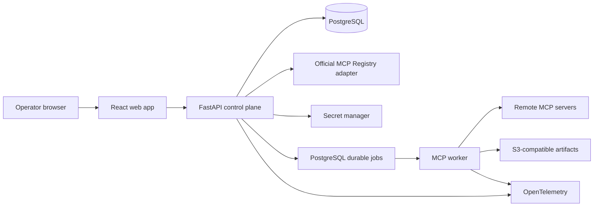

# Modall Milestone 1 — MCP Registry Alpha Implementation Plan

**Status:** Proposed for execution

**Release:** `v0.1.0` — closed operator alpha

**Date:** September 3, 2026

**Parent plan:** `IMPLEMENTATION_PLAN.md`

**Source plan:** `capability_intelligence_exchange_revised_technical_plan.md`

---

## 1. Release decision

Build the platform foundation first as a closed MCP registry with a basic operator UI.

This milestone establishes the control-plane objects and execution lineage that later routing, evaluation, and marketplace features will use. It does not attempt to prove a vertical, select the best capability, or expose an open marketplace.

The release is successful when authenticated admin and operator roles can collectively:

1. search the official MCP Registry or manually enter a remote MCP endpoint;
2. create a server connection using an optional safe credential reference;
3. synchronize live server metadata and tools;
4. inspect immutable, versioned tool schemas in the UI;
5. invoke an enabled tool with non-confidential input;
6. inspect the result, timing, protocol, errors, and audit history; and
7. refresh the server without overwriting earlier capability versions or runs.

The reference journey is:

```text
Find or enter server
  -> create connection
  -> verify MCP compatibility
  -> discover tools
  -> create immutable capability versions
  -> enable a tool
  -> invoke from playground
  -> inspect append-only run record
```

### 1.1 Why this is the first release

- It delivers a usable platform surface without depending on the Swift/iOS evaluation program.
- It makes MCP supply observable before attempting routing across that supply.
- It establishes stable identity, versioning, credentials, execution, audit, and UI patterns once.
- It produces the run records and operational telemetry needed for later comparison and routing.
- It tests a narrow vertical slice of every core layer without prematurely building marketplace or ML systems.

### 1.2 What “registry” means

This release is a workspace control-plane registry, not a replacement for the official MCP Registry.

- The **official MCP Registry** is an upstream catalog of public server metadata.
- A **Modall registry entry** is imported or manually authored metadata with source provenance.
- A **server connection** is an operator-configured endpoint and optional credential binding.
- A **capability** is the protocol-neutral logical object Modall can later evaluate and route.
- An **MCP tool binding** connects one immutable capability version to one discovered MCP tool schema.

Importing a catalog entry never makes code executable, installs a package, or marks a server trusted. Only a successfully verified, policy-compliant connection can expose enabled tools for invocation.

---

## 2. Scope

### 2.1 In scope for `v0.1.0`

#### Registry

- One workspace with pre-provisioned operator access; all tenant-owned rows carry `workspace_id`.
- Manual registration of remote MCP Streamable HTTP endpoints.
- Read-only search of the official MCP Registry through an isolated upstream adapter.
- On-demand import of official `server.json` metadata with source and version provenance.
- Catalog-only handling for package/container entries that lack a directly usable remote endpoint.
- Connection lifecycle: draft, verifying, active, degraded, disabled.
- Operator-controlled display name, tags, environment, and data-classification policy.
- Explicit refresh, periodic synchronization of active connections, and durable bounded-backoff recovery reconciliation for degraded connections.
- Immutable discovery snapshots and schema-drift history.

#### MCP compatibility

- Prefer MCP revision `2026-07-28`.
- Fall back to `2025-11-25` through the official Tier 1 SDK compatibility path.
- Remote Streamable HTTP transport.
- `server/discover` for the modern protocol and legacy initialization fallback.
- Paginated `tools/list` and `tools/call`.
- Tool list cache hints and change notification support when advertised.
- Full preservation of JSON Schema 2020-12 input and output schemas, including valid local URI references such as `#/$defs/item`, without treating inert schema identifiers/references as navigable URLs.
- Text and structured JSON tool results displayed inline.
- Other content blocks retained as bounded artifacts or safe metadata; no active HTML execution.

#### Invocation

- JSON argument editor with server-side schema validation.
- Explicit operator confirmation before every tool call.
- Asynchronous execution with queued, running, succeeded, failed, timed-out, cancelled, and indeterminate terminal states.
- Idempotent creation of a Modall run.
- No automatic retry of an upstream tool call after the durable dispatch fence in this alpha, regardless of tool annotations.
- Immutable run identity, capability version, input snapshot, protocol revision, result, timing, and error lineage.
- Configurable input, output, deadline, and concurrency limits with conservative defaults.

#### Basic UI

- Overview.
- Upstream registry search and import.
- Server connections list, create, detail, refresh, enable, and disable.
- Capability catalog and capability-version detail.
- Invocation playground.
- Run list and run-detail timeline.
- Clear loading, empty, unavailable, authorization, schema-drift, and failure states.

#### Operations and security

- OIDC authentication in deployed environments and an explicit local-development auth mode.
- Admin, operator, and viewer roles mapped from deployment configuration or OIDC groups; membership and invitation management are not exposed in this release.
- Secret references backed by the deployment secret manager; secrets never returned by APIs.
- Server-side SSRF, TLS, and redirect protection. Every credential-bearing manual or imported connection is HTTPS-only.
- All hosted remote MCP endpoints use HTTPS. Plain HTTP is allowed only for a credential-free loopback fixture under explicit local-development configuration.
- Structured audit events for registration, credential changes, enable/disable, refresh, and invocation.
- OpenTelemetry traces, metrics, and structured logs.
- Local Docker Compose development environment and reproducible deployment configuration.

### 2.2 Explicitly out of scope

- Task-aware routing or automatic capability selection.
- Capability comparisons, benchmarks, leaderboards, or quality scores.
- Swift/iOS-specific schemas or UI.
- Public anonymous access or public profile pages.
- Creator self-service publishing.
- Automatic installation of npm, PyPI, OCI, or other packages from registry metadata.
- Arbitrary `stdio` command execution in a hosted environment.
- Legacy HTTP+SSE as a first-class transport.
- MCP prompts and resources as invocable Modall capabilities; their advertised support may be recorded.
- MCP Apps, Tasks, Multi Round-Trip Requests, sampling, elicitation, or roots.
- Interactive OAuth authorization flows for third-party servers.
- Billing, credits, settlement, quotas with monetary value, or x402.
- Workspace-membership administration, SCIM, SSO configuration UI, or enterprise policy management.
- Mobile UI, browser extension, IDE plugin, or GitHub integration.
- Private source-code processing by third-party model providers.

### 2.3 Follow-on candidates for `v0.1.1`

- Interactive OAuth using current MCP authorization discovery and issuer validation.
- Local-only, manifest-allowlisted `stdio` connections.
- Prompts and resources catalog views.
- MCP Tasks extension for long-running upstream calls.
- Scheduled official-registry mirroring instead of on-demand search/import.
- Exportable connection manifests and CLI administration.

---

## 3. Users and release scenarios

### 3.1 Primary user

Internal admins and operators who understand that MCP tools may read or mutate external systems. The alpha is an operations product, not an end-user chat client.

### 3.2 Required scenarios

#### Scenario A — manually connect a public server

1. Admin enters an HTTPS Streamable HTTP endpoint and optional credential reference.
2. Modall validates the destination and records a draft connection.
3. Worker probes protocol compatibility and discovers all tool pages.
4. Modall creates a discovery snapshot and immutable capability versions.
5. Operator reviews and enables selected tools.

#### Scenario B — import from the official registry

1. Operator searches the upstream registry and imports catalog metadata.
2. UI distinguishes remote-connectable entries from catalog-only packages.
3. Import stores the exact upstream version, sanitized allowlisted metadata, a validated `SafeUrl` source location, and a versioned HMAC fingerprint of the received payload; the fingerprint key remains outside ordinary storage in the secret manager.
4. Admin separately configures the endpoint and optional credential reference; Operator verifies the connection.

#### Scenario C — invoke a tool

1. Operator chooses an enabled capability version.
2. UI presents its schema and a JSON arguments editor; it directs operators to configured opaque credential bindings rather than raw secret arguments.
3. UI chooses the prospective run `Idempotency-Key` and calls the non-dispatching run-preflight API; before request materialization, the API performs bounded fail-closed secret/PII classification, rejects raw credential input without persisting a content-derived value, validates and authorizes the exact clean request, and returns a canonical confirmation summary plus a short-lived single-use token bound to its versioned HMAC request fingerprint, idempotency key, actor, workspace, capability version, connection configuration, discovery snapshot, input-scan policy, and policy version.
4. Operator confirms; before persistence the run API repeats the fail-closed input scan and computes the clean request fingerprint, then resolves the scoped `Idempotency-Key` under lock before inspecting preflight consumption. A matching live replay reauthorizes the actor/workspace and returns the original run without validating or consuming the already-used token; a mismatched fingerprint conflicts and an expired replay representation fails closed. Only when no record exists does the transaction acquire the connection, configuration, discovery-observation, capability-status, input-scan-policy, and connection-policy locks in the common global order, then require and consume the unexpired token, revalidate every mutable condition, create one clean run/idempotency record, and queue it before releasing those locks. A uniqueness race rereads the winner and follows the same replay decision; a different key cannot reuse the confirmation.
5. Worker calls the bound MCP tool once.
6. UI shows the terminal result, latency, content metadata, and correlation ID.

#### Scenario D — detect schema drift

1. A refresh returns changed tool metadata or schema.
2. Modall creates a new discovery snapshot and capability version.
3. Existing runs continue referencing the prior version.
4. New version remains disabled until reviewed if the change is materially incompatible.

#### Scenario E — uncertain execution

1. Worker dispatches a potentially mutating call and loses the connection before receiving a response.
2. Modall records the attempt as `indeterminate`.
3. It does not retry automatically.
4. UI explains that the upstream side effect may have occurred.

#### Scenario F — recover a disabled connection and capability

1. Operator disables a connection during an incident; in the same transaction Modall marks every currently enabled capability version on that connection `disabled` with reason `connection_disabled` and cancels its undispatched runs.
2. Operator requests re-enable; the connection moves to `verifying` rather than directly to `active`.
3. Successful fresh discovery returns the connection to `active`.
4. Operator explicitly re-enables the latest non-superseded capability version after confirming that its stored binding still matches the current discovery snapshot.

---

## 4. Release acceptance criteria

### 4.1 Functional gate

- Three reference servers pass the end-to-end suite: an in-repository fixture, a public remote server, and an authenticated test server.
- Both target protocol eras pass discovery and invocation contract tests.
- A server exposing at least 100 tools synchronizes every page without lost or duplicate tools.
- A schema change creates a new immutable capability version, makes the superseded live binding non-invocable, and preserves historical runs.
- A same-connection A→B→A schema rollback creates a fresh pending occurrence generation for the restored A content and preserves both superseded historical rows.
- A server-provided `ttlMs` cannot postpone a forced no-cache reconciliation beyond the local interval; a server that omits notifications and changes/removes a tool is detected within that bound, while an overdue connection becomes degraded and non-dispatchable but retains a durable bounded-backoff reconciliation job until recovery or explicit disable.
- A tool schema containing valid local `$ref` or `$dynamicRef` fragments preserves each exact decoded string value, hashes deterministically under canonical JSON, and is invocable without network resolution; relative or absolute external references through either keyword remain visible but non-invocable and are never fetched.
- A material endpoint or credential change suspends dispatch and requires fresh verification, discovery, and capability review; a tool omitted from a complete refresh becomes unavailable and is rejected before enqueue.
- An imported official-registry entry retains its upstream name, version, validated `SafeUrl` source location, and versioned keyed payload fingerprint without retaining an unsafe raw URL, unsanitized metadata, or an ordinary digest that could act as a low-entropy secret oracle.
- Catalog-only entries cannot be invoked.
- Disabled connections and capabilities cannot create new runs.
- A disabled connection and its latest non-superseded capability version can be restored only through Scenario F revalidation and explicit enablement.
- A run whose declared classification is not allowed by both the global alpha policy and selected connection policy is rejected before enqueue; the worker checks current policy again before dispatch.
- Tool arguments matching a credential, token, secret, high-entropy detector, or disallowed policy-defined PII—and any input scanner failure—are rejected before request persistence or enqueue and again before dispatch. Initial rejection retains no argument, digest, or fingerprint. Retained clean arguments are envelope-encrypted under a unique externally erasable per-run key, and durable queues/replays/caches never duplicate plaintext. If a later scan-policy version rejects them, dispatch and reads stop in `erasure_pending`; terminal rejection occurs only after verified key destruction makes database, WAL, replica, backup, and cache ciphertext unrecoverable and cleanup is attested. Neither path sends provider data. Server authentication uses an opaque credential binding instead.
- Sensitive tool output is never stored inline or in plaintext and is never displayed through ordinary run APIs. Only the explicitly policy-permitted encrypted restricted-artifact path in Section 6.3 may retain it; otherwise the raw value is discarded. Scanner failure also fails closed to quarantine.
- Non-text result bytes remain quarantined until detected type, malware, archive safety, and the allowlisted type's complete content-aware extraction/OCR/secret-PII classification plan pass; executables, encrypted/uninspectable content, unsupported types, mismatches, incomplete coverage, and scanner failure cannot be published or downloaded.
- Confirmation uses a non-dispatching authoritative preflight; after bounded scanning/fingerprinting, run creation resolves idempotency first, returns an authorized matching replay without revalidating its consumed token, and only for a missing record acquires the shared lifecycle locks and atomically consumes the single-use token with run/idempotency creation. If admission wins, a later control mutation observes and cancels the queued row; if the control mutation wins, admission's locked recheck rejects it. Sensitive/scanner-failed input or expired, mismatched, reused-with-another-key, or stale-lifecycle tokens never persist or enqueue a request.
- Large and non-text results are read only through authorized, subject-bound, short-lived artifact access to an integrity-checked immutable object version; overwrite and cross-workspace attempts fail closed.
- Artifact access-grant bearer tokens exist only in the authorized no-store mint/replay response and redacted request header; ordinary grant/idempotency rows, audit, telemetry, and browser surfaces retain no full token, and the encrypted replay envelope is erased at grant expiry.
- Redeeming an artifact grant reauthorizes current subject/workspace membership and role, authorization epoch, artifact visibility, classification policy, retention, scan, and exact-version integrity; revocation after mint denies bytes even while the token is unexpired.
- A completed run can be diagnosed from the UI without direct database access.

### 4.2 Reliability gate

- API or worker restart does not lose queued runs.
- Duplicate or delayed `Idempotency-Key` requests never create a second mutation, including after the full replay response expires.
- No automatic retry occurs after upstream execution becomes ambiguous.
- Discovery retries are bounded and use backoff because discovery is read-only.
- Per-server concurrency and circuit-breaker behavior pass fault-injection tests.
- Migrations pass clean-install, upgrade, and rollback-readiness tests.

### 4.3 Security gate

- Cross-workspace authorization tests exist even though the alpha seeds one workspace.
- OIDC mode cannot be enabled until a provider-specific adapter proves current group membership and revocation propagation within 60 seconds; endpoint presence alone is insufficient. An unqualified provider blocks the deployable closed-alpha release. The audited local principal remains available only in explicit local-development mode, and any artifact using it is labeled developer preview rather than closed alpha.
- Endpoint validation blocks loopback, link-local, cloud metadata, and private-network destinations unless deployment configuration explicitly allows them.
- Every request and redirect hop is resolved through the policy resolver, rejects any forbidden answer, and binds the transport dial to a selected validated IP without a second library DNS lookup while preserving the original hostname for TLS SNI, certificate verification, and the HTTP `Host`. Connection-pool reuse is allowed only for that validated origin/address tuple; new dials repeat resolution and policy checks. An enforced egress policy provides a second boundary against DNS rebinding and TOCTOU races.
- Credential-bearing requests require a valid HTTPS certificate. HTTPS-to-HTTP redirects are rejected; redirects are bounded and must remain on the credential-bound origin. Scheme, host, port, certificate, and the dialed validated IP are checked for every hop, and credentials are retrieved and attached only after those checks pass.
- Every navigable or source URL-valued field—including connection endpoints, redirects, imported source locations, upstream search results, and retained resource links—must cross the one typed `SafeUrl` parser/sanitizer before persistence, audit, error interpolation, logging, tracing, or API output. It rejects userinfo, fragments, ambiguous/double encoding, credential/token/signature/secret/high-entropy-shaped decoded path segments, and non-allowlisted or credential-shaped query names/values. Raw URL secrets never leave the bounded parsing boundary. JSON Schema `$id`, `$schema`, `$ref`, and `$dynamicRef` strings instead use the inert schema-URI-reference contract in Section 6.2; they are never passed to transport or `SafeUrl`. Registry Alpha does not issue delegated upload URLs; Phase 1's separately typed, short-lived `EphemeralUploadTarget` is a sealed outbound secret capability and is never accepted or represented as `SafeUrl`.
- Long-lived credentials, upstream authorization headers, and provider secret values do not appear in Alpha logs, traces, API responses, or audit payloads. Alpha's short-lived `ArtifactAccessGrantToken` is the only sealed secret-response exception and follows the no-store, encrypted TTL-matched replay, and telemetry-redaction contract in Section 8.5. The later `EphemeralUploadTarget` uses the same class of explicit secret transport under the stricter non-recording transfer contract in the platform plan, not an ordinary response or URL field.
- Artifact-grant qualification proves the full bearer token exists only in an authorized no-store mint/replay response, the redacted redemption header, and its TTL-matched encrypted secret envelope; ordinary database/idempotency rows and every telemetry/browser surface retain no token.
- Role, membership, artifact-policy, visibility, classification, retention, or authorization-epoch changes between grant mint and redemption deny content on the next authoritative check.
- Mutation request bodies are disabled in ingress/proxy/application telemetry, and fail-closed tool-argument scanning prevents a raw credential from reaching request persistence, idempotency storage, a queue, or an upstream server.
- Hosted `stdio` execution and automatic package installation are impossible through the API.
- Tool input/output, JSON Schema depth, artifact count, artifact size, and total response size are bounded.
- Untrusted result content is rendered as escaped text or safe structured data under a restrictive CSP.
- Every publishable binary type has a versioned fail-closed content-inspection profile covering malware/type, metadata and embedded-object/text extraction, applicable archive recursion, all-page/frame rendering and OCR, and secret/PII classification. Encrypted, truncated, unsupported, coverage-incomplete, or scanner-failed content remains blocked.
- Dependency, secret, and container scans have no unresolved critical findings.
- Hosted workers run as non-root in non-privileged containers with read-only root filesystems, bounded writable scratch space, CPU/memory/process limits, restricted syscalls, default-deny egress with explicit destinations, and images pinned by immutable digest.

### 4.4 Usability and accessibility gate

- A new admin/operator pair can connect the fixture server and execute a tool using only the UI and release documentation, without either role exceeding its documented permissions.
- All core workflows are keyboard accessible.
- Forms have programmatic labels and errors; status is not communicated by color alone.
- Destructive-looking or potentially mutating calls always require explicit confirmation.
- Unsupported MCP features produce actionable messages rather than generic failures.

### 4.5 Performance gate

These are platform-overhead targets, not guarantees about upstream servers:

- p95 cached capability-list API latency under 300 ms with 5,000 capability versions.
- p95 run-creation latency under 300 ms.
- p95 Modall invocation overhead under 250 ms, excluding queue wait and upstream execution.
- A 100-tool discovery completes within 10 seconds against the reference server under normal local test conditions.
- The UI becomes interactive within 2.5 seconds on the supported desktop test profile.

### 4.6 Release decision

Release `v0.1.0` only when functional, reliability, security, and migration gates pass. Performance misses may be accepted only with a measured cause, an owner, and no correctness or security impact. Feature scope must be cut before weakening a security or lineage invariant.

---

## 5. Architecture

### 5.1 Deployment shape

Use a modular monolith with one worker deployable. This preserves the parent plan's architecture while moving registry and MCP execution earlier.



Deployables:

- `api`: authentication, registry administration, read APIs, run creation, audit.
- `worker`: connection verification, discovery synchronization, health probes, tool invocation.
- `web`: operator console.

No service mesh, Kubernetes requirement, event broker, Redis, or workflow engine is needed for this release.

### 5.2 Technology choices

- Backend: Python, FastAPI, Pydantic, SQLAlchemy, Alembic.
- MCP: official Tier 1 Python SDK, exactly pinned in the lockfile.
- Database and jobs: PostgreSQL with leased jobs and `FOR UPDATE SKIP LOCKED`.
- Frontend: React, TypeScript, Vite, a small accessible component layer, and server-state query caching.
- Artifact storage: S3-compatible storage; MinIO in local development.
- Authentication: standards-based OIDC JWT validation; explicit local-only development principal.
- Telemetry: OpenTelemetry, structured JSON logging, Prometheus-compatible metrics.
- Tooling: `uv`, `pnpm`, pytest, Ruff, static type checking, Vitest, Testing Library, Playwright.

Pin runtime and dependency versions during PR-01. Do not depend on floating MCP SDK or registry schemas.

### 5.3 Domain boundaries

```text
identity
  users, workspaces, memberships, roles

registry
  upstream entries, server connections, discovery snapshots

capabilities
  logical capabilities, immutable versions, MCP bindings

invocations
  runs, attempts, state transitions, artifacts

credentials
  opaque secret references and access policy

audit
  actor-attributed control-plane changes

telemetry
  traces, metrics, logs, correlation
```

Modules use typed interfaces and repositories. Application code must not reach into another module's tables through ad hoc ORM queries.

### 5.4 Capability abstraction

The core object remains protocol-neutral:

```text
Capability
  -> CapabilityVersion
       content_digest
       occurrence_generation
       -> MCPToolBinding
            server_connection_id
            server_connection_version_id
            remote_tool_name
            input_schema
            output_schema
            implementation_identity_assurance
            implementation_revision
       -> CapabilityObservation [one or more]
            discovery_snapshot_id
            present
            observed_at
```

For `v0.1.0`, one discovered MCP tool maps to one logical capability scoped to its server connection. Semantic grouping of equivalent tools across providers is deferred. This avoids inventing deduplication logic before evaluation data exists.

### 5.5 Versioning rules

- IDs are UUIDv7 or another sortable opaque identifier; slugs are mutable aliases.
- Normalize JSON deterministically before hashing.
- A discovery snapshot digest covers server identity, negotiated protocol, advertised capabilities, complete tool pages, and relevant extensions.
- A tool content digest covers only that tool's normalized name, title, description, annotations, input schema, output schema, exact `server_connection_version_id`, `implementation_identity_assurance`, normalized identity source, and implementation revision when one is available. The complete discovery-snapshot ID/digest is provenance in a separate observation and never participates in every tool digest, so an unrelated tool addition, removal, or change cannot churn unchanged capability versions. Credential rotation, identity-source change, or assurance upgrade/downgrade therefore changes the content digest even when the advertised tool and revision are byte-identical.
- Capability-version identity is the logical capability plus content digest plus a monotonically increasing occurrence generation. An unchanged observation reuses the latest non-superseded version. A changed content digest creates a new immutable `pending_review` generation. If content A is superseded by B and A later reappears, create a fresh A generation in `pending_review`; never resurrect the terminal earlier A row.
- Operator metadata such as local tags does not create a protocol version; it is separately audited.
- Refresh never overwrites a prior snapshot or version.
- Runs always reference the exact capability version and binding used.
- Every complete discovery appends observations for the union of listed and previously current remote tool names, linking the snapshot and `present` boolean to the reused or newly created capability version. An unchanged present tool on the same connection version reuses its version and appends only an observation; an omitted prior tool receives `present=false` provenance for its unavailable transition. Each run records the exact current present observation/snapshot checked at dispatch.
- Every binding records `implementation_identity_assurance` (`pinned`, `declared`, or `unverified`), normalized identity source, and optional revision; all three participate in version identity. A changed revision, source, or assurance creates a new capability version and prevents stale trust metadata from surviving in the current binding.
- An unpinned remote implementation remains invocable in the registry alpha, but every result is labeled `unverified_remote` and tied to its discovery snapshot and observation time. It is ineligible for authoritative benchmark aggregation, G1 evidence, or learned routing until an immutable revision is attested or a platform-controlled adapter provides one.

### 5.6 Lifecycle rules

Connection and capability states below are operational projections, not fields in immutable version content. Every transition appends a status event with prior state, next state, reason, actor/system source, and correlation ID, then compare-and-set updates the current projection in the same transaction. Capability schema, content digest, occurrence generation, and binding rows never change.

```text
Server connection
draft -> verifying
verifying -> active | degraded | disabled
active <-> degraded
active | degraded -> verifying
active | degraded -> disabled
disabled -> verifying

Capability version
pending_review -> enabled | disabled | unavailable | superseded
enabled <-> disabled
enabled | disabled -> unavailable | superseded
unavailable -> pending_review | superseded

Run
queued -> running -> succeeded
   |         |-----> failed
   |         |-----> timed_out
   |         |-----> cancelled
   |         |-----> indeterminate
   +---------------> cancelled
   +---------------> failed
```

- A disabled or degraded connection does not accept new dispatches. Degradation never stops recovery: a durable forced-reconciliation job remains scheduled for every degraded connection and retries complete no-cache discovery with bounded exponential backoff/jitter capped at five minutes until success or explicit disable; operators may also request a read-only bypass refresh.
- `queued -> failed` is allowed only before a dispatch fence exists, for a definitive pre-dispatch failure such as provisional request-key activation failure or a security reclassification whose key destruction has completed. It appends the stable safe reason, projects to the existing public `failed` status, and cannot bypass the requirement that `erasure_pending` reach attested `erased` first. Control-plane disablement continues to use `queued -> cancelled`.
- Re-enabling a disabled connection transitions it to `verifying`, never directly to `active`; successful protocol negotiation and discovery are required before it can serve new runs.
- Disabling a connection atomically transitions every currently `enabled` capability version on that connection to `disabled` with reason `connection_disabled` and cancels queued runs before setting the connection `disabled`. Connection reverification never clears those capability states; each intended version requires a later explicit enable action.
- Run admission and every connection disable, material configuration change, capability-state change, discovery-observation replacement, input-scan-policy change, and connection-policy update acquire the affected rows/advisory locks in one documented global order. Where client idempotency applies, its scoped key lock precedes the lifecycle lock sequence; the worker fence uses that same lifecycle subsequence without an idempotency lock. Admission inserts its run/queue row before releasing lifecycle locks. Therefore a control mutation that locks second must observe and cancel the admitted undispatched run, while admission that locks second must observe the new state and reject before enqueue; there is no read/enqueue gap or inverted lock order.

The global order is mandatory and implemented by one shared lock-plan helper:

1. scoped idempotency advisory key, for API mutations only;
2. `server_connections`, ordered by stable connection ID;
3. current `server_connection_versions`/configuration pointers, ordered by ID;
4. current discovery-observation pointers and referenced `discovery_snapshots`, ordered by connection then snapshot ID;
5. `capability_status_projections`, ordered by capability-version ID;
6. current input-scan-policy pointer/version;
7. current global/deployment and connection-policy pointers/versions, ordered by policy scope then ID;
8. affected `runs`, `run_attempts`, and `jobs`, in that order and then by ID.

Transactions skip irrelevant classes but never reorder them. They choose the documented row or advisory lock for each key, never both; multi-row sets are sorted before acquisition. A worker completes and commits lease claiming before beginning the fence transaction, so it carries no run/job lock backward into steps 2–7. Control mutations acquire steps 2–7 before locking queued rows in step 8. The helper rejects an out-of-order plan in tests and emits only bounded lock-class timing telemetry, never identifiers.
- A material connection change, including endpoint or credential binding, atomically creates a connection-configuration version, moves the connection to `verifying`, suspends new dispatch, and transitions every non-superseded capability version tied to the prior configuration to `superseded`. Already-superseded versions are terminal idempotent no-ops and emit no duplicate transition event. Fresh verification and complete discovery are required before the connection can become `active`; versions materialized against the new configuration remain `pending_review` until explicitly enabled.
- Refresh matches tools by connection plus remote tool name. When a complete current snapshot omits a previously present tool, its version transitions to persisted `unavailable`, becomes non-invocable immediately, and is rejected before enqueue. If the exact same digest and binding later reappear in a fresh complete snapshot, the unavailable version may return only to `pending_review`; a changed digest creates a new `pending_review` version and supersedes the old one.
- Any changed tool digest creates a new `pending_review` version. The old binding becomes `superseded` and historical-only because a remote MCP endpoint cannot guarantee that its prior implementation remains addressable.
- A disabled capability version can return to `enabled` only through an explicit operator action while it is the latest non-superseded version, its connection is active, and its binding matches the current discovery snapshot. A superseded version is permanently historical.
- A run queued against a version that becomes disabled, unavailable, superseded, or detached from the current connection configuration/discovery snapshot before dispatch is cancelled with a stable reason code.
- Terminal run states never transition back to active states. Corrections are appended as events rather than rewriting history.

---

## 6. MCP behavior and compatibility contract

### 6.1 Protocol negotiation

- Configure the official SDK for automatic modern negotiation.
- Prefer `2026-07-28` using `server/discover`.
- Fall back to the legacy initialization flow for `2025-11-25` servers.
- Record the selected protocol revision on every snapshot and run attempt.
- Reject unsupported revisions with a stable `mcp_protocol_unsupported` error.
- Keep MCP wire objects behind an internal adapter so future SDK upgrades do not leak through domain or API contracts.

### 6.2 Discovery

- Follow every `tools/list` cursor with a configurable maximum page and tool count.
- Reject cursor loops and inconsistent duplicate tool definitions.
- Treat list `ttlMs` and `cacheScope` only as untrusted optimization hints. Compute effective TTL as the minimum of a valid nonnegative server hint (invalid or absent uses a 60-second local default), a configurable local maximum defaulting to 5 minutes, and a non-overridable 15-minute hard ceiling; `cacheScope` may narrow but never broaden the connection/workspace cache boundary.
- Ordinary reads may honor an entry within that effective TTL. Independently, every active connection must complete a scheduled full no-cache reconciliation at least every 10 minutes with bounded jitter that never pushes the deadline later, regardless of the server hint or notification support. When a missed deadline or failure degrades a connection, the scheduler preserves one durable recovery job and keeps attempting the same complete bypass with bounded exponential backoff/jitter capped at five minutes until a successful complete pagination atomically restores current observations and `active`, or an operator explicitly disables the connection; lease recovery cannot silently drop this job. Operator refresh also bypasses the SDK/list cache. A bypass path performs a fresh upstream listing and replaces the cache only after successful complete pagination; if the SDK lacks a bypass API, use a fresh no-cache client instance/path.
- Record `last_complete_bypass_at` and `next_reconciliation_due_at`. If the last complete bypass becomes 15 minutes old, atomically move the connection to `degraded`; the dispatch-fence eligibility check independently enforces the same hard staleness bound and blocks new calls until a successful forced reconciliation restores current discovery evidence.
- Subscribe to supported list-change notifications when operationally useful; they expedite a bypass refresh but never replace the periodic reconciliation correctness path.
- Treat tool annotations as descriptive hints, never as a security boundary.
- Validate schemas with bounded depth, reference count, and processing time.
- Persist only allowlisted protocol metadata in normalized snapshots. Unknown `_meta` and extension values are dropped by default; an explicitly enabled diagnostic capture is sanitized for secrets, tokens, cookies, credentials, and configured PII patterns before encrypted restricted storage.
- Never return unsanitized remote metadata from a snapshot API. Negative fixtures cover credential, token, cookie, and PII-shaped values.
- Parse JSON Schema `$id`, `$schema`, `$ref`, and `$dynamicRef` strings as bounded `InertSchemaUriReference` values under RFC 3986/JSON Schema 2020-12 syntax while preserving their exact strings in the canonical schema. Local targets—such as `$ref: "#/$defs/item"` and `$dynamicRef: "#node"` with a same-document `$dynamicAnchor`—resolve only inside the same immutable document through the bounded local validator. Relative or absolute external targets through either applicator are preserved and marked `external_ref_unresolved`, never fetched; a schema requiring one is visible but non-invocable with stable reason `mcp_schema_external_ref_unsupported`. Credential/secret/control-character scanning covers every one of these keyword values before persistence and rejects the whole tool snapshot safely rather than rewriting a reference. These inert values never enter HTTP clients, browser navigation, resource links, logs, or `SafeUrl`.

### 6.3 Invocation

- At the first run-preflight ingress, hold raw arguments only in a bounded ephemeral buffer excluded from request logs, traces, error interpolation, audit payloads, and body capture. Before canonical request materialization or HMAC fingerprinting, scan parsed strings and decoded values for credentials, tokens, secrets, high-entropy values, and policy-defined PII. A match or scanner failure returns stable `mcp_input_sensitive` or `mcp_input_scan_failed`, persists only non-content-derived rule/type/size audit metadata, and cannot produce a reusable confirmation token. Raw secrets are unsupported as tool arguments; operators must use the connection's opaque credential binding for server authentication.
- Validate the operator arguments against the immutable stored schema before dispatch.
- Accept only `public` or `non_confidential` declarations in the alpha. Before enqueue, authorize the declared classification against the global alpha policy and the selected server-connection version; fail closed when policy is missing or ambiguous.
- Run creation repeats the bounded input scan under the current immutable scan-policy version and computes the clean canonical request plus versioned HMAC request fingerprint, never an ordinary input digest. It then performs the idempotency lookup/lock and fingerprint comparison before validating whether the submitted preflight is still unconsumed; an authorized matching record returns its replay representation without another token consumption. Only the no-record branch acquires the same lifecycle/configuration/observation/policy locks used by control mutations, rechecks under those locks, and atomically consumes the preflight while persisting the request/run/idempotency/queue rows. Before durable persistence, it provisions a unique per-run content key in a qualified cryptographic-erasure service as a short-lived provisional key bound to the prospective run ID and envelope-encrypts the canonical arguments. The database transaction persists only ciphertext, the opaque handle, and an activation outbox row; after commit, an idempotent handler activates the key for the request-retention period, while rollback or missing activation lets the provisional key self-destruct. The run cannot dispatch or expose arguments until activation is confirmed; activation failure/expiry moves it into the same fail-closed erasure path. PostgreSQL, WAL, replicas, backups, jobs/queues, idempotency responses, and durable caches receive only ciphertext or a run/content reference plus the opaque key handle, never a plaintext duplicate or recoverable key. A worker decrypts once into a single-use bounded non-swappable `ScannedArgumentLease`, rescans it immediately before fencing, and binds its exact HMAC fingerprint plus current scan-policy version into the fence transaction. A changed version forces a fresh scan. On a clean committed fence, that same worker passes the still-held lease directly to a bounded transport serializer and upstream send without another database read or decryption. The worker retains ownership of the lease and every mutable serialization buffer until the transport reports that the full request body was written, or proves a definitive failure before any byte was written; it then wipes them. A partial/ambiguous write follows `indeterminate`, and a crash after the fence loses the lease and follows the existing no-retry recovery rule. If scanning newly rejects the input, no fence is written: the lease is wiped and the locked transaction first advances the monotonic content state to `erasure_pending`, revokes dispatch eligibility, suppresses every read/replay, and enqueues an idempotent key-destruction workflow; it does not claim terminal erasure. That workflow irreversibly destroys the unique external key and verifies provider destruction across active versions and recovery copies, purges ciphertext caches, tombstones database ciphertext/content references, and only then appends the attested security-erasure event and finalizes `request_content_state=erased` plus `dispatch_eligibility_revoked`. WAL, MVCC pages, replicas, and backups may retain ciphertext but cannot recover plaintext after verified key destruction. Failure or delayed provider destruction leaves the run `erasure_pending`, quarantined, unreadable, and non-dispatchable with an alert; only the existing versioned HMAC request fingerprint plus non-content-derived policy/rule/size and erasure evidence survives.
- The transaction that creates `dispatch_fenced` uses steps 2–8 of the shared lock plan for connection, configuration, discovery observation, capability status, input-scan policy, global/connection policy, and attempt/job state. While holding them, revalidate the clean input-scan decision/current version, live tool name, invocable capability projection, exact current connection-configuration version, current present discovery observation/snapshot, `last_complete_bypass_at` younger than the 15-minute dispatch-staleness bound, and run classification/current policy; write the fence only if every check passes. If a control change or staleness boundary wins first, fencing fails and no call occurs; if fencing commits first, the attempt is already in at-most-once uncertain-execution semantics. There is no unlocked check-to-fence gap.
- Attach trace context using the current protocol's supported metadata.
- Default deadline: 120 seconds; configurable downward per connection or capability.
- Default maximum input: 256 KiB serialized JSON.
- Default maximum result: 1 MiB inline only after content scanning; bounded larger content becomes an artifact up to the configured hard limit.
- Stream every result first into a bounded ephemeral quarantine buffer. Before database persistence, artifact publication, or UI/API display, scan text and structured content for tokens, credentials, secrets, and policy-defined PII. Every non-text MIME on the publication allowlist maps to an immutable scanner-profile version. In a no-network sandbox, that profile must verify actual versus declared type, run malware checks, extract metadata/embedded text and objects, recursively inspect bounded archive contents, and render/OCR every page or frame when visible content can carry text; secret/PII classification runs over all extracted, OCR, metadata, and recursively decoded content. Profile-specific coverage counters must prove every required page/frame/object was examined. Password protection, encryption, unsupported embedding/compression, truncation, resource/recursion limits, extractor/OCR timeout/error, or incomplete coverage fails closed to quarantine. A type without such a tested complete profile is not publishable; executables remain blocked.
- Clean, output-schema-valid results may be persisted under the declared run classification with an ordinary content digest. A sensitive match in raw text, structured data, metadata, extraction, OCR, or embedded content upgrades the output classification and is never stored inline: when policy explicitly permits an encrypted restricted artifact, identify it only with an opaque ID and a versioned HMAC fingerprint whose key remains in the secret manager outside ordinary storage; when policy forbids preservation, discard the raw value and retain no content-derived digest or fingerprint—only non-reversible classification/rule IDs, detected type, size, scanner-profile/coverage status, and audit metadata. Return only a redacted placeholder and safe metadata to ordinary run APIs.
- Before any result is published or the run is marked successful, validate structured content against the immutable capability version's advertised output schema with the same bounded depth, reference, size, and processing-time controls used for input. A missing advertised output schema is recorded as `not_declared`; a declared-schema violation fails the attempt/run with stable code `mcp_output_schema_invalid`, keeps raw content in the quarantine policy path only, and excludes the result from success or evidence aggregation.
- A scanner error or unsupported content type fails closed to quarantine. Neither raw nor quarantined content enters logs, traces, browser caches, or ordinary snapshot/run responses.
- Never follow resource links or render active content automatically.
- Persist an attempt-level `dispatch_fenced` state before any upstream network send. The alpha never automatically retries a fenced tool call, regardless of tool annotations.
- If dispatch may have reached the server but no definitive response is available, mark the attempt `indeterminate`.
- Lease recovery may redispatch only an attempt still durably in `created`. A recovered `dispatch_fenced` or `awaiting_result` attempt without a durable result records any provider receipt and transitions to `indeterminate` with `reconciliation_required`.
- Cancellation before the dispatch fence can terminally cancel the attempt. After the fence, record `cancellation_requested` and propagate best effort, but transition to `cancelled` only when definitive upstream evidence proves the operation did not execute or was fully rolled back. Otherwise continue awaiting a definitive result; a lost acknowledgement or deadline with uncertain execution becomes `indeterminate` with `reconciliation_required`, never a successful cancellation.

### 6.4 Unsupported features

If an invocation returns an MCP flow requiring Multi Round-Trip Requests, Tasks, elicitation, or another unsupported extension, retain the response metadata and fail with a specific `mcp_feature_not_supported` result. Do not silently approximate the interaction.

### 6.5 Official Registry integration

The official MCP Registry is in preview, so its adapter is treated as an unreliable external dependency:

- generate or validate a client against the official OpenAPI contract;
- isolate upstream response objects from internal domain models;
- pass every navigable/source URL-valued upstream field through the shared `SafeUrl` boundary before mapping it into a domain object, cache, error, or API response; schema keyword URI references use only `InertSchemaUriReference`; reject an unsafe import/search item with a safe reason that never echoes the raw URL;
- compute a versioned HMAC fingerprint of the received payload before discarding unsanitized fields, with its key held in the secret manager, then retain only the fingerprint/key-version reference, allowlisted/sanitized metadata, and source provenance;
- use timeouts, bounded retries, caching, and a circuit breaker;
- show stale cached results explicitly when the upstream is unavailable;
- import only on an operator action in `v0.1.0`;
- never equate registry publication with trust, health, compatibility, or Modall enablement;
- never automatically execute installation instructions from registry metadata.

---

## 7. Data model

### 7.1 Tables

| Table | Purpose | Mutability |
|---|---|---|
| `users` | Authenticated human identities | Mutable profile |
| `workspaces` | Tenant boundary | Mutable settings |
| `workspace_memberships` | Role binding | Audited mutable |
| `registry_sources` | Official or manually configured catalog sources | Audited mutable |
| `registry_entries` | Imported upstream server metadata | Versioned append/supersede |
| `server_connections` | Stable connection identity and current status | Audited mutable |
| `server_connection_versions` | Immutable endpoint, policy, environment, and optional credential binding snapshot | Append-only |
| `credential_bindings` | Stable identity for an opaque secret-manager reference | Audited mutable |
| `credential_binding_versions` | Immutable secret-manager provider/resource/version reference and rotation lineage, never secret value or mutable alias | Append-only |
| `connection_status_events` | Connection lifecycle history | Append-only |
| `discovery_snapshots` | Immutable normalized and sanitized discovery result | Append-only |
| `capabilities` | Stable logical tool identity | Mutable display metadata |
| `capability_versions` | Immutable discovered schema, content digest, occurrence generation, and binding identity; excludes lifecycle status | Append-only |
| `mcp_tool_bindings` | Version-to-exact-server-connection-version/tool binding | Immutable |
| `capability_observations` | Per-snapshot present/absent observation linking each listed or previously current tool name to its capability version | Append-only |
| `capability_status_events` | Per-version operational lifecycle transitions with reason and actor/system source | Append-only |
| `capability_status_projections` | Current per-version operational state materialized from events | Compare-and-set mutable projection |
| `jobs` | Durable worker coordination | State machine |
| `runs` | Operator-requested direct MCP invocation with envelope-encrypted canonical arguments while retained, opaque per-run content-key handle, accepted input-scan decision/version, exact Alpha `server_connection_version_id`, and monotonic `retained|erasure_pending|erased` content state | Append/supersede status; erasure may only tombstone ciphertext after verified key destruction and append evidence |
| `request_content_keys` | Opaque handle, `provisional|active|destroy_pending|destroyed` lifecycle, activation outbox identity, and destruction attestation for one per-run key held only by the qualified cryptographic-erasure service; never raw or wrapped key material in application storage | Provisional create/activate once; irreversibly destroy once |
| `run_attempts` | Exact dispatch attempt, receipt, and output-scan decision | Append-only events/status |
| `run_events` | Timeline and state-transition evidence | Append-only |
| `consumed_run_preflights` | Unique signed-token JTI, versioned HMAC request fingerprint, prospective run idempotency key, and run lineage inserted atomically with run creation | Append-only |
| `artifacts` | Clean content-addressed artifact metadata, or opaque restricted-sensitive metadata with a secret-manager-keyed plaintext fingerprint and ciphertext integrity checksum, pinned to an immutable object version | Append-only |
| `artifact_access_grants` | Short-lived, subject/workspace/artifact-version/authorization-epoch-bound metadata plus versioned HMAC token verifier; never the bearer token | Expiring append-only |
| `idempotency_records` | Ordinary replay response or non-secret reference to a sealed ephemeral-secret envelope, plus workspace-lifetime HMAC-keyed tombstone, HMAC key-version ID, domain-separated HMAC request fingerprint, and original resource/result reference | Response/envelope expires; tombstone append-only until workspace hard deletion |
| `secret_envelope_outbox` | Non-secret prepared-envelope ID, owning idempotency/resource IDs, immutable expiry, and activation/cleanup state; never credential bytes | Transactional outbox; delete after verified commit or orphan/expiry cleanup evidence |
| `idempotency_hmac_keys` | Encrypted versioned verification keyring for tombstone lookup across rotations | Append/retire only after every protected workspace is hard-deleted |
| `audit_events` | Actor-attributed control-plane activity | Append-only |

### 7.2 Required constraints

- Every tenant-owned row carries `workspace_id` and is checked by repository methods.
- A capability occurrence generation is monotonically allocated while locking its logical capability and is unique within that capability. The tuple `(capability_id, content_digest, occurrence_generation)` is unique, while a content digest may recur in a later generation after its earlier row became terminally superseded.
- A discovery snapshot digest is unique within a server connection.
- Snapshot deduplication creates a fresh successful observation that may point to an older identical snapshot. The current connection/capability observation and projection pointers therefore retention-protect that exact snapshot independent of its creation age; cleanup takes the same ordered observation/snapshot locks and may delete only after no current pointer, binding, retained run, or audit requirement references it.
- Every MCP tool binding references the exact `server_connection_version_id`; that identifier participates in the capability-version content digest. Discovery snapshot identity is excluded from the tool digest and retained through `capability_observations`.
- Capability lifecycle writes never mutate `capability_versions` or bindings. They append `capability_status_events` and atomically compare-and-set the matching current projection; replay from events must reproduce every projection.
- Every event-backed connection, capability, and run projection records the last applied event identity/version. Its authoritative event stream is retention-protected for the lifetime of that projection and every retained reference, so a rebuild always starts from genesis in Alpha.
- In Registry Alpha, every direct MCP run and attempt references one immutable capability version and exact `server_connection_version_id`. Its credential-binding version is nullable for unauthenticated servers and exact when credentials are used. This non-null MCP-only binding is a release-baseline constraint, not a valid representation for later model/CLI/static-analysis runs; the Phase 0 expand/contract migration in `IMPLEMENTATION_PLAN.md` must replace it with the exclusive MCP-connection/provider-deployment binding before any evaluation writer is enabled.
- A credential-binding version names an immutable provider-native secret version or generation. Mutable aliases such as `current` are resolved only in the control plane; a changed resolved version creates a new credential binding and server-connection version and triggers the material-change reverification flow. Workers request only the pinned secret version and fail closed if it is unavailable.
- Each idempotency tombstone records its HMAC key version. Lookup computes candidate identifiers with the current and retained retired verification keys; after finding a record, request comparison recomputes its domain-separated fingerprint with that record's key version. Rotation writes new tombstones/fingerprints with the new key but retains older keys until every protected record is removed at workspace hard deletion. Missing key material fails closed, and rotation/retirement is audited.
- Registry-payload and restricted-artifact fingerprints use a separate versioned HMAC purpose/key from idempotency. Fingerprint keys remain in the secret manager and each record stores its key version; retired versions remain available for the record's retention lifetime, missing key material fails closed for comparison, and neither path persists an ordinary digest of potentially sensitive bytes.
- Every run attempt persists its pre-send dispatch fence, exact versioned clean-input HMAC fingerprint and scan-policy version/decision, nullable credential-binding version, optional provider receipt, reconciliation state, output classification, output-scan status, and result-fingerprint kind plus nullable digest/HMAC key version. A rejected sensitive input is never a run attempt, and a discarded sensitive result has no content-derived fingerprint.
- Every retained canonical request is encrypted before its first durable write with a unique external per-run key. Application tables, queues, idempotency responses, caches, WAL, replicas, and backups may contain only ciphertext or opaque references and never the key material; workers decrypt only in bounded ephemeral memory. `retained -> erasure_pending -> erased` is monotonic, and no reader or dispatcher can use content after the first transition. `erased` requires a verified irreversible key-destruction attestation and cache purge; provider delay/failure remains quarantined in `erasure_pending`.
- State transitions use compare-and-set version columns or explicit row locks.
- Audit, snapshot, run event, and attempt tables cannot be updated through application repositories except to append terminal metadata defined by their state machine.
- Raw secrets and full artifact grant tokens are forbidden from all table columns and JSON metadata fields; only versioned HMAC grant verifiers and non-secret envelope references may persist there.
- A credential-bearing mutation may commit only after its exact encrypted envelope is durably prepared. The same transaction writes its resource, verifier, idempotency reference, and activation outbox; replay/worker promotion is idempotent, never extends expiry, and never remints after a committed envelope is missing. Prepared envelopes without a committed database owner are inaccessible and expire or are swept.
- Raw or merely redacted navigable/source URL values are forbidden from domain/storage/API types; only a successfully validated canonical `SafeUrl` may cross that parsing boundary. Exact JSON Schema keyword strings may persist only inside the immutable schema plus typed `InertSchemaUriReference` validation/provenance and can never be used as a network target.
- Timestamps are UTC and server-assigned.

### 7.3 Retention defaults

- Operational metadata and audit events: 90 days for alpha unless extended explicitly, excluding any lifecycle/state-event stream still required to rebuild a live or retained projection.
- `connection_status_events`, `capability_status_events`, `run_events`, and any other projection-authoritative transition stream remain complete while their entity/projection exists or retained runs/audit evidence reference it; the 90-day clock can begin only after that authority and every reference are removed. Alpha performs no lossy lifecycle compaction. Any later compactor must atomically write a versioned, hash-chained checkpoint with last-applied event identity, independently prove checkpoint-plus-suffix replay equals the current projection, and preserve the prior chain root before deleting a prefix.
- Tool inputs and outputs: 14 days by default; input expiry uses the same per-run key-destruction workflow before ciphertext tombstoning.
- A dispatch-time security reclassification overrides normal input retention: the first locked transition immediately suppresses reads and dispatch, then verified destruction of the unique per-run key cryptographically erases every historical ciphertext copy—including WAL, MVCC, replicas, and backups—before terminal rejection. Durable queues/replays contain references rather than argument copies; ciphertext cache/database cleanup and non-content-derived destruction evidence complete afterward. A failed or delayed erasure stays quarantined and alerts.
- Discovery metadata and immutable schemas: retained while referenced by a retained run or by any current connection/capability observation, binding, or projection. Snapshot-digest deduplication never resets age, so the retention job must protect an old byte-identical snapshot for as long as the newest successful observation still points to it; deletion is allowed only after locked referential rechecks prove that it is neither current nor otherwise retained.
- Large artifacts: 14 days, then tombstoned with the identifier appropriate to their kind (clean digest or restricted keyed fingerprint) and a deletion event retained; discarded sensitive content never gains an identifier.
- Artifact access-grant metadata/verifiers expire with the grant; the full `ArtifactAccessGrantToken` replay envelope is erased at exactly that expiry, while the non-secret idempotency tombstone remains under the normal mutation rule.
- Idempotency replay payloads follow the referenced resource retention, but any credential-bearing `ArtifactAccessGrantToken` replay envelope expires and is erased exactly with its grant while the ordinary idempotency row retains only a non-secret grant reference. The versioned HMAC idempotency-key tombstone/domain-separated request fingerprint and the verification key needed for lookup/comparison remain for the workspace lifetime so response expiry or HMAC-key rotation cannot authorize the same mutation again.
- Authentication, raw request-content keys, and other secret material: never copied into run or discovery storage.

Retention jobs and deletion audit events are required for release even though the alpha accepts only non-confidential test data.

---

## 8. HTTP API contract

The OpenAPI document is generated from the backend schema source and checked into release artifacts. Ingress, proxy, and application telemetry record route templates and bounded safe metadata but never mutation request bodies. Every mutating `POST`—including resource creation, import, verification, refresh, enable/disable, run creation, artifact-grant minting, and cancellation—requires an `Idempotency-Key` scoped to workspace, actor, method, and route. After any required bounded pre-hash scan, middleware computes the domain-separated HMAC request fingerprint and acquires the idempotency lookup/creation lock before handler-specific one-time authorization such as preflight consumption. A matching authorized key/fingerprint returns the original result while its replay representation exists without rerunning that one-time authorization. Ordinary responses may be stored in the idempotency ledger. Reuse with a different fingerprint returns `409 idempotency_conflict`; after the full response/resource representation expires, same-request reuse returns `409 idempotency_replay_expired` with safe original-reference metadata and never executes again. A missing ordinary-response record proceeds to handler validation and inserts the tombstone/result atomically with the mutation; a concurrent uniqueness conflict rereads the winner and applies the same replay/conflict decision. A minimal HMAC-keyed tombstone enforces this for the workspace lifetime, and lookup tries every non-retirable HMAC key version recorded by live tombstones so key rotation cannot bypass uniqueness or request comparison. Mutable `PATCH` operations require an entity version or `If-Match` precondition.

A credential-bearing mutation uses a recoverable prepare/commit protocol while holding that idempotency lock. After current authorization but before the PostgreSQL commit, generate the credential once and durably create a random-ID encrypted envelope in the qualified secret store with immutable issued/expiry times, state `prepared`, and a TTL no longer than the credential's TTL; creation must be acknowledged before the database may commit, and the envelope is readable only by the replay coordinator. The database transaction then atomically inserts the domain resource and HMAC verifier, idempotency tombstone plus non-secret resource/envelope reference, and a non-secret envelope-activation outbox row. A committed row therefore always references an already durable envelope. The idempotent post-commit handler changes `prepared -> committed`; the initial response waits for that confirmation, while a crash is recovered by the outbox or by a same-key replay, which confirms the database reference, promotes the same envelope, and returns the original credential without reminting. A rolled-back transaction leaves no database reference, so its inaccessible prepared envelope expires or is deleted by the orphan sweeper; an unexpected uniqueness loser deletes its own envelope and replays the winner. Issued/expiry times never move during promotion or retry. Missing/corrupt envelope state after a committed mutation fails closed as `idempotency_replay_unavailable` and raises an incident—it never mints a replacement. At the immutable credential expiry, replay is disabled immediately and the tombstone returns `idempotency_replay_expired`; the deletion workflow verifies envelope erasure, and any secret-store cleanup delay alerts but can never re-enable replay.

### 8.1 Upstream catalog

- `GET /v1/registry/search?q=&cursor=` — search the official registry through the adapter.
- `POST /v1/registry/imports` — import one exact upstream server version.
- `GET /v1/registry/entries` — list imported entries.
- `GET /v1/registry/entries/{id}` — imported metadata and provenance.

### 8.2 Server connections

- `POST /v1/server-connections` — create a draft manual or imported connection.
- `GET /v1/server-connections` — filter by state, tag, environment, and source.
- `GET /v1/server-connections/{id}` — configuration, latest status, and snapshots.
- `PATCH /v1/server-connections/{id}` — edit operator metadata or apply a new endpoint, optional credential reference, and connection policy version; material changes execute the suspension and reverification transition below.
- `POST /v1/server-connections/{id}/verify` — enqueue verification and discovery.
- `POST /v1/server-connections/{id}/refresh` — enqueue discovery refresh.
- `POST /v1/server-connections/{id}/enable` — move a disabled connection to verification; only successful rediscovery returns it to active service.
- `POST /v1/server-connections/{id}/disable` — atomically prevent new discovery execution/runs, disable currently enabled capability versions with reason `connection_disabled`, and cancel undispatched runs.

Connection endpoint and credential changes create a new audited connection configuration version even if the public connection ID remains stable. Applying one is a material lifecycle transition: it suspends dispatch, moves the connection to `verifying`, supersedes non-superseded prior-configuration capability versions while treating terminal superseded rows as no-ops, and requires fresh complete discovery plus explicit capability review before new runs.

All navigable/source URL-valued fields use one context-aware `SafeUrl` parser/sanitizer at their first trusted application boundary. For an endpoint inside a request body, ingress/proxy body capture is disabled; the application holds the raw field only in bounded ephemeral memory, parses and percent-decodes exactly once, validates the fully decoded components, then destroys the raw buffer before normal middleware telemetry. Access logs record only the route template. The same boundary runs on redirects and every navigable/source URL obtained from Official Registry payloads before caching, persistence, audit, error construction, or response mapping. All contexts reject userinfo, fragments, malformed or ambiguous/double encoding, and credential-, token-, signature-, key-, secret-, or high-entropy-shaped decoded path segments. Query names and values must pass a configured non-secret allowlist and the same credential/entropy checks. An unsafe endpoint or imported/search source URL fails with a stable safe reason and is never echoed, redacted-and-stored, or emitted. Admins must use an opaque credential reference and the configured header/auth binding instead. JSON Schema keyword references follow the inert, non-network contract in Section 6.2 and never pass through this parser. The Alpha schema contains no delegated upload target; a later `EphemeralUploadTarget` may bypass `SafeUrl` only as the sealed outbound type defined in the platform plan and can never enter these generic URL surfaces.

Credential configuration persists only a provider, resource identifier, and immutable provider-native version/generation. If an Admin supplies an alias such as `current`, the control plane resolves and displays its immutable version before applying the configuration; later alias movement has no effect until it is detected and applied as a new credential-binding and connection version through the same material-change flow.

### 8.3 Capabilities

- `GET /v1/capabilities` — filter by connection, tag, status, and protocol revision.
- `GET /v1/capabilities/{id}` — logical identity and version summary.
- `GET /v1/capabilities/{id}/versions/{version_id}` — exact schemas and binding.
- `POST /v1/capabilities/{id}/versions/{version_id}/enable` — enable after review, or safely re-enable only when the version remains latest, non-superseded, and bound to the current active discovery snapshot.
- `POST /v1/capabilities/{id}/versions/{version_id}/disable` — stop new runs.

### 8.4 Runs

- `POST /v1/run-preflights` — in bounded ephemeral memory, fail-closed scan arguments under the current input-scan policy before canonicalization/HMAC fingerprinting, then perform authoritative schema validation and authorization without creating, persisting, or enqueueing a run; accept the prospective run `Idempotency-Key` and return a canonical confirmation summary plus a signed short-lived token with a unique JTI bound to that key, the exact clean request fingerprint, its HMAC key version, and scan-policy version. The stateless preflight call itself is non-mutating and does not need a separate idempotency key, but it rejects sensitive/scanner-failed input and a proposed key with an expired-response tombstone, so neither can authorize a run.
- `POST /v1/runs` — hold the submitted request in bounded ephemeral memory, repeat the fail-closed input scan, then canonicalize/fingerprint only clean input and acquire the scoped idempotency lock. If a record exists, reauthorize its actor/workspace: a matching fingerprint with a retained representation returns the original run without validating the consumed preflight, a different fingerprint conflicts, and an expired representation returns `idempotency_replay_expired`. Only if no record exists does the transaction acquire the connection/configuration/discovery-observation/capability-status/input-scan-policy/connection-policy locks in the documented order, validate the token against the identical clean request/key, require its JTI to be unconsumed, recheck current state, and atomically insert consumed JTI, idempotency record, invocation, and queue row before releasing the lifecycle locks. A concurrent insert conflict rereads the winner and uses the same replay branch. The endpoint requires a declared data classification and returns `202`; sensitive input or token reuse with another key fails without persistence or enqueue.
- `GET /v1/runs` — filter by status, capability, connection, actor, and time.
- `GET /v1/runs/{id}` — immutable request while retained plus current status and result metadata; during or after security erasure, return only `request_content_state=erasure_pending|erased`, safe reason metadata, and no arguments.
- `GET /v1/runs/{id}/events` — ordered diagnostic timeline.
- `POST /v1/runs/{id}/cancel` — best-effort cancel before or during supported execution.

`Run` is the sole public execution resource and maps one-to-one to the internal invocation aggregate. Registry Alpha publishes only this plural `/v1/runs` family, with generated operations `createRun`, `listRuns`, `getRun`, `listRunEvents`, and `cancelRun`. Phase 1 preserves those direct-run schemas and paths, adds `POST /v1/routed-runs` as `createRoutedRun`, and adds `POST /v1/runs/{id}/outcomes` as `createRunOutcome`; routed creation returns the same Run schema and ID. The singular `/v1/run` and `/v1/invocations/*` names in earlier drafts are replaced before implementation and must never appear as runtime aliases, OpenAPI paths, or generated SDK methods. Compatibility tests compile an Alpha direct-run client against the Phase 1 schema and reject accidental legacy routes.

Alpha freezes the public `Run.status` enum as `queued|running|succeeded|failed|timed_out|cancelled|indeterminate`. Later orchestration phases must project into those values rather than extending the enum. `RunEvent.event_type` is deliberately a forward-compatible bounded string, not a closed generated enum: Alpha SDKs expose documented constants plus the raw value and must retain/deserialize an unknown safe type. Event payload schemas remain versioned and bounded, so unknown types can be displayed as safe metadata without interpreting provider content. Golden compatibility fixtures include future routed/fallback event strings.

All identity-scoped responses set `Cache-Control: no-store`. `GET /v1/session` and identity-scoped responses expose an `authorization_epoch` derived from a qualified current group/membership and revocation snapshot plus deployment-policy revision, never solely from still-valid issuance-time token claims. Each deployed IdP requires a provider-specific `AuthorizationFreshnessAdapter` that names the exact group and revocation sources, claim mapping, maximum propagation/cache age, and evidence. Introspection or UserInfo qualifies only when provider documentation plus an automated conformance test prove the response contains current group membership and revocation state rather than omitting groups or echoing issuance-time claims; an active-only introspection response must be combined with a qualified directory/admin group API. A refreshed token qualifies only when its maximum lifetime is 60 seconds or less and documentation plus the same add/remove test prove newly issued group claims reflect changes within that bound. If no path meets both current-group and revocation requirements, OIDC deployment qualification fails and the deployable closed alpha is blocked. The audited local principal/configuration path remains local-development-only; a build using it must be labeled and released solely as a developer preview under Section 18, never as the closed alpha. Re-run qualification after provider/tenant/claim-mapping changes. The API refreshes through the qualified adapter at least every 60 seconds; mutation and artifact redemption block when the snapshot is stale, incomplete, or refresh fails. Frontend query keys include subject, workspace, and the epoch; cached tenant data is never rendered until the current session check succeeds, and tenant content is hidden once authorization freshness exceeds 60 seconds. The client purges all identity-scoped query data on logout, token refresh, subject/workspace/epoch change, visibility regain with a stale session check, or any `401`/`403`. Qualified group, deployment membership/role, and policy changes advance the epoch so the next response or session refresh invalidates the prior cache.

### 8.5 Artifacts

- `GET /v1/artifacts/{id}` — return authorized metadata, classification, immutable object-version identity, readiness, permitted viewer modes, and a clean-content digest only when policy allows. Restricted plaintext fingerprints remain internal and are never returned by ordinary APIs.
- `POST /v1/artifacts/{id}/access-grants` — after current subject, workspace, visibility, classification, retention, scan, and integrity checks, mint a sealed `ArtifactAccessGrantToken` bound to that subject, workspace, exact artifact version, and current authorization epoch through the Section 8 credential-envelope prepare/commit protocol. The token appears only in this authorized no-store response or a matching same-key replay; the ordinary ledger stores a non-secret grant/envelope reference, the grant row stores a versioned HMAC verifier, and the full token lives only in the prepared-then-committed encrypted envelope erased at the grant's immutable short expiry. It is excluded/redacted from request/response body capture, logs, traces, audit payloads, errors, analytics, browser history/DOM/referrers, and caches.
- `GET /v1/artifacts/{id}/content` — require normal authentication plus the bound grant in the redacted `X-Modall-Artifact-Grant` header, never a URL. On every call, obtain a qualified current authorization snapshot under the Section 8 freshness rule and recheck subject, workspace membership/role, token epoch against the current epoch, artifact visibility, classification policy, retention, scan status, exact immutable version/integrity, and grant expiry/revocation. Any stale refresh, mismatch, or post-mint revocation returns no bytes; possession never bypasses current authorization. Clean text and JSON are parsed, escaped, and rendered in the sandboxed viewer; only explicitly allowlisted non-text types that completed all content-aware scans are attachment-only. Active, encrypted/uninspectable, unknown, unsupported, type-mismatched, coverage-incomplete, or quarantined artifacts return no content bytes. Ingress, proxy, application, and trace configuration must redact the grant header. Responses use `Cache-Control: no-store`, `X-Content-Type-Options: nosniff`, restrictive sandbox CSP, and same-origin/cross-origin isolation headers.

Result publication writes to a unique non-overwritable object key or a versioned bucket and records the exact storage version. Clean artifacts record a content digest. Encrypted restricted-sensitive artifacts record a ciphertext integrity checksum plus the purpose-separated versioned HMAC fingerprint of plaintext; they never persist an ordinary plaintext digest. A finalized artifact never follows a mutable key: reads verify the pinned version and kind-appropriate integrity value before release, and a still-valid upload credential cannot replace finalized content.

### 8.6 Error contract

Every error includes:

```json
{
  "error": {
    "code": "mcp_protocol_unsupported",
    "message": "This server does not support a release protocol revision.",
    "correlation_id": "...",
    "retryable": false,
    "details": {}
  }
}
```

Stable codes cover authentication, authorization, endpoint policy, upstream registry availability, protocol negotiation, sensitive/scanner-failed input, input/output schema validation, connection state, capability state, timeout, cancellation, response limit, idempotency conflict/expired replay, unsupported feature, upstream error, and indeterminate execution.

### 8.7 Alpha role matrix

| Action | Viewer | Operator | Admin |
|---|:---:|:---:|:---:|
| Browse registry, connections, capabilities, and permitted run results | Yes | Yes | Yes |
| Import public catalog metadata | No | Yes | Yes |
| Verify, refresh, enable, disable, invoke, and cancel | No | Yes | Yes |
| Create or edit endpoints, credential references, and connection policy | No | No | Yes |

The API enforces this matrix independently of UI visibility. Every mutating action records the actor, reason where required, request correlation ID, and before/after configuration version identifiers.

Workspace membership and role mappings are provisioned outside the application through deployment configuration or OIDC groups. Their administration remains explicitly out of scope; the identity provider or configuration delivery system is the authoritative audit source for changes.

---

## 9. UI information architecture

### 9.1 Overview

- Counts of active, degraded, and disabled connections.
- Counts of enabled capabilities and recent runs.
- Recent failures and schema changes requiring review.
- Upstream-registry availability indicator.

### 9.2 Discover

- Search upstream public entries.
- Show publisher, upstream version, transport/package availability, and provenance.
- Label entries as `remote-connectable` or `catalog-only`.
- Import exact version; no one-click installation.

### 9.3 Servers

- List with health, environment, protocol revision, last refresh, and tool count.
- Create flow for endpoint, optional imported entry, optional credential reference, tags, and policy.
- Detail view with configuration history, discovery snapshots, errors, tools, refresh, enable, and disable actions.

### 9.4 Capabilities

- Searchable/filterable tool catalog.
- Detail view with description, server, immutable version ID, content digest, occurrence generation, schemas, annotations, status, and history diff.
- Enable/disable action with audit reason.

### 9.5 Playground

- Immutable capability-version selector.
- Read-only JSON Schema viewer.
- JSON arguments editor with client hints and authoritative non-dispatching server preflight.
- Server-produced confirmation summary, preflight expiry handling, deadline display, and explicit execution confirmation.
- Live polling of run status.
- Safe viewer for text and structured JSON plus authenticated short-lived artifact access. Only explicitly allowlisted non-text media that completed its full content-aware extraction/OCR/classification profile is download-only; active, encrypted/uninspectable, unknown, unsupported, type-mismatched, coverage-incomplete, or quarantined content exposes safe metadata/placeholders only.

Do not attempt a universal form generator for full JSON Schema 2020-12 in this release. The JSON editor is the correctness path; simple generated controls may be added only as progressive enhancement.

### 9.6 Runs

- Filterable run table.
- Detail timeline showing creation, queue lease, dispatch, protocol revision, response, terminal state, and artifacts.
- Clear `indeterminate` treatment distinct from ordinary failure.
- Copyable correlation ID and safe diagnostic details.

---

## 10. Epics and tasks

Estimates are relative: **S** is up to two focused engineering days, **M** is three to five, and **L** is six to eight. Any task larger than L must be split before implementation.

### E0 — Architecture and repository foundation

**Outcome:** Reproducible workspace, approved boundaries, and enforceable quality checks.

| ID | Task | Size | Depends on | Acceptance |
|---|---|---:|---|---|
| E0-T1 | Record ADRs for release boundary, capability identity, MCP compatibility, invocation semantics, and secret handling | M | — | ADRs approved before dependent merge |
| E0-T2 | Scaffold Python API/worker packages and React web app | M | E0-T1 | All apps run locally from documented commands |
| E0-T3 | Add lockfiles, formatting, linting, type checking, unit-test, migration, and frontend-build CI | M | E0-T2 | Required checks run on every PR |
| E0-T4 | Add PostgreSQL and object-storage local stack with health checks | S | E0-T2 | Fresh clone reaches green health state |
| E0-T5 | Define configuration layering and typed environment validation | S | E0-T2 | Missing/invalid production configuration fails closed |

### E1 — Identity, persistence, and audit

**Outcome:** Tenant-safe storage and operator authorization usable by every later module.

| ID | Task | Size | Depends on | Acceptance |
|---|---|---:|---|---|
| E1-T1 | Implement UUID, time, actor, and state-machine primitives | S | E0 | Unit and serialization tests pass |
| E1-T2 | Create workspace, user, membership, and role migrations/repositories | M | E0 | Cross-workspace repository tests fail closed |
| E1-T3 | Implement provider-specific OIDC authorization-freshness adapter/qualification, epochs, and local-development principal | M | E1-T2 | Documentation plus add/remove conformance proves current groups and revocation within 60 seconds; missing/static group sources, incomplete refresh, and unqualified IdPs block closed-alpha deployment; local-principal builds are developer-preview-only |
| E1-T4 | Implement append-only audit service and middleware | M | E1-T1, E1-T2 | All listed control actions emit actor-attributed events |
| E1-T5 | Add immutable-version secret-reference abstraction and one deployment adapter | M | E1-T2 | Workers fetch only provider-native pinned versions; alias rotation creates audited binding/connection versions and mutable aliases never enter immutable bindings |

### E2 — Registry domain and versioning

**Outcome:** Durable registry objects with immutable discovery and capability history.

| ID | Task | Size | Depends on | Acceptance |
|---|---|---:|---|---|
| E2-T1 | Implement `SafeUrl` for navigable/source URLs, `InertSchemaUriReference` for JSON Schema URI keywords including `$dynamicRef`, plus registry entry/source models | M | E1 | Local `$ref`/`$dynamicRef` fragments survive exactly without transport access; external targets are inert/non-invocable; only canonical `SafeUrl` reaches navigable URL types |
| E2-T2 | Implement server connection configuration and lifecycle | M | E1 | Invalid transitions are rejected atomically |
| E2-T3 | Implement canonical JSON normalization and snapshot hashing | M | E0 | Golden cross-process digests are stable |
| E2-T4 | Implement sanitized discovery snapshot persistence and current-observation retention protection | M | E2-T2, E2-T3 | Duplicate snapshot is deduplicated but remains protected while the newest observation points to it; local schema references preserve exact canonical provenance; external `$ref`/`$dynamicRef` never fetch; unsafe metadata never persists |
| E2-T5 | Implement capability, occurrence-generated version, exact connection-version MCP binding, observation, and remote-assurance models | L | E2-T4 | Tool/config/revision/source/assurance drift versions only affected tools; A→B→A creates a fresh pending A generation without resurrecting its superseded row; unrelated changes only append observations; unverified remotes are excluded from evidence |
| E2-T6 | Implement capability status events/projections, connection-disable overlay, unavailable/superseded, and safe re-enable policy | M | E2-T5, E1-T4 | Full retained event replay reproduces projections even after 90 days; immutable version content never changes; connection disable atomically disables enabled projections and recovery never auto-enables them |

### E3 — MCP client and discovery

**Outcome:** Version-aware, testable live discovery against remote servers.

| ID | Task | Size | Depends on | Acceptance |
|---|---|---:|---|---|
| E3-T1 | Build MCP fixture servers for both supported protocol eras | M | E0 | Fixtures expose paging, schema drift, errors, and auth |
| E3-T2 | Wrap the official SDK behind `McpClientAdapter` | M | E0 | No SDK type appears in domain or public API contracts |
| E3-T3 | Enforce the shared pre-log `SafeUrl` boundary and safe HTTP transport with resolved-address pinning | L | E1-T5, E2-T1 | Endpoint/source path, query, userinfo, fragment, and encoding secret fixtures leave no stored or emitted raw URL; every hop dials only its validated IP with TLS hostname checks; rebinding/SSRF/downgrade tests pass |
| E3-T4 | Implement negotiation/discovery and normalized server metadata | M | E3-T2, E3-T3 | Both target revisions pass contract tests |
| E3-T5 | Implement paginated tool discovery and schema bounds | L | E3-T4 | 100-tool, cursor-loop, duplicate, and schema-bomb tests pass |
| E3-T6 | Implement clamped cache hints, durable active/degraded forced-reconciliation scheduling/bypass, observations, and change handling | M | E3-T5, E2 | Active bypasses complete within 10 minutes; degraded recovery keeps one leased retry job with <=5-minute capped backoff until success/disable; missing notifications, worker loss, A→B→A, removed tools, and one-of-100 drift behave correctly |
| E3-T7 | Implement connection health, reconciliation-staleness, and circuit-breaker state | M | E3-T4, E2-T2 | A bypass age of 15 minutes degrades and blocks dispatch without cancelling the recovery job; upstream restoration returns to active only after a complete no-cache discovery |

### E4 — Official Registry adapter

**Outcome:** Safe upstream discovery without coupling Modall to preview response shapes.

| ID | Task | Size | Depends on | Acceptance |
|---|---|---:|---|---|
| E4-T1 | Pin official Registry OpenAPI fixture and generate/validate client types | M | E0 | Contract fixture detects upstream breaking changes |
| E4-T2 | Implement search, pagination, timeout, cache, and circuit breaker | M | E4-T1 | Upstream outage returns explicit stale/unavailable state |
| E4-T3 | Normalize and import exact server versions with `SafeUrl` source locations, sanitized metadata, and versioned keyed-payload provenance | M | E2-T1, E4-T2 | Repeat import is idempotent; unsafe source URLs, secret-shaped fields, and ordinary raw-payload digests never persist or reach API output; HMAC key version is recorded |
| E4-T4 | Classify remote-connectable versus catalog-only entries | S | E4-T3 | Package metadata cannot create an executable connection |

### E5 — Jobs and invocation ledger

**Outcome:** Durable, diagnosable, at-most-once-oriented tool execution.

| ID | Task | Size | Depends on | Acceptance |
|---|---|---:|---|---|
| E5-T1 | Implement leased PostgreSQL job queue, heartbeat, and dispatch-fence-aware recovery | L | E1 | Lease recovery redispatches only unfenced attempts |
| E5-T2 | Implement run, request-content key/erasure, attempt, event, receipt/reconciliation, output-scan, and immutable artifact/access-grant models | L | E1, E2-T5 | Retained requests use unique external erasure keys and ciphertext-only durable storage; every terminal, pending-erasure, indeterminate, quarantined, and artifact-access state has complete lineage; grant and fingerprint key handling remains explicit |
| E5-T3 | Implement idempotency-first replay, lock-serialized run admission, encrypted request persistence, single-use preflight consumption, role authorization, and fail-closed classification policy | M | E5-T2, E1 | After bounded scan/fingerprint, lookup precedes preflight validation; the no-record branch shares lifecycle locks and writes one encrypted request plus reference-only queue/replay state; a lost-`202` replay returns one run, while conflicts, expiry, sensitive input, or stale state never enqueue another |
| E5-T4 | Implement bounded pre-persistence input secret/PII scanning and local-only JSON Schema validation | M | E2-T5, E0-T4 | Local `$ref`/`$dynamicRef` validate from the immutable document; unresolved external targets are non-invocable without network access; pathological schemas/scanner failures fail safely |
| E5-T5 | Implement MCP dispatch with single-use scanned-argument lease, lock-serialized rescanning, cryptographic erasure, deadline, and evidence-aware cancellation | L | E3, E5-T1, E5-T2 | The exact scanned lease survives fence-to-send and is wiped after one transport consumption; no post-fence redecrypt occurs. Newly sensitive input reaches `queued -> failed` only after erasure; key activation, cancellation, timeout, races, and worker loss preserve truth without leakage |
| E5-T6 | Implement shared ordered lock-plan helper, durable pre-send dispatch fence, indeterminate reconciliation, and no-retry policy | M | E5-T5 | Admission/fence/control paths use the enumerated order; helper and reverse-order barrier tests prevent inversion, while crash tests before/after send and response persistence prove linearization and never duplicate a fenced call |
| E5-T7 | Quarantine; malware/type/archive plus per-MIME extraction/render/OCR classification; validate, redact, and store results | L | E5-T2, E0-T4 | Images/PDFs/archives with visible, metadata, or embedded secrets/PII are restricted/discarded; encrypted, partial-coverage, timeout, executable, archive-bomb, mismatch, schema-invalid, and scanner-failure fixtures cannot publish |

### E6 — Control-plane API

**Outcome:** Stable HTTP interface for the UI and future clients.

| ID | Task | Size | Depends on | Acceptance |
|---|---|---:|---|---|
| E6-T1 | Establish errors, pagination, optimistic concurrency, rotation-safe idempotency, and prepared/committed sealed-secret replay envelopes | M | E0, E1 | Crash tests around prepare/database commit/promotion prove every committed credential mutation has one durable replay envelope, rollback/uniqueness orphans expire safely, expiry never extends, and missing committed envelopes fail closed without reminting |
| E6-T2 | Implement upstream catalog and import endpoints | M | E4, E6-T1 | Role, degraded-upstream, and unsafe-source-URL response paths pass without echoing raw input |
| E6-T3 | Implement server connection lifecycle endpoints | L | E2, E3, E6-T1 | Create/verify/refresh/disable/re-enable and endpoint-change suspension/reverification flows pass; control mutations share both admission and dispatch-fence lock order, cancel admitted undispatched rows, and repeated material changes treat terminal superseded versions as no-ops |
| E6-T4 | Implement capability catalog/version endpoints | M | E2, E6-T1 | Historical versions remain queryable |
| E6-T5 | Implement secret-scanning run preflight, no-store run/event/cancel, and currently reauthorized artifact-read endpoints | M | E5, E6-T1 | Grant-token replay/expiry plus membership, role, epoch, visibility, policy, retention, and integrity revocation between mint/redemption deny bytes; invocation/cache tests pass |
| E6-T6 | Generate checked API client and verify forward/backward compatibility in CI | S | E6-T2–T5 | Frontend build fails on contract drift; the fixed Run status enum and raw-preserving unknown event type pass future-version fixtures |

### E7 — Operator UI

**Outcome:** The entire release journey is usable without SQL or command-line administration.

| ID | Task | Size | Depends on | Acceptance |
|---|---|---:|---|---|
| E7-T1 | Build app shell, navigation, auth boundary, and subject/workspace/authorization-epoch-partitioned query cache | M | E0, E1-T3 | Tenant content hides after 60 seconds without authoritative group/session refresh; auth changes/failures, logout, token refresh, visibility recheck, and workspace/epoch changes purge cache |
| E7-T2 | Build overview and shared status components | M | E7-T1 | Empty, loading, stale, and degraded states covered |
| E7-T3 | Build official-registry search/import flow | M | E6-T2, E7-T1 | Remote and catalog-only states are distinct |
| E7-T4 | Build connection list/create/detail/refresh/disable/re-enable flows | L | E6-T3, E7-T1 | Scenarios A and F pass in Playwright |
| E7-T5 | Build capability list, schema, version history, implementation-assurance, and enablement views | L | E6-T4, E7-T1 | Schema/revision drift and unverified-remote scenarios pass in Playwright |
| E7-T6 | Build JSON playground, server-preflight confirmation, safe artifact access, and run polling | L | E6-T5, E7-T5 | Scenario C plus input-secret rejection, expired-preflight, and artifact-isolation paths pass in Playwright |
| E7-T7 | Build run list and diagnostic timeline | M | E6-T5, E7-T1 | Indeterminate and failure states are understandable |
| E7-T8 | Complete keyboard, labels, focus, contrast, and screen-reader pass | M | E7-T2–T7 | Automated checks plus manual core-flow review pass |

### E8 — Security, telemetry, and release operations

**Outcome:** Closed alpha can be operated and diagnosed safely.

| ID | Task | Size | Depends on | Acceptance |
|---|---|---:|---|---|
| E8-T1 | Complete threat model and abuse-case review | M | E0-T1 | Security owner accepts mitigations or blocks release |
| E8-T2 | Add request/output limits, rate limits, and concurrency controls | M | E3, E5, E6 | Cost/volume amplification tests pass |
| E8-T3 | Add CSP, output escaping, artifact grants, header redaction, content-aware binary gates, integrity checks, and isolation | M | E5-T7, E6-T5, E7 | Grants never leak; per-MIME extraction/OCR/coverage plus malware/type/archive, overwrite, isolation, expiry, and active-content suites pass |
| E8-T4 | Add correlated traces across API, jobs, worker, and MCP | M | E3, E5, E6 | One trace spans request through terminal run |
| E8-T5 | Add service and product metrics with alert thresholds | M | E8-T4 | Dashboards expose sync/reconciliation age and overdue count, run, error, and queue health |
| E8-T6 | Implement retention/deletion, current-snapshot protection, request-key destruction, and audit evidence | M | E2, E5 | Expired inputs/artifacts are erased and attested; old deduplicated snapshots and lifecycle streams backing any current/live/retained state are exempt; replay remains complete |
| E8-T7 | Write deployment, rollback, incident, secret/HMAC-key rotation, and upstream-outage runbooks | M | All core flows | Another engineer exercises each runbook, including retained idempotency and content-fingerprint key-version recovery |
| E8-T8 | Run load, dispatch-crash, migration, dependency, secret, and worker-isolation checks | L | E8-T1–T7, feature complete | Verify non-root, non-privileged, read-only filesystem, scratch/resource/process bounds, syscall restrictions, default-deny egress, immutable image digests, and all release gates with stored evidence |

---

## 11. Planned pull requests

PRs should be vertically reviewable, generally stay below roughly 600 changed implementation lines excluding generated files and fixtures, and avoid mixing schema migrations with unrelated UI work. A PR may be split further without changing the dependency plan.

| PR | Title | Primary contents | Depends on | Merge proof |
|---:|---|---|---|---|
| 01 | `docs: lock registry alpha decisions and contracts` | ADRs, scope, state diagrams, explicit lock-class order/matrix, initial OpenAPI conventions | — | Architecture review |
| 02 | `build: scaffold api worker web and CI` | Python/TypeScript workspaces, lockfiles, quality gates, local commands | 01 | Green CI from clean checkout |
| 03 | `infra: add local postgres object storage and migrations` | Compose stack, health, Alembic harness, backup/restore smoke test | 02 | Clean setup and migration test |
| 04 | `feat(identity): add workspace roles auth and audit foundation` | Qualified OIDC freshness adapter, local-development auth, workspace repositories, RBAC, immutable secret-version adapter, audit | 03 | Live-token group add/remove/revocation, static-claim rejection, closed-alpha block/developer-preview classification for unqualified OIDC, and secret-rotation matrix |
| 05 | `feat(registry): add entries connections and immutable snapshots` | `SafeUrl`, inert schema-URI references, core registry migrations, repositories, lifecycle, canonical hashing | 03, 04 | Navigable-URL, local-ref, no-external-fetch, and versioning golden tests |
| 06 | `test(mcp): add dual-era conformance fixture servers` | Modern/legacy fixtures, paging, auth, drift, errors, schema limits | 02 | Fixture contract suite |
| 07 | `feat(mcp): connect and discover remote Streamable HTTP servers` | Shared `SafeUrl` enforcement, SDK wrapper, negotiation, address-pinned transport, paginated tools, TTL-clamped forced reconciliation, health | 05, 06 | Both protocol eras plus cache-staleness, URL-secret, DNS-rebinding, and SSRF suites |
| 08 | `feat(registry): materialize capability versions from discovery` | Immutable occurrence-generated per-tool versions/trust-aware bindings, snapshot observations, status projections, drift policy | 05, 07 | One-of-100 drift changes one version; A→B→A creates a fresh pending generation; assurance downgrade creates review-required version; observation/event, endpoint, and credential tests pass |
| 09 | `feat(catalog): search and import official registry entries` | Upstream adapter, `SafeUrl` mapping, cache, import, keyed provenance, catalog-only state | 05 | Recorded upstream contract, unsafe-source-URL, and low-entropy-secret provenance tests |
| 10 | `feat(jobs): add durable jobs encrypted run ledger and erasure keys` | Leases, events, attempts, idempotency, per-run external key handles, ciphertext-only request storage, shared lock plan, artifact metadata | 03, 04, 08 | Crash recovery, encryption/key-lifecycle, and lock-order-helper tests |
| 11 | `feat(invocation): execute MCP tools with bounded inputs and results` | Input scanning, ephemeral decryption/rescanning, attested cryptographic erasure, lock-serialized dispatch, cancellation, and content-aware artifacts | 07, 10 | Input secrecy/erasure across restored storage and caches, races/faults, invalid output, binary secret/PII, malware/archive, and integrity suites |
| 12 | `feat(api): expose registry capability and run APIs` | REST resources, stable Run/event contracts, scan-before-hash idempotency, lock-serialized admission, run preflight, prepared/committed access-grant envelopes, auth epochs, generated client | 08–11 | OpenAPI/client fixtures, admission/control races, envelope prepare/commit crash matrix, grant-token/input secrecy, API E2E |
| 13 | `feat(web): add operator shell discovery and server flows` | Auth shell, overview, upstream search/import, connection screens | 04, 12 | Playwright scenarios A/B under the admin/operator role split |
| 14 | `feat(web): add capability catalog playground and runs` | Version detail, JSON editor, preflight confirmation, safe artifact access, run polling/timeline | 11–13 | Playwright scenarios C–E |
| 15 | `feat(ops): add telemetry limits retention and security hardening` | OTel, metrics, CSP, rate/concurrency limits, projection-safe deletion jobs, worker isolation | 11–14 | Security, lifecycle-replay retention, worker-isolation, and trace gates |
| 16 | `release: package and qualify registry alpha` | Digest-pinned deployment manifests, seed/reference server, runbooks, full release evidence | 15 | Release checklist and isolation evidence signed |

### 11.1 Parallel lanes

After PR-03:

- Identity/audit (PR-04), MCP fixtures (PR-06), and local UI foundation can proceed in parallel.
- Official Registry integration (PR-09) can proceed once registry persistence interfaces from PR-05 are stable.
- UI implementation can begin against generated mock contracts before PR-12 merges, but its final PR must consume the generated client.
- Telemetry instrumentation is added with each feature; PR-15 completes dashboards and hardening rather than retrofitting all observability.

### 11.2 Critical path

```text
PR-01 decisions
  -> PR-02/03 foundation
  -> PR-05 registry model
  -> PR-07 MCP discovery
  -> PR-08 capability versions
  -> PR-10/11 durable invocation
  -> PR-12 API
  -> PR-14 UI completion
  -> PR-15 security/operations
  -> PR-16 release qualification
```

---

## 12. Test plan

### 12.1 Unit tests

- canonical schema normalization and hashing;
- inert JSON Schema URI-reference parsing preserves local fragments/relative/absolute identifiers exactly, resolves only same-document fragments, and never constructs a transport request;
- state transitions and permission decisions;
- authorization-freshness qualification rejects group-less/static-claim refresh sources and enforces the declared propagation/cache bound;
- shared pre-log `SafeUrl` rejection for credential-bearing navigable endpoint/import path, query, userinfo, fragment, encoding, and resolved-address policy, while valid inert schema fragments remain accepted;
- HTTPS-only credential attachment and redirect validation;
- schema bounds and argument validation;
- fail-closed input secret/PII scanning before canonicalization, HMAC fingerprinting, persistence, or dispatch;
- MCP error normalization;
- run/attempt terminal-state rules, including pre-fence `queued -> failed`, post-erasure ordering, and rejection of that edge after a dispatch fence;
- content and artifact limits;
- result-content classification, quarantine, redaction, per-MIME required-coverage accounting, and fail-closed extraction/OCR/scanner behavior;
- upstream registry normalization and keyed fingerprint provenance without raw-payload digests;
- retention eligibility;
- artifact-grant token HMAC verification plus TTL-matched secret-envelope expiry;
- remote metadata redaction for tokens, credentials, cookies, and PII patterns.

### 12.2 Contract tests

- `2026-07-28` discovery and invocation;
- `2025-11-25` fallback discovery and invocation;
- JSON Schema 2020-12 fixtures with nested `$defs`, local `$ref`, same-document `$dynamicAnchor`/`$dynamicRef`, inert `$id`/`$schema`, unresolved relative/absolute external targets through both applicators, and secret-bearing URI values; local schemas invoke, external schemas never fetch and remain non-invocable, and secret references reject without persistence;
- pagination, cache hints/reconciliation, authentication, timeout/cancellation, output-schema-invalid, and binary fixtures containing visible OCR text, metadata/embedded secrets, PII, encrypted content, partial pages/frames, extractor limits/failures, malware, and type/archive hazards;
- official Registry OpenAPI recorded fixtures, including credential-bearing/high-entropy path and query source locations that never reach cache/domain/API output;
- generated frontend client against checked OpenAPI;
- frozen `Run.status` enum plus raw-preserving unknown `RunEvent.event_type` fixtures, including future routed/fallback strings consumed by the Alpha client;
- IdP fixtures cover current-group introspection/UserInfo, active-only introspection plus directory lookup, issuance-time static claims, missing groups, revocation, and qualified <=60-second newly issued claims;
- stable public error codes.

### 12.3 Integration tests

- PostgreSQL transaction boundaries and migration upgrades;
- job leasing, worker death, and recovery;
- dispatch-fence crashes before send, during partial write, after full send, after receipt, and before response persistence; argument-bearing calls prove the exact scanned lease/fingerprint is consumed once with no second decryption, retained until full-body write or proven zero-byte failure, wiped on exit, and classified `indeterminate` after any ambiguous partial write;
- deterministic barrier races between fence creation and connection disable, material change, capability-state change, or policy restriction, proving exactly one lock-serialized winner and no ineligible send;
- deterministic barrier races between run admission and connection disable, material change, discovery replacement, capability-state change, scan-policy change, or connection-policy restriction, proving admission either commits visibly before cancellation or rejects after the control mutation with no orphan queued row;
- reverse-ordered connection/capability ID inputs and opposite API-versus-worker start orders still acquire these coordinated lock classes and rows through the shared normalized plan; lock timeouts/deadlock detection fail the suite, and no admission/fence/control path may lock those resources outside the helper;
- DNS answer changes between validation and dial, including redirects and pooled/new connections;
- a network-spy fixture proves discovery, validation, UI rendering, and hashing never fetch absolute/relative JSON Schema `$ref` or `$dynamicRef` targets, while both forms of local fragment resolution remain deterministic;
- connection request-body and registry-import URL fixtures prove raw credential-bearing path/query values never enter persistence, caches, audit, errors, logs/traces, or API responses;
- object-store authorization and deletion;
- artifact access-grant fault injection before/after secret-store prepare, PostgreSQL commit, and envelope promotion proves a committed grant always references one durable envelope; same-key replay promotes/reads that exact credential, rollback and uniqueness-loser envelopes expire inaccessible, promotion never extends TTL, and missing/corrupt committed state fails closed without minting another grant;
- artifact-grant redemption after subject role/membership removal, authorization-epoch advance, artifact visibility/classification/retention-policy change, quarantine, revocation, or integrity-state change returns no bytes despite a valid unexpired token; a stale/failed authorization refresh also fails closed;
- immutable-version secret retrieval without disclosure and alias rotation through new binding/connection versions;
- provider-specific OIDC qualification and live-token add/remove tests prove current group and revocation propagation within 60 seconds; group-less/static issuance-time refresh responses are rejected, incomplete/failed refresh blocks, and an unqualified provider prevents closed-alpha deployment while the local-principal build reports developer-preview-only release metadata;
- subject/workspace/authorization-epoch cache partitioning, no-store responses, and purge on logout, token refresh, authorization change/failure, visibility recheck, and workspace change;
- audit completeness;
- capability status-event replay exactly reconstructs current projections without mutating immutable version/binding rows;
- backdated lifecycle streams older than 90 days remain replay-complete while their projection or retained evidence exists, and retention never deletes an authoritative prefix without a verified checkpoint contract; a byte-identical discovery snapshot older than 90 days also survives cleanup and remains dispatchable while the newest current observation points to it;
- repeated material connection changes skip already-superseded terminal versions without an illegal self-transition or duplicate event;
- A→B→A tool content creates a new occurrence generation in `pending_review` while preserving both superseded historical generations;
- connection refresh, schema drift, and byte-identical discovery after endpoint or credential rotation without capability-version collision;
- fake-clock reconciliation proves untrusted TTLs cannot extend the local cap, missed bypass deadlines degrade/block dispatch, and the durable degraded-connection job survives lease/worker loss, retries with <=5-minute capped backoff, and restores eligibility only after successful complete bypass; explicit disable terminates retries;
- implementation assurance/source downgrade creates a new pending version and prevents reuse of prior pinned trust metadata;
- connection disable atomically disables enabled capabilities and reverification never auto-enables them;
- replay after full idempotency-response expiry is rejected by the workspace-lifetime tombstone without executing;
- a lost-`202` retry with the original key/request returns the original run even though its preflight JTI is consumed; a changed fingerprint conflicts, and concurrent same-key creation elects one winner/run while every loser rereads it;
- replay lookup still finds the original tombstone after HMAC-key rotation, and missing retired key material fails closed;
- circuit breaker and scheduled health probes;
- low-entropy secret fixtures prove discarded sensitive results retain no content-derived value, restricted artifacts and registry payloads retain only purpose-separated versioned HMAC fingerprints, and key rotation retains required verification versions;
- image, PDF, and archive fixtures prove every required page/frame/metadata/embedded object is extracted or OCR-classified before publication; credential/PII matches follow restricted/discard policy, while encryption, unsupported embedding, truncation, timeout, or incomplete coverage remains quarantined and undownloadable;
- low-entropy credential and scanner-failure argument fixtures leave no request row, idempotency payload, content-derived audit value, log/trace body, confirmation token, queue item, or provider send;
- retained clean-request fixtures prove PostgreSQL/base backups, WAL-restored databases, replicas, queues, idempotency responses, and durable caches contain only ciphertext or references and no recoverable key; transaction rollback leaves only a provisional key that self-destructs, activation-handler crashes retry idempotently, and no run dispatches before activation; after scan-policy reclassification, restored pre-erasure ciphertext cannot decrypt once the destruction attestation exists, while delayed/failed destruction remains `erasure_pending`, unreadable, quarantined, and unsent across crashes/retries.
- provisional-key activation expiry and dispatch-time reclassification fixtures reach `queued -> failed` with the public status `failed` only after no fence exists and required key destruction is attested; the transition is rejected before erasure completion or after a dispatch fence.

### 12.4 End-to-end tests

- Scenarios A–F from Section 3.
- Run-create replay after a lost response succeeds from the idempotency record without requiring a fresh preflight; replay-expired and changed-request cases fail without a second run or provider send.
- Viewer cannot mutate; operator can operate; admin can change credentials/policy.
- Disabled, superseded, or newly policy-incompatible connection blocks invocation already queued but not dispatched.
- Exact historical capability schema remains visible after refresh.
- Upstream Registry outage does not impair existing connection browsing or invocation.
- Oversized and active-content responses are safely contained.
- Sensitive or unscannable tool results—including allowlisted binaries with visible, metadata, OCR, or embedded credential/PII content—never appear inline or become downloadable; incomplete content-aware coverage remains quarantined.
- Artifact access-grant mint/replay survives a crash after database commit by promoting and replaying the already prepared envelope, exposes no bearer token through database rows, audit/log/trace/error/body capture, caches, browser history/DOM/referrers, or analytics, and expired or missing committed envelopes cannot replay or remint.
- A grant minted immediately before membership/role or artifact-policy revocation cannot retrieve content after the authoritative epoch/state changes.
- Sensitive or unscannable tool arguments never reach the upstream server; initial rejection never persists, and a policy change that newly rejects a queued encrypted request immediately suppresses reads/dispatch, remains visibly `erasure_pending` through destruction failure, and becomes terminal only after attested key destruction makes historical storage copies unrecoverable and ciphertext caches are purged.
- Worker isolation controls and egress policy are effective in the release deployment.

### 12.5 Manual qualification

- Keyboard and screen-reader walkthrough.
- Fresh-environment installation.
- Credential rotation.
- IdP authorization-freshness qualification, including group removal while an original token remains cryptographically valid, plus verification that qualification failure blocks closed-alpha release and permits only an explicitly labeled local developer preview.
- Restore from backup.
- Disable a failing server during an incident.
- Diagnose one failure using only the UI and telemetry.
- Roll back application version while retaining forward-compatible database state.

---

## 13. Delivery estimate and staffing

### 13.1 Estimate

Expected effort: **45–55 person-weeks**, including stabilization and release evidence. This range reconciles the 56-task inventory with the declared S/M/L day ranges; it assumes some implementation and validation work within a task overlaps, but it does not treat parallel work as reducing total effort.

- Four focused engineers: approximately fourteen to seventeen elapsed weeks.
- Three focused engineers: approximately nineteen to twenty-three elapsed weeks.
- Two focused engineers: approximately twenty-eight to thirty-five elapsed weeks.
- One engineer: approximately forty-five to fifty-five elapsed weeks.

These estimates assume managed OIDC, PostgreSQL, object storage, and a managed secret/key service that can issue unique request-content keys and attest irreversible destruction are available. Building identity or key-erasure infrastructure, supporting interactive OAuth, or enabling hosted `stdio` materially expands the estimate.

### 13.2 Recommended ownership

- **Platform/MCP engineer:** protocol adapter, discovery, invocation, jobs.
- **Backend/control-plane engineer:** domain model, API, identity, audit, upstream registry.
- **Product/full-stack engineer:** UI, generated client, end-to-end tests, accessibility.
- **Part-time security reviewer:** threat model, SSRF, credentials, content isolation, release gate.
- **Product owner:** scope decisions and acceptance of workflows.

### 13.3 Target sequence for three focused engineers

| Elapsed weeks | Target |
|---|---|
| 1–3 | ADRs, scaffolding, CI, local infrastructure, identity skeleton, fixture servers |
| 4–7 | Registry persistence, safe MCP transport, protocol negotiation, upstream adapter |
| 8–12 | Capability materialization, durable jobs, invocation ledger, API contracts |
| 13–17 | Invocation completion, server/capability UI, playground, run timeline |
| 18–22 | Security hardening, telemetry, accessibility, failure testing, runbooks, release qualification |

The schedule is capability-based, not date-based. If the critical path slips, cut upstream search polish or overview analytics before cutting version lineage, SSRF defenses, run durability, or release tests.

---

## 14. Rollout plan

### Stage 0 — developer qualification

- Fixture servers only.
- Local auth and local infrastructure.
- All protocol, migration, and failure tests green.

### Stage 1 — internal staging

- OIDC enabled.
- Non-confidential public/test servers only.
- One admin and one operator jointly complete scenarios A–F under the documented role boundary.
- Security review and telemetry dashboards complete.

### Stage 2 — closed alpha `v0.1.0`

- Pre-provisioned operators only.
- Explicit allowlist of remote destinations.
- Conservative per-server concurrency and global run limits.
- No confidential inputs.
- Daily review of degraded connections, errors, and indeterminate executions for the first week.

### Rollback

- Disable new run creation with a feature flag.
- Disable a connection or capability without deployment.
- Stop workers while preserving queued jobs.
- Roll back application code only across migration-compatible versions.
- Never roll back by deleting snapshots, capability versions, runs, or audit history.

---

## 15. Principal risks

| Risk | Early signal | Mitigation |
|---|---|---|
| MCP version churn | SDK or server behavior changes during implementation | Official SDK wrapper, pinned versions, dual-era fixtures, protocol fields persisted |
| Registry becomes an undifferentiated catalog | Work concentrates on listing metadata | Keep live verification, immutable versions, execution lineage, and later outcomes as the product path |
| Official Registry preview breaks integration | Contract fixture or production parsing fails | Isolated adapter, stale cache, explicit provenance, no critical-path dependency for existing servers |
| Untrusted cache hints conceal remote tool drift | Reconciliation age grows or stale bindings remain enabled | Clamp server TTLs, force no-cache reconciliation, alert before the deadline, degrade/block overdue connections, and retain a durable bounded-backoff recovery job until complete bypass or disable |
| SSRF or secret exposure through URL-like fields | Requests target internal/metadata addresses, credentials appear in paths/queries, or schema references are accidentally fetched | `SafeUrl` for navigable/source values; inert scanned JSON Schema references with same-document-only resolution; IP/redirect validation and egress policy |
| Arbitrary code execution via package metadata or `stdio` | Imported package becomes executable | Catalog and connection separation; no auto-install; hosted `stdio` impossible in alpha |
| Duplicate mutating action | Worker retries after ambiguous disconnect | At-most-once dispatch policy and `indeterminate` terminal state |
| Invisible remote redeploy mixes evidence | Behavior changes while schema digest remains stable | Record identity assurance/revision; version attested changes; exclude unverified remotes from authoritative evaluation and learned routing |
| Schema bombs or hostile result content | CPU/memory spikes or UI execution | Schema limits, size limits, timeouts, escaped rendering, CSP, artifact isolation |
| Secret leakage | Headers appear in logs/traces/errors | Secret references, centralized redaction, negative tests, least-privilege access |
| UI form scope explodes | Complex JSON Schema cannot render correctly | JSON editor is authoritative; generated forms deferred |
| Premature multi-tenancy complexity | Identity work dominates core flow | One workspace in alpha, but enforce workspace IDs and repository boundaries now |
| Invocation looks like quality intelligence | Users infer enabled means recommended | UI labels enabled as available, never verified/best/safe; no scores in this release |

---

## 16. Required ADRs

1. **ADR-001:** Milestone 1 boundary and closed-alpha release posture.
2. **ADR-002:** Protocol-neutral capability identity, MCP tool binding, and remote implementation identity assurance.
3. **ADR-003:** MCP protocol revisions, SDK pinning, and compatibility policy.
4. **ADR-004:** Immutable discovery snapshots, schema-content digests, and occurrence-generated version identity.
5. **ADR-005:** Shared URL-field secret boundary, remote endpoint trust, SSRF, redirects, and private-network policy.
6. **ADR-006:** Credential references and secret-manager boundary.
7. **ADR-007:** Durable job leases and at-most-once-oriented invocation semantics.
8. **ADR-008:** Tool content normalization, artifact storage, and active-content isolation.
9. **ADR-009:** OIDC, roles, workspace boundary, and audit policy.
10. **ADR-010:** Official Registry integration and preview-dependency isolation.

ADRs 002–008 block implementation of their respective critical-path PRs. ADRs may be short, but they must include rejected alternatives and operational consequences.

---

## 17. Definition of done

Milestone 1 is done when:

- every in-scope user journey works through the deployed UI;
- discovery and invocation pass against both supported MCP protocol eras;
- official-registry import and manual registration preserve source provenance;
- every tool schema change produces immutable history;
- run creation is idempotent and upstream ambiguity never causes an automatic duplicate call;
- no raw credential is stored or emitted outside the secret boundary;
- URL-field/endpoint, input-secret, schema, content, and tenant isolation security tests pass;
- a run can be diagnosed and a server disabled without database access;
- backup, restore, retention, deployment, incident, and rollback runbooks are exercised;
- release evidence is attached to the `v0.1.0` tag; and
- deferred features remain absent or inaccessible rather than partially implemented.

The next milestone begins with comparison and feedback: execute the same typed task through selected capability versions, collect a human outcome, and preserve the comparison. Swift/iOS review may be the first reference workflow for that milestone, but it is not embedded in the registry kernel.

---

## 18. Kickoff inputs to confirm

The implementation can start with ADRs and scaffolding, but these inputs must be resolved before their dependent PRs merge:

| Input | Recommended default | Blocks |
|---|---|---|
| Alpha deployment target | One managed staging environment plus local Compose | PR-03, PR-16 |
| OIDC issuer and allowed identities | Existing managed identity provider with an explicit invite allowlist | PR-04 |
| Secret/key manager | Deployment-native managed store with immutable secret versions plus unique per-run content keys and verified irreversible destruction; environment injection only in local development | PR-04, PR-07, PR-10, PR-11 |
| Private-network MCP access | Deny in hosted alpha; allow only explicit local-development ranges | PR-07 |
| Reference MCP servers | Repository fixture, controlled authenticated fixture, and one allowlisted public remote server | PR-06, PR-16 |
| Engineering capacity | Three focused engineers plus a part-time security reviewer | Delivery date |

If no managed OIDC or qualified secret/key-erasure store is available, the artifact may ship as a local developer preview, but it must not be represented as the deployable closed alpha defined here.

---

## 19. External references

- [MCP 2026-07-28 release](https://blog.modelcontextprotocol.io/posts/2026-07-28/)
- [Official MCP Registry overview](https://modelcontextprotocol.io/registry/about)
- [Official MCP Registry API reference](https://registry.modelcontextprotocol.io/docs)
- [Official MCP Python SDK](https://github.com/modelcontextprotocol/python-sdk)
