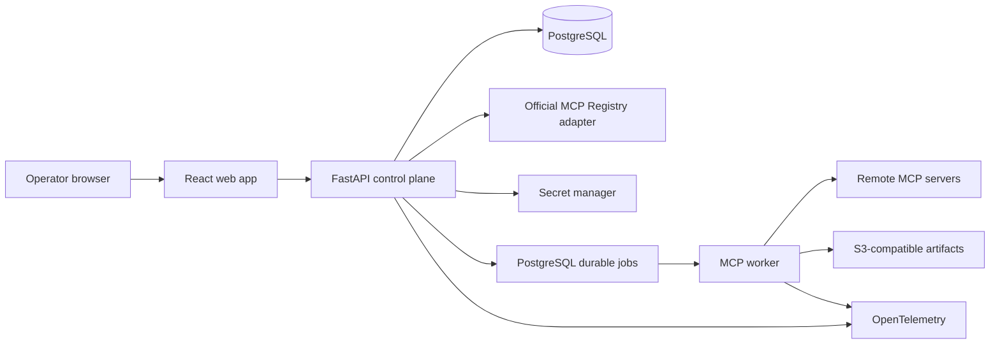

# Modall Milestone 1 — MCP Registry Alpha Implementation Plan

**Status:** Proposed for execution

**Release:** `v0.1.0` — closed operator alpha

**Date:** September 3, 2026

**Parent plan:** `IMPLEMENTATION_PLAN.md`

**Source plan:** `capability_intelligence_exchange_revised_technical_plan.md`

---

## 1. Release decision

Build the platform foundation first as a closed MCP registry with a basic operator UI.

This milestone establishes the control-plane objects and execution lineage that later routing, evaluation, and marketplace features will use. It does not attempt to prove a vertical, select the best capability, or expose an open marketplace.

The release is successful when authenticated admin and operator roles can collectively:

1. search the official MCP Registry or manually enter a remote MCP endpoint;
2. create a server connection using an optional safe credential reference;
3. synchronize live server metadata and tools;
4. inspect immutable, versioned tool schemas in the UI;
5. invoke an enabled tool with non-confidential input;
6. inspect the result, timing, protocol, errors, and audit history; and
7. refresh the server without overwriting earlier capability versions or runs.

The reference journey is:

```text
Find or enter server
  -> create connection
  -> verify MCP compatibility
  -> discover tools
  -> create immutable capability versions
  -> enable a tool
  -> invoke from playground
  -> inspect append-only run record
```

### 1.1 Why this is the first release

- It delivers a usable platform surface without depending on the Swift/iOS evaluation program.
- It makes MCP supply observable before attempting routing across that supply.
- It establishes stable identity, versioning, credentials, execution, audit, and UI patterns once.
- It produces the run records and operational telemetry needed for later comparison and routing.
- It tests a narrow vertical slice of every core layer without prematurely building marketplace or ML systems.

### 1.2 What “registry” means

This release is a workspace control-plane registry, not a replacement for the official MCP Registry.

- The **official MCP Registry** is an upstream catalog of public server metadata.
- A **Modall registry entry** is imported or manually authored metadata with source provenance.
- A **server connection** is an operator-configured endpoint and optional credential binding.
- A **capability** is the protocol-neutral logical object Modall can later evaluate and route.
- An **MCP tool binding** connects one immutable capability version to one discovered MCP tool schema.

Importing a catalog entry never makes code executable, installs a package, or marks a server trusted. Only a successfully verified, policy-compliant connection can expose enabled tools for invocation.

---

## 2. Scope

### 2.1 In scope for `v0.1.0`

#### Registry

- One workspace with pre-provisioned operator access; all tenant-owned rows carry `workspace_id`.
- Manual registration of remote MCP Streamable HTTP endpoints.
- Read-only search of the official MCP Registry through an isolated upstream adapter.
- On-demand import of official `server.json` metadata with source and version provenance.
- Catalog-only handling for package/container entries that lack a directly usable remote endpoint.
- Connection lifecycle: draft, verifying, active, degraded, disabled.
- Operator-controlled display name, tags, environment, and data-classification policy.
- Explicit refresh and periodic synchronization of active connections.
- Immutable discovery snapshots and schema-drift history.

#### MCP compatibility

- Prefer MCP revision `2026-07-28`.
- Fall back to `2025-11-25` through the official Tier 1 SDK compatibility path.
- Remote Streamable HTTP transport.
- `server/discover` for the modern protocol and legacy initialization fallback.
- Paginated `tools/list` and `tools/call`.
- Tool list cache hints and change notification support when advertised.
- Full preservation of JSON Schema 2020-12 input and output schemas.
- Text and structured JSON tool results displayed inline.
- Other content blocks retained as bounded artifacts or safe metadata; no active HTML execution.

#### Invocation

- JSON argument editor with server-side schema validation.
- Explicit operator confirmation before every tool call.
- Asynchronous execution with queued, running, succeeded, failed, timed-out, cancelled, and indeterminate terminal states.
- Idempotent creation of a Modall run.
- No automatic retry of an upstream tool call after the durable dispatch fence in this alpha, regardless of tool annotations.
- Immutable run identity, capability version, input snapshot, protocol revision, result, timing, and error lineage.
- Configurable input, output, deadline, and concurrency limits with conservative defaults.

#### Basic UI

- Overview.
- Upstream registry search and import.
- Server connections list, create, detail, refresh, enable, and disable.
- Capability catalog and capability-version detail.
- Invocation playground.
- Run list and run-detail timeline.
- Clear loading, empty, unavailable, authorization, schema-drift, and failure states.

#### Operations and security

- OIDC authentication in deployed environments and an explicit local-development auth mode.
- Admin, operator, and viewer roles mapped from deployment configuration or OIDC groups; membership and invitation management are not exposed in this release.
- Secret references backed by the deployment secret manager; secrets never returned by APIs.
- Server-side SSRF, TLS, and redirect protection. Every credential-bearing manual or imported connection is HTTPS-only.
- All hosted remote MCP endpoints use HTTPS. Plain HTTP is allowed only for a credential-free loopback fixture under explicit local-development configuration.
- Structured audit events for registration, credential changes, enable/disable, refresh, and invocation.
- OpenTelemetry traces, metrics, and structured logs.
- Local Docker Compose development environment and reproducible deployment configuration.

### 2.2 Explicitly out of scope

- Task-aware routing or automatic capability selection.
- Capability comparisons, benchmarks, leaderboards, or quality scores.
- Swift/iOS-specific schemas or UI.
- Public anonymous access or public profile pages.
- Creator self-service publishing.
- Automatic installation of npm, PyPI, OCI, or other packages from registry metadata.
- Arbitrary `stdio` command execution in a hosted environment.
- Legacy HTTP+SSE as a first-class transport.
- MCP prompts and resources as invocable Modall capabilities; their advertised support may be recorded.
- MCP Apps, Tasks, Multi Round-Trip Requests, sampling, elicitation, or roots.
- Interactive OAuth authorization flows for third-party servers.
- Billing, credits, settlement, quotas with monetary value, or x402.
- Workspace-membership administration, SCIM, SSO configuration UI, or enterprise policy management.
- Mobile UI, browser extension, IDE plugin, or GitHub integration.
- Private source-code processing by third-party model providers.

### 2.3 Follow-on candidates for `v0.1.1`

- Interactive OAuth using current MCP authorization discovery and issuer validation.
- Local-only, manifest-allowlisted `stdio` connections.
- Prompts and resources catalog views.
- MCP Tasks extension for long-running upstream calls.
- Scheduled official-registry mirroring instead of on-demand search/import.
- Exportable connection manifests and CLI administration.

---

## 3. Users and release scenarios

### 3.1 Primary user

Internal admins and operators who understand that MCP tools may read or mutate external systems. The alpha is an operations product, not an end-user chat client.

### 3.2 Required scenarios

#### Scenario A — manually connect a public server

1. Admin enters an HTTPS Streamable HTTP endpoint and optional credential reference.
2. Modall validates the destination and records a draft connection.
3. Worker probes protocol compatibility and discovers all tool pages.
4. Modall creates a discovery snapshot and immutable capability versions.
5. Operator reviews and enables selected tools.

#### Scenario B — import from the official registry

1. Operator searches the upstream registry and imports catalog metadata.
2. UI distinguishes remote-connectable entries from catalog-only packages.
3. Import stores the exact upstream version, sanitized allowlisted metadata, source location, and digest of the received payload.
4. Admin separately configures the endpoint and optional credential reference; Operator verifies the connection.

#### Scenario C — invoke a tool

1. Operator chooses an enabled capability version.
2. UI presents its schema and a JSON arguments editor.
3. UI chooses the prospective run `Idempotency-Key` and calls the non-dispatching run-preflight API; the API validates and authorizes the exact request and returns a canonical confirmation summary plus a short-lived single-use token bound to its request hash, idempotency key, actor, workspace, capability version, connection configuration, discovery snapshot, and policy version.
4. Operator confirms; in one transaction the run API requires and consumes that token, revalidates all mutable policy and lifecycle conditions against the same request and idempotency key, then creates one run and queues it. Replay with that same idempotency key returns the original run; a different key cannot reuse the confirmation.
5. Worker calls the bound MCP tool once.
6. UI shows the terminal result, latency, content metadata, and correlation ID.

#### Scenario D — detect schema drift

1. A refresh returns changed tool metadata or schema.
2. Modall creates a new discovery snapshot and capability version.
3. Existing runs continue referencing the prior version.
4. New version remains disabled until reviewed if the change is materially incompatible.

#### Scenario E — uncertain execution

1. Worker dispatches a potentially mutating call and loses the connection before receiving a response.
2. Modall records the attempt as `indeterminate`.
3. It does not retry automatically.
4. UI explains that the upstream side effect may have occurred.

#### Scenario F — recover a disabled connection and capability

1. Operator disables a connection during an incident; in the same transaction Modall marks every currently enabled capability version on that connection `disabled` with reason `connection_disabled` and cancels its undispatched runs.
2. Operator requests re-enable; the connection moves to `verifying` rather than directly to `active`.
3. Successful fresh discovery returns the connection to `active`.
4. Operator explicitly re-enables the latest non-superseded capability version after confirming that its stored binding still matches the current discovery snapshot.

---

## 4. Release acceptance criteria

### 4.1 Functional gate

- Three reference servers pass the end-to-end suite: an in-repository fixture, a public remote server, and an authenticated test server.
- Both target protocol eras pass discovery and invocation contract tests.
- A server exposing at least 100 tools synchronizes every page without lost or duplicate tools.
- A schema change creates a new immutable capability version, makes the superseded live binding non-invocable, and preserves historical runs.
- A material endpoint or credential change suspends dispatch and requires fresh verification, discovery, and capability review; a tool omitted from a complete refresh becomes unavailable and is rejected before enqueue.
- An imported official-registry entry retains its upstream name, version, source URL, and raw metadata digest.
- Catalog-only entries cannot be invoked.
- Disabled connections and capabilities cannot create new runs.
- A disabled connection and its latest non-superseded capability version can be restored only through Scenario F revalidation and explicit enablement.
- A run whose declared classification is not allowed by both the global alpha policy and selected connection policy is rejected before enqueue; the worker checks current policy again before dispatch.
- Sensitive tool output is never stored or displayed inline; scanner failure also fails closed to quarantine.
- Confirmation uses a non-dispatching authoritative preflight; run creation atomically consumes its single-use token with the bound `Idempotency-Key`, returns the original run on same-key replay, and rejects expired, mismatched, reused-with-another-key, or stale-lifecycle tokens without enqueueing.
- Large and non-text results are read only through authorized, subject-bound, short-lived artifact access to an integrity-checked immutable object version; overwrite and cross-workspace attempts fail closed.
- A completed run can be diagnosed from the UI without direct database access.

### 4.2 Reliability gate

- API or worker restart does not lose queued runs.
- Duplicate or delayed `Idempotency-Key` requests never create a second mutation, including after the full replay response expires.
- No automatic retry occurs after upstream execution becomes ambiguous.
- Discovery retries are bounded and use backoff because discovery is read-only.
- Per-server concurrency and circuit-breaker behavior pass fault-injection tests.
- Migrations pass clean-install, upgrade, and rollback-readiness tests.

### 4.3 Security gate

- Cross-workspace authorization tests exist even though the alpha seeds one workspace.
- Endpoint validation blocks loopback, link-local, cloud metadata, and private-network destinations unless deployment configuration explicitly allows them.
- Every request and redirect hop is resolved through the policy resolver, rejects any forbidden answer, and binds the transport dial to a selected validated IP without a second library DNS lookup while preserving the original hostname for TLS SNI, certificate verification, and the HTTP `Host`. Connection-pool reuse is allowed only for that validated origin/address tuple; new dials repeat resolution and policy checks. An enforced egress policy provides a second boundary against DNS rebinding and TOCTOU races.
- Credential-bearing requests require a valid HTTPS certificate. HTTPS-to-HTTP redirects are rejected; redirects are bounded and must remain on the credential-bound origin. Scheme, host, port, certificate, and the dialed validated IP are checked for every hop, and credentials are retrieved and attached only after those checks pass.
- Credentials, authorization headers, and secret values do not appear in logs, traces, API responses, or audit payloads.
- Hosted `stdio` execution and automatic package installation are impossible through the API.
- Tool input/output, JSON Schema depth, artifact count, artifact size, and total response size are bounded.
- Untrusted result content is rendered as escaped text or safe structured data under a restrictive CSP.
- Dependency, secret, and container scans have no unresolved critical findings.
- Hosted workers run as non-root in non-privileged containers with read-only root filesystems, bounded writable scratch space, CPU/memory/process limits, restricted syscalls, default-deny egress with explicit destinations, and images pinned by immutable digest.

### 4.4 Usability and accessibility gate

- A new admin/operator pair can connect the fixture server and execute a tool using only the UI and release documentation, without either role exceeding its documented permissions.
- All core workflows are keyboard accessible.
- Forms have programmatic labels and errors; status is not communicated by color alone.
- Destructive-looking or potentially mutating calls always require explicit confirmation.
- Unsupported MCP features produce actionable messages rather than generic failures.

### 4.5 Performance gate

These are platform-overhead targets, not guarantees about upstream servers:

- p95 cached capability-list API latency under 300 ms with 5,000 capability versions.
- p95 run-creation latency under 300 ms.
- p95 Modall invocation overhead under 250 ms, excluding queue wait and upstream execution.
- A 100-tool discovery completes within 10 seconds against the reference server under normal local test conditions.
- The UI becomes interactive within 2.5 seconds on the supported desktop test profile.

### 4.6 Release decision

Release `v0.1.0` only when functional, reliability, security, and migration gates pass. Performance misses may be accepted only with a measured cause, an owner, and no correctness or security impact. Feature scope must be cut before weakening a security or lineage invariant.

---

## 5. Architecture

### 5.1 Deployment shape

Use a modular monolith with one worker deployable. This preserves the parent plan's architecture while moving registry and MCP execution earlier.



Deployables:

- `api`: authentication, registry administration, read APIs, run creation, audit.
- `worker`: connection verification, discovery synchronization, health probes, tool invocation.
- `web`: operator console.

No service mesh, Kubernetes requirement, event broker, Redis, or workflow engine is needed for this release.

### 5.2 Technology choices

- Backend: Python, FastAPI, Pydantic, SQLAlchemy, Alembic.
- MCP: official Tier 1 Python SDK, exactly pinned in the lockfile.
- Database and jobs: PostgreSQL with leased jobs and `FOR UPDATE SKIP LOCKED`.
- Frontend: React, TypeScript, Vite, a small accessible component layer, and server-state query caching.
- Artifact storage: S3-compatible storage; MinIO in local development.
- Authentication: standards-based OIDC JWT validation; explicit local-only development principal.
- Telemetry: OpenTelemetry, structured JSON logging, Prometheus-compatible metrics.
- Tooling: `uv`, `pnpm`, pytest, Ruff, static type checking, Vitest, Testing Library, Playwright.

Pin runtime and dependency versions during PR-01. Do not depend on floating MCP SDK or registry schemas.

### 5.3 Domain boundaries

```text
identity
  users, workspaces, memberships, roles

registry
  upstream entries, server connections, discovery snapshots

capabilities
  logical capabilities, immutable versions, MCP bindings

invocations
  runs, attempts, state transitions, artifacts

credentials
  opaque secret references and access policy

audit
  actor-attributed control-plane changes

telemetry
  traces, metrics, logs, correlation
```

Modules use typed interfaces and repositories. Application code must not reach into another module's tables through ad hoc ORM queries.

### 5.4 Capability abstraction

The core object remains protocol-neutral:

```text
Capability
  -> CapabilityVersion
       -> MCPToolBinding
            server_connection_id
            server_connection_version_id
            discovery_snapshot_id
            remote_tool_name
            input_schema
            output_schema
            implementation_identity_assurance
            implementation_revision
```

For `v0.1.0`, one discovered MCP tool maps to one logical capability scoped to its server connection. Semantic grouping of equivalent tools across providers is deferred. This avoids inventing deduplication logic before evaluation data exists.

### 5.5 Versioning rules

- IDs are UUIDv7 or another sortable opaque identifier; slugs are mutable aliases.
- Normalize JSON deterministically before hashing.
- A discovery snapshot digest covers server identity, negotiated protocol, advertised capabilities, complete tool pages, and relevant extensions.
- Tool version digest covers tool name, title, description, annotations, input schema, output schema, exact `server_connection_version_id`, discovery snapshot, and an attested remote implementation revision when one is available. Credential rotation or another material connection-version change therefore creates a distinct pending capability version even when the advertised tools are byte-identical.
- Any digest change creates a new immutable version.
- Operator metadata such as local tags does not create a protocol version; it is separately audited.
- Refresh never overwrites a prior snapshot or version.
- Runs always reference the exact capability version and binding used.
- Every binding records `implementation_identity_assurance` (`pinned`, `declared`, or `unverified`), identity source, and optional revision. A changed attested revision creates a new capability version even when its schemas are unchanged.
- An unpinned remote implementation remains invocable in the registry alpha, but every result is labeled `unverified_remote` and tied to its discovery snapshot and observation time. It is ineligible for authoritative benchmark aggregation, G1 evidence, or learned routing until an immutable revision is attested or a platform-controlled adapter provides one.

### 5.6 Lifecycle rules

```text
Server connection
draft -> verifying
verifying -> active | degraded | disabled
active <-> degraded
active | degraded -> verifying
active | degraded -> disabled
disabled -> verifying

Capability version
pending_review -> enabled | disabled | unavailable | superseded
enabled <-> disabled
enabled | disabled -> unavailable | superseded
unavailable -> pending_review | superseded

Run
queued -> running -> succeeded
   |         |-----> failed
   |         |-----> timed_out
   |         |-----> cancelled
   |         |-----> indeterminate
   +---------------> cancelled
```

- A disabled or degraded connection does not accept new dispatches; operators may allow read-only refresh while degraded.
- Re-enabling a disabled connection transitions it to `verifying`, never directly to `active`; successful protocol negotiation and discovery are required before it can serve new runs.
- Disabling a connection atomically transitions every currently `enabled` capability version on that connection to `disabled` with reason `connection_disabled` and cancels queued runs before setting the connection `disabled`. Connection reverification never clears those capability states; each intended version requires a later explicit enable action.
- A material connection change, including endpoint or credential binding, atomically creates a connection-configuration version, moves the connection to `verifying`, suspends new dispatch, and transitions every capability version tied to the prior configuration to `superseded`. Fresh verification and complete discovery are required before the connection can become `active`; versions materialized against the new configuration remain `pending_review` until explicitly enabled.
- Refresh matches tools by connection plus remote tool name. When a complete current snapshot omits a previously present tool, its version transitions to persisted `unavailable`, becomes non-invocable immediately, and is rejected before enqueue. If the exact same digest and binding later reappear in a fresh complete snapshot, the unavailable version may return only to `pending_review`; a changed digest creates a new `pending_review` version and supersedes the old one.
- Any changed tool digest creates a new `pending_review` version. The old binding becomes `superseded` and historical-only because a remote MCP endpoint cannot guarantee that its prior implementation remains addressable.
- A disabled capability version can return to `enabled` only through an explicit operator action while it is the latest non-superseded version, its connection is active, and its binding matches the current discovery snapshot. A superseded version is permanently historical.
- A run queued against a version that becomes disabled, unavailable, superseded, or detached from the current connection configuration/discovery snapshot before dispatch is cancelled with a stable reason code.
- Terminal run states never transition back to active states. Corrections are appended as events rather than rewriting history.

---

## 6. MCP behavior and compatibility contract

### 6.1 Protocol negotiation

- Configure the official SDK for automatic modern negotiation.
- Prefer `2026-07-28` using `server/discover`.
- Fall back to the legacy initialization flow for `2025-11-25` servers.
- Record the selected protocol revision on every snapshot and run attempt.
- Reject unsupported revisions with a stable `mcp_protocol_unsupported` error.
- Keep MCP wire objects behind an internal adapter so future SDK upgrades do not leak through domain or API contracts.

### 6.2 Discovery

- Follow every `tools/list` cursor with a configurable maximum page and tool count.
- Reject cursor loops and inconsistent duplicate tool definitions.
- Honor list `ttlMs` and `cacheScope` when returned.
- Ordinary and scheduled reads may honor a fresh cache entry. An operator-triggered refresh must bypass the SDK/list cache, perform a fresh upstream listing, and replace the cache only after successful complete pagination; if the SDK lacks a bypass API, use a fresh no-cache client path.
- Subscribe to supported list-change notifications when operationally useful; explicit and scheduled refresh remain the correctness path.
- Treat tool annotations as descriptive hints, never as a security boundary.
- Validate schemas with bounded depth, reference count, and processing time.
- Persist only allowlisted protocol metadata in normalized snapshots. Unknown `_meta` and extension values are dropped by default; an explicitly enabled diagnostic capture is sanitized for secrets, tokens, cookies, credentials, and configured PII patterns before encrypted restricted storage.
- Never return unsanitized remote metadata from a snapshot API. Negative fixtures cover credential, token, cookie, and PII-shaped values.
- Do not dereference external JSON Schema references during discovery or invocation validation.

### 6.3 Invocation

- Validate the operator arguments against the immutable stored schema before dispatch.
- Accept only `public` or `non_confidential` declarations in the alpha. Before enqueue, authorize the declared classification against the global alpha policy and the selected server-connection version; fail closed when policy is missing or ambiguous.
- Revalidate against the live tool name, invocable capability state, exact current connection-configuration version, and current complete discovery snapshot immediately before the call.
- Before dispatch, re-evaluate the run classification against the current connection policy so a policy restriction applied while a job was queued takes effect immediately.
- Attach trace context using the current protocol's supported metadata.
- Default deadline: 120 seconds; configurable downward per connection or capability.
- Default maximum input: 256 KiB serialized JSON.
- Default maximum result: 1 MiB inline only after content scanning; bounded larger content becomes an artifact up to the configured hard limit.
- Stream every result first into a bounded ephemeral quarantine buffer. Before database persistence, artifact publication, or UI/API display, scan text, structured content, and decoded artifact metadata for tokens, credentials, secrets, and policy-defined PII.
- Clean, output-schema-valid results may be persisted under the declared run classification. A sensitive match upgrades the output classification and is never stored inline: store it only as an encrypted restricted artifact when policy explicitly permits, otherwise discard the raw value after retaining a digest and audit event. Return only a redacted placeholder and safe metadata to ordinary run APIs.
- Before any result is published or the run is marked successful, validate structured content against the immutable capability version's advertised output schema with the same bounded depth, reference, size, and processing-time controls used for input. A missing advertised output schema is recorded as `not_declared`; a declared-schema violation fails the attempt/run with stable code `mcp_output_schema_invalid`, keeps raw content in the quarantine policy path only, and excludes the result from success or evidence aggregation.
- A scanner error or unsupported content type fails closed to quarantine. Neither raw nor quarantined content enters logs, traces, browser caches, or ordinary snapshot/run responses.
- Never follow resource links or render active content automatically.
- Persist an attempt-level `dispatch_fenced` state before any upstream network send. The alpha never automatically retries a fenced tool call, regardless of tool annotations.
- If dispatch may have reached the server but no definitive response is available, mark the attempt `indeterminate`.
- Lease recovery may redispatch only an attempt still durably in `created`. A recovered `dispatch_fenced` or `awaiting_result` attempt without a durable result records any provider receipt and transitions to `indeterminate` with `reconciliation_required`.
- Cancellation before the dispatch fence can terminally cancel the attempt. After the fence, record `cancellation_requested` and propagate best effort, but transition to `cancelled` only when definitive upstream evidence proves the operation did not execute or was fully rolled back. Otherwise continue awaiting a definitive result; a lost acknowledgement or deadline with uncertain execution becomes `indeterminate` with `reconciliation_required`, never a successful cancellation.

### 6.4 Unsupported features

If an invocation returns an MCP flow requiring Multi Round-Trip Requests, Tasks, elicitation, or another unsupported extension, retain the response metadata and fail with a specific `mcp_feature_not_supported` result. Do not silently approximate the interaction.

### 6.5 Official Registry integration

The official MCP Registry is in preview, so its adapter is treated as an unreliable external dependency:

- generate or validate a client against the official OpenAPI contract;
- isolate upstream response objects from internal domain models;
- compute the received-payload digest before discarding unsanitized fields, then retain only allowlisted/sanitized metadata plus source provenance;
- use timeouts, bounded retries, caching, and a circuit breaker;
- show stale cached results explicitly when the upstream is unavailable;
- import only on an operator action in `v0.1.0`;
- never equate registry publication with trust, health, compatibility, or Modall enablement;
- never automatically execute installation instructions from registry metadata.

---

## 7. Data model

### 7.1 Tables

| Table | Purpose | Mutability |
|---|---|---|
| `users` | Authenticated human identities | Mutable profile |
| `workspaces` | Tenant boundary | Mutable settings |
| `workspace_memberships` | Role binding | Audited mutable |
| `registry_sources` | Official or manually configured catalog sources | Audited mutable |
| `registry_entries` | Imported upstream server metadata | Versioned append/supersede |
| `server_connections` | Stable connection identity and current status | Audited mutable |
| `server_connection_versions` | Immutable endpoint, policy, environment, and optional credential binding snapshot | Append-only |
| `credential_bindings` | Stable identity for an opaque secret-manager reference | Audited mutable |
| `credential_binding_versions` | Immutable secret-manager provider/resource/version reference and rotation lineage, never secret value or mutable alias | Append-only |
| `connection_status_events` | Connection lifecycle history | Append-only |
| `discovery_snapshots` | Immutable normalized and sanitized discovery result | Append-only |
| `capabilities` | Stable logical tool identity | Mutable display metadata |
| `capability_versions` | Immutable discovered tool version | Append-only |
| `mcp_tool_bindings` | Version-to-exact-server-connection-version/snapshot/tool binding | Immutable |
| `jobs` | Durable worker coordination | State machine |
| `runs` | Operator-requested invocation | Append/supersede status |
| `run_attempts` | Exact dispatch attempt, receipt, and output-scan decision | Append-only events/status |
| `run_events` | Timeline and state-transition evidence | Append-only |
| `consumed_run_preflights` | Unique signed-token JTI, request hash, prospective run idempotency key, and run lineage inserted atomically with run creation | Append-only |
| `artifacts` | Content-addressed large result metadata pinned to an immutable object version and digest | Append-only |
| `artifact_access_grants` | Short-lived, subject-bound viewer/download authorization | Expiring append-only |
| `idempotency_records` | Full replay response plus workspace-lifetime HMAC-keyed tombstone, request hash, and original resource/result reference | Response expires; tombstone append-only until workspace hard deletion |
| `audit_events` | Actor-attributed control-plane activity | Append-only |

### 7.2 Required constraints

- Every tenant-owned row carries `workspace_id` and is checked by repository methods.
- A capability version digest is unique within its logical capability.
- A discovery snapshot digest is unique within a server connection.
- Every MCP tool binding references the exact `server_connection_version_id`; that identifier participates in the capability-version digest even when a discovery snapshot is deduplicated.
- A run references one immutable capability version and server-connection version. Its credential-binding version is nullable for unauthenticated servers and exact when credentials are used.
- A credential-binding version names an immutable provider-native secret version or generation. Mutable aliases such as `current` are resolved only in the control plane; a changed resolved version creates a new credential binding and server-connection version and triggers the material-change reverification flow. Workers request only the pinned secret version and fail closed if it is unavailable.
- Every run attempt persists its pre-send dispatch fence, exact input digest, nullable credential-binding version, optional provider receipt, reconciliation state, output classification, scan status, and content digest.
- State transitions use compare-and-set version columns or explicit row locks.
- Audit, snapshot, run event, and attempt tables cannot be updated through application repositories except to append terminal metadata defined by their state machine.
- Raw secrets are forbidden from all table columns and JSON metadata fields.
- Timestamps are UTC and server-assigned.

### 7.3 Retention defaults

- Operational metadata and audit events: 90 days for alpha unless extended explicitly.
- Tool inputs and outputs: 14 days by default.
- Discovery metadata and immutable schemas: retained for the life of referenced runs.
- Large artifacts: 14 days, then tombstoned with digest and deletion event retained.
- Idempotency replay payloads follow the referenced resource retention, but the HMAC-keyed key/request-hash tombstone remains for the workspace lifetime so an expired response cannot authorize the same mutation again.
- Authentication and secret material: never copied into run or discovery storage.

Retention jobs and deletion audit events are required for release even though the alpha accepts only non-confidential test data.

---

## 8. HTTP API contract

The OpenAPI document is generated from the backend schema source and checked into release artifacts. Every mutating `POST`—including resource creation, import, verification, refresh, enable/disable, run creation, and cancellation—requires an `Idempotency-Key` scoped to workspace, actor, method, and route. The same key and request hash returns the original result while its replay representation exists. Reuse with a different hash returns `409 idempotency_conflict`; after the full response/resource representation expires, same-hash reuse returns `409 idempotency_replay_expired` with safe original-reference metadata and never executes again. A minimal HMAC-keyed tombstone enforces this for the workspace lifetime. Mutable `PATCH` operations require an entity version or `If-Match` precondition.

### 8.1 Upstream catalog

- `GET /v1/registry/search?q=&cursor=` — search the official registry through the adapter.
- `POST /v1/registry/imports` — import one exact upstream server version.
- `GET /v1/registry/entries` — list imported entries.
- `GET /v1/registry/entries/{id}` — imported metadata and provenance.

### 8.2 Server connections

- `POST /v1/server-connections` — create a draft manual or imported connection.
- `GET /v1/server-connections` — filter by state, tag, environment, and source.
- `GET /v1/server-connections/{id}` — configuration, latest status, and snapshots.
- `PATCH /v1/server-connections/{id}` — edit operator metadata or apply a new endpoint, optional credential reference, and connection policy version; material changes execute the suspension and reverification transition below.
- `POST /v1/server-connections/{id}/verify` — enqueue verification and discovery.
- `POST /v1/server-connections/{id}/refresh` — enqueue discovery refresh.
- `POST /v1/server-connections/{id}/enable` — move a disabled connection to verification; only successful rediscovery returns it to active service.
- `POST /v1/server-connections/{id}/disable` — atomically prevent new discovery execution/runs, disable currently enabled capability versions with reason `connection_disabled`, and cancel undispatched runs.

Connection endpoint and credential changes create a new audited connection configuration version even if the public connection ID remains stable. Applying one is a material lifecycle transition: it suspends dispatch, moves the connection to `verifying`, supersedes prior-configuration capability versions, and requires fresh complete discovery plus explicit capability review before new runs.

Credential configuration persists only a provider, resource identifier, and immutable provider-native version/generation. If an Admin supplies an alias such as `current`, the control plane resolves and displays its immutable version before applying the configuration; later alias movement has no effect until it is detected and applied as a new credential-binding and connection version through the same material-change flow.

### 8.3 Capabilities

- `GET /v1/capabilities` — filter by connection, tag, status, and protocol revision.
- `GET /v1/capabilities/{id}` — logical identity and version summary.
- `GET /v1/capabilities/{id}/versions/{version_id}` — exact schemas and binding.
- `POST /v1/capabilities/{id}/versions/{version_id}/enable` — enable after review, or safely re-enable only when the version remains latest, non-superseded, and bound to the current active discovery snapshot.
- `POST /v1/capabilities/{id}/versions/{version_id}/disable` — stop new runs.

### 8.4 Runs

- `POST /v1/run-preflights` — perform authoritative validation and authorization without creating, persisting, or enqueueing a run; accept the prospective run `Idempotency-Key` and return a canonical confirmation summary plus a signed short-lived token with a unique JTI bound to that key and the exact request. The stateless preflight call itself is non-mutating and does not need a separate idempotency key, but it rejects a proposed key with an expired-response tombstone so it cannot authorize a second run.
- `POST /v1/runs` — validate the preflight token against an identical request and `Idempotency-Key`, recheck current authorization, policy, connection, snapshot, and capability state, then atomically consume the preflight while creating the idempotency record and invocation; requires a declared data classification and returns `202`. Same-key replay returns the original run, while token reuse with any different key fails without enqueue.
- `GET /v1/runs` — filter by status, capability, connection, actor, and time.
- `GET /v1/runs/{id}` — immutable request plus current status and result metadata.
- `GET /v1/runs/{id}/events` — ordered diagnostic timeline.
- `POST /v1/runs/{id}/cancel` — best-effort cancel before or during supported execution.

All identity-scoped responses set `Cache-Control: no-store`. `GET /v1/session` and identity-scoped responses expose an `authorization_epoch` derived from the active token claims, workspace membership/role mapping, and deployment-policy revision. Frontend query keys include subject, workspace, and this epoch; cached tenant data is never rendered until the current session check succeeds, and authorization context has a 60-second maximum freshness before tenant content is hidden pending refresh. The client purges all identity-scoped query data on logout, token refresh, subject/workspace/epoch change, visibility regain with a stale session check, or any `401`/`403`. OIDC claim changes and deployment membership/role changes increment or replace the epoch so the next response or session refresh invalidates the prior cache.

### 8.5 Artifacts

- `GET /v1/artifacts/{id}` — return authorized metadata, classification, immutable object-version/digest identity, readiness, and permitted viewer modes.
- `POST /v1/artifacts/{id}/access-grants` — after current subject, workspace, classification, and retention checks, mint an audited, short-lived grant bound to that subject and exact artifact version. The grant is not sufficient without the same authenticated subject and expires quickly, allowing content retrieval to remain a safe `GET`.
- `GET /v1/artifacts/{id}/content` — require normal authentication plus the bound grant in the redacted `X-Modall-Artifact-Grant` header, never a URL, and stream only the exact immutable object version through the isolated artifact path. Text and JSON are parsed, escaped, and rendered in the sandboxed viewer; every other type is attachment-only. Ingress, proxy, application, and trace configuration must redact the grant header. Responses use `Cache-Control: no-store`, `X-Content-Type-Options: nosniff`, restrictive sandbox CSP, and same-origin/cross-origin isolation headers.

Result publication writes to a unique non-overwritable object key or a versioned bucket and records the exact storage version plus content digest. A finalized artifact never follows a mutable key: reads verify the pinned version and digest (or a storage checksum with equivalent integrity) before release, and a still-valid upload credential cannot replace finalized content.

### 8.6 Error contract

Every error includes:

```json
{
  "error": {
    "code": "mcp_protocol_unsupported",
    "message": "This server does not support a release protocol revision.",
    "correlation_id": "...",
    "retryable": false,
    "details": {}
  }
}
```

Stable codes cover authentication, authorization, endpoint policy, upstream registry availability, protocol negotiation, input/output schema validation, connection state, capability state, timeout, cancellation, response limit, idempotency conflict/expired replay, unsupported feature, upstream error, and indeterminate execution.

### 8.7 Alpha role matrix

| Action | Viewer | Operator | Admin |
|---|:---:|:---:|:---:|
| Browse registry, connections, capabilities, and permitted run results | Yes | Yes | Yes |
| Import public catalog metadata | No | Yes | Yes |
| Verify, refresh, enable, disable, invoke, and cancel | No | Yes | Yes |
| Create or edit endpoints, credential references, and connection policy | No | No | Yes |

The API enforces this matrix independently of UI visibility. Every mutating action records the actor, reason where required, request correlation ID, and before/after configuration version identifiers.

Workspace membership and role mappings are provisioned outside the application through deployment configuration or OIDC groups. Their administration remains explicitly out of scope; the identity provider or configuration delivery system is the authoritative audit source for changes.

---

## 9. UI information architecture

### 9.1 Overview

- Counts of active, degraded, and disabled connections.
- Counts of enabled capabilities and recent runs.
- Recent failures and schema changes requiring review.
- Upstream-registry availability indicator.

### 9.2 Discover

- Search upstream public entries.
- Show publisher, upstream version, transport/package availability, and provenance.
- Label entries as `remote-connectable` or `catalog-only`.
- Import exact version; no one-click installation.

### 9.3 Servers

- List with health, environment, protocol revision, last refresh, and tool count.
- Create flow for endpoint, optional imported entry, optional credential reference, tags, and policy.
- Detail view with configuration history, discovery snapshots, errors, tools, refresh, enable, and disable actions.

### 9.4 Capabilities

- Searchable/filterable tool catalog.
- Detail view with description, server, immutable version digest, schemas, annotations, status, and history diff.
- Enable/disable action with audit reason.

### 9.5 Playground

- Immutable capability-version selector.
- Read-only JSON Schema viewer.
- JSON arguments editor with client hints and authoritative non-dispatching server preflight.
- Server-produced confirmation summary, preflight expiry handling, deadline display, and explicit execution confirmation.
- Live polling of run status.
- Safe viewer for text and structured JSON plus authenticated short-lived artifact access; active or unknown content is download-only.

Do not attempt a universal form generator for full JSON Schema 2020-12 in this release. The JSON editor is the correctness path; simple generated controls may be added only as progressive enhancement.

### 9.6 Runs

- Filterable run table.
- Detail timeline showing creation, queue lease, dispatch, protocol revision, response, terminal state, and artifacts.
- Clear `indeterminate` treatment distinct from ordinary failure.
- Copyable correlation ID and safe diagnostic details.

---

## 10. Epics and tasks

Estimates are relative: **S** is up to two focused engineering days, **M** is three to five, and **L** is six to eight. Any task larger than L must be split before implementation.

### E0 — Architecture and repository foundation

**Outcome:** Reproducible workspace, approved boundaries, and enforceable quality checks.

| ID | Task | Size | Depends on | Acceptance |
|---|---|---:|---|---|
| E0-T1 | Record ADRs for release boundary, capability identity, MCP compatibility, invocation semantics, and secret handling | M | — | ADRs approved before dependent merge |
| E0-T2 | Scaffold Python API/worker packages and React web app | M | E0-T1 | All apps run locally from documented commands |
| E0-T3 | Add lockfiles, formatting, linting, type checking, unit-test, migration, and frontend-build CI | M | E0-T2 | Required checks run on every PR |
| E0-T4 | Add PostgreSQL and object-storage local stack with health checks | S | E0-T2 | Fresh clone reaches green health state |
| E0-T5 | Define configuration layering and typed environment validation | S | E0-T2 | Missing/invalid production configuration fails closed |

### E1 — Identity, persistence, and audit

**Outcome:** Tenant-safe storage and operator authorization usable by every later module.

| ID | Task | Size | Depends on | Acceptance |
|---|---|---:|---|---|
| E1-T1 | Implement UUID, time, actor, and state-machine primitives | S | E0 | Unit and serialization tests pass |
| E1-T2 | Create workspace, user, membership, and role migrations/repositories | M | E0 | Cross-workspace repository tests fail closed |
| E1-T3 | Implement OIDC validation, authorization epochs, and local development principal | M | E1-T2 | Invalid issuer/audience/signature tests fail closed; claim, membership, role, and deployment-policy changes advance the effective epoch |
| E1-T4 | Implement append-only audit service and middleware | M | E1-T1, E1-T2 | All listed control actions emit actor-attributed events |
| E1-T5 | Add immutable-version secret-reference abstraction and one deployment adapter | M | E1-T2 | Workers fetch only provider-native pinned versions; alias rotation creates audited binding/connection versions and mutable aliases never enter immutable bindings |

### E2 — Registry domain and versioning

**Outcome:** Durable registry objects with immutable discovery and capability history.

| ID | Task | Size | Depends on | Acceptance |
|---|---|---:|---|---|
| E2-T1 | Implement registry entry and source models | M | E1 | Provenance survives import/update |
| E2-T2 | Implement server connection configuration and lifecycle | M | E1 | Invalid transitions are rejected atomically |
| E2-T3 | Implement canonical JSON normalization and snapshot hashing | M | E0 | Golden cross-process digests are stable |
| E2-T4 | Implement sanitized discovery snapshot persistence | M | E2-T2, E2-T3 | Duplicate snapshot is deduplicated; old data immutable; secret/token/cookie/PII fixtures never persist unsanitized |
| E2-T5 | Implement capability, version, exact connection-version MCP binding, and remote-identity-assurance models | L | E2-T4 | Schema, connection-version, or attested implementation-revision drift produces a new version; identical tools after credential rotation materialize without digest collision; unverified remotes are excluded from authoritative evidence |
| E2-T6 | Implement connection-disable overlay, capability enable/disable, unavailable/superseded, safe re-enable, and material-change review policy | M | E2-T5, E1-T4 | Connection disable atomically disables enabled versions; recovery never auto-enables them; disappeared, stale, and unreviewed bindings cannot run |

### E3 — MCP client and discovery

**Outcome:** Version-aware, testable live discovery against remote servers.

| ID | Task | Size | Depends on | Acceptance |
|---|---|---:|---|---|
| E3-T1 | Build MCP fixture servers for both supported protocol eras | M | E0 | Fixtures expose paging, schema drift, errors, and auth |
| E3-T2 | Wrap the official SDK behind `McpClientAdapter` | M | E0 | No SDK type appears in domain or public API contracts |
| E3-T3 | Implement safe Streamable HTTP transport factory with policy-resolved address pinning | L | E1-T5 | Every request/redirect dials only its validated IP while preserving TLS hostname checks; rebinding, SSRF, downgrade, certificate, pooling, and secret tests pass |
| E3-T4 | Implement negotiation/discovery and normalized server metadata | M | E3-T2, E3-T3 | Both target revisions pass contract tests |
| E3-T5 | Implement paginated tool discovery and schema bounds | L | E3-T4 | 100-tool, cursor-loop, duplicate, and schema-bomb tests pass |
| E3-T6 | Implement cache hints, refresh scheduling, explicit cache bypass, and change handling | M | E3-T5, E2 | Scheduled reads respect expiry; operator refresh proves a fresh complete listing, persists disappeared tools as unavailable, and never mutates snapshots |
| E3-T7 | Implement connection health and circuit-breaker state | M | E3-T4, E2-T2 | Fault injection drives deterministic status transitions |

### E4 — Official Registry adapter

**Outcome:** Safe upstream discovery without coupling Modall to preview response shapes.

| ID | Task | Size | Depends on | Acceptance |
|---|---|---:|---|---|
| E4-T1 | Pin official Registry OpenAPI fixture and generate/validate client types | M | E0 | Contract fixture detects upstream breaking changes |
| E4-T2 | Implement search, pagination, timeout, cache, and circuit breaker | M | E4-T1 | Upstream outage returns explicit stale/unavailable state |
| E4-T3 | Normalize and import exact server versions with sanitized metadata and raw-payload digest provenance | M | E2-T1, E4-T2 | Repeat import is idempotent and unsanitized upstream fields never persist |
| E4-T4 | Classify remote-connectable versus catalog-only entries | S | E4-T3 | Package metadata cannot create an executable connection |

### E5 — Jobs and invocation ledger

**Outcome:** Durable, diagnosable, at-most-once-oriented tool execution.

| ID | Task | Size | Depends on | Acceptance |
|---|---|---:|---|---|
| E5-T1 | Implement leased PostgreSQL job queue, heartbeat, and dispatch-fence-aware recovery | L | E1 | Lease recovery redispatches only unfenced attempts |
| E5-T2 | Implement run, attempt, event, receipt/reconciliation, output-scan, and immutable artifact/access-grant models | L | E1, E2-T5 | Every terminal, indeterminate, quarantined, and artifact-access state has complete lineage; credentials are optional but exactly versioned when present |
| E5-T3 | Implement single-use preflight consumption, idempotent run creation, role authorization, and fail-closed classification policy | M | E5-T2, E1 | Preflight consumption and run/idempotency creation are atomic; same-key replay returns one run, while another key or disallowed classification never enqueues |
| E5-T4 | Implement JSON Schema input validation with resource bounds | M | E2-T5 | Invalid and pathological schemas fail safely |
| E5-T5 | Implement MCP tool dispatch, dispatch-time policy recheck, deadline, and evidence-aware cancellation | L | E3, E5-T1, E5-T2 | Pre-fence cancel, confirmed post-fence cancel, unsupported/lost cancel, timeout, policy-change, and worker-loss tests preserve execution truth |
| E5-T6 | Implement durable pre-send dispatch fence, indeterminate reconciliation, and no-retry policy | M | E5-T5 | Crash tests before send, after send, and before response persistence never duplicate a fenced call |
| E5-T7 | Quarantine, classify, bounded-output-schema-validate, normalize, redact, and store result content | L | E5-T2, E0-T4 | Schema-invalid output fails with a stable code and never counts as success; secret/PII, scanner-failure, size, type, and active-content tests prove safe publication |

### E6 — Control-plane API

**Outcome:** Stable HTTP interface for the UI and future clients.

| ID | Task | Size | Depends on | Acceptance |
|---|---|---:|---|---|
| E6-T1 | Establish error, pagination, filtering, optimistic concurrency, and durable idempotency conventions | M | E0, E1 | Every mutating POST passes immediate replay, conflicting-payload, expired-response, and workspace-lifetime tombstone tests without duplicate execution |
| E6-T2 | Implement upstream catalog and import endpoints | M | E4, E6-T1 | Role and degraded-upstream paths pass |
| E6-T3 | Implement server connection lifecycle endpoints | L | E2, E3, E6-T1 | Create/verify/refresh/disable/re-enable and endpoint-change suspension/reverification flows pass |
| E6-T4 | Implement capability catalog/version endpoints | M | E2, E6-T1 | Historical versions remain queryable |
| E6-T5 | Implement run preflight, no-store run/event/cancel, and authorized artifact-read endpoints | M | E5, E6-T1 | Non-dispatching confirmation, E2E invocation, immutable artifact access, and authenticated-cache contract tests pass |
| E6-T6 | Generate checked API client and verify compatibility in CI | S | E6-T2–T5 | Frontend build fails on contract drift |

### E7 — Operator UI

**Outcome:** The entire release journey is usable without SQL or command-line administration.

| ID | Task | Size | Depends on | Acceptance |
|---|---|---:|---|---|
| E7-T1 | Build app shell, navigation, auth boundary, and subject/workspace/authorization-epoch-partitioned query cache | M | E0, E1-T3 | Tenant content hides after 60 seconds without session refresh; logout, refresh, claims/role/membership/epoch change, visibility recheck, and `401`/`403` purge identity-scoped cache before stale data renders |
| E7-T2 | Build overview and shared status components | M | E7-T1 | Empty, loading, stale, and degraded states covered |
| E7-T3 | Build official-registry search/import flow | M | E6-T2, E7-T1 | Remote and catalog-only states are distinct |
| E7-T4 | Build connection list/create/detail/refresh/disable/re-enable flows | L | E6-T3, E7-T1 | Scenarios A and F pass in Playwright |
| E7-T5 | Build capability list, schema, version history, implementation-assurance, and enablement views | L | E6-T4, E7-T1 | Schema/revision drift and unverified-remote scenarios pass in Playwright |
| E7-T6 | Build JSON playground, server-preflight confirmation, safe artifact access, and run polling | L | E6-T5, E7-T5 | Scenario C plus expired-preflight and artifact-isolation paths pass in Playwright |
| E7-T7 | Build run list and diagnostic timeline | M | E6-T5, E7-T1 | Indeterminate and failure states are understandable |
| E7-T8 | Complete keyboard, labels, focus, contrast, and screen-reader pass | M | E7-T2–T7 | Automated checks plus manual core-flow review pass |

### E8 — Security, telemetry, and release operations

**Outcome:** Closed alpha can be operated and diagnosed safely.

| ID | Task | Size | Depends on | Acceptance |
|---|---|---:|---|---|
| E8-T1 | Complete threat model and abuse-case review | M | E0-T1 | Security owner accepts mitigations or blocks release |
| E8-T2 | Add request/output limits, rate limits, and concurrency controls | M | E3, E5, E6 | Cost/volume amplification tests pass |
| E8-T3 | Add CSP, output escaping, subject-bound artifact grants, header redaction, integrity checks, and download isolation | M | E5-T7, E6-T5, E7 | Grants never enter URLs/logs/traces; overwrite, cross-workspace, expired-grant, and active-content suites pass |
| E8-T4 | Add correlated traces across API, jobs, worker, and MCP | M | E3, E5, E6 | One trace spans request through terminal run |
| E8-T5 | Add service and product metrics with alert thresholds | M | E8-T4 | Dashboards expose sync, run, error, and queue health |
| E8-T6 | Implement retention/deletion jobs and audit evidence | M | E2, E5 | Expired test artifacts are deleted and recorded |
| E8-T7 | Write deployment, rollback, incident, secret-rotation, and upstream-outage runbooks | M | All core flows | Another engineer exercises each runbook |
| E8-T8 | Run load, dispatch-crash, migration, dependency, secret, and worker-isolation checks | L | E8-T1–T7, feature complete | Verify non-root, non-privileged, read-only filesystem, scratch/resource/process bounds, syscall restrictions, default-deny egress, immutable image digests, and all release gates with stored evidence |

---

## 11. Planned pull requests

PRs should be vertically reviewable, generally stay below roughly 600 changed implementation lines excluding generated files and fixtures, and avoid mixing schema migrations with unrelated UI work. A PR may be split further without changing the dependency plan.

| PR | Title | Primary contents | Depends on | Merge proof |
|---:|---|---|---|---|
| 01 | `docs: lock registry alpha decisions and contracts` | ADRs, scope, state diagrams, initial OpenAPI conventions | — | Architecture review |
| 02 | `build: scaffold api worker web and CI` | Python/TypeScript workspaces, lockfiles, quality gates, local commands | 01 | Green CI from clean checkout |
| 03 | `infra: add local postgres object storage and migrations` | Compose stack, health, Alembic harness, backup/restore smoke test | 02 | Clean setup and migration test |
| 04 | `feat(identity): add workspace roles auth and audit foundation` | OIDC/local auth, workspace repositories, RBAC, immutable secret-version adapter, audit service | 03 | Authorization and secret-rotation matrix |
| 05 | `feat(registry): add entries connections and immutable snapshots` | Core registry migrations, repositories, lifecycle, canonical hashing | 03, 04 | Versioning golden tests |
| 06 | `test(mcp): add dual-era conformance fixture servers` | Modern/legacy fixtures, paging, auth, drift, errors, schema limits | 02 | Fixture contract suite |
| 07 | `feat(mcp): connect and discover remote Streamable HTTP servers` | SDK wrapper, negotiation, address-pinned safe transport, paginated tools, health | 05, 06 | Both protocol eras and DNS-rebinding/SSRF suites |
| 08 | `feat(registry): materialize capability versions from discovery` | Capability/version/exact-connection-version binding models, drift/disappearance policy, enable/disable | 05, 07 | Drift, disappearance, endpoint-change, and credential-rotation E2E tests |
| 09 | `feat(catalog): search and import official registry entries` | Upstream adapter, cache, import, provenance, catalog-only state | 05 | Recorded upstream contract tests |
| 10 | `feat(jobs): add durable jobs and run ledger` | Leases, events, attempts, idempotency, artifact metadata | 03, 04, 08 | Crash-recovery test |
| 11 | `feat(invocation): execute MCP tools with bounded results` | Input/output validation, dispatch, evidence-aware cancellation, indeterminate state, immutable artifacts | 07, 10 | Invocation fault, invalid-output, and artifact-integrity suites |
| 12 | `feat(api): expose registry capability and run APIs` | REST resources, durable idempotency, single-use run preflight, header-based artifact access, auth epochs, generated client | 08–11 | OpenAPI and API E2E suite |
| 13 | `feat(web): add operator shell discovery and server flows` | Auth shell, overview, upstream search/import, connection screens | 04, 12 | Playwright scenarios A/B under the admin/operator role split |
| 14 | `feat(web): add capability catalog playground and runs` | Version detail, JSON editor, preflight confirmation, safe artifact access, run polling/timeline | 11–13 | Playwright scenarios C–E |
| 15 | `feat(ops): add telemetry limits retention and security hardening` | OTel, metrics, CSP, rate/concurrency limits, deletion jobs, worker isolation | 11–14 | Security, worker-isolation, and trace gates |
| 16 | `release: package and qualify registry alpha` | Digest-pinned deployment manifests, seed/reference server, runbooks, full release evidence | 15 | Release checklist and isolation evidence signed |

### 11.1 Parallel lanes

After PR-03:

- Identity/audit (PR-04), MCP fixtures (PR-06), and local UI foundation can proceed in parallel.
- Official Registry integration (PR-09) can proceed once registry persistence interfaces from PR-05 are stable.
- UI implementation can begin against generated mock contracts before PR-12 merges, but its final PR must consume the generated client.
- Telemetry instrumentation is added with each feature; PR-15 completes dashboards and hardening rather than retrofitting all observability.

### 11.2 Critical path

```text
PR-01 decisions
  -> PR-02/03 foundation
  -> PR-05 registry model
  -> PR-07 MCP discovery
  -> PR-08 capability versions
  -> PR-10/11 durable invocation
  -> PR-12 API
  -> PR-14 UI completion
  -> PR-15 security/operations
  -> PR-16 release qualification
```

---

## 12. Test plan

### 12.1 Unit tests

- canonical schema normalization and hashing;
- state transitions and permission decisions;
- endpoint and resolved-address policy;
- HTTPS-only credential attachment and redirect validation;
- schema bounds and argument validation;
- MCP error normalization;
- run/attempt terminal-state rules;
- content and artifact limits;
- result-content classification, quarantine, redaction, and fail-closed scanner behavior;
- upstream registry normalization;
- retention eligibility.
- remote metadata redaction for tokens, credentials, cookies, and PII patterns.

### 12.2 Contract tests

- `2026-07-28` discovery and invocation;
- `2025-11-25` fallback discovery and invocation;
- pagination, cache hints, tool change, authentication, timeout, cancellation acknowledgement/loss, and output-schema-invalid responses;
- official Registry OpenAPI recorded fixtures;
- generated frontend client against checked OpenAPI;
- stable public error codes.

### 12.3 Integration tests

- PostgreSQL transaction boundaries and migration upgrades;
- job leasing, worker death, and recovery;
- dispatch-fence crashes before send, after send, after receipt, and before response persistence;
- DNS answer changes between validation and dial, including redirects and pooled/new connections;
- object-store authorization and deletion;
- immutable-version secret retrieval without disclosure and alias rotation through new binding/connection versions;
- OIDC claim and role enforcement with authorization-epoch changes for claim, membership, role, and deployment-policy revisions;
- subject/workspace/authorization-epoch cache partitioning, no-store responses, and purge on logout, token refresh, authorization change/failure, visibility recheck, and workspace change;
- audit completeness;
- connection refresh, schema drift, and byte-identical discovery after endpoint or credential rotation without capability-version collision;
- connection disable atomically disables enabled capabilities and reverification never auto-enables them;
- replay after full idempotency-response expiry is rejected by the workspace-lifetime tombstone without executing;
- circuit breaker and scheduled health probes.

### 12.4 End-to-end tests

- Scenarios A–F from Section 3.
- Viewer cannot mutate; operator can operate; admin can change credentials/policy.
- Disabled, superseded, or newly policy-incompatible connection blocks invocation already queued but not dispatched.
- Exact historical capability schema remains visible after refresh.
- Upstream Registry outage does not impair existing connection browsing or invocation.
- Oversized and active-content responses are safely contained.
- Sensitive or unscannable tool results never appear inline or in ordinary run APIs.
- Worker isolation controls and egress policy are effective in the release deployment.

### 12.5 Manual qualification

- Keyboard and screen-reader walkthrough.
- Fresh-environment installation.
- Credential rotation.
- Restore from backup.
- Disable a failing server during an incident.
- Diagnose one failure using only the UI and telemetry.
- Roll back application version while retaining forward-compatible database state.

---

## 13. Delivery estimate and staffing

### 13.1 Estimate

Expected effort: **45–55 person-weeks**, including stabilization and release evidence. This range reconciles the 56-task inventory with the declared S/M/L day ranges; it assumes some implementation and validation work within a task overlaps, but it does not treat parallel work as reducing total effort.

- Four focused engineers: approximately fourteen to seventeen elapsed weeks.
- Three focused engineers: approximately nineteen to twenty-three elapsed weeks.
- Two focused engineers: approximately twenty-eight to thirty-five elapsed weeks.
- One engineer: approximately forty-five to fifty-five elapsed weeks.

These estimates assume managed OIDC, PostgreSQL, object storage, and secret storage are available. Building identity or secret infrastructure, supporting interactive OAuth, or enabling hosted `stdio` materially expands the estimate.

### 13.2 Recommended ownership

- **Platform/MCP engineer:** protocol adapter, discovery, invocation, jobs.
- **Backend/control-plane engineer:** domain model, API, identity, audit, upstream registry.
- **Product/full-stack engineer:** UI, generated client, end-to-end tests, accessibility.
- **Part-time security reviewer:** threat model, SSRF, credentials, content isolation, release gate.
- **Product owner:** scope decisions and acceptance of workflows.

### 13.3 Target sequence for three focused engineers

| Elapsed weeks | Target |
|---|---|
| 1–3 | ADRs, scaffolding, CI, local infrastructure, identity skeleton, fixture servers |
| 4–7 | Registry persistence, safe MCP transport, protocol negotiation, upstream adapter |
| 8–12 | Capability materialization, durable jobs, invocation ledger, API contracts |
| 13–17 | Invocation completion, server/capability UI, playground, run timeline |
| 18–22 | Security hardening, telemetry, accessibility, failure testing, runbooks, release qualification |

The schedule is capability-based, not date-based. If the critical path slips, cut upstream search polish or overview analytics before cutting version lineage, SSRF defenses, run durability, or release tests.

---

## 14. Rollout plan

### Stage 0 — developer qualification

- Fixture servers only.
- Local auth and local infrastructure.
- All protocol, migration, and failure tests green.

### Stage 1 — internal staging

- OIDC enabled.
- Non-confidential public/test servers only.
- One admin and one operator jointly complete scenarios A–F under the documented role boundary.
- Security review and telemetry dashboards complete.

### Stage 2 — closed alpha `v0.1.0`

- Pre-provisioned operators only.
- Explicit allowlist of remote destinations.
- Conservative per-server concurrency and global run limits.
- No confidential inputs.
- Daily review of degraded connections, errors, and indeterminate executions for the first week.

### Rollback

- Disable new run creation with a feature flag.
- Disable a connection or capability without deployment.
- Stop workers while preserving queued jobs.
- Roll back application code only across migration-compatible versions.
- Never roll back by deleting snapshots, capability versions, runs, or audit history.

---

## 15. Principal risks

| Risk | Early signal | Mitigation |
|---|---|---|
| MCP version churn | SDK or server behavior changes during implementation | Official SDK wrapper, pinned versions, dual-era fixtures, protocol fields persisted |
| Registry becomes an undifferentiated catalog | Work concentrates on listing metadata | Keep live verification, immutable versions, execution lineage, and later outcomes as the product path |
| Official Registry preview breaks integration | Contract fixture or production parsing fails | Isolated adapter, stale cache, explicit provenance, no critical-path dependency for existing servers |
| SSRF through operator-supplied endpoint | Requests target internal or metadata addresses | URL/IP/redirect validation, egress policy, explicit private-network configuration |
| Arbitrary code execution via package metadata or `stdio` | Imported package becomes executable | Catalog and connection separation; no auto-install; hosted `stdio` impossible in alpha |
| Duplicate mutating action | Worker retries after ambiguous disconnect | At-most-once dispatch policy and `indeterminate` terminal state |
| Invisible remote redeploy mixes evidence | Behavior changes while schema digest remains stable | Record identity assurance/revision; version attested changes; exclude unverified remotes from authoritative evaluation and learned routing |
| Schema bombs or hostile result content | CPU/memory spikes or UI execution | Schema limits, size limits, timeouts, escaped rendering, CSP, artifact isolation |
| Secret leakage | Headers appear in logs/traces/errors | Secret references, centralized redaction, negative tests, least-privilege access |
| UI form scope explodes | Complex JSON Schema cannot render correctly | JSON editor is authoritative; generated forms deferred |
| Premature multi-tenancy complexity | Identity work dominates core flow | One workspace in alpha, but enforce workspace IDs and repository boundaries now |
| Invocation looks like quality intelligence | Users infer enabled means recommended | UI labels enabled as available, never verified/best/safe; no scores in this release |

---

## 16. Required ADRs

1. **ADR-001:** Milestone 1 boundary and closed-alpha release posture.
2. **ADR-002:** Protocol-neutral capability identity, MCP tool binding, and remote implementation identity assurance.
3. **ADR-003:** MCP protocol revisions, SDK pinning, and compatibility policy.
4. **ADR-004:** Immutable discovery snapshots and schema-version digest.
5. **ADR-005:** Remote endpoint trust, SSRF, redirects, and private-network policy.
6. **ADR-006:** Credential references and secret-manager boundary.
7. **ADR-007:** Durable job leases and at-most-once-oriented invocation semantics.
8. **ADR-008:** Tool content normalization, artifact storage, and active-content isolation.
9. **ADR-009:** OIDC, roles, workspace boundary, and audit policy.
10. **ADR-010:** Official Registry integration and preview-dependency isolation.

ADRs 002–008 block implementation of their respective critical-path PRs. ADRs may be short, but they must include rejected alternatives and operational consequences.

---

## 17. Definition of done

Milestone 1 is done when:

- every in-scope user journey works through the deployed UI;
- discovery and invocation pass against both supported MCP protocol eras;
- official-registry import and manual registration preserve source provenance;
- every tool schema change produces immutable history;
- run creation is idempotent and upstream ambiguity never causes an automatic duplicate call;
- no raw credential is stored or emitted outside the secret boundary;
- endpoint, schema, content, and tenant isolation security tests pass;
- a run can be diagnosed and a server disabled without database access;
- backup, restore, retention, deployment, incident, and rollback runbooks are exercised;
- release evidence is attached to the `v0.1.0` tag; and
- deferred features remain absent or inaccessible rather than partially implemented.

The next milestone begins with comparison and feedback: execute the same typed task through selected capability versions, collect a human outcome, and preserve the comparison. Swift/iOS review may be the first reference workflow for that milestone, but it is not embedded in the registry kernel.

---

## 18. Kickoff inputs to confirm

The implementation can start with ADRs and scaffolding, but these inputs must be resolved before their dependent PRs merge:

| Input | Recommended default | Blocks |
|---|---|---|
| Alpha deployment target | One managed staging environment plus local Compose | PR-03, PR-16 |
| OIDC issuer and allowed identities | Existing managed identity provider with an explicit invite allowlist | PR-04 |
| Secret manager | Deployment-native managed secret store; environment injection only in local development | PR-04, PR-07 |
| Private-network MCP access | Deny in hosted alpha; allow only explicit local-development ranges | PR-07 |
| Reference MCP servers | Repository fixture, controlled authenticated fixture, and one allowlisted public remote server | PR-06, PR-16 |
| Engineering capacity | Three focused engineers plus a part-time security reviewer | Delivery date |

If no managed OIDC or secret store is available, the artifact may ship as a local developer preview, but it must not be represented as the deployable closed alpha defined here.

---

## 19. External references

- [MCP 2026-07-28 release](https://blog.modelcontextprotocol.io/posts/2026-07-28/)
- [Official MCP Registry overview](https://modelcontextprotocol.io/registry/about)
- [Official MCP Registry API reference](https://registry.modelcontextprotocol.io/docs)
- [Official MCP Python SDK](https://github.com/modelcontextprotocol/python-sdk)
