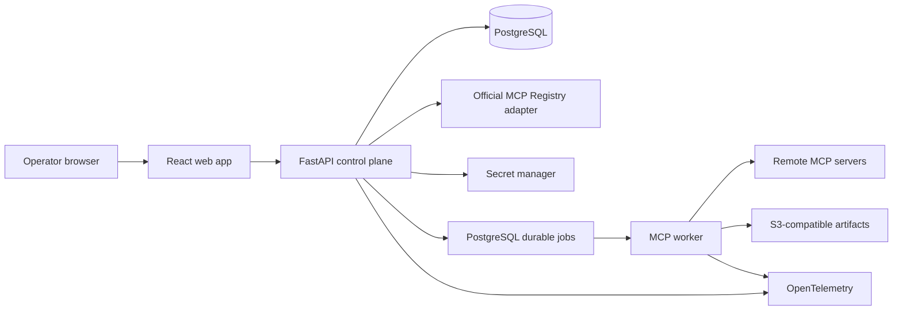

# Modall Milestone 1 — MCP Registry Alpha Implementation Plan

**Status:** Proposed for execution

**Release:** `v0.1.0` — closed operator alpha

**Date:** September 3, 2026

**Parent plan:** `IMPLEMENTATION_PLAN.md`

**Source plan:** `capability_intelligence_exchange_revised_technical_plan.md`

---

## 1. Release decision

Build the platform foundation first as a closed MCP registry with a basic operator UI.

This milestone establishes the control-plane objects and execution lineage that later routing, evaluation, and marketplace features will use. It does not attempt to prove a vertical, select the best capability, or expose an open marketplace.

The release is successful when authenticated admin and operator roles can collectively:

1. search the official MCP Registry or manually enter a remote MCP endpoint;
2. create a server connection using an optional safe credential reference;
3. synchronize live server metadata and tools;
4. inspect immutable, versioned tool schemas in the UI;
5. invoke an enabled tool with non-confidential input;
6. inspect the result, timing, protocol, errors, and audit history; and
7. refresh the server without overwriting earlier capability versions or runs.

The reference journey is:

```text
Find or enter server
  -> create connection
  -> verify MCP compatibility
  -> discover tools
  -> create immutable capability versions
  -> enable a tool
  -> invoke from playground
  -> inspect append-only run record
```

### 1.1 Why this is the first release

- It delivers a usable platform surface without depending on the Swift/iOS evaluation program.
- It makes MCP supply observable before attempting routing across that supply.
- It establishes stable identity, versioning, credentials, execution, audit, and UI patterns once.
- It produces the run records and operational telemetry needed for later comparison and routing.
- It tests a narrow vertical slice of every core layer without prematurely building marketplace or ML systems.

### 1.2 What “registry” means

This release is a workspace control-plane registry, not a replacement for the official MCP Registry.

- The **official MCP Registry** is an upstream catalog of public server metadata.
- A **Modall registry entry** is imported or manually authored metadata with source provenance.
- A **server connection** is an operator-configured endpoint and optional credential binding.
- A **capability** is the protocol-neutral logical object Modall can later evaluate and route.
- An **MCP tool binding** connects one immutable capability version to one discovered MCP tool schema.

Importing a catalog entry never makes code executable, installs a package, or marks a server trusted. Only a successfully verified, policy-compliant connection can expose enabled tools for invocation.

---

## 2. Scope

### 2.1 In scope for `v0.1.0`

#### Registry

- One workspace with pre-provisioned operator access; all tenant-owned rows carry `workspace_id`.
- Manual registration of remote MCP Streamable HTTP endpoints.
- Read-only search of the official MCP Registry through an isolated upstream adapter.
- On-demand import of official `server.json` metadata with source and version provenance.
- Catalog-only handling for package/container entries that lack a directly usable remote endpoint.
- Connection lifecycle: draft, verifying, active, degraded, disabled.
- Operator-controlled display name, tags, environment, and data-classification policy.
- Explicit refresh, periodic synchronization of active connections, and durable bounded-backoff recovery reconciliation for degraded connections.
- Immutable discovery snapshots and schema-drift history.

#### MCP compatibility

- Prefer MCP revision `2026-07-28`.
- Fall back to `2025-11-25` through the official Tier 1 SDK compatibility path.
- Remote Streamable HTTP transport.
- `server/discover` for the modern protocol and legacy initialization fallback.
- Paginated `tools/list` and `tools/call`.
- Tool list cache hints and change notification support when advertised.
- Full preservation of JSON Schema 2020-12 input and output schemas, including valid local URI references such as `#/$defs/item`, without treating inert schema identifiers/references as navigable URLs.
- Text and structured JSON tool results displayed inline.
- Other content blocks retained as bounded artifacts or safe metadata; no active HTML execution.

#### Invocation

- JSON argument editor with server-side schema validation.
- Explicit operator confirmation before every tool call.
- Asynchronous execution with queued, running, succeeded, failed, timed-out, cancelled, and indeterminate terminal states.
- Idempotent creation of a Modall run.
- No automatic retry of an upstream tool call after the durable dispatch fence in this alpha, regardless of tool annotations.
- Immutable run identity, capability version, input snapshot, protocol revision, result, timing, and error lineage.
- Configurable input, output, deadline, and concurrency limits with conservative defaults.

#### Basic UI

- Overview.
- Upstream registry search and import.
- Server connections list, create, detail, refresh, enable, and disable.
- Capability catalog and capability-version detail.
- Invocation playground.
- Run list and run-detail timeline.
- Clear loading, empty, unavailable, authorization, schema-drift, and failure states.

#### Operations and security

- OIDC authentication in deployed environments and an explicit local-development auth mode.
- Admin, operator, and viewer roles mapped from deployment configuration or OIDC groups; membership and invitation management are not exposed in this release.
- Secret references backed by the deployment secret manager; secrets never returned by APIs.
- Server-side SSRF, TLS, and redirect protection. Every credential-bearing manual or imported connection is HTTPS-only.
- All hosted remote MCP endpoints use HTTPS. Plain HTTP is allowed only for a credential-free loopback fixture under explicit local-development configuration.
- Structured audit events for registration, credential changes, enable/disable, refresh, and invocation.
- OpenTelemetry traces, metrics, and structured logs.
- Local Docker Compose development environment and reproducible deployment configuration.

### 2.2 Explicitly out of scope

- Task-aware routing or automatic capability selection.
- Capability comparisons, benchmarks, leaderboards, or quality scores.
- Swift/iOS-specific schemas or UI.
- Public anonymous access or public profile pages.
- Creator self-service publishing.
- Automatic installation of npm, PyPI, OCI, or other packages from registry metadata.
- Arbitrary `stdio` command execution in a hosted environment.
- Legacy HTTP+SSE as a first-class transport.
- MCP prompts and resources as invocable Modall capabilities; their advertised support may be recorded.
- MCP Apps, Tasks, Multi Round-Trip Requests, sampling, elicitation, or roots.
- Interactive OAuth authorization flows for third-party servers.
- Billing, credits, settlement, quotas with monetary value, or x402.
- Workspace-membership administration, SCIM, SSO configuration UI, or enterprise policy management.
- Mobile UI, browser extension, IDE plugin, or GitHub integration.
- Private source-code processing by third-party model providers.

### 2.3 Follow-on candidates for `v0.1.1`

- Interactive OAuth using current MCP authorization discovery and issuer validation.
- Local-only, manifest-allowlisted `stdio` connections.
- Prompts and resources catalog views.
- MCP Tasks extension for long-running upstream calls.
- Scheduled official-registry mirroring instead of on-demand search/import.
- Exportable connection manifests and CLI administration.

---

## 3. Users and release scenarios

### 3.1 Primary user

Internal admins and operators who understand that MCP tools may read or mutate external systems. The alpha is an operations product, not an end-user chat client.

### 3.2 Required scenarios

#### Scenario A — manually connect a public server

1. Admin enters an HTTPS Streamable HTTP endpoint and optional credential reference.
2. Modall validates the destination and records a draft connection.
3. Worker probes protocol compatibility and discovers all tool pages.
4. Modall creates a discovery snapshot and immutable capability versions.
5. Operator reviews and enables selected tools.

#### Scenario B — import from the official registry

1. Operator searches the upstream registry and imports catalog metadata.
2. UI distinguishes remote-connectable entries from catalog-only packages.
3. Import stores the exact upstream version, validated `SafeUrl` source location, and encrypted allowlisted remote metadata with an erasable keyed identity plus current metadata-policy attestation; ordinary storage receives neither raw payload/metadata nor an ordinary content digest.
4. Admin separately configures the endpoint and optional credential reference; Operator verifies the connection.

#### Scenario C — invoke a tool

1. Operator chooses an enabled capability version.
2. UI presents its schema and a JSON arguments editor; it directs operators to configured opaque credential bindings rather than raw secret arguments.
3. UI chooses the prospective run `Idempotency-Key` and calls the non-dispatching run-preflight API; before request materialization, the API performs bounded fail-closed secret/PII classification, rejects raw credential input without persisting a content-derived value, validates and authorizes the exact clean request, and returns a canonical confirmation summary plus a short-lived single-use token bound to an ephemeral preflight-verification HMAC, idempotency key, actor, workspace, capability version, connection configuration, discovery snapshot, input-scan policy, and policy version.
4. Operator confirms; the run API repeats the fail-closed input scan, derives only the ephemeral preflight-verification value, then resolves the scoped `Idempotency-Key` under lock before inspecting preflight consumption. After reauthorizing the actor/workspace, a matching live run recomputes and compares through its erasable fingerprint subkey only when the locked input attestation matches the current policy, and returns the original run without validating or consuming the already-used token; a stale attestation returns `request_rescan_required` without comparison, a mismatch conflicts, and erased/non-comparable or replay-expired state fails closed without comparison. Only when no record exists does the transaction acquire actor membership/current authorization epoch, connection, configuration, discovery-publication/observation, capability-status, input-scan-policy, and connection-policy locks in the common global order, require the unexpired token and unconsumed JTI, revalidate every mutable condition, provision the provisional per-run key hierarchy, and atomically consume the token while binding the current authorization epoch into one clean encrypted run plus per-run-keyed fingerprint/current input attestation/idempotency record and queue row. A uniqueness race rereads the winner and follows the same policy-gated replay decision while its unreferenced provisional hierarchy self-destructs; a different key cannot reuse the confirmation.
5. Worker calls the bound MCP tool once.
6. UI shows the terminal result, latency, content metadata, and correlation ID.

#### Scenario D — detect schema drift

1. A refresh returns changed tool metadata or schema.
2. Modall creates a new discovery snapshot and capability version.
3. Existing runs continue referencing the prior version.
4. New version remains disabled until reviewed if the change is materially incompatible.

#### Scenario E — uncertain execution

1. Worker dispatches a potentially mutating call and loses the connection before receiving a response.
2. Modall records the attempt as `indeterminate`.
3. It does not retry automatically.
4. UI explains that the upstream side effect may have occurred.

#### Scenario F — recover a disabled connection and capability

1. Operator disables a connection during an incident; in the same transaction Modall marks every currently enabled capability version on that connection `disabled` with reason `connection_disabled` and cancels its undispatched runs.
2. Operator requests re-enable; the connection moves to `verifying` rather than directly to `active`.
3. Successful fresh discovery returns the connection lifecycle/discovery projection to `active`; it does not close an invocation circuit breaker. If that breaker is open, dispatch remains ineligible until a dedicated half-open execution probe succeeds under the current configuration and health generation.
4. Operator explicitly re-enables the latest non-superseded capability version after confirming that its stored binding still matches the current discovery snapshot.

---

## 4. Release acceptance criteria

### 4.1 Functional gate

- Three reference servers pass the end-to-end suite: an in-repository fixture, a public remote server, and an authenticated test server.
- Both target protocol eras pass discovery and invocation contract tests.
- Switching the negotiated protocol revision with otherwise byte-identical tool schemas and implementation revision creates fresh `pending_review` capability versions; the prior enabled versions become historical and execution evidence never spans both wire contracts under one version.
- A server exposing at least 100 tools synchronizes every page without lost or duplicate tools only when one upstream snapshot token stays fixed or two consecutive complete no-cache traversals agree; cross-page revision churn publishes nothing and preserves the prior state.
- A schema change creates a new immutable capability version, makes the superseded live binding non-invocable, and preserves historical runs.
- A same-connection A→B→A schema rollback creates a fresh pending occurrence generation for the restored A content and preserves both superseded historical rows.
- A server-provided `ttlMs` cannot postpone a forced no-cache reconciliation beyond the local interval; a server that omits notifications and changes/removes a tool is detected within that bound, while an overdue connection becomes degraded and non-dispatchable but retains a durable bounded-backoff reconciliation job until recovery or explicit disable.
- Concurrent scheduled, notification-triggered, and operator discoveries use monotonically allocated per-connection generations; only the latest-started stable request on the still-current configuration, metadata/schema policies, and lifecycle epoch may publish, so an older/unstable/disabled late completion cannot replace newer tools, timestamps, cache state, or connection health.
- A tool schema containing valid local `$ref` or `$dynamicRef` fragments preserves each exact decoded string value, normalizes deterministically for exact comparison and an erasable keyed identity, and is invocable without network resolution; relative or absolute external references through either keyword remain visible but non-invocable and are never fetched.
- A material endpoint or credential change suspends dispatch and requires fresh verification, discovery, and capability review; a tool omitted from a complete refresh becomes unavailable and is rejected before enqueue.
- An imported official-registry entry retains its upstream version and HTTPS-only context-qualified `SafeUrl` source location plus encrypted current-policy-attested name/metadata and an erasable keyed payload identity, without retaining an unsafe/active-scheme raw URL, plaintext/unsanitized metadata, or an ordinary digest that could act as a low-entropy secret oracle; later metadata-policy recognition suppresses or cryptographically erases it.
- Catalog-only entries cannot be invoked.
- Disabled connections and capabilities cannot create new runs.
- Every run records the originating actor and admitted authorization epoch; immediately before each fence, a qualified cache-bypassing source lookup plus locked membership/role/epoch recheck cancels any unfenced request whose actor was removed or changed, so queued work cannot outlive the authorization-freshness bound.
- A disabled connection and its latest non-superseded capability version can be restored only through Scenario F revalidation and explicit enablement.
- A run whose declared input classification is not allowed by both the global alpha policy and selected connection policy is rejected before enqueue; the worker checks current policy again before dispatch. Every immutable connection version also requires an explicit conservative minimum output classification based on the data the remote tools can access; missing or ambiguous output classification blocks enablement and dispatch.
- Tool arguments matching a credential, token, secret, high-entropy detector, or disallowed policy-defined PII—and any input scanner failure—are rejected before request persistence or enqueue and again before dispatch. Initial rejection retains no argument, digest, or fingerprint. Retained clean arguments are envelope-encrypted under a unique externally erasable per-run key hierarchy with purpose-separated encryption and request-fingerprint subkeys and an exact input-policy/trusted-floor attestation; durable queues/replays/caches never duplicate plaintext or key material. Every retained result/artifact records a complete opaque dependency on its originating request before publication, and every content release rechecks that the parent request hierarchy and attestation remain active/current. A later input-policy or trusted-floor version therefore immediately suppresses request reads/replay/comparison and all derived result/artifact publication, grants, and bytes for terminal and nonterminal runs until coordinated quarantine rescan/reclassification. If the request becomes retention-forbidden, the monotonic cascade enters request and every derived result/artifact into erasure pending, destroys all request/result encryption and fingerprint subkeys, and cannot finalize request erasure until every dependency is attested erased; active storage becomes generic non-comparable tombstones, so database/object/WAL/replica/backup/cache ciphertext and keyed fingerprints are unrecoverable. Non-content execution status, receipt, cost, and safe event history remain unchanged, but no derived content survives or is released, and neither path sends new provider data. Server authentication uses an opaque credential binding instead.
- Result classification is the most restrictive of the declared input classification, the immutable connection-version minimum output classification, and any detector/content-profile promotion; scanners can raise but never lower it. Restricted-sensitive output is never stored inline or in plaintext and is never displayed through ordinary run APIs. Only the explicitly policy-permitted encrypted restricted-artifact path in Section 6.3 may retain it; otherwise the raw value is discarded. Scanner failure also fails closed to quarantine.
- Every retained result/artifact is ciphertext under a unique externally erasable per-result hierarchy from its first durable write and remains releasable only while both its originating request attestation/hierarchy and its exact-content scan attestation match the current trusted-floor/input-policy and output/artifact-scan-policy plus applicable MIME-profile versions. Input authority drift immediately yields parent `request_rescan_required` and dependent `result_reclassification_required`; output/profile drift yields `rescan_required`. Either state blocks decryption, inline reads, publication, grant mint/replay/redemption, artifact bytes, and later dispatch consumption until coordinated same-request/same-content current-version reclassification succeeds. A retention-forbidden request always erases every derived result/artifact rather than relying on its earlier independent output scan; a result/output policy that independently forbids retention does the same for that result hierarchy. Subkeys are destroyed before terminal erasure, so restored database/object/WAL/replica/backup ciphertext cannot recover the value. Non-text bytes remain quarantined until detected type, malware, archive safety, and the allowlisted type's complete content-aware extraction/OCR/secret-PII classification plan pass; executables, encrypted/uninspectable content, unsupported types, mismatches, incomplete coverage, and scanner failure cannot be published or downloaded.
- Confirmation uses a non-dispatching authoritative preflight; after bounded scanning/fingerprinting, run creation resolves idempotency first, returns an authorized matching replay without revalidating its consumed token, and only for a missing record acquires the shared lifecycle locks and atomically consumes the single-use token with run/idempotency creation. The consumed-preflight record stores only the scoped workspace-HMAC digest and lookup-key version derived from the prospective idempotency key, never the raw caller header. If admission wins, a later control mutation observes and cancels the queued row; if the control mutation wins, admission's locked recheck rejects it. Sensitive/scanner-failed input or expired, mismatched, reused-with-another-key, or stale-lifecycle tokens never persist or enqueue a request.
- Large and non-text results are read only through authorized, subject-bound, short-lived artifact access to an integrity-checked immutable object version. HTTP delivery is chunked at no more than 256 KiB and reauthorizes before decrypting/emitting each chunk under a server deadline capped by grant expiry and interval `D`; overwrite, stale parent request, expiry/revocation during a backpressured stream, and cross-workspace attempts fail closed before later bytes.
- Artifact access-grant bearer tokens exist only in the authorized no-store mint/replay response and redacted request header; ordinary grant/idempotency rows, audit, telemetry, and browser surfaces retain no full token, and the encrypted replay envelope remains available through grant expiry, becomes logically unreadable at that instant, and is physically erased afterward.
- Minting, replaying, or redeeming an artifact grant reauthorizes current subject/workspace membership and role, authorization epoch, artifact visibility, classification policy, retention, exact current scan attestation, exact-version integrity, and—for derived results—the active originating-request hierarchy, complete dependency, and exact current input attestation/cascade generation. The grant binds every applicable parent/result attestation version; revocation, parent invalidation, or scan-policy/profile drift after mint denies token replay and bytes even while the token is unexpired, and later coordinated reclassification/rescan requires a new grant.
- A completed run can be diagnosed from the UI without direct database access.

### 4.2 Reliability gate

- API or worker restart does not lose queued runs.
- Duplicate or delayed `Idempotency-Key` requests never create a second mutation, including after the full replay response expires.
- No automatic retry occurs after upstream execution becomes ambiguous.
- Discovery retries are bounded and use backoff because discovery is read-only.
- Per-server concurrency and circuit-breaker behavior pass fault-injection tests.
- Migrations pass clean-install, upgrade, and rollback-readiness tests.

### 4.3 Security gate

- Cross-workspace authorization tests exist even though the alpha seeds one workspace.
- OIDC mode cannot be enabled until a provider-specific adapter proves that the complete authorization path fits one 60-second end-to-end bound from an authoritative group/revocation change to Modall's decision. Qualification records the conservative IdP propagation bound, lookup allowance, and safety margin; any cached snapshot TTL/poll interval must fit only in the remaining budget, and privileged mutations, every initial/fallback dispatch fence, artifact grant mint/redemption, and every bounded HTTP/MCP artifact chunk synchronously bypass that cache. Long HTTP responses use `P + R + D + M <= 60 seconds`. Endpoint presence alone is insufficient. An unqualified provider blocks the deployable closed-alpha release. The audited local principal remains available only in explicit local-development mode, and any artifact using it is labeled developer preview rather than closed alpha.
- Endpoint validation blocks loopback, link-local, cloud metadata, and private-network destinations unless deployment configuration explicitly allows them.
- Every initial request and every permitted read-only discovery/verification redirect hop is resolved through the policy resolver, rejects any forbidden answer, and binds the transport dial to a selected validated IP without a second library DNS lookup while preserving the original hostname for TLS SNI, certificate verification, and the HTTP `Host`. Connection-pool reuse is allowed only for that validated origin/address tuple; new dials repeat resolution and policy checks. An enforced egress policy provides a second boundary against DNS rebinding and TOCTOU races. Invocation traffic never follows a redirect.
- Credential-bearing requests require a valid HTTPS certificate. Only explicitly classified read-only discovery/verification traffic may follow a bounded same-origin redirect; HTTPS-to-HTTP redirects are rejected. Scheme, host, port, certificate, and the dialed validated IP are checked for every permitted hop, and credentials are retrieved and attached only after those checks pass. A `tools/call` response with any 3xx status is not followed or rewritten: because the original server may already have acted, the fenced attempt becomes `indeterminate` with `reconciliation_required`, the connection moves to reverification, and no request body is sent to the `Location` target.
- Every navigable or source URL-valued field—including connection endpoints, redirects, imported source locations, upstream search results, and retained resource links—must cross the one typed, context/scheme-qualified `SafeUrl` parser/sanitizer before persistence, audit, error interpolation, logging, tracing, or API output. Imported/UI-navigable sources and deployable MCP endpoints are HTTPS-only; active, local-file, custom, scheme-relative, and every unlisted scheme fail closed, with HTTP loopback allowed solely in explicit developer-preview fixture mode. The parser also rejects userinfo, fragments, ambiguous/double encoding, credential/token/signature/secret/high-entropy-shaped decoded path segments, and non-allowlisted or credential-shaped query names/values. Raw URL secrets never leave the bounded parsing boundary. JSON Schema `$id`, `$schema`, `$ref`, and `$dynamicRef` strings instead use the inert schema-URI-reference contract in Section 6.2; they are never passed to transport or `SafeUrl`. Before exact schema preservation, the bounded discovery classifier recursively scans every decoded schema member name and scalar leaf—including descriptions, defaults, examples, enum/const values, and custom annotations—not only URI keywords; a match or scan failure rejects the complete discovery result before any schema-derived persistence or output. Registry Alpha does not issue delegated upload URLs; Phase 1's separately typed, short-lived `EphemeralUploadTarget` is a sealed outbound secret capability and is never accepted or represented as `SafeUrl`.
- Every retained remote-origin string or extension value outside JSON Schema—including server/tool names, titles, descriptions, annotations, icons, and diagnostic `_meta`—is independently bounded and scanned under an immutable remote-metadata-scan-policy version before normalization. Accepted remote metadata is encrypted before its first durable write under an external hierarchy with a purpose-separated fingerprint subkey; ordinary rows and composite identities retain only ciphertext/reference, an opaque keyed identity, and a current-policy attestation. Policy activation immediately suppresses stale metadata from APIs/UI and blocks any binding that needs it until quarantine rescan succeeds; a newly sensitive value destroys both metadata subkeys and makes dependent identities non-comparable before erasure completes. Dropped unallowlisted metadata creates no content-derived state.
- Official Registry search never forwards arbitrary operator-authored text. Its body-capture-disabled non-mutating POST accepts only an opaque `public_query_id` selected from Modall's immutable versioned closed catalog of server-authored public Registry identifiers/facets, plus a Modall-issued authenticated encrypted cursor. The backend locks/resolves that ID to an exact scanner-attested `public` term with public-source provenance immediately before forwarding; a missing, retired, stale-policy, or non-public entry fails closed. Raw UI text may filter the locally returned public choices in bounded browser memory but never reaches the API or upstream Registry. Every caller-controlled field is bounded/scanned before lookup or forwarding; the recovered upstream cursor is separately scanned in no-capture memory after binding verification, and any match/failure/tampering leaves no query-derived state or upstream request. Browser/proxy URLs, history, referrers, telemetry, audit, errors, and cache keys never carry a raw term/cursor, and the adapter redacts the final upstream URL.
- Long-lived credentials, upstream authorization headers, and provider secret values do not appear in Alpha logs, traces, API responses, or audit payloads. Alpha's short-lived `ArtifactAccessGrantToken` is the only sealed secret-response exception and follows the no-store, encrypted exact-lifetime replay, no-premature-eviction, and telemetry-redaction contract in Section 8.5. The later `EphemeralUploadTarget` uses the same class of explicit secret transport under the stricter non-recording transfer contract in the platform plan, not an ordinary response or URL field.
- Every operator-supplied free-form display name, tag, note, and reason crosses a bounded typed control-text boundary before domain mutation or audit creation. Reason identity is an enum. Retained optional text/display metadata is encrypted before first write under a unique external control-text hierarchy with purpose-separated encryption/fingerprint subkeys and an attestation to the exact current control-text policy; ordinary domain/audit rows keep only opaque references and safe IDs/enums/version IDs. Reads require a current attestation. Policy drift immediately suppresses the value; quarantine rescan may restore it, while newly sensitive/forbidden text destroys both subkeys and leaves a generic tombstone across WAL, replicas, and backups. A match or scanner failure at ingress rejects before state change.
- Artifact-grant qualification proves the full bearer token exists only in an authorized no-store mint/replay response, the redacted redemption header, and its exact-lifetime encrypted secret envelope; the envelope is available at `expires_at - epsilon`, never prematurely evicted, and logically unreadable at expiry, while ordinary database/idempotency rows and every telemetry/browser surface retain no token.
- Role, membership, artifact-policy, visibility, classification, retention, authorization-epoch, originating-request authority, output-scan-policy, or applicable MIME-profile changes between grant mint and any response chunk deny content on the next authoritative check; policy/profile drift requires coordinated current-version request/result reclassification and a new exact-version-bound grant before release.
- Mutation request bodies are disabled in ingress/proxy/application telemetry, and fail-closed tool-argument scanning prevents a raw credential from reaching request persistence, idempotency storage, a queue, or an upstream server.
- Hosted `stdio` execution and automatic package installation are impossible through the API.
- Tool input/output, JSON Schema depth, artifact count, artifact size, and total response size are bounded.
- Untrusted result content is rendered as escaped text or safe structured data under a restrictive CSP.
- Every publishable binary type has a versioned fail-closed content-inspection profile covering malware/type, metadata and embedded-object/text extraction, applicable archive recursion, all-page/frame rendering and OCR, and secret/PII classification. Encrypted, truncated, unsupported, coverage-incomplete, or scanner-failed content remains blocked.
- Dependency, secret, and container scans have no unresolved critical findings.
- Hosted workers run as non-root in non-privileged containers with read-only root filesystems, bounded writable scratch space, CPU/memory/process limits, restricted syscalls, default-deny egress with explicit destinations, and images pinned by immutable digest.

### 4.4 Usability and accessibility gate

- A new admin/operator pair can connect the fixture server and execute a tool using only the UI and release documentation, without either role exceeding its documented permissions.
- All core workflows are keyboard accessible.
- Forms have programmatic labels and errors; status is not communicated by color alone.
- Destructive-looking or potentially mutating calls always require explicit confirmation.
- Unsupported MCP features produce actionable messages rather than generic failures.

### 4.5 Performance gate

These are platform-overhead targets, not guarantees about upstream servers:

- p95 cached capability-list API latency under 300 ms with 5,000 capability versions.
- p95 run-creation latency under 300 ms.
- p95 Modall invocation overhead under 250 ms, excluding queue wait and upstream execution.
- A 100-tool discovery completes within 10 seconds against the reference server under normal local test conditions.
- The UI becomes interactive within 2.5 seconds on the supported desktop test profile.

### 4.6 Release decision

Release `v0.1.0` only when functional, reliability, security, and migration gates pass. Performance misses may be accepted only with a measured cause, an owner, and no correctness or security impact. Feature scope must be cut before weakening a security or lineage invariant.

---

## 5. Architecture

### 5.1 Deployment shape

Use a modular monolith with one worker deployable. This preserves the parent plan's architecture while moving registry and MCP execution earlier.



Deployables:

- `api`: authentication, registry administration, read APIs, run creation, audit.
- `worker`: connection verification, discovery synchronization, health probes, tool invocation.
- `web`: operator console.

No service mesh, Kubernetes requirement, event broker, Redis, or workflow engine is needed for this release.

### 5.2 Technology choices

- Backend: Python, FastAPI, Pydantic, SQLAlchemy, Alembic.
- MCP: official Tier 1 Python SDK, exactly pinned in the lockfile.
- Database and jobs: PostgreSQL with leased jobs and `FOR UPDATE SKIP LOCKED`.
- Frontend: React, TypeScript, Vite, a small accessible component layer, and server-state query caching.
- Artifact storage: S3-compatible storage; MinIO in local development.
- Authentication: standards-based OIDC JWT validation; explicit local-only development principal.
- Telemetry: OpenTelemetry, structured JSON logging, Prometheus-compatible metrics.
- Tooling: `uv`, `pnpm`, pytest, Ruff, static type checking, Vitest, Testing Library, Playwright.

Pin runtime and dependency versions during PR-01. Do not depend on floating MCP SDK or registry schemas.

### 5.3 Domain boundaries

```text
identity
  users, workspaces, memberships, roles

registry
  upstream entries, server connections, discovery snapshots

capabilities
  logical capabilities, immutable versions, MCP bindings

invocations
  runs, attempts, state transitions, artifacts

credentials
  opaque secret references and access policy

audit
  actor-attributed control-plane changes

telemetry
  traces, metrics, logs, correlation
```

Modules use typed interfaces and repositories. Application code must not reach into another module's tables through ad hoc ORM queries.

### 5.4 Capability abstraction

The core object remains protocol-neutral:

```text
Capability
  -> CapabilityVersion
       opaque_content_identity + comparability_state
       occurrence_generation
       -> MCPToolBinding
            server_connection_id
            server_connection_version_id
            negotiated_protocol_revision
            encrypted_current-attested_remote_tool_identity_ref
            input_schema
            output_schema
            implementation_identity_assurance
            implementation_revision
       -> CapabilityObservation [one or more]
            discovery_publication_id
            discovery_snapshot_id
            discovery_generation
            present
            observed_at
```

For `v0.1.0`, one discovered MCP tool maps to one logical capability scoped to its server connection. Semantic grouping of equivalent tools across providers is deferred. This avoids inventing deduplication logic before evaluation data exists.

### 5.5 Versioning rules

- IDs are UUIDv7 or another sortable opaque identifier; slugs are mutable aliases.
- Normalize JSON deterministically before exact in-memory comparison and keyed fingerprinting.
- No ordinary digest ever covers schema bytes. Each accepted schema hierarchy has purpose-separated encryption and fingerprint subkeys; its stored schema identity is an HMAC of the canonical bytes under that hierarchy's fingerprint subkey. A discovery-snapshot digest covers safe server/protocol/page metadata plus those opaque schema HMAC identities, never plaintext schema content. Destruction of that schema's fingerprint subkey after sensitive reclassification therefore also makes every dependent snapshot digest cryptographically non-comparable and suppresses it from ordinary APIs.
- A tool content digest is an opaque composite over the normalized remote-metadata HMAC identity—including remote name/title/description/annotations and implementation identity source/revision—the input/output schema HMAC identities, exact `server_connection_version_id`, negotiated protocol revision, immutable MCP SDK/client-adapter version, and safe `implementation_identity_assurance` enum; raw metadata/schema bytes or an ordinary content-derived digest never enter it. The complete discovery-snapshot ID/digest remains separate observation provenance, so unrelated tool drift cannot churn a version. Credential rotation, protocol or adapter change, identity-source/revision change, or assurance change creates a new digest even with byte-identical advertised schemas. Destruction of a participating metadata or schema fingerprint subkey marks the tool digest non-comparable, suppresses it from public detail, and leaves only an opaque generic tombstone projection; retained HMAC/composite bits in immutable rows, WAL, replicas, and backups cannot test candidate content without the destroyed subkey.
- Capability-version identity is the logical capability plus opaque content digest plus a monotonically increasing occurrence generation. To reuse the latest non-superseded version, discovery must hold current clean metadata/schema attestations, decrypt those bundles in bounded memory, and compare every candidate canonical byte plus safe structural field exactly; it then reuses the existing keyed identities/digest. Changed or non-comparable current content creates a new immutable `pending_review` generation with fresh metadata/schema hierarchies. If content A is superseded by B and A later reappears, create a fresh A generation in `pending_review`; never resurrect the terminal earlier A row.
- Operator metadata such as local tags does not create a protocol version; it crosses the typed control-text boundary and is separately audited only after bounded secret/PII classification succeeds.
- Refresh never overwrites a prior snapshot or version.
- Runs always reference the exact capability version and binding used.
- Every winning complete discovery publication appends observations for the union of listed and previously current remote tool names, linking its generation/publication and snapshot plus `present` boolean to the reused or newly created capability version. An unchanged present tool on the same connection version reuses its version and appends only an observation; an omitted prior tool receives `present=false` provenance for its unavailable transition. Each run records the exact current present publication/observation/snapshot checked at dispatch.
- Every binding records the negotiated protocol revision, immutable MCP SDK/client-adapter version, safe `implementation_identity_assurance` enum (`pinned`, `declared`, or `unverified`), and current-attested encrypted remote-metadata reference containing the exact identity source plus optional implementation revision; their opaque identities participate in version identity. A changed protocol revision, adapter version, implementation revision, source, or assurance creates a new `pending_review` capability version and prevents a prior enablement or stale trust metadata from crossing changed execution behavior.
- An unpinned remote implementation remains invocable in the registry alpha, but every result is labeled `unverified_remote` and tied to its discovery snapshot and observation time. It is ineligible for authoritative benchmark aggregation, G1 evidence, or learned routing until an immutable revision is attested or a platform-controlled adapter provides one.

### 5.6 Lifecycle rules

Connection and capability states below are operational projections, not fields in immutable version content. Every transition appends a status event with prior state, next state, reason, actor/system source, and correlation ID, then compare-and-set updates the current projection in the same transaction. Capability ciphertext, stored opaque identity bits, occurrence generation, and binding rows never change; a separate comparability/read projection may only move fail-closed to suppressed/non-comparable after policy invalidation or key destruction.

```text
Server connection
draft -> verifying
verifying -> active | degraded | disabled
active <-> degraded
active | degraded -> verifying
active | degraded -> disabled
disabled -> verifying

Capability version
pending_review -> enabled | disabled | unavailable | superseded
enabled <-> disabled
enabled | disabled -> unavailable | superseded
unavailable -> pending_review | superseded

Run
queued -> running -> succeeded
   |         |-----> failed
   |         |-----> timed_out
   |         |-----> cancelled
   |         |-----> indeterminate
   +---------------> cancelled
   +---------------> failed
```

- A disabled or degraded connection does not accept new dispatches. Discovery health/lifecycle and invocation circuit-breaker state are separate projections with separate generations. Every invocation failure transition that opens the breaker atomically advances the invocation-health generation, moves the aggregate connection to `degraded`, and cancels admitted but unfenced runs under the same connection-first lock order. A successful `tools/list` discovery may clear only discovery degradation and refresh discovery evidence; it never changes `open|half_open|closed` invocation-breaker state or restores dispatch eligibility. `open -> half_open` admits exactly one dedicated, administrator-configured side-effect-free execution probe through the same session-initialization and transport path, never an ordinary/user run; only its success under the locked current configuration closes the breaker and can restore dispatch eligibility. If no qualified probe exists, the breaker requires explicit operator-controlled reverification and remains open. Probe failure reopens it and advances the invocation-health generation. Degradation never stops discovery recovery: a durable forced-reconciliation job remains scheduled for every discovery-degraded non-disabled connection and retries complete no-cache discovery with bounded exponential backoff/jitter capped at five minutes until discovery succeeds or the operator explicitly disables the connection; operators may also request a read-only bypass refresh.
- `queued -> failed` is allowed only before a dispatch fence exists, for a definitive pre-dispatch failure such as provisional request-key activation failure or a security reclassification whose key destruction has completed. It appends the stable safe reason, projects to the existing public `failed` status, and cannot bypass the requirement that `erasure_pending` reach attested `erased` first. Control-plane disablement continues to use `queued -> cancelled`.
- Re-enabling a disabled connection transitions it to `verifying`, never directly to `active`; successful protocol negotiation and discovery are required before it can serve new runs.
- Disabling a connection atomically increments its monotonic `connection_lifecycle_epoch`, invalidates every unredeemed session-initialization lease, closes/cancels every initializing or initialized invocation transport, cancels every discovery/recovery job and in-process discovery cancellation token, transitions every currently `enabled` capability version on that connection to `disabled` with reason `connection_disabled`, and cancels queued runs before setting the connection `disabled`. Actor membership/role/authorization-epoch and probe-service grant mutations likewise invalidate the affected unredeemed session leases and cancel their transports under the same ordered locks. Re-enable increments the epoch again and enters `verifying`; connection reverification never clears prior capability states or the invocation breaker, and each intended version requires a later explicit enable action.
- Run admission and every identity/authorization-epoch update, connection disable, material configuration change, capability-state change, discovery-publication/observation replacement, control-text/remote-metadata/schema/input/output/artifact-scan-policy or MIME-profile change, trusted input-floor change, and connection-policy update acquire the affected rows/advisory locks in one documented global order. Where client idempotency applies, its scoped key lock precedes the lifecycle lock sequence; worker fencing, control-text/metadata/schema/request/result publication/rescan/reclassification, dependency cascade, and artifact access use the same relevant subsequence without an idempotency lock. Admission inserts its run/queue row before releasing lifecycle locks. Therefore a control mutation that locks second must observe and cancel the admitted undispatched run, while admission that locks second must observe the new state and reject before enqueue; there is no read/enqueue gap or inverted lock order. A scanner-policy or trusted-floor activation need not enumerate retained content before taking effect: advancing its locked current-version pointer immediately makes every older request attestation and therefore every dependent result/artifact ineligible for reads and for validation, enablement, admission, publication, replay, grant, redemption, or dispatch consumption.

The global order is mandatory and implemented by one shared lock-plan helper:

1. scoped idempotency advisory key, for API mutations only;
2. actor `users`, `workspace_memberships`, and current workspace authorization-epoch projection, ordered by workspace then subject ID;
3. `server_connections`, ordered by stable connection ID;
4. current `server_connection_versions`/configuration pointers, ordered by ID;
5. current discovery-publication/observation pointers, referenced `discovery_snapshots`, and schema-payload/key-state records, ordered by connection, generation, snapshot, then schema ID;
6. `capability_status_projections`, ordered by capability-version ID;
7. affected `artifacts`, ordered by artifact ID;
8. current control-text-scan-policy, remote-metadata-scan-policy, schema-scan-policy, input-scan-policy, and output/artifact-scan-policy plus MIME-profile pointers/versions, ordered by policy kind then MIME;
9. current global/deployment and connection-policy pointers/versions, ordered by policy scope then ID;
10. affected `runs`, `run_attempts`, `request_derived_content_dependencies`, and `jobs`, in that order and then by ID.

Transactions skip irrelevant classes but never reorder them. They choose the documented row or advisory lock for each key, never both; multi-row sets are sorted before acquisition. Network authorization lookup occurs before acquiring database locks. A worker completes and commits lease claiming before beginning the fence transaction, so it carries no run/job lock backward into steps 2–9. Control mutations acquire steps 2–9 before locking queued rows in step 10. The helper rejects an out-of-order plan in tests and emits only bounded lock-class timing telemetry, never identifiers.
- A material connection change, including endpoint or credential binding, atomically creates a connection-configuration version, increments the lifecycle epoch, invalidates every older unredeemed session-initialization lease, closes/cancels every transport initialized under the prior epoch/configuration, moves the connection to `verifying`, suspends new dispatch, and transitions every non-superseded capability version tied to the prior configuration to `superseded`. Already-superseded versions are terminal idempotent no-ops and emit no duplicate transition event. Fresh verification and complete discovery are required before the connection can become `active`; versions materialized against the new configuration remain `pending_review` until explicitly enabled.
- Refresh matches tools by connection plus remote tool name. When a complete current snapshot omits a previously present tool, its version transitions to persisted `unavailable`, becomes non-invocable immediately, and is rejected before enqueue. If the exact same digest and binding later reappear in a fresh complete snapshot, the unavailable version may return only to `pending_review`; a changed digest creates a new `pending_review` version and supersedes the old one.
- Any changed tool digest creates a new `pending_review` version. The old binding becomes `superseded` and historical-only because a remote MCP endpoint cannot guarantee that its prior implementation remains addressable.
- A disabled capability version can return to `enabled` only through an explicit operator action while it is the latest non-superseded version, its connection is active, and its binding matches the current discovery snapshot. A superseded version is permanently historical.
- A run queued against a version that becomes disabled, unavailable, superseded, or detached from the current connection configuration/discovery snapshot before dispatch is cancelled with a stable reason code.
- Terminal run states never transition back to active states. Corrections are appended as events rather than rewriting history.

---

## 6. MCP behavior and compatibility contract

### 6.1 Protocol negotiation

- Configure the official SDK for automatic modern negotiation.
- Prefer `2026-07-28` using `server/discover`.
- Fall back to the legacy initialization flow for `2025-11-25` servers.
- Record the selected protocol revision on every snapshot and run attempt.
- Reject unsupported revisions with a stable `mcp_protocol_unsupported` error.
- Keep MCP wire objects behind an internal adapter so future SDK upgrades do not leak through domain or API contracts.
- Establish and initialize the invocation transport session before the database dispatch fence but send no `tools/call` yet. Session initialization itself is fenced through two disjoint paths. Immediately before an ordinary run initializes, its worker repeats the cache-bypassing qualified-source actor authorization lookup without database locks; the half-open probe instead authenticates its dedicated service identity and narrow probe grant and has no user actor or arguments. A short transaction then uses the shared identity/connection/configuration/discovery/health lock subsequence and requires the exact bound configuration/credential/discovery/protocol/adapter versions. For an ordinary run it reconciles the lookup, requires unchanged admitted membership/role/authorization epoch, lifecycle/discovery health `active`, the current discovery-health generation, invocation breaker `closed` at its current generation, and aggregate dispatch eligibility. For the single designated half-open probe it requires the current authorized probe service identity/grant, a non-disabled lifecycle, current clean discovery publication/health generation, breaker state `half_open`, the exact current invocation-health generation and designated probe lease, and the configured side-effect-free probe identity; this branch explicitly bypasses only ordinary aggregate dispatch eligibility and can never carry a user run, user arguments, or an arbitrary tool. On either branch the transaction records one short-lived single-use `session_initialization_fenced` lease bound to all checked values, the applicable actor or probe-service authorization, and the lifecycle epoch. The service-controlled transport redeems that lease under the same locks immediately before retrieving/attaching the pinned credential and writing the first byte; an expired, cancelled, already-redeemed, or mismatched lease sends nothing. Actor/probe-service authorization change, disable, material endpoint/credential change, or breaker transition takes the same locks, invalidates every affected unredeemed lease, and closes/cancels every transport from an older epoch/generation. If redemption linearizes first, later control mutation still invalidates the eventual proof and cancels the transport; it cannot pass the dispatch fence. Successful initialization publishes a short-lived single-use session proof only through a compare-and-set that the captured identity/lifecycle/configuration/credential/discovery/health values remain current, binding the observed server identity and negotiated live protocol revision. For an ordinary run, the dispatch fence repeats actor authorization and must consume that proof and match both exactly to the immutable capability/server-connection version and current discovery publication. The dedicated probe consumes its proof on the non-run probe path and may close the breaker only if the same probe-specific predicate/generation remains current at probe completion. A mismatch or stale/cancelled proof suspends the connection, wipes arguments/session state, sends zero tool-call bytes, and requires fresh stable discovery plus review. Thus a paused worker cannot emit credential-bearing initialization traffic after an identity or connection control mutation, the half-open recovery path remains reachable without admitting ordinary work, and automatic negotiation cannot silently execute a stored binding under a different wire revision.

### 6.2 Discovery

- Follow every `tools/list` cursor with a configurable maximum page and tool count. If the negotiated protocol/server contract supplies a conformance-tested snapshot/revision token defined to identify the complete listing, require the same token on every page and an authoritative end-of-walk confirmation; an arbitrary `_meta` value does not qualify. Otherwise one discovery generation performs two consecutive independent full no-cache traversals from the first page and may publish only when their complete canonical tool/metadata/schema sets agree byte-for-byte in bounded memory. Any token change or disagreement discards both traversals and retries the whole pair only within a fixed attempt/deadline budget; exhaustion degrades the connection and leaves the prior snapshot historical rather than publishing a synthetic mixed-revision view.
- Reject cursor loops, inconsistent duplicate tool definitions, changed snapshot tokens, and disagreement between untokened stabilization traversals.
- Treat list `ttlMs` and `cacheScope` only as untrusted optimization hints. Compute effective TTL as the minimum of a valid nonnegative server hint (invalid or absent uses a 60-second local default), a configurable local maximum defaulting to 5 minutes, and a non-overridable 15-minute hard ceiling; `cacheScope` may narrow but never broaden the connection/workspace cache boundary.
- Ordinary reads may honor an entry within that effective TTL. Independently, every active connection must complete a scheduled full no-cache reconciliation at least every 10 minutes with bounded jitter that never pushes the deadline later, regardless of the server hint or notification support. Before any scheduled, notification-triggered, or operator discovery performs network I/O, a short transaction locks the connection, requires lifecycle state `verifying|active|degraded`, monotonically increments `latest_started_discovery_generation`, and captures that generation plus the exact current connection-configuration version, remote-metadata/schema scan-policy versions, and `connection_lifecycle_epoch`; disabled connections allocate nothing and perform no request. Before credential retrieval and every later pagination or untokened-stabilization request, the client rechecks that the epoch is unchanged and state is not `disabled`, aborting and wiping buffers on mismatch in addition to honoring the cancellation token. After a token-consistent traversal or two agreeing untokened traversals plus complete metadata/schema scanning, publication reacquires the shared connection/configuration/observation/capability/metadata-policy/schema-policy locks and succeeds only through compare-and-set when the captured generation, configuration, both scan-policy versions, and lifecycle epoch still equal their current values and the locked lifecycle remains publication-eligible. A superseded, inconsistent, or disabled completion is discarded with safe `discovery_superseded|discovery_unstable|connection_disabled` evidence and cannot write a cache/snapshot/observation/capability/metadata-or-schema-attestation transition, update reconciliation timestamps, schedule recovery except for a new eligible generation, or move the connection to `active`; raw pages and provisional content keys are destroyed. Thus a request started later always wins even if it finishes first, while disable/re-enable invalidates every older fetch. A failed latest eligible generation is recovered by a new generation rather than an older stale success. When a missed deadline or current-generation failure degrades a non-disabled connection, the scheduler preserves one durable recovery job and keeps attempting a complete stable bypass with bounded exponential backoff/jitter capped at five minutes until a winning successful traversal atomically restores current observations and the discovery lifecycle projection to `active`, or an operator explicitly disables the connection; disable terminates retries and lease recovery cannot recreate them until re-enable. Discovery publication never changes the separate invocation-breaker projection or its generation, and an open/half-open breaker continues to make the aggregate connection dispatch-ineligible until its dedicated execution probe closes it. Operator refresh also bypasses the SDK/list cache. A bypass path performs a fresh upstream listing and replaces the cache only after the winning stable complete publication; if the SDK lacks a bypass API, use a fresh no-cache client instance/path.
- Record the winning `published_discovery_generation`, `last_complete_bypass_at`, and `next_reconciliation_due_at` in the same publication transaction. If the last complete winning bypass becomes 15 minutes old, atomically move the connection to `degraded`; the dispatch-fence eligibility check independently enforces the same hard staleness bound and blocks new calls until a successful forced reconciliation restores current discovery evidence.
- Subscribe to supported list-change notifications when operationally useful; they expedite a bypass refresh but never replace the periodic reconciliation correctness path.
- Treat tool annotations as descriptive hints, never as a security boundary.
- Validate schemas with bounded depth, reference count, and processing time.
- Persist only allowlisted protocol metadata in normalized snapshots. Unknown `_meta` and extension values are dropped by default. Every retained remote-origin metadata bundle—including explicitly enabled diagnostics—is recursively bounded/scanned under the captured immutable remote-metadata policy before normalization/keyed identity and encrypted from its first durable write under a per-bundle external hierarchy; ordinary rows retain no plaintext or ordinary content digest. Its append-only attestation records exact keyed identity, policy version, traversal coverage, and decision. A current-policy mismatch immediately suppresses metadata/API detail and any binding that requires it; quarantine rescan may append a current attestation only after an exact locked identity check, while newly sensitive or retention-forbidden metadata destroys both subkeys, makes dependent tool/snapshot identities non-comparable, and requires a fresh stable discovery before service can resume. This metadata rule does not sanitize or exempt JSON Schema content, which follows the separate whole-document rejection rule below.
- Remote-metadata hierarchy preparation, winning publication, post-commit activation, rollback, and orphan expiry use the same external-key/outbox protocol as schema payloads; no metadata may be read, searched, bound, or invoked until both subkeys are active.
- Never return unsanitized remote metadata from a snapshot API. Negative fixtures cover credential, token, cookie, and PII-shaped values.
- Before normalization, keyed fingerprinting, caching, persistence, audit construction, logging/tracing, or API/UI mapping, recursively traverse the entire bounded decoded input and output schema and classify every member name and scalar leaf for credentials, tokens, secrets, high-entropy material, control characters, and policy-defined PII. This includes `title`, `description`, `default`, `examples`, `enum`, `const`, all definition/property content, URI keywords, and custom annotations. Discovery captures the exact current immutable schema-scan-policy version before scanning and publication locks/rechecks that pointer; a policy change during discovery makes the attempt non-publishable. A match, traversal-limit breach, or scanner failure rejects the complete discovery attempt with a stable safe reason, stores only non-content-derived rule/type/count telemetry, immediately degrades and blocks the connection, and leaves its prior snapshot historical rather than current/dispatchable; no partial or redacted schema, content-derived digest/fingerprint, cache entry, capability version, or diagnostic payload is retained. Only a completely clean schema is preserved exactly, envelope-encrypted from its first durable write under a per-schema external hierarchy; its fingerprint subkey creates the only persisted schema identity, and no ordinary schema digest is computed. Ordinary snapshot/version rows contain only ciphertext or an opaque encrypted-content reference, keyed identity, and safe metadata. Schema-key preparation, publication commit, activation, rollback, and orphan expiry use the same external-key/outbox invariants as retained requests, and no schema is readable or invocable before both subkeys activate. For that clean schema, parse JSON Schema `$id`, `$schema`, `$ref`, and `$dynamicRef` strings as bounded `InertSchemaUriReference` values under RFC 3986/JSON Schema 2020-12 syntax while preserving their exact strings in the canonical schema. Local targets—such as `$ref: "#/$defs/item"` and `$dynamicRef: "#node"` with a same-document `$dynamicAnchor`—resolve only inside the same immutable document through the bounded local validator. Relative or absolute external targets through either applicator are preserved and marked `external_ref_unresolved`, never fetched; a schema requiring one is visible but non-invocable with stable reason `mcp_schema_external_ref_unsupported`. These inert values never enter HTTP clients, browser navigation, resource links, logs, or `SafeUrl`.
- Every accepted input/output schema receives an append-only attestation over its exact keyed canonical content identity, schema-scan-policy version, bounded traversal coverage, and decision. Capability list/detail/version APIs, schema diffs, enablement, argument validation, run admission, and every dispatch fence lock the current schema-policy pointer and release/use no schema bytes or content digest unless the exact attestation and active hierarchy match. Activating a new schema policy therefore makes every older attestation immediately `schema_rescan_required`, makes affected versions non-invocable, and suppresses schema fields/digests from APIs/UI without a fan-out race. A durable job may decrypt a retained quarantined schema and append a new attestation only when commit-time locks prove the same keyed content identity and still-current policy. A clean rescan restores eligible historical display and, only when every other current-binding check passes, invocability; a sensitive, failed, unavailable-byte, or superseded-policy rescan remains quarantined and releases no schema. When current policy forbids retention, the job destroys both per-schema encryption/fingerprint subkeys, replaces the active payload and dependent digest projections with generic non-comparable tombstones, and verifies that database/WAL/replica/backup ciphertext and HMAC/composite bits are undecryptable and unusable for candidate enumeration before finalizing erasure.

### 6.3 Invocation

- At the first run-preflight ingress, hold raw arguments only in a bounded ephemeral buffer excluded from request logs, traces, error interpolation, audit payloads, and body capture. Before canonical request materialization or HMAC fingerprinting, scan parsed strings and decoded values for credentials, tokens, secrets, high-entropy values, and policy-defined PII. A match or scanner failure returns stable `mcp_input_sensitive` or `mcp_input_scan_failed`, persists only non-content-derived rule/type/size audit metadata, and cannot produce a reusable confirmation token. Raw secrets are unsupported as tool arguments; operators must use the connection's opaque credential binding for server authentication.
- Validate the operator arguments against the immutable stored schema before dispatch.
- Accept only effective `public` or `non_confidential` inputs in the alpha; a client declaration is never classification authority. Derive `effective_input_classification = max(trusted_workspace_input_floor, every referenced artifact/source floor, client_declared_classification, detector_classification)` under the policy locks. The workspace floor is a versioned data-owner/Admin-controlled policy, defaults to `private_internal`, can be lowered only by the dedicated `input_classification:admin` permission with audited data-owner approval, and cannot be changed by a run caller or an idempotency replay. A content-specific approved source attestation may supply a stricter exact-content floor but never lower the workspace floor. Secret/PII scanning can raise/reject but a clean scan never proves content public. Therefore an unapproved workspace or ambiguous/untrusted inline source remains `private_internal` and is ineligible for remote Alpha execution even if the operator declares `public`. Before enqueue, authorize the effective input classification against the global alpha policy and selected server-connection version, require that immutable connection version's explicit `minimum_output_classification`, and authorize the worst-case input/output combination; fail closed when any floor, policy, provenance, or classification is missing/ambiguous. This output minimum describes all data the authenticated remote tools can return, independently of the submitted arguments or detector result, and changing it creates a new connection version through the material-change flow.
- Run creation repeats the bounded input scan under the current immutable scan-policy version and computes the clean canonical request plus a short-lived preflight-verification HMAC, never an ordinary input digest. It then performs the idempotency lookup/lock and request comparison before validating whether the submitted preflight is still unconsumed; an authorized matching record returns its replay representation without another token consumption, while a record already marked non-comparable by erasure returns `idempotency_replay_expired` regardless of the submitted body and never executes. Only the no-record branch acquires the same lifecycle/configuration/observation/input-floor/policy locks used by control mutations, re-derives the effective classification from the locked trusted workspace/source floors and current detector result, and atomically consumes the preflight while persisting the request/run/idempotency/queue rows. Before durable persistence, it provisions one unique per-run external key hierarchy in a qualified cryptographic-erasure service as a short-lived provisional handle bound to the prospective run ID, derives purpose-separated encryption and request-fingerprint subkeys, envelope-encrypts the canonical arguments, and computes the durable run fingerprint only with that per-run fingerprint subkey. The consumed-preflight row does not copy the preflight fingerprint. The database transaction persists only ciphertext, the keyed fingerprint, opaque handle, fingerprint state `comparable`, effective classification plus exact trusted-floor/source/detector/policy versions, an append-only input-scan attestation over that exact keyed identity/current policy version/coverage/decision, and activation outbox row; after commit, an idempotent handler activates the hierarchy for request retention, while rollback or missing activation lets it self-destruct. The run cannot dispatch or expose arguments until activation is confirmed; activation failure/expiry moves it into the same fail-closed erasure path. PostgreSQL, WAL, replicas, backups, jobs/queues, idempotency responses, and durable caches receive only ciphertext/keyed bits or a run/content reference plus the opaque handle, never plaintext or a recoverable key. A worker decrypts once into a single-use bounded non-swappable `ScannedArgumentLease`, rescans it immediately before fencing, and binds its exact per-run-keyed HMAC fingerprint plus current scan-policy and trusted input-floor/source versions into the fence transaction. A changed version forces a fresh scan/classification decision. On a clean committed fence, that same worker passes the still-held lease directly to a bounded transport serializer and upstream send without another database read or decryption. The worker retains ownership of the lease and every mutable serialization buffer until the transport reports that the full request body was written, or proves a definitive failure before any byte was written; it then wipes them. A partial/ambiguous write follows `indeterminate`, and a crash after the fence loses the lease and follows the existing no-retry recovery rule. If scanning or trusted classification newly rejects the input, no fence is written: the lease is wiped and the locked transaction first advances the monotonic content state and fingerprint state to `erasure_pending`, revokes dispatch eligibility, suppresses every read/replay/comparison, and enqueues an idempotent hierarchy-destruction workflow; it does not claim terminal erasure. That workflow irreversibly destroys both purpose-separated subkeys and verifies provider destruction across active versions and recovery copies, purges ciphertext/fingerprint caches, replaces active database ciphertext/content/fingerprint references with a generic `erased_no_compare` tombstone, and only then appends the attested security-erasure event and finalizes `request_content_state=erased`, `request_fingerprint_state=erased`, and `dispatch_eligibility_revoked`. WAL, MVCC pages, replicas, and backups may retain ciphertext and keyed fingerprint bits but no surviving key can test candidate plaintexts. Failure or delayed destruction leaves the run `erasure_pending`, quarantined, unreadable, non-comparable, and non-dispatchable with an alert; only the HMAC of the client-supplied idempotency key, generic no-replay tombstone, and non-content-derived policy/rule/size/erasure evidence survive.
- Activating a new input-scan-policy or trusted input-floor version immediately makes every older request attestation ineligible for argument reads, idempotent content replay/comparison, and unfenced dispatch, including requests belonging to already terminal runs; because every result/artifact release also locks and rechecks its parent request, the same pointer change immediately suppresses all derived content without enumerating descendants. APIs return only safe `request_rescan_required|result_reclassification_required` metadata. A durable classification-qualified cascade job may decrypt the request and each dependency only in bounded quarantine. It may append superseding request and result attestations only when commit-time locks prove the same keyed identities, complete dependency set, and still-current input floor/policy plus output policy/profile; it recomputes effective output classification from the current input class and never lowers it. A newly sensitive, retention-forbidden, scanner-failed, or missing request atomically enters request erasure pending and every dependency into result erasure pending, destroys both subkeys for the request and every derived result/artifact, and finalizes request erasure only after all dependency destruction is attested. Non-content execution status, receipts, cost, and safe events remain terminal and traceable, but arguments and derived content never become readable again. Missing ciphertext/key material remains quarantined, non-comparable, and cascade-blocking rather than grandfathering the old attestation.
- Immediately before every initial dispatch fence—and before a fallback fence in Phase 1—the worker performs a synchronous qualified-source authorization lookup for the originating actor that bypasses the shared cache and holds no database locks; timeout, incomplete group/revocation data, or an unqualified source fails closed. The transaction that creates `dispatch_fenced` then uses the relevant classes from steps 2–10 of the shared lock plan for actor membership/current authorization epoch, connection/current discovery-health and invocation-health generations, configuration, discovery publication/observation, capability status, any input artifacts, scan policies, global/connection policy, and attempt/job state. Reconcile the fresh source result into the locked authorization projection and require the actor still has the execution role and workspace membership and that the current epoch exactly equals the epoch bound into the admitted run; any change cancels the unfenced run with stable `actor_authorization_changed`, requires a new preflight/confirmation, and sends nothing. While holding the remaining locks, require connection lifecycle `active`, invocation circuit breaker `closed`, and dispatch-eligible current discovery/invocation health generations; consume a live-session proof whose lifecycle epoch and exact configuration/credential/discovery/protocol/adapter/health bindings still match; revalidate the clean input-scan decision/current version, every referenced artifact's current scan attestation when applicable, live tool name, invocable capability projection, exact current connection-configuration version and its required minimum output classification, current latest-started/winning discovery generation plus present publication/observation/snapshot, `last_complete_bypass_at` younger than the 15-minute dispatch-staleness bound, and current input/output policy compatibility. Half-open probes use the separate non-run, probe-specific eligibility predicate in Section 6.1 and never enter this ordinary dispatch fence. Write the fence only if every check passes. If authorization, breaker/degradation, stale session proof, scan-profile/policy change, other control change, or staleness wins first, fencing fails and no call occurs; if fencing commits first, the attempt is already in at-most-once uncertain-execution semantics. Identity, health, and policy mutations take the same ordered locks, so there is no unlocked check-to-fence gap.
- That fence also locks the current trusted workspace/source input-floor versions, recomputes the effective input-classification maximum, and compares it with the admission attestation. A raised/missing/ambiguous floor or newly ineligible effective class invalidates the queued intent and sends zero bytes; the worker never substitutes the client's declaration or a clean detector result for trusted classification.
- The fence also requires current clean remote-metadata and schema attestations with active hierarchies for the exact capability binding. Only after those locked checks may the worker decrypt the bound remote tool name into a single-use buffer; it serializes that name with the already scanned argument lease, sends once, and wipes both. A metadata-policy activation or erasure that linearizes first therefore sends nothing, and no durable queue/event contains the plaintext tool name.
- Attach trace context using the current protocol's supported metadata.
- Default deadline: 120 seconds; configurable downward per connection or capability.
- Default maximum input: 256 KiB serialized JSON.
- Default maximum result: 1 MiB inline only after content scanning; bounded larger content becomes an artifact up to the configured hard limit.
- Stream every result first into a bounded ephemeral quarantine buffer. Before database persistence, artifact publication, or UI/API display, scan text and structured content for tokens, credentials, secrets, and policy-defined PII. Every scan binds an immutable output/artifact-scan-policy version; every non-text MIME on the publication allowlist additionally binds its immutable scanner-profile version. In a no-network sandbox, that profile must verify actual versus declared type, run malware checks, extract metadata/embedded text and objects, recursively inspect bounded archive contents, and render/OCR every page or frame when visible content can carry text; secret/PII classification runs over all extracted, OCR, metadata, and recursively decoded content. Profile-specific coverage counters must prove every required page/frame/object was examined. Password protection, encryption, unsupported embedding/compression, truncation, resource/recursion limits, extractor/OCR timeout/error, or incomplete coverage fails closed to quarantine. A type without such a tested complete profile is not publishable; executables remain blocked.
- Treat every upstream JSON-RPC/MCP error `message`, `data`, and transport/provider body as untrusted result content before error normalization. It enters the same bounded output quarantine, effective-class lattice, encrypted-from-first-durable-write hierarchy, policy/profile attestation, current-policy release gate, rescan, and retention-forbidden erasure path as successful bytes. Run/attempt events, audit, telemetry, and ordinary APIs persist only a stable local error code, retryability/disposition, safe size/type/classification/rule IDs, correlation/receipt lineage, and an optional authorized encrypted artifact reference; they never copy raw upstream error text/data. Scanner failure or forbidden retention exposes only that safe envelope, and an upstream error can never count as success even when its content is retained.
- After scanning and output-schema validation, derive `effective_output_classification = max(effective_input_classification, connection_version.minimum_output_classification, detector_or_content_profile_classification)` in the fixed policy lattice; no detector-clean result inherits a lower class merely from its input. An effective `public` or `non_confidential` result may be presented logically inline only when policy permits, but no retained result is stored as plaintext or with an ordinary persistent plaintext digest. Before the first durable result write, provision a unique provisional per-result external hierarchy with purpose-separated encryption and fingerprint subkeys and encrypt the exact bytes. The result-publication transaction locks the still-current parent request/floor/input-policy attestation and atomically persists a unique `request_derived_content_dependencies` link plus only ciphertext or an opaque object reference, ciphertext integrity, a keyed fingerprint, the opaque key handle, and activation outbox state; no success/content publication can exist without that dependency. Commit/activate/rollback follows the request-key protocol: the run cannot publish success or release content until activation is confirmed, and an unreferenced provisional hierarchy self-destructs. PostgreSQL, object storage, WAL, replicas, backups, jobs, caches, events, and idempotency responses therefore never receive retained plaintext or a recoverable key. An effective `restricted_sensitive` result is never logically inline: when policy permits restricted retention, keep the encrypted representation behind an opaque artifact ID; when policy forbids preservation, destroy the provisional hierarchy or discard the ephemeral raw value and retain only non-content-derived classification/rule IDs, detected type, size, scanner-profile/coverage status, and typed safe audit metadata.
- Result-key activation has a durable recovery/terminal path because provider execution is already fenced. The activation outbox retries idempotently only until the provisional hierarchy's immutable expiry; while pending, the attempt is `result_publication_pending`, content is unavailable, and its quota/budget reservation remains unreleased except through normal reconciliation. If activation becomes impossible or the provisional handle expires, atomically enter `result_erasure_pending`, suppress and destroy all provisional ciphertext/fingerprint references and recovery copies, and after destruction evidence terminalize the attempt/run as public `failed` with stable `result_publication_failed` while preserving the separate executed/possibly-executed disposition. Never retry or fall back. Reconcile known provider usage normally; uncertain usage retains its conservative liability and `reconciliation_required` until resolved. Recovery crashes replay the outbox or this monotonic terminal cleanup, so neither run nor reservation can remain indefinitely nonterminal.
- Before any result is published or the run is marked successful, validate structured content against the immutable capability version's advertised output schema with the same bounded depth, reference, size, and processing-time controls used for input. A missing advertised output schema is recorded as `not_declared`; a declared-schema violation fails the attempt/run with stable code `mcp_output_schema_invalid`, keeps raw content in the quarantine policy path only, and excludes the result from success or evidence aggregation.
- A scanner error or unsupported content type fails closed to quarantine. Neither raw nor quarantined content enters logs, traces, browser caches, or ordinary snapshot/run responses.
- Persist an append-only scan attestation over the exact keyed result/artifact content identity, originating request/dependency identity, current request classification/floor/input-policy version, detected MIME, output/artifact-scan-policy version, applicable MIME-profile version, output classification, and complete coverage counters. A result or artifact is releasable only while its parent request remains active/current and that result attestation exactly matches all locked current request and output policy/profile pointers. Activating any changed input floor/policy, output policy, or applicable profile immediately makes older dependent content logically `result_reclassification_required|rescan_required` and suppresses result decryption/reads, publication, grant mint/replay/redemption, artifact reads, and later dispatch consumption without waiting for a fan-out update. A durable job may decrypt retained ciphertext only inside bounded quarantine, rescan/reclassify it, and append a superseding attestation only if a commit-time lock recheck proves the same parent request, complete dependency set, keyed content identity, and still-current versions. If current request and output policies still permit retention, the ciphertext remains encrypted and only its authorized presentation/classification changes. If the originating request or result becomes retention-forbidden, the job atomically enters `result_erasure_pending`, suppresses all reads and fingerprints, irreversibly destroys the result hierarchy's encryption and fingerprint subkeys across active/recovery copies, purges caches, replaces active ciphertext/fingerprint references with a generic tombstone, and finalizes `result_erased` only after destruction is attested; parent request erasure waits for every such dependency. Failure remains quarantined, unreadable, and alerted. Restored database/WAL/replica/backup ciphertext and keyed bits are then undecryptable and non-enumerable. A read authorization that linearizes after policy activation therefore returns no bytes; an activation that locks after authorization cannot retroactively reclaim bytes from that already-authorized response.
- Never follow resource links or render active content automatically.
- Persist an attempt-level `dispatch_fenced` state before any upstream network send. The alpha never automatically retries a fenced tool call, regardless of tool annotations.
- Disable automatic redirect handling on the invocation transport. Any 3xx response to `tools/call`, including same-origin 307/308, produces stable `mcp_invocation_redirect_forbidden`, transitions the already-fenced attempt to `indeterminate` with reconciliation required, suspends the connection for endpoint reverification, and sends the body exactly once only to the originally fenced endpoint.
- If dispatch may have reached the server but no definitive response is available, mark the attempt `indeterminate`.
- Lease recovery may redispatch only an attempt still durably in `created`. A recovered `dispatch_fenced` or `awaiting_result` attempt without a durable result records any provider receipt and transitions to `indeterminate` with `reconciliation_required`.
- Cancellation before the dispatch fence can terminally cancel the attempt. After the fence, record `cancellation_requested` and propagate best effort, but transition to `cancelled` only when definitive upstream evidence proves the operation did not execute or was fully rolled back. Otherwise continue awaiting a definitive result; a lost acknowledgement or deadline with uncertain execution becomes `indeterminate` with `reconciliation_required`, never a successful cancellation.

### 6.4 Unsupported features

If an invocation returns an MCP flow requiring Multi Round-Trip Requests, Tasks, elicitation, or another unsupported extension, treat the entire remote response as untrusted result content through the same quarantine/encryption/current-policy path and retain ordinarily only the stable bounded feature kind plus `mcp_feature_not_supported`; raw extension metadata never enters the event timeline. Do not silently approximate the interaction.

### 6.5 Official Registry integration

The official MCP Registry is in preview, so its adapter is treated as an unreliable external dependency:

- generate or validate a client against the official OpenAPI contract;
- isolate upstream response objects from internal domain models;
- forward only exact queries resolved from the locked current `registry_public_search_terms` catalog, whose immutable rows carry trusted public-source provenance and a current clean control-text attestation; arbitrary caller text and retired/stale/non-public term rows never reach the upstream adapter;
- pass every navigable/source URL-valued upstream field through the shared `SafeUrl` boundary before mapping it into a domain object, cache, error, or API response; schema keyword URI references use only `InertSchemaUriReference`; reject an unsafe import/search item with a safe reason that never echoes the raw URL;
- pass retained allowlisted strings/extensions through the same remote-metadata-policy boundary, encrypt the accepted bundle under a unique external hierarchy, compute only its erasable purpose-separated keyed identity, and retain ciphertext/reference, current-policy attestation, safe source provenance, and no raw-payload or ordinary digest;
- use timeouts, bounded retries, and a circuit breaker; cache only safe provenance plus encrypted accepted metadata references/current attestations, never raw upstream payloads, and suppress a stale-policy cache entry before response mapping;
- show stale cached results explicitly when the upstream is unavailable;
- import only on an operator action in `v0.1.0`;
- never equate registry publication with trust, health, compatibility, or Modall enablement;
- never automatically execute installation instructions from registry metadata.

---

## 7. Data model

### 7.1 Tables

| Table | Purpose | Mutability |
|---|---|---|
| `users` | Authenticated human identities | Mutable profile |
| `workspaces` | Tenant boundary | Mutable settings |
| `workspace_memberships` | Role binding | Audited mutable |
| `workspace_input_classification_policies` | Versioned trusted data-owner-approved workspace input floor, approval lineage, and current pointer; defaults to `private_internal` and is not caller-writable | Append-only versions plus locked current projection |
| `control_text_content_keys`, `control_text_scan_attestations` | Per-value external encryption/fingerprint hierarchy plus exact current control-text-policy decision for retained operator names/tags/notes and server-authored Registry public-search terms; ordinary domain/audit rows keep only opaque references or closed enums | Activate/destroy once; attestations append/supersede |
| `registry_sources` | Official or manually configured catalog sources | Audited mutable |
| `registry_public_search_terms` | Immutable server-authored closed Registry identifier/facet values with trusted public-source provenance, encrypted control-text reference/current attestation, opaque public query ID, and active/retired projection; never tenant-supplied text | Append-only versions plus locked current projection |
| `registry_entries` | Imported upstream version/safe provenance plus encrypted current-policy-attested remote-metadata reference and erasable keyed identity; no raw/plaintext payload | Versioned append/supersede with fail-closed metadata comparability projection |
| `server_connections` | Stable connection identity, current status, monotonic lifecycle epoch, and latest-started/published discovery generations | Audited mutable |
| `server_connection_versions` | Immutable endpoint, input policy, required conservative minimum output classification, environment, and optional credential binding snapshot | Append-only |
| `credential_bindings` | Stable identity for an opaque secret-manager reference | Audited mutable |
| `credential_binding_versions` | Immutable secret-manager provider/resource/version reference and rotation lineage, never secret value or mutable alias | Append-only |
| `connection_status_events` | Connection lifecycle history | Append-only |
| `discovery_snapshots` | Immutable normalized safe structural facts plus envelope-encrypted remote-metadata and schema payload references, content-deduplicated independently of observation time | Append-only non-content metadata; payload erasure/non-comparability is separately attested |
| `discovery_publications` | Winning stable discovery generation, upstream snapshot token or two-pass agreement evidence, captured connection/configuration/metadata-policy/schema-policy/lifecycle versions, referenced snapshot, protocol, and publication/reconciliation timestamps | Append-only after full publication-token compare-and-set |
| `remote_metadata_scan_attestations` | Exact keyed remote-metadata identity, immutable metadata-scan-policy version, bounded traversal coverage, decision, and supersession lineage | Append-only |
| `remote_metadata_content_keys` | Opaque per-bundle external hierarchy handle with purpose-separated encryption/fingerprint subkeys and provisional/active/destroy-pending/destroyed lifecycle, never key material | Activate once; destroy both subkeys once with attestation |
| `schema_scan_attestations` | Exact canonical schema identity, immutable schema-scan-policy version, bounded traversal coverage, decision, and supersession lineage | Append-only |
| `schema_content_keys` | Opaque per-schema external hierarchy handle with purpose-separated encryption/fingerprint subkeys and provisional/active/destroy-pending/destroyed lifecycle, never key material | Activate once; destroy both subkeys once with attestation |
| `capabilities` | Stable opaque logical tool identity; no unscanned remote display text | Mutable local typed metadata only |
| `capability_versions` | Immutable current-policy-clean encrypted remote-metadata/schema references, opaque composite keyed content identity/comparability lineage, occurrence generation, and binding identity; excludes lifecycle status | Append-only |
| `mcp_tool_bindings` | Version-to-exact-server-connection-version/tool binding including negotiated protocol revision, immutable MCP SDK/client-adapter version, safe assurance enum, and encrypted current-attested remote tool-name/identity-source/revision reference | Immutable |
| `capability_observations` | Per-winning-publication present/absent observation linking each listed or previously current opaque keyed tool identity to its capability version and snapshot | Append-only |
| `capability_status_events` | Per-version operational lifecycle transitions with reason and actor/system source | Append-only |
| `capability_status_projections` | Current per-version operational state materialized from events | Compare-and-set mutable projection |
| `jobs` | Durable worker coordination | State machine |
| `connection_invocation_health` | Separate invocation circuit-breaker state/generation, designated half-open probe lease, and last probe outcome; discovery publication cannot mutate it | Compare-and-set under connection lock |
| `mcp_session_initialization_leases` | Short-lived one-shot pre-session authorization bound to attempt/probe, applicable actor/admitted epoch or dedicated probe-service grant, lifecycle epoch, exact configuration/credential/discovery/protocol/adapter identity, and discovery/invocation-health generations; contains no credential | Mint/redeem/cancel/expire once |
| `scan_policy_versions` | Immutable bounded control-text, remote-metadata, schema, input, output/artifact rules, and per-MIME scanner-profile definitions with release compatibility metadata | Append-only |
| `scan_policy_pointers` | Current control-text, remote-metadata, schema, input, output/artifact, and per-MIME profile version/generation selectors | Compare-and-set under shared lock plan |
| `runs` | Operator-requested direct MCP invocation with originating actor, admitted authorization epoch, envelope-encrypted canonical arguments while retained, opaque per-run content-key handle, current-attested input identity/decision lineage, exact Alpha `server_connection_version_id`, and monotonic `retained|erasure_pending|erased` content state | Append/supersede status; policy mismatch suppresses reads immediately and erasure may only tombstone ciphertext after verified key destruction and append evidence |
| `request_content_keys` | Opaque handle, provisional/active/destroy-pending/destroyed lifecycle, activation outbox identity, and destruction attestation for one per-run hierarchy with purpose-separated encryption and fingerprint subkeys held only by the qualified cryptographic-erasure service; never raw or wrapped key material in application storage | Provisional create/activate once; irreversibly destroy both subkeys once |
| `input_scan_attestations` | Exact per-run keyed request identity, immutable input-scan-policy plus trusted workspace/source-floor versions, effective classification, bounded traversal coverage, decision, dependency-cascade generation, and supersession lineage for terminal and nonterminal runs | Append-only |
| `run_attempts` | Exact dispatch attempt, receipt, encrypted/keyed successful-result or upstream-error-content reference and key handle, parent-request dependency, output-scan decision/attestation, stable safe error envelope, and monotonic retained/reclassification/erasure state | Append-only events/status; erasure tombstones content only after key destruction |
| `request_derived_content_dependencies` | Complete opaque parent-request-to-result/artifact/key-hierarchy links inserted atomically before result publication; contains no content identity | Append-only; parent request cannot finalize erasure while any dependency is not attested erased |
| `result_content_keys` | Opaque handle and provisional/active/destroy-pending/destroyed lifecycle for one per-result hierarchy with purpose-separated encryption/fingerprint subkeys held only by the external erasure service | Activate once; irreversibly destroy both subkeys once with attestation |
| `run_events` | Timeline and state-transition evidence | Append-only |
| `consumed_run_preflights` | Unique signed-token JTI, scoped workspace-HMAC digest and lookup-key version derived from the prospective run idempotency key, and run lineage inserted atomically with run creation; never the raw `Idempotency-Key` header or a copied content fingerprint | Append-only |
| `artifacts` | Immutable uploaded-input or encrypted-result artifact metadata pinned to an exact object version; every result artifact carries its parent-request dependency, ciphertext integrity, a per-result keyed plaintext fingerprint/key handle, and current scan/reclassification/erasure projections, never a persistent ordinary plaintext digest | Immutable content identity; compare-and-set scan/erasure projections |
| `artifact_scan_attestations` | Exact artifact/content and parent-request/dependency identity, request classification/floor/input-policy, detected MIME, immutable output/artifact-scan-policy and MIME-profile versions, output classification, coverage counters, decision, and supersession lineage | Append-only |
| `artifact_access_grants` | Short-lived, subject/workspace/artifact-version/authorization-epoch-bound metadata plus exact result/artifact-scan-attestation version, nullable exact originating-request input-attestation/cascade-generation for derived results, and a versioned HMAC token verifier; never the bearer token | Expiring append-only identity; superseding any applicable bound attestation never revives an older grant |
| `artifact_access_grant_events` | Minted, revoked, and expired transitions with safe reason code and actor/system source | Append-only |
| `artifact_access_grant_status_projections` | Current `active|revoked|expired` status and last event identity for redemption/replay checks | Compare-and-set mutable projection rebuilt from events |
| `idempotency_records` | Ordinary replay response or non-secret sealed-envelope reference, workspace-lifetime HMAC-keyed idempotency-key tombstone/key version, request-fingerprint kind/state and reference, and original resource/result reference; runs use only the erasable per-run fingerprint key | Response expires; credential envelopes remain available through exact credential expiry and become unreadable then; no-replay key tombstone survives workspace lifetime while content comparison can be cryptographically erased |
| `secret_envelope_outbox` | Non-secret prepared-envelope ID, owning idempotency/resource IDs, immutable expiry, and activation/cleanup state; never credential bytes | Transactional outbox; delete after verified commit or orphan/expiry cleanup evidence |
| `idempotency_hmac_keys` | Encrypted versioned verification keyring for tombstone lookup across rotations | Append/retire only after every protected workspace is hard-deleted |
| `audit_events` | Actor-attributed control-plane activity containing typed safe fields, stable IDs/enums, and version references only | Append-only |

### 7.2 Required constraints

- Every tenant-owned row carries `workspace_id` and is checked by repository methods.
- A capability occurrence generation is monotonically allocated while locking its logical capability and is unique within that capability. The tuple `(capability_id, opaque_content_digest, occurrence_generation)` is unique while comparable. A digest may recur only when exact canonical comparison safely reuses active schema HMAC identities; a destroyed schema fingerprint subkey marks every dependent digest non-comparable and prevents future candidate matching.
- A comparable discovery snapshot digest is unique within a server connection and is constructed only from safe structural metadata plus active keyed remote-metadata/schema identities, never raw content bytes or ordinary content-derived digests.
- Every publishable paginated snapshot is either bound to one unchanged contract-qualified/conformance-tested upstream snapshot token across all pages and authoritative final confirmation, or is the exact agreement of two consecutive complete no-cache traversals inside one local generation. Unqualified `_meta` never substitutes for the two-pass check. Token change, traversal disagreement, or stability-budget exhaustion publishes nothing, degrades the connection, and schedules a fresh generation.
- Every retained remote-origin metadata bundle is ciphertext under one external hierarchy and has a current exact-content metadata-scan attestation. A metadata-policy pointer mismatch suppresses its API/UI fields and any binding that depends on them before decryption; a clean quarantine rescan may restore it, while newly sensitive/retention-forbidden metadata destroys both subkeys and marks dependent snapshot/tool identities non-comparable. No remote descriptive string or diagnostic extension is grandfathered under an earlier detector policy.
- Every discovery network attempt first requires an eligible non-disabled lifecycle, allocates a monotonically increasing per-connection generation, and captures the current configuration and lifecycle epoch under lock. Publication compare-and-sets all three values and requires an eligible locked state; only the latest-started matching generation/epoch may append a `discovery_publication` plus observations/version transitions, point to a new or deduplicated snapshot, replace cache state, advance reconciliation time, schedule recovery, or restore the discovery lifecycle projection to `active`. It cannot mutate the separate invocation-breaker projection or dispatch eligibility. Disable and re-enable each advance the epoch; superseded/disabled completions are non-publishable and their raw pages/provisional keys are discarded.
- Snapshot deduplication creates a fresh winning publication/observation that may point to an older identical snapshot. The current connection/capability publication/observation and projection pointers therefore retention-protect that exact snapshot independent of its creation age; cleanup takes the same ordered publication/observation/snapshot locks and may delete only after no current pointer, binding, retained run, or audit requirement references it.
- Every persisted schema payload is ciphertext under one external per-schema hierarchy and has an append-only exact-content schema-scan attestation. A current-policy pointer mismatch atomically makes the schema non-readable and the capability non-invocable; no API, validator, enablement, admission, or fence path may decrypt it first and check later. Rescan publication compares the keyed schema identity and current policy under the shared locks. Policy-forbidden retention reaches `schema_erased` only after attested destruction of both encryption/fingerprint subkeys, payload-reference tombstoning, and non-comparable projection of every dependent tool/snapshot digest; delayed destruction remains quarantined and unreadable.
- Every MCP tool binding references the exact `server_connection_version_id`, negotiated protocol revision, and immutable MCP SDK/client-adapter version; all participate in the capability-version content digest and attempt lineage. Discovery snapshot identity is excluded from the tool digest and retained through `capability_observations`.
- Capability lifecycle writes never mutate `capability_versions` or bindings. They append `capability_status_events` and atomically compare-and-set the matching current projection; replay from events must reproduce every projection.
- Every event-backed connection, capability, and run projection records the last applied event identity/version. Its authoritative event stream is retention-protected for the lifetime of that projection and every retained reference, so a rebuild always starts from genesis in Alpha.
- In Registry Alpha, every direct MCP run and attempt references one immutable capability version and exact `server_connection_version_id`. Its credential-binding version is nullable for unauthenticated servers and exact when credentials are used. This non-null MCP-only binding is a release-baseline constraint, not a valid representation for later model/CLI/static-analysis runs; the Phase 0 expand/contract migration in `IMPLEMENTATION_PLAN.md` must replace it with the exclusive MCP-connection/provider-deployment binding before any evaluation writer is enabled.
- Every run binds its originating actor ID and admitted workspace authorization epoch. Every initial/fallback fence performs a fresh qualified-source lookup, then under the identity locks requires current membership, execution role, and an unchanged epoch; lookup failure or any epoch/role/membership change terminally cancels the unfenced work and cannot send.
- A credential-binding version names an immutable provider-native secret version or generation. Mutable aliases such as `current` are resolved only in the control plane; a changed resolved version creates a new credential binding and server-connection version and triggers the material-change reverification flow. Workers request only the pinned secret version and fail closed if it is unavailable.
- Each idempotency tombstone records the workspace HMAC key version used only to locate the client-supplied idempotency key. Lookup tries current and retained retired lookup keys; those keys remain until every protected record is removed at workspace hard deletion. Ordinary non-content mutations may use a separately domain-separated workspace-keyed request fingerprint. Run request comparison instead uses the record's unique erasable per-run fingerprint subkey and state; `erasure_pending|erased` never attempts comparison and returns the generic no-replay result. Missing key material fails closed, and rotation/retirement/destruction is audited.
- Every retained request, including one on a terminal run, has an append-only attestation over its exact per-run-keyed identity, trusted-floor/input-scan-policy versions, and cascade generation. Request reads, replay comparison, unfenced dispatch, and every derived result/artifact release require an active parent hierarchy and an attestation matching the locked current pointers. Input authority change immediately produces logical `request_rescan_required` and `result_reclassification_required`; only a coordinated clean quarantine rescan/reclassification restores content eligibility. Sensitive/forbidden/failure/missing-request paths remain non-comparable, enter every derived result/artifact into erasure, destroy all parent and dependency subkeys, and cannot finalize parent erasure until dependency destruction is attested; non-content execution history is not rewritten.
- Every retained optional control-text value has an append-only attestation over its exact per-value-keyed identity and immutable control-text-scan-policy version. Reads, UI/API projection, audit reference expansion, and idempotency comparison first lock the authoritative current control-text pointer and require an active hierarchy plus exact-current attestation before decryption. Pointer activation immediately suppresses older values; only a quarantine rescan committed under the same locks may restore them, while sensitive/failure/forbidden retention destroys both subkeys and leaves a generic non-comparable tombstone.
- Registry-payload fingerprints and every retained result/artifact fingerprint use purposes and keys separated from idempotency. Result fingerprints use only that result's erasable hierarchy subkey; other retained fingerprint keys remain in the secret manager and each record stores its key version. Missing key material fails closed, destroyed result subkeys are never retained, and no result path persists an ordinary digest that could survive later sensitive reclassification.
- Upstream MCP error message/data/body bytes are result content, not operational metadata. They use the same per-result encryption/fingerprint hierarchy, output policy/profile attestation, current-pointer release gate, quarantine rescan, and erasure rules; ordinary attempts/events expose only stable local codes, safe typed evidence, and an optional authorized artifact reference.
- Every run stores the declared input class, immutable connection-version minimum output class, detector/profile class, and derived effective output class. The fixed lattice and database checks enforce that the effective value is their maximum; an ordinary digest/inline result is forbidden for `restricted_sensitive` regardless of whether a detector matched.
- Every run attempt persists its pre-send dispatch fence, exact per-run-keyed clean-input fingerprint reference/state and scan-policy version/decision, nullable credential-binding version, optional provider receipt, reconciliation state, output classification, exact parent-request dependency plus request/input/output-policy/profile attestation, opaque per-result hierarchy handle, ciphertext/integrity reference, keyed fingerprint, and monotonic retained/reclassification/erasure state. A rejected sensitive input is never a run attempt, a reclassified request's fingerprint becomes cryptographically non-comparable, and every retained result is encrypted and dependency-linked before its first durable write. A stale parent or output attestation suppresses result decryption; request- or result-policy-forbidden reclassification reaches `result_erased` only after both result subkeys are destroyed and active content/fingerprint references are generically tombstoned, while a discarded ephemeral result leaves no content-derived value.
- Each attempt also records the immutable MCP SDK/client-adapter version and the consumed pre-fence live-session proof's server identity/protocol revision; database constraints require both to equal the bound capability version before `dispatch_fenced` can exist.
- Every pre-session lease follows a fresh qualified-source actor lookup and is minted/redeemed through the shared actor/connection/configuration/discovery/health locks before any credential retrieval or initialization byte. Actor or connection control mutations cancel affected unredeemed leases and initialized transports from older epochs/generations; only a session proof compare-and-set under still-current actor and connection bindings can later be consumed by `dispatch_fenced`.
- Every retained canonical request is encrypted before its first durable write with a unique external per-run key hierarchy; its request fingerprint uses only that hierarchy's separate erasable fingerprint subkey. Application tables, queues, idempotency responses, caches, WAL, replicas, and backups may contain only ciphertext/keyed bits or opaque references and never key material; workers decrypt only in bounded ephemeral memory. `retained -> erasure_pending -> erased` is monotonic, and no reader, dispatcher, or replay comparator can use content after the first transition. `erased` requires verified irreversible destruction of both subkeys, generic no-compare tombstoning, and cache purge; provider delay/failure remains quarantined and non-comparable in `erasure_pending`.
- State transitions use compare-and-set version columns or explicit row locks.
- Audit, snapshot, run event, and attempt tables cannot be updated through application repositories except to append terminal metadata defined by their state machine.
- Raw secrets and full artifact grant tokens are forbidden from all table columns and JSON metadata fields; only versioned HMAC grant verifiers and non-secret envelope references may persist there.
- Artifact-grant status is event-authoritative. Mint atomically appends `minted` and creates the active projection; revoke locks the grant/projection, appends one idempotent `revoked` event with a typed safe reason code, advances the projection, suppresses credential-envelope replay, and enqueues envelope erasure. Expiry similarly appends `expired`. The grant row and sealed token bind the exact result/artifact-scan-attestation version and, for a derived result, its originating-request input-attestation/cascade-generation admitted at mint. Token verification, mint replay, initial redemption, and every bounded HTTP/MCP content chunk require the locked/current `active` projection, exact equality of every applicable grant-bound version to the current parent/result attestations, and current policy pointers; a revoked/expired grant or invalidated parent can never return its token or later content, even if an HTTP response is already open or envelope cleanup is delayed. A coordinated reclassification/rescan can restore content eligibility only for a newly minted grant and never revives the old version-bound grant.
- Every retained result/artifact has an append-only scan attestation bound to its exact immutable keyed content identity, complete parent-request dependency, request classification/floor/input-policy version, current required output/artifact-scan-policy version, and applicable MIME-profile version. All result/artifact publication and release paths compare both parent and result attestations to the current locked pointers and require both content hierarchies active; parent mismatch is authoritatively `result_reclassification_required` and output mismatch is `rescan_required` even before projections materialize. Either returns no bytes/token. Readiness can return only through one coordinated current-version reclassification commit, while a retention-forbidden parent forces dependent key erasure and blocks terminal parent erasure until all dependencies are attested erased.
- Audit-writing interfaces accept no raw string or arbitrary JSON. User-authored names/tags/notes are bounded typed values scanned before the domain transaction, reason identity is an enum plus an optional scanned note, and before/after audit evidence references immutable configuration versions rather than embedding their free-form bodies; unsafe input or scanner failure aborts the mutation.
- A credential-bearing mutation may commit only after its exact encrypted envelope is durably prepared. The same transaction writes its resource, verifier, idempotency reference, and activation outbox; replay/worker promotion is idempotent, never extends expiry, and never remints after a committed envelope is missing. Prepared envelopes without a committed database owner are inaccessible and expire or are swept.
- Raw or merely redacted navigable/source URL values are forbidden from domain/storage/API types; only a successfully validated canonical `SafeUrl` may cross that parsing boundary. Exact JSON Schema keyword strings may persist only inside the immutable schema plus typed `InertSchemaUriReference` validation/provenance and can never be used as a network target.
- Timestamps are UTC and server-assigned.

### 7.3 Retention defaults

- Operational metadata and audit events: 90 days for alpha unless extended explicitly, excluding any lifecycle/state-event stream still required to rebuild a live or retained projection.
- `connection_status_events`, `capability_status_events`, `run_events`, and any other projection-authoritative transition stream remain complete while their entity/projection exists or retained runs/audit evidence reference it; the 90-day clock can begin only after that authority and every reference are removed. Alpha performs no lossy lifecycle compaction. Any later compactor must atomically write a versioned, hash-chained checkpoint with last-applied event identity, independently prove checkpoint-plus-suffix replay equals the current projection, and preserve the prior chain root before deleting a prefix.
- Tool inputs and outputs: 14 days by default; input expiry or retention-forbidden current-policy rescan destroys the per-run hierarchy and output/error-content expiry destroys the distinct per-result hierarchy before ciphertext/fingerprint tombstoning. Terminal run state never exempts retained arguments or upstream error bytes from current-policy invalidation and erasure.
- A dispatch-time security reclassification overrides normal input retention: the first locked transition immediately suppresses reads, dispatch, and fingerprint comparison, then verified destruction of both purpose-separated per-run subkeys makes every historical ciphertext copy and retained keyed fingerprint—including WAL, MVCC, replicas, and backups—undecryptable and non-comparable before terminal rejection. Durable queues/replays contain references rather than argument copies; generic no-compare tombstoning, cache/database cleanup, and non-content-derived destruction evidence complete afterward. A failed or delayed erasure stays quarantined, non-comparable, and alerts.
- Discovery safe structural metadata plus immutable encrypted remote metadata/schemas: retained while current-policy attested and referenced by a retained run or by any current connection/capability observation, binding, or projection. Snapshot-digest deduplication never resets age, so cleanup protects an old byte-identical snapshot while a current observation points to it; deletion requires locked referential rechecks and destroys both encryption/fingerprint subkeys for every content bundle before tombstoning dependent identities as non-comparable. A metadata/schema-policy mismatch blocks decryption regardless of retention age.
- Large artifacts: 14 days, then tombstoned with the erasable keyed identifier appropriate to their kind (per-upload or per-result keyed fingerprint) and a deletion event retained; expiry destroys the corresponding hierarchy before tombstoning, so retained keyed bits become non-comparable, and discarded sensitive content never gains an ordinary content identifier.
- Artifact access-grant metadata/verifiers expire with the grant; the full `ArtifactAccessGrantToken` replay envelope remains available through the exact immutable grant expiry and becomes logically unreadable at that instant, while physical erasure may finish later and the non-secret idempotency tombstone remains under the normal mutation rule.
- Idempotency replay payloads follow the referenced resource retention, but a credential-bearing `ArtifactAccessGrantToken` replay envelope is logically readable through—and never after—its grant expiry while the ordinary idempotency row retains only a non-secret grant reference. The versioned workspace HMAC idempotency-key tombstone and lookup key remain for the workspace lifetime so response expiry or key rotation cannot authorize the mutation again. Ordinary non-content fingerprints retain only their permitted comparison keys; run fingerprints use erasable per-run subkeys and become generic non-comparable tombstones after security erasure.
- Authentication plus raw request, schema, and result content keys and other secret material: never copied into application, run, artifact, or discovery storage.

Retention jobs and deletion audit events are required for release even though the alpha accepts only non-confidential test data.

---

## 8. HTTP API contract

The OpenAPI document is generated from the backend schema source and checked into release artifacts. Ingress, proxy, and application telemetry record route templates and bounded safe metadata but never mutation request bodies. API schemas use bounded `SafeDisplayName`, `SafeTag`, and `SafeAuditNote` types plus enumerated reason codes for every operator-authored field; the application recursively classifies them for secrets/PII before domain mutation, idempotency materialization, or audit creation, and audit APIs cannot accept untyped text/JSON. Every mutating `POST`—including resource creation, import, verification, refresh, enable/disable, run creation, artifact-grant minting/revocation, and cancellation—requires an `Idempotency-Key` scoped to workspace, actor, method, and route. After any required bounded pre-hash scan, middleware acquires the HMAC-keyed idempotency lookup/creation lock before handler-specific one-time authorization such as preflight consumption. Ordinary non-content mutations compute a separately domain-separated workspace-keyed request fingerprint; run creation follows Section 6.3 and compares a live record only through its erasable per-run fingerprint subkey. A matching authorized comparable key/fingerprint returns the original result while its replay representation exists without rerunning one-time authorization, except that a credential-mint replay first requires its current active projection and returns a safe revoked/expired error without credential bytes otherwise. Ordinary responses may be stored in the idempotency ledger. Reuse with a different comparable fingerprint returns `409 idempotency_conflict`; an erased/non-comparable run or a request whose full response/resource representation expired returns `409 idempotency_replay_expired` with safe original-reference metadata, performs no request comparison, and never executes again. A missing ordinary-response record proceeds to handler validation and inserts the tombstone/result atomically with the mutation; a concurrent uniqueness conflict rereads the winner and applies the same replay/conflict/no-compare decision. A minimal lookup-only HMAC tombstone enforces non-reexecution for the workspace lifetime. Lookup tries every non-retirable lookup-key version recorded by live tombstones, while fingerprint keys remain only for their permitted comparison lifetime and destroyed run subkeys are never restored. Mutable `PATCH` operations require an entity version or `If-Match` precondition.

Any mutation containing retained optional control text is content-bearing rather than “ordinary non-content”: its idempotency comparison uses only the corresponding per-value hierarchy's erasable fingerprint subkey. Control-text policy invalidation suppresses response replay/comparison, destroys that subkey with the encryption subkey, and leaves only the workspace-lifetime lookup tombstone plus generic `idempotency_replay_expired`; no workspace-keyed low-entropy control-text fingerprint survives.

A credential-bearing mutation uses a recoverable prepare/commit protocol while holding that idempotency lock. After current authorization but before the PostgreSQL commit, generate the credential once and durably create a random-ID encrypted envelope in the qualified secret store with identical immutable issued/expiry times, state `prepared`, and logical readability through—but never after—the credential's exact expiry; creation must be acknowledged before the database may commit, and the envelope is readable only by the replay coordinator. The backing secret-store TTL must not expire earlier than that instant. If the provider supports only coarse TTLs, round physical deletion later while the replay coordinator enforces the exact logical expiry; provider qualification and monitoring must prove no premature eviction during the supported credential lifetime. The database transaction then atomically inserts the domain resource and HMAC verifier, idempotency tombstone plus non-secret resource/envelope reference, and a non-secret envelope-activation outbox row. A committed row therefore always references an already durable envelope. The idempotent post-commit handler changes `prepared -> committed`; the initial response waits for that confirmation, while a crash is recovered by the outbox or by a same-key replay at any instant before expiry, which confirms the database reference, promotes the same envelope, and returns the original credential without reminting. A rolled-back transaction leaves no database reference, so its inaccessible prepared envelope expires or is deleted by the orphan sweeper; an unexpected uniqueness loser deletes its own envelope and replays the winner. Issued/expiry times never move during promotion or retry. Missing/corrupt or prematurely evicted envelope state after a committed mutation fails closed as `idempotency_replay_unavailable` and raises an incident—it never mints a replacement. At the exact immutable credential expiry, replay is disabled immediately and the tombstone returns `idempotency_replay_expired`; the deletion workflow verifies envelope erasure, and any post-expiry secret-store cleanup delay alerts but can never re-enable replay.

### 8.1 Upstream catalog

- `GET /v1/registry/public-search-terms` — list opaque IDs plus currently attested public display values from the immutable server-authored closed catalog; no caller term is accepted, and stale/retired/control-text-policy-mismatched values are suppressed before decryption.
- `POST /v1/registry/searches` — perform a non-mutating official-registry search from a bounded JSON body containing only `public_query_id` and an optional Modall-issued sealed cursor. Arbitrary `query` text is not in the schema. Ingress/proxy body capture is disabled. Before any cache lookup, audit construction, term decryption, or upstream call, scan every caller-controlled decoded field, reject unknown fields, then lock the exact active public-term projection and current control-text policy, require trusted public-source provenance plus a matching clean attestation, and resolve the exact term only into bounded no-capture adapter memory. Never accept a raw upstream cursor from a caller. A returned cursor is an authenticated encrypted fixed-expiry envelope over the exact upstream cursor, Registry source/contract version, public-query ID/version, workspace, and next-page position. On use, verify those bindings, re-lock/revalidate the term projection and attestation, decrypt the cursor only in bounded no-capture adapter memory, apply the same secret/PII classifier to the recovered upstream cursor, and forward only if both remain clean/current; tampering, expiry, mismatch, retired/stale term, or scanner failure sends nothing. Only trusted public server-authored values reach the final upstream hop, whose complete URL/query is redacted from telemetry. Browser URLs, history, referrers, caches, errors, and audit metadata never contain raw term/cursor. This non-mutating POST requires authorization but no `Idempotency-Key`.
- `POST /v1/registry/imports` — import one exact upstream server version.
- `GET /v1/registry/entries` — list imported safe provenance; decrypt names/descriptive metadata only with an active hierarchy and attestation matching the locked current remote-metadata policy, otherwise return safe rescan/quarantine/erasure state and no remote strings or keyed identity.
- `GET /v1/registry/entries/{id}` — imported metadata and provenance.

### 8.2 Server connections

- `POST /v1/server-connections` — create a draft manual or imported connection.
- `GET /v1/server-connections` — filter by state, tag, environment, and source.
- `GET /v1/server-connections/{id}` — configuration, latest status, and snapshots.
- `PATCH /v1/server-connections/{id}` — edit operator metadata or apply a new endpoint, optional credential reference, and connection policy version; material changes execute the suspension and reverification transition below.
- `POST /v1/server-connections/{id}/verify` — enqueue verification and discovery.
- `POST /v1/server-connections/{id}/refresh` — enqueue discovery refresh.
- `POST /v1/server-connections/{id}/enable` — move a disabled connection to verification; successful rediscovery restores only its discovery lifecycle, while any still-open invocation breaker continues to block dispatch until the qualified half-open execution probe closes it.
- `POST /v1/server-connections/{id}/disable` — atomically increment the connection lifecycle epoch, invalidate every unredeemed session-initialization lease, cancel/close initializing and initialized invocation transports plus every in-flight or queued discovery/recovery attempt, prevent new discovery execution/runs, disable currently enabled capability versions with reason `connection_disabled`, and cancel undispatched runs.

Connection endpoint and credential changes create a new audited connection configuration version even if the public connection ID remains stable. Applying one is a material lifecycle transition: it increments the lifecycle epoch, invalidates prior session-initialization leases/proofs and cancels their transports under the shared locks, suspends dispatch, moves the connection to `verifying`, supersedes non-superseded prior-configuration capability versions while treating terminal superseded rows as no-ops, and requires fresh complete discovery plus explicit capability review before new runs.

All navigable/source URL-valued fields use one context-aware `SafeUrl` parser/sanitizer at their first trusted application boundary. Its required context selects an explicit scheme allowlist before the value can enter a domain type: imported Registry source/provenance and every UI-navigable link permit only `https`; deployable remote MCP endpoints also permit only `https`; an explicit local-development-only mode may permit `http` solely for literal loopback fixture origins and marks the build developer preview. Permitted read-only discovery/verification redirects are revalidated under the same original context and cannot downgrade schemes; invocation redirects are never followed. `javascript`, `data`, `file`, `blob`, `ftp`, custom schemes, scheme-relative inputs, and every unlisted scheme are rejected before persistence, response mapping, or navigation. For an endpoint inside a request body, ingress/proxy body capture is disabled; the application holds the raw field only in bounded ephemeral memory, parses and percent-decodes exactly once, validates the fully decoded components, then destroys the raw buffer before normal middleware telemetry. Access logs record only the route template. The same boundary runs on permitted redirects and every navigable/source URL obtained from Official Registry payloads before caching, persistence, audit, error construction, or response mapping. All contexts reject userinfo, fragments, malformed or ambiguous/double encoding, and credential-, token-, signature-, key-, secret-, or high-entropy-shaped decoded path segments. Query names and values must pass a configured non-secret allowlist and the same credential/entropy checks. An unsafe endpoint or imported/search source URL fails with a stable safe reason and is never echoed, redacted-and-stored, or emitted. Admins must use an opaque credential reference and the configured header/auth binding instead. JSON Schema keyword references follow the inert, non-network contract in Section 6.2 and never pass through this parser. The Alpha schema contains no delegated upload target; a later `EphemeralUploadTarget` may bypass `SafeUrl` only as the sealed outbound type defined in the platform plan and can never enter these generic URL surfaces.

Credential configuration persists only a provider, resource identifier, and immutable provider-native version/generation. If an Admin supplies an alias such as `current`, the control plane resolves and displays its immutable version before applying the configuration; later alias movement has no effect until it is detected and applied as a new credential-binding and connection version through the same material-change flow.

### 8.3 Capabilities

- `GET /v1/capabilities` — filter by safe local connection/tag/status/protocol fields; remote-origin names/descriptions/annotations are returned or searched only through active current metadata-policy attestations, otherwise the item exposes a safe opaque status projection.
- `GET /v1/capabilities/{id}` — logical opaque identity and safe version summary; remote descriptive fields require an active hierarchy and locked exact-current metadata attestation.
- `GET /v1/capabilities/{id}/versions/{version_id}` — exact remote metadata, schemas, opaque content identity, and binding only when every metadata/schema bundle has an active hierarchy and attestation matching its locked current scan policy; otherwise return safe `metadata_or_schema_rescan_required|quarantined|erased` plus non-comparable tombstone metadata and no remote strings, schema bytes, or content digest.
- `POST /v1/capabilities/{id}/versions/{version_id}/enable` — enable after review only with current clean schema attestations, or safely re-enable only when the version remains latest, non-superseded, and bound to the current active discovery snapshot.
- `POST /v1/capabilities/{id}/versions/{version_id}/disable` — stop new runs.

### 8.4 Runs

- `POST /v1/run-preflights` — in bounded ephemeral memory, fail-closed scan arguments under the current input-scan policy before canonicalization/HMAC fingerprinting, then perform authoritative schema validation and authorization without creating, persisting, or enqueueing a run; accept the prospective run `Idempotency-Key` and return a canonical confirmation summary plus a signed short-lived token with a unique JTI bound to that key, the exact ephemeral preflight-verification HMAC/key version, and scan-policy version. The stateless preflight call itself is non-mutating and does not need a separate idempotency key, but it rejects sensitive/scanner-failed input and a proposed key with an expired-response tombstone, so neither can authorize a run; the ephemeral HMAC is never copied into durable run or consumed-preflight state.
- `POST /v1/runs` — hold the submitted request in bounded ephemeral memory, repeat the fail-closed input scan, derive the ephemeral preflight-verification value only for token validation, and acquire the scoped idempotency lock. If a record exists, reauthorize its actor/workspace, lock the current input-policy pointer plus request attestation/key state, and compare only when the hierarchy is active and that exact attestation is current: a live comparable record then recomputes through its erasable fingerprint subkey and either returns the retained representation on a match or conflicts on a mismatch. Policy-mismatched state returns safe `request_rescan_required` without comparison; erased/non-comparable or replay-expired state returns `idempotency_replay_expired` without comparison. Only if no record exists does the transaction acquire actor membership/current authorization epoch and the connection/configuration/discovery-publication/observation/capability-status/input-scan-policy/connection-policy locks in the documented order, validate the token against the identical clean request/key, require its JTI to be unconsumed, recheck current state, provision the unique provisional per-run encryption/fingerprint hierarchy, and atomically insert consumed JTI, admitted actor/authorization epoch, encrypted invocation/per-run-keyed fingerprint/current input attestation, idempotency record, and queue row before releasing the lifecycle locks. A concurrent insert conflict rereads the winner and uses the same policy-gated replay branch; any unreferenced provisional hierarchy self-destructs. The endpoint requires a declared data classification and returns `202`; sensitive input or token reuse with another key fails without persistence or enqueue.

For both calls, “declared data classification” is only a caller-provided lower-trust input to the lattice in Section 6.3. Preflight binds its token to the exact locked trusted workspace/source-floor versions and effective classification; run creation locks/rechecks those versions and rejects a stale token. Idempotent replay likewise locks current floor/source pointers and cannot reuse a formerly eligible classification after either floor rises. No client declaration or detector-clean result can lower the trusted floor.
- `GET /v1/runs` — filter by status, capability, connection, actor, and time.
- `GET /v1/runs/{id}` — immutable request only while its hierarchy is active and its input-scan attestation matches the locked current input policy, plus current status and safe result metadata; policy mismatch returns only `request_rescan_required`, while security erasure returns `request_content_state=erasure_pending|erased`, safe reason metadata, and no arguments. This gate applies equally to terminal and nonterminal runs. A retained logical-inline result or upstream-error payload is decrypted only after authorization and locking the active originating-request hierarchy, its exact current input attestation/cascade generation, the complete dependency, and the exact current output attestation. Parent mismatch returns only `result_reclassification_required`; output mismatch or `result_erasure_pending|result_erased` returns only a safe placeholder and stable local error metadata, never upstream message/data.
- `GET /v1/runs/{id}/events` — ordered diagnostic timeline.
- `POST /v1/runs/{id}/cancel` — best-effort cancel before or during supported execution.

`Run` is the sole public execution resource and maps one-to-one to the internal invocation aggregate. Registry Alpha publishes only this plural `/v1/runs` family, with generated operations `createRun`, `listRuns`, `getRun`, `listRunEvents`, and `cancelRun`. Phase 1 preserves those direct-run schemas and paths, adds `POST /v1/routed-runs` as `createRoutedRun`, and adds `POST /v1/runs/{id}/outcomes` as `createRunOutcome`; routed creation returns the same Run schema and ID. The singular `/v1/run` and `/v1/invocations/*` names in earlier drafts are replaced before implementation and must never appear as runtime aliases, OpenAPI paths, or generated SDK methods. Compatibility tests compile an Alpha direct-run client against the Phase 1 schema and reject accidental legacy routes.

Alpha freezes the public `Run.status` enum as `queued|running|succeeded|failed|timed_out|cancelled|indeterminate`. Later orchestration phases must project into those values rather than extending the enum. `RunEvent.event_type` is deliberately a forward-compatible bounded string, not a closed generated enum: Alpha SDKs expose documented constants plus the raw value and must retain/deserialize an unknown safe type. Event payload schemas remain versioned and bounded, so unknown types can be displayed as safe metadata without interpreting provider content. Golden compatibility fixtures include future routed/fallback event strings.

All identity-scoped responses set `Cache-Control: no-store`. `GET /v1/session` and identity-scoped responses expose an `authorization_epoch` derived from a qualified current group/membership and revocation snapshot plus deployment-policy revision, never solely from still-valid issuance-time token claims. Each deployed IdP requires a provider-specific `AuthorizationFreshnessAdapter` that names the exact group and revocation sources, claim mapping, conservative maximum provider propagation bound `P`, maximum qualified-source lookup allowance `R`, a non-overridable safety margin `M` of at least five seconds for scheduling and clock uncertainty, and supporting evidence. The closed-alpha invariant is one end-to-end bound: `P + R + M <= 60 seconds` for an authoritative lookup and `P + R + L + M <= 60 seconds` for any cached decision, where `L` is the server snapshot TTL and maximum poll interval. Configuration derives `L <= 60 - P - R - M`; it never independently defaults to 60 seconds. A zero or negative remaining cache budget disables authorization caching and polling-based decisions rather than weakening the bound. Introspection or UserInfo qualifies only when provider documentation plus an automated conformance test prove the response contains current group membership and revocation state rather than omitting groups or echoing issuance-time claims; an active-only introspection response must be combined with a qualified directory/admin group API. Token-claim refresh qualifies only when the still-valid-token revocation behavior, maximum token lifetime, and newly issued group-claim propagation are included in `P` and the complete equation passes. If no path meets both the current-group/revocation semantics and the end-to-end equation, OIDC deployment qualification fails and the deployable closed alpha is blocked. The audited local principal/configuration path remains local-development-only; a build using it must be labeled and released solely as a developer preview under Section 18, never as the closed alpha. Re-run qualification after provider/tenant/claim-mapping/timeout changes.

Every privileged mutation, initial or fallback dispatch fence, artifact-access-grant mint/replay/redemption, bounded HTTP artifact-response chunk, and MCP `read_artifact` chunk performs a synchronous qualified-source lookup that bypasses the shared snapshot cache and fails closed on timeout, incomplete data, or refresh failure; it therefore spends no `L` budget. A fence also locks and compares the current membership/role/authorization epoch with the epoch stored at admission, and any change requires new confirmation rather than executing queued intent. Before each bounded HTTP response chunk, require database server time strictly before grant expiry, obtain the cache-bypassing check, and only on success set `artifact_authorization_expires_at = min(source_checked_at + D, grant_expires_at)` and require current time strictly before it; the configured maximum interval `D` satisfies `P + R + D + M <= 60 seconds`. The same deadline bounds the chunk write, so backpressure terminates application writes rather than extending authority. Other identity-scoped requests may reuse a snapshot only until its server-authored `authorization_expires_at = source_checked_at + L`; refresh scheduling never extends either deadline without another successful source lookup. Session responses carry the absolute session deadline, and the frontend hides tenant content at or before it using the qualification clock-skew allowance, so browser caching adds no separate staleness interval. Frontend query keys include subject, workspace, and the epoch, cached tenant data is never rendered until the current session check succeeds, and the client purges all identity-scoped query data on logout, token refresh, subject/workspace/epoch change, visibility regain with a stale session check, expiry, or any `401`/`403`. Qualified group, deployment membership/role, and policy changes advance the epoch so the next permitted response invalidates the prior cache.

### 8.5 Artifacts

- `GET /v1/artifacts/{id}` — return authorized metadata, classification, immutable object-version identity, current scan eligibility/readiness, permitted viewer modes, and a clean-content digest only when policy allows; for a derived result artifact, first lock and require its active originating-request hierarchy, exact current input attestation/cascade generation, and complete dependency. A parent mismatch reports safe `result_reclassification_required`, while a result scan-attestation mismatch reports safe `rescan_required`; either returns no releasable viewer mode or digest. For eligible encrypted result artifacts the digest is computed transiently during an authorized decryption and never persisted. Keyed plaintext fingerprints remain internal and are never returned by ordinary APIs.
- `POST /v1/artifacts/{id}/access-grants` — after current subject, workspace, visibility, classification, retention, integrity, exact current output/artifact-scan-policy plus MIME-profile attestation checks, and—for a derived result artifact—an active originating-request hierarchy, exact current input attestation/cascade generation, and complete dependency under the shared lock order, mint a sealed `ArtifactAccessGrantToken` bound to that subject, workspace, exact artifact version, current authorization epoch, exact result/artifact scan-attestation versions, and the nullable exact parent input-attestation/cascade-generation version through the Section 8 credential-envelope prepare/commit protocol. The token appears only in this authorized no-store response or a matching same-key replay; replay repeats every applicable current parent/result check and requires exact equality with those grant-bound versions, so a stale parent/artifact returns no token and a later reclassification/rescan cannot revive the old grant. The ordinary ledger stores a non-secret grant/envelope reference, exact safe binding IDs, and a versioned HMAC verifier; the full token lives only in the prepared-then-committed encrypted envelope, remains replayable through the grant's immutable short expiry, and is logically unreadable thereafter even if physical deletion finishes later. It is excluded/redacted from request/response body capture, logs, traces, audit payloads, errors, analytics, browser history/DOM/referrers, and caches.
- `POST /v1/artifact-access-grants/{grant_id}/revoke` — Operator/Admin only; under the grant/projection lock, idempotently append a typed-reason `revoked` event, advance the status projection, suppress mint replay, and enqueue secret-envelope erasure. It returns only safe grant status, never the token; a repeated same-key request returns the same revocation.
- `GET /v1/artifacts/{id}/content` — require normal authentication plus the bound grant in the redacted `X-Modall-Artifact-Grant` header, never a URL. On initial redemption and before decrypting or emitting every at-most-256-KiB response chunk, first require database server time strictly before grant expiry, then obtain a cache-bypassing qualified current authorization snapshot under the Section 8 freshness rule. Only on success set `artifact_authorization_expires_at = min(source_checked_at + D, grant_expires_at)`, require current server time strictly before that new deadline, resolve the verifier to the exact grant, require its current event-backed status projection to be `active`, and under the shared artifact/policy/request lock order recheck subject, workspace membership/role, token epoch against the current epoch, artifact visibility, classification policy, retention, exact immutable version/integrity, and exact current artifact output-policy/MIME-profile scan attestation. For a derived result artifact, also require its active originating-request hierarchy, complete dependency, and exact current parent input attestation/cascade generation. Every applicable parent/result version must equal the version bound into the grant. Never speculatively decrypt/read ahead across the check, and apply the new authorization deadline to the bounded write so backpressure terminates application writes at expiry. Any stale authorization refresh or write timeout, parent/result attestation mismatch, `request_rescan_required|result_reclassification_required|rescan_required`, revoked/expired projection, or post-mint authorization/policy change terminates before a later chunk; possession and an already-open response never bypass current authorization, and later reclassification/rescan never revives the old grant. Clean text and JSON are parsed, escaped, and rendered in the sandboxed viewer; only explicitly allowlisted non-text types that completed all content-aware scans are attachment-only. Active, encrypted/uninspectable, unknown, unsupported, type-mismatched, coverage-incomplete, or quarantined artifacts return no content bytes. Ingress, proxy, application, and trace configuration must redact the grant header. Responses use `Cache-Control: no-store`, `X-Content-Type-Options: nosniff`, restrictive sandbox CSP, and same-origin/cross-origin isolation headers.

Result publication writes only ciphertext to a unique non-overwritable object key or versioned bucket and records the exact storage version plus the per-result hierarchy handle, ciphertext integrity checksum, purpose-separated keyed plaintext fingerprint, and complete originating-request dependency; even initially clean result artifacts never persist an ordinary plaintext digest. When policy permits returning a clean-content digest, compute it transiently during an already-authorized decryption and do not persist it. A finalized artifact never follows a mutable key: reads verify the pinned version, ciphertext integrity, active parent/result key state, complete dependency, and exact current parent input and result scan attestations before release, and a still-valid upload credential cannot replace finalized content.

### 8.6 Error contract

Every error includes:

```json
{
  "error": {
    "code": "mcp_protocol_unsupported",
    "message": "This server does not support a release protocol revision.",
    "correlation_id": "...",
    "retryable": false,
    "details": {}
  }
}
```

Stable codes cover authentication, authorization, endpoint policy, upstream registry availability, protocol negotiation, sensitive/scanner-failed input, input/output schema validation, connection state, capability state, timeout, cancellation, response limit, idempotency conflict/expired replay, unsupported feature, upstream error, and indeterminate execution. Public `message` and `details` are locally authored bounded values selected by code and never interpolate upstream JSON-RPC/HTTP `message`, `data`, body, headers, URLs, or provider metadata; any retained remote error content is an independently authorized encrypted artifact under the current output policy.

### 8.7 Alpha role matrix

| Action | Viewer | Operator | Admin |
|---|:---:|:---:|:---:|
| Browse registry, connections, capabilities, and permitted run results | Yes | Yes | Yes |
| Import public catalog metadata | No | Yes | Yes |
| Verify, refresh, enable, disable, invoke, and cancel | No | Yes | Yes |
| Revoke one artifact access grant | No | Yes | Yes |
| Lower the trusted workspace input floor with recorded data-owner approval | No | No | Yes |
| Create or edit endpoints, credential references, and connection policy | No | No | Yes |

The API enforces this matrix independently of UI visibility. Every mutating action records the actor, enumerated reason plus optional validated `SafeAuditNote` where required, request correlation ID, and before/after configuration version identifiers; it never copies raw form values or configuration bodies into the audit event.

Workspace membership and role mappings are provisioned outside the application through deployment configuration or OIDC groups. Their administration remains explicitly out of scope; the identity provider or configuration delivery system is the authoritative audit source for changes.

---

## 9. UI information architecture

### 9.1 Overview

- Counts of active, degraded, and disabled connections.
- Counts of enabled capabilities and recent runs.
- Recent failures and schema changes requiring review.
- Upstream-registry availability indicator.

### 9.2 Discover

- Search upstream public entries.
- Show current-policy-attested publisher/descriptive metadata, upstream version, transport/package availability, and safe provenance; stale/quarantined/erased remote fields render only a safe status.
- Label entries as `remote-connectable` or `catalog-only`.
- Import exact version; no one-click installation.

### 9.3 Servers

- List with health, environment, protocol revision, last refresh, and tool count.
- Create flow for endpoint, optional imported entry, optional credential reference, tags, and policy.
- Detail view with configuration history, discovery snapshots, errors, tools, refresh, enable, and disable actions.

### 9.4 Capabilities

- Searchable/filterable tool catalog.
- Detail view with description, server, immutable version ID, occurrence generation, annotations, status, and history diff; the opaque content identity, schemas, and diffs appear only after an active-hierarchy/current-policy attestation check and otherwise show safe non-comparable rescan/quarantine/erasure state.
- Enable/disable action with audit reason.

### 9.5 Playground

- Immutable capability-version selector.
- Read-only JSON Schema viewer.
- JSON arguments editor with client hints and authoritative non-dispatching server preflight.
- Server-produced confirmation summary, preflight expiry handling, deadline display, and explicit execution confirmation.
- Live polling of run status.
- Safe viewer for text and structured JSON plus authenticated short-lived artifact access. Only explicitly allowlisted non-text media that completed its full content-aware extraction/OCR/classification profile is download-only; active, encrypted/uninspectable, unknown, unsupported, type-mismatched, coverage-incomplete, or quarantined content exposes safe metadata/placeholders only.

Do not attempt a universal form generator for full JSON Schema 2020-12 in this release. The JSON editor is the correctness path; simple generated controls may be added only as progressive enhancement.

### 9.6 Runs

- Filterable run table.
- Detail timeline showing creation, queue lease, dispatch, protocol revision, response, terminal state, and artifacts.
- Clear `indeterminate` treatment distinct from ordinary failure.
- Copyable correlation ID and safe diagnostic details.

---

## 10. Epics and tasks

Estimates are relative: **S** is up to two focused engineering days, **M** is three to five, and **L** is six to eight. Any task larger than L must be split before implementation.

### E0 — Architecture and repository foundation

**Outcome:** Reproducible workspace, approved boundaries, and enforceable quality checks.

| ID | Task | Size | Depends on | Acceptance |
|---|---|---:|---|---|
| E0-T1 | Record ADRs for release boundary, capability identity, MCP compatibility, invocation semantics, and secret handling | M | — | ADRs approved before dependent merge |
| E0-T2 | Scaffold Python API/worker packages and React web app | M | E0-T1 | All apps run locally from documented commands |
| E0-T3 | Add lockfiles, formatting, linting, type checking, unit-test, migration, and frontend-build CI | M | E0-T2 | Required checks run on every PR |
| E0-T4 | Add PostgreSQL and object-storage local stack with health checks | S | E0-T2 | Fresh clone reaches green health state |
| E0-T5 | Define configuration layering and typed environment validation | S | E0-T2 | Missing/invalid production configuration fails closed |

### E1 — Identity, persistence, and audit

**Outcome:** Tenant-safe storage and operator authorization usable by every later module.

| ID | Task | Size | Depends on | Acceptance |
|---|---|---:|---|---|
| E1-T1 | Implement UUID, time, actor, and state-machine primitives | S | E0 | Unit and serialization tests pass |
| E1-T2 | Create workspace, user, membership, and role migrations/repositories | M | E0 | Cross-workspace repository tests fail closed |
| E1-T3 | Implement provider-specific OIDC authorization-freshness adapter/qualification, epochs, bounded HTTP-download interval, and local-development principal | M | E1-T2 | Add/remove conformance proves cached, authoritative, and `P + R + D + M` 60-second equations; every fence, privileged action, and artifact chunk bypasses cache; admitted epoch/membership/role changes block unfenced sends and later stream chunks; missing/static/incomplete/unqualified sources block closed alpha; local principal is developer-preview-only |
| E1-T4 | Implement versioned control-text policy/current pointer, encrypted current-policy-attested values, and append-only reference-only audit service/middleware | M | E1-T1, E1-T2 | Every retained optional name/tag/note is encrypted under a per-value erasable hierarchy; authoritative pointer drift immediately suppresses and lock-serializes rescan/erasure, reasons are enums, and audit stores only safe IDs/enums/references; restore tests prove old ciphertext non-enumerable |
| E1-T5 | Add immutable-version secret-reference abstraction and one deployment adapter | M | E1-T2 | Workers fetch only provider-native pinned versions; alias rotation creates audited binding/connection versions and mutable aliases never enter immutable bindings |

### E2 — Registry domain and versioning

**Outcome:** Durable registry objects with immutable discovery and capability history.

| ID | Task | Size | Depends on | Acceptance |
|---|---|---:|---|---|
| E2-T1 | Implement context/scheme-qualified `SafeUrl` for navigable/source URLs, `InertSchemaUriReference` for JSON Schema URI keywords including `$dynamicRef`, plus registry entry/source models | M | E1 | Imported/UI sources and deployed endpoints are HTTPS-only; active/unlisted schemes fail before domain mapping; local `$ref`/`$dynamicRef` fragments survive without transport and external targets remain inert/non-invocable |
| E2-T2 | Implement server connection configuration, explicit minimum output classification, and lifecycle | M | E1 | Missing/ambiguous output class and invalid transitions are rejected atomically; classification changes create a material connection version |
| E2-T3 | Implement canonical JSON normalization plus purpose-separated keyed schema and snapshot identities | M | E0 | Golden identities are stable across processes only under the same test fingerprint key; no ordinary digest covers schema bytes, and destroyed keys make dependent identities non-comparable |
| E2-T4 | Implement encrypted policy-attested remote-metadata/schema snapshot persistence, content-key lifecycles, and current-observation retention protection | L | E2-T2, E2-T3 | Duplicate stable snapshot is deduplicated but protected while current; remote strings/schema plaintext never enter durable stores; policy drift suppresses/rescans/erases both content classes; local references preserve provenance; external references never fetch |
| E2-T5 | Implement capability, occurrence-generated version, exact connection-version/protocol MCP binding, observation, and remote-assurance models | L | E2-T4 | Tool/config/protocol/implementation-revision/source/assurance drift versions only affected tools; protocol changes force fresh pending review; A→B→A creates a new generation; unrelated changes append observations; unverified remotes are excluded from evidence |
| E2-T6 | Implement capability status events/projections, connection-disable overlay, unavailable/superseded, and safe re-enable policy | M | E2-T5, E1-T4 | Full retained event replay reproduces projections even after 90 days; immutable version content never changes; connection disable atomically disables enabled projections and recovery never auto-enables them |

### E3 — MCP client and discovery

**Outcome:** Version-aware, testable live discovery against remote servers.

| ID | Task | Size | Depends on | Acceptance |
|---|---|---:|---|---|
| E3-T1 | Build MCP fixture servers for both supported protocol eras | M | E0 | Fixtures expose paging, schema drift, errors, and auth |
| E3-T2 | Wrap the official SDK behind `McpClientAdapter` | M | E0 | No SDK type appears in domain or public API contracts |
| E3-T3 | Enforce context/scheme-qualified `SafeUrl`, address-pinned HTTP, and method-aware redirect policy | L | E1-T5, E2-T1 | HTTPS-only and URL checks pass; permitted discovery hops repeat scheme/address/TLS validation; invocation never redirects/resends; active-scheme, rebinding, SSRF, and downgrade suites pass |
| E3-T4 | Implement negotiation/discovery and normalized server metadata | M | E3-T2, E3-T3 | Both target revisions pass contract tests |
| E3-T5 | Implement paginated discovery, policy-versioned recursive remote-metadata/whole-schema classification/attestation, rescan/erasure, and content bounds | L | E3-T4 | Every retained remote field and schema key/leaf is scanned under its locked current policy before encrypted persistence; policy drift instantly hides/blocks stale content, and clean rescan or attested erasure passes; sensitive/scanner/limit failures leave no releasable content-derived state |
| E3-T6 | Implement token/two-pass stable pagination, clamped cache hints, per-connection discovery generations/lifecycle epochs/CAS publication, durable forced reconciliation, observations, and change handling | M | E3-T5, E2 | Only a token-consistent or two-pass-identical set under the latest matching configuration/policies/enabled epoch can publish; unstable, older, or disable-invalidated completion is discarded; durable recovery, worker loss, A→B→A, removal, and one-of-100 drift pass |
| E3-T7 | Implement separate discovery-health and invocation-breaker generations, reconciliation staleness, and probe-only recovery | M | E3-T4, E2-T2 | Breaker-open atomically degrades/cancels unfenced runs; discovery success cannot close it; ordinary session/dispatch requires active/closed/dispatch-eligible health, while half-open permits exactly one qualified probe through a current-generation probe-only predicate that bypasses only aggregate dispatch eligibility; discovery recovery continues until complete no-cache discovery |

### E4 — Official Registry adapter

**Outcome:** Safe upstream discovery without coupling Modall to preview response shapes.

| ID | Task | Size | Depends on | Acceptance |
|---|---|---:|---|---|
| E4-T1 | Pin official Registry OpenAPI fixture and generate/validate client types | M | E0 | Contract fixture detects upstream breaking changes |
| E4-T2 | Implement server-authored public-query catalog, body-based opaque-ID search, pagination, timeout, HMAC-keyed cache, and circuit breaker | M | E4-T1, E1-T4 | Arbitrary operator text is absent from the API/upstream path; only locked active current-attested public-source terms reach the Registry; secret/PII/stale terms never reach URL/telemetry/storage surfaces; upstream outage returns explicit stale/unavailable state |
| E4-T3 | Normalize and import exact server versions with `SafeUrl` provenance plus encrypted policy-attested remote metadata and erasable keyed identity | M | E2-T1, E4-T2 | Repeat import is idempotent while comparable; unsafe source URLs, plaintext/secret-shaped fields, and ordinary raw-payload digests never persist/reach APIs; policy drift suppresses/rescans/erases metadata and dependent identity |
| E4-T4 | Classify remote-connectable versus catalog-only entries | S | E4-T3 | Package metadata cannot create an executable connection |

### E5 — Jobs and invocation ledger

**Outcome:** Durable, diagnosable, at-most-once-oriented tool execution.

| ID | Task | Size | Depends on | Acceptance |
|---|---|---:|---|---|
| E5-T1 | Implement leased PostgreSQL job queue, heartbeat, and dispatch-fence-aware recovery | L | E1 | Lease recovery redispatches only unfenced attempts |
| E5-T2 | Implement run/admitted-authorization identity, request/result-key erasure, complete request-derived-content dependencies, input/output attestations, attempt/event/reconciliation, upstream-error classification, artifact status, and grant models | L | E1, E2-T5 | Actor/epoch and effective output are durable; requests and every retained result/error fingerprint use separate erasable hierarchies; no result publishes without its parent dependency; terminal requests remain policy-attested; every cascade, erasure, scan/quarantine, grant, key, and reconciliation state has replayable lineage |
| E5-T3 | Implement idempotency-first replay, lock-serialized run admission, encrypted request/per-run-keyed fingerprint persistence, single-use preflight consumption, role authorization, and trusted-floor classification policy | M | E5-T2, E1 | Effective input is the locked maximum of trusted workspace/source floor, declaration, and detector; unapproved/ambiguous inline input remains private and cannot enqueue; live records compare through the erasable subkey, erased records return generic no-replay, and the no-record branch writes one encrypted request plus HMAC/key-version-only preflight/idempotency and reference-only queue state |
| E5-T4 | Implement bounded pre-persistence input secret/PII scanning and local-only JSON Schema validation | M | E2-T5, E0-T4 | Local `$ref`/`$dynamicRef` validate from the immutable document; unresolved external targets are non-invocable without network access; pathological schemas/scanner failures fail safely |
| E5-T5 | Implement MCP dispatch with fresh actor authorization, current input attestation, pre-session lifecycle lease, single-use scanned lease, health fencing, retained-request rescan plus derived-content cascade/erasure, no redirects, deadline, and cancellation | L | E3, E5-T1, E5-T2 | No credential/init byte precedes a current redeemed session lease; fence, request reads, and dependent content release require current input authority; forbidden request reclassification destroys request and every dependent result/artifact hierarchy before parent erasure without rewriting non-content execution history; lease sends once; auth, control-change, redirect, cancellation, timeout, breaker, and loss races preserve truth |
| E5-T6 | Implement identity-aware shared lock-plan helper, durable pre-session and pre-send fences, indeterminate reconciliation, and no-retry policy | M | E5-T5 | Admission/session-init/dispatch/identity/control paths use the order; reverse barriers prevent inversion; crash/redirect tests prove control/session/send linearization and never duplicate a fenced call |
| E5-T7 | Quarantine successful and upstream-error content; parent-request dependency and current-authority gate; policy/profile-versioned output classification; encrypted-from-first-write persistence; coordinated invalidation/rescan/erasure; per-MIME extraction/OCR; validate/redact | L | E5-T2, E0-T4 | No result/error publishes without an opaque parent dependency or enters durable storage as plaintext; input/output drift blocks decryption, forbidden parent reclassification erases all derived hierarchies, and only stable safe execution/error metadata survives |

### E6 — Control-plane API

**Outcome:** Stable HTTP interface for the UI and future clients.

| ID | Task | Size | Depends on | Acceptance |
|---|---|---:|---|---|
| E6-T1 | Establish errors, pagination, optimistic concurrency, rotation-safe idempotency, and exact-lifetime prepared/committed sealed-secret replay envelopes | M | E0, E1 | Crash/boundary tests prove every committed credential mutation has one envelope available through credential expiry and unreadable after it; rollback/uniqueness orphans expire safely, expiry never moves, and premature/missing envelopes fail closed without reminting |
| E6-T2 | Implement public-term listing, opaque-ID upstream catalog search, and import endpoints | M | E4, E6-T1 | Role, arbitrary-query/retired/stale/non-public term, degraded-upstream, cursor-secret/PII, and unsafe-source/scheme paths fail without forwarding or echoing raw input |
| E6-T3 | Implement server connection lifecycle endpoints and monotonic lifecycle epochs | L | E2, E3, E6-T1 | Create/verify/refresh/disable/re-enable and endpoint-change suspension/reverification flows pass; disable/re-enable invalidates every older discovery token and retry; control mutations share both admission and dispatch-fence lock order, cancel admitted undispatched rows, and repeated material changes treat terminal superseded versions as no-ops |
| E6-T4 | Implement current metadata/schema-attested capability catalog/version endpoints | M | E2, E6-T1 | Historical safe structural facts remain queryable, but stale/quarantined/erased remote metadata/schema payloads and dependent identities are suppressed; current clean attestations gate exact detail, binding, and enablement |
| E6-T5 | Implement secret-scanning run preflight, current-input-attested no-store run/event/cancel, safe upstream-error projection, artifact-grant mint/revoke, and periodic parent/current-output-attested artifact chunks | M | E5, E6-T1 | Terminal/nonterminal request authority drift denies arguments/replay and all dependent content until coordinated reclassification or cascade erasure; raw upstream errors never enter events; grant/identity/input/output-policy drift terminates open streams within `D` and denies later tokens/bytes; invocation/cache tests pass |
| E6-T6 | Generate checked API client and verify forward/backward compatibility in CI | S | E6-T2–T5 | Frontend build fails on contract drift; the fixed Run status enum and raw-preserving unknown event type pass future-version fixtures |

### E7 — Operator UI

**Outcome:** The entire release journey is usable without SQL or command-line administration.

| ID | Task | Size | Depends on | Acceptance |
|---|---|---:|---|---|
| E7-T1 | Build app shell, navigation, auth boundary, and subject/workspace/authorization-epoch-partitioned query cache | M | E0, E1-T3 | Tenant content hides by the server-authored `authorization_expires_at` within the same end-to-end 60-second budget; expiry, auth changes/failures, logout, token refresh, visibility recheck, and workspace/epoch changes purge cache |
| E7-T2 | Build overview and shared status components | M | E7-T1 | Empty, loading, stale, and degraded states covered |
| E7-T3 | Build public-term selector/local filter and opaque-ID official-registry search/import flow | M | E6-T2, E7-T1 | Remote and catalog-only states are distinct; arbitrary UI text filters only downloaded public choices locally; resolved terms/cursors never enter browser URLs, history, referrers, analytics, or error capture |
| E7-T4 | Build connection list/create/detail/refresh/disable/re-enable flows | L | E6-T3, E7-T1 | Scenarios A and F pass in Playwright |
| E7-T5 | Build capability list, schema, version history, implementation-assurance, and enablement views | L | E6-T4, E7-T1 | Schema/revision drift and unverified-remote scenarios pass in Playwright |
| E7-T6 | Build JSON playground, server-preflight confirmation, safe artifact access/revocation, and run polling | L | E6-T5, E7-T5 | Scenario C plus input-secret rejection, expired-preflight, individual grant revocation, and artifact-isolation paths pass in Playwright |
| E7-T7 | Build run list and diagnostic timeline | M | E6-T5, E7-T1 | Indeterminate and failure states are understandable |
| E7-T8 | Complete keyboard, labels, focus, contrast, and screen-reader pass | M | E7-T2–T7 | Automated checks plus manual core-flow review pass |

### E8 — Security, telemetry, and release operations

**Outcome:** Closed alpha can be operated and diagnosed safely.

| ID | Task | Size | Depends on | Acceptance |
|---|---|---:|---|---|
| E8-T1 | Complete threat model and abuse-case review | M | E0-T1 | Security owner accepts mitigations or blocks release |
| E8-T2 | Add request/output limits, rate limits, and concurrency controls | M | E3, E5, E6 | Cost/volume amplification tests pass |
| E8-T3 | Add CSP, output escaping, artifact grants, header redaction, bounded periodic HTTP authorization, parent/current-policy scan gates/reclassification, integrity checks, and isolation | M | E5-T7, E6-T5, E7 | Grants never leak; open streams stop before a later chunk after grant/identity/parent/policy expiry or drift; per-MIME extraction/OCR/coverage plus malware/type/archive, overwrite, isolation, and active-content suites pass |
| E8-T4 | Add correlated traces across API, jobs, worker, and MCP | M | E3, E5, E6 | One trace spans request through terminal run |
| E8-T5 | Add service and product metrics with alert thresholds | M | E8-T4 | Dashboards expose sync/reconciliation age and overdue count, run, error, and queue health |
| E8-T6 | Implement retention/deletion, current-snapshot protection, request-and-derived-content cascade key destruction, and audit evidence | M | E2, E5 | Expired inputs/artifacts are erased and attested; forbidden parent requests cannot finalize before every derived result/artifact hierarchy is destroyed; old deduplicated snapshots and lifecycle streams backing any current/live/retained state are exempt; replay remains complete |
| E8-T7 | Write deployment, rollback, incident, secret/HMAC-key rotation, and upstream-outage runbooks | M | All core flows | Another engineer exercises each runbook, including retained idempotency and content-fingerprint key-version recovery |
| E8-T8 | Run load, dispatch-crash, migration, dependency, secret, and worker-isolation checks | L | E8-T1–T7, feature complete | Verify non-root, non-privileged, read-only filesystem, scratch/resource/process bounds, syscall restrictions, default-deny egress, immutable image digests, and all release gates with stored evidence |

---

## 11. Planned pull requests

PRs should be vertically reviewable, generally stay below roughly 600 changed implementation lines excluding generated files and fixtures, and avoid mixing schema migrations with unrelated UI work. A PR may be split further without changing the dependency plan.

| PR | Title | Primary contents | Depends on | Merge proof |
|---:|---|---|---|---|
| 01 | `docs: lock registry alpha decisions and contracts` | ADRs, scope, state diagrams, explicit lock-class order/matrix, initial OpenAPI conventions | — | Architecture review |
| 02 | `build: scaffold api worker web and CI` | Python/TypeScript workspaces, lockfiles, quality gates, local commands | 01 | Green CI from clean checkout |
| 03 | `infra: add local postgres object storage and migrations` | Compose stack, health, Alembic harness, backup/restore smoke test | 02 | Clean setup and migration test |
| 04 | `feat(identity): add workspace roles auth and audit foundation` | Qualified OIDC freshness adapter, epochs, derived cache deadline, fence/privileged authoritative refresh, local-development auth, workspace repositories, RBAC, immutable secret versions, typed control text, audit | 03 | IdP budget plus fence/cache/bypass and secret-rotation matrices pass; removed/changed actor cannot dispatch queued work; unsafe control text rejects; unqualified OIDC remains developer-preview-only |
| 05 | `feat(registry): add entries connections and immutable snapshots` | Context/scheme-qualified `SafeUrl`, inert schema-URI references, encrypted remote-metadata/schema payload/key and policy-attestation models, explicit output classification, migrations, lifecycle, canonical normalization and keyed identities | 03, 04 | HTTPS-only schemes, no ordinary content digest, current metadata/schema-policy gates, key lifecycle/non-comparability, missing/changed output class, local-ref, no-external-fetch, and versioning tests pass |
| 06 | `test(mcp): add dual-era conformance fixture servers` | Modern/legacy fixtures, paging, auth, drift, errors, schema limits | 02 | Fixture contract suite |
| 07 | `feat(mcp): connect and discover remote Streamable HTTP servers` | Scheme-qualified `SafeUrl`, redirects, SDK/negotiation, address-pinned transport, token/two-pass-stable pagination, policy-versioned remote-metadata/schema scan/rescan, generations/lifecycle epochs/CAS, reconciliation, health | 05, 06 | Dual-era, paginated-revision churn, metadata/schema-policy invalidation, overlapping/disable refresh, no-redirect invocation, active-scheme, metadata-secret, staleness, rebinding, and SSRF suites pass |
| 08 | `feat(registry): materialize capability versions from discovery` | Immutable occurrence-generated versions with exact protocol/trust binding, generation-qualified observations, status projections, drift policy | 05, 07 | Only winning discovery generation mutates versions; same-schema protocol switch/assurance downgrade force review; one-of-100 and A→B→A replay pass |
| 09 | `feat(catalog): search and import official registry entries` | Immutable server-authored public-query catalog, body-based opaque-ID search, upstream adapter, scheme-qualified `SafeUrl`, encrypted current-policy remote metadata/erasable identity, safe cache/provenance, import, catalog-only state | 05 | Arbitrary operator text never reaches the upstream path; only active current-attested public-source terms resolve; secret/PII/stale terms or metadata never reach unsafe URL/plaintext storage/API surfaces; policy rescan/erasure, recorded contract, active/unsafe source URL, and provenance tests pass |
| 10 | `feat(jobs): add durable jobs encrypted run ledger and erasure keys` | Leases, events, actor/admitted epoch, attempts, HMAC/key-version-only consumed-preflight/idempotency lineage, complete request-derived-content dependencies, per-request/per-result keys, current input/output attestations, shared lock plan, safe error envelopes, grant projections | 03, 04, 08 | Crash recovery, raw-idempotency-key absence, actor/epoch/dependency lineage, terminal-request cascade and result/error no-compare erasure, scan/grant replay, key lifecycle, and lock-order tests pass |
| 11 | `feat(invocation): execute MCP tools with bounded inputs results and errors` | Fresh fence authorization, pre-session lifecycle lease, current input scan/rescan/cascade erasure, single-use lease, separate discovery/invocation health, no redirects, dependency-linked encrypted result/error publication, coordinated input/output policy reclassification, cancellation, artifacts | 07, 10 | No credential/init byte after a winning control mutation and no retained result/error plaintext; actor, redirect, breaker, input/output-policy, dependency publication, and request/result cascade races fail safely; discovery cannot close the invocation breaker; stale requests/outputs release no bytes; content suites pass |
| 12 | `feat(api): expose registry capability and run APIs` | REST resources, current-metadata/schema-attested capabilities, current-input-attested requests, stable safe Run/event errors, scanned idempotency/preflight and public-query-ID search, prepared grant envelopes, parent/current-result reauthorization, auth epochs, generated client | 08–11 | OpenAPI/client, control-text/metadata/schema/request/result cascade suppression, search/error leakage, admission races, envelope/revoke crash, grant/input secrecy, and API E2E pass |
| 13 | `feat(web): add operator shell discovery and server flows` | Auth shell, overview, body-based no-history upstream search/import, connection screens | 04, 12 | Playwright scenarios A/B plus browser URL/history/referrer/analytics leakage checks pass |
| 14 | `feat(web): add capability catalog playground and runs` | Current-attested version detail, JSON editor, preflight confirmation, bounded periodic decrypt-on-authorized-read result/artifact access, revocation, run timeline | 11–13 | Playwright scenarios C–E plus stale-schema/parent/result suppression and grant/identity revocation terminating later stream chunks |
| 15 | `feat(ops): add telemetry limits retention and security hardening` | OTel, metrics, CSP, rate/concurrency limits, projection-safe deletion jobs, worker isolation | 11–14 | Security, lifecycle-replay retention, worker-isolation, and trace gates |
| 16 | `release: package and qualify registry alpha` | Digest-pinned deployment manifests, seed/reference server, runbooks, full release evidence | 15 | Release checklist and isolation evidence signed |

### 11.1 Parallel lanes

After PR-03:

- Identity/audit (PR-04), MCP fixtures (PR-06), and local UI foundation can proceed in parallel.
- Official Registry integration (PR-09) can proceed once registry persistence interfaces from PR-05 are stable.
- UI implementation can begin against generated mock contracts before PR-12 merges, but its final PR must consume the generated client.
- Telemetry instrumentation is added with each feature; PR-15 completes dashboards and hardening rather than retrofitting all observability.

### 11.2 Critical path

```text
PR-01 decisions
  -> PR-02/03 foundation
  -> PR-05 registry model
  -> PR-07 MCP discovery
  -> PR-08 capability versions
  -> PR-10/11 durable invocation
  -> PR-12 API
  -> PR-14 UI completion
  -> PR-15 security/operations
  -> PR-16 release qualification
```

---

## 12. Test plan

### 12.1 Unit tests

- canonical schema normalization, purpose-separated HMAC identities, key-scoped cross-process stability, and non-comparability after fingerprint-key destruction; no ordinary schema digest is ever produced;
- remote-metadata normalization, bounded recursive policy classification, encryption/keyed identity, current-attestation suppression/rescan, and both-subkey erasure/non-comparability;
- schema-scan-policy attestation/current-pointer matching and `schema_rescan_required|quarantined|erased` transitions, including key activation/destruction ordering;
- inert JSON Schema URI-reference parsing preserves local fragments/relative/absolute identifiers exactly, resolves only same-document fragments, and never constructs a transport request;
- state transitions and permission decisions;
- authorization-freshness qualification rejects group-less/static-claim sources, derives `L` and HTTP-download interval `D` from their respective complete 60-second equations, disables caching/streaming when no positive budget remains, and requires privileged plus per-chunk cache bypass;
- shared pre-log `SafeUrl` rejection for active/unlisted/context-invalid schemes, credential-bearing navigable endpoint/import path, query, userinfo, fragment, encoding, and resolved-address policy, while valid inert schema fragments remain accepted;
- HTTPS-only credential attachment, discovery-only bounded redirect validation, and unconditional invocation-redirect rejection;
- schema bounds and argument validation;
- fail-closed input secret/PII scanning before canonicalization, HMAC fingerprinting, persistence, or dispatch;
- current trusted-floor/input-attestation checks for terminal and nonterminal request reads/replay/dispatch and every derived-content release, plus coordinated clean reclassification and sensitive/failure cascade-erasure transitions;
- MCP error normalization;
- upstream error message/data/body quarantine, stable safe-envelope projection, encrypted retention, current-output-policy suppression, and erasure;
- run/attempt terminal-state rules, including pre-fence `queued -> failed`, content/fingerprint `retained|comparable -> erasure_pending -> erased|non-comparable` ordering, generic no-replay tombstoning, and rejection of the failure edge after a dispatch fence;
- content and artifact limits;
- effective result-class lattice derivation from independent input, immutable connection minimum, and detector/profile values; complete request-derived-content dependency state; exact parent/input/output policy/profile attestation matching; encrypted-from-first-write result key lifecycle; reclassification/rescan-required invalidation; parent-cascade and independent forbidden-retention erasure; quarantine, redaction, per-MIME required-coverage accounting, and fail-closed extraction/OCR/scanner behavior;
- upstream registry normalization and keyed fingerprint provenance without raw-payload digests;
- retention eligibility;
- artifact-grant token HMAC verification, event/projection replay for `active|revoked|expired`, revoked mint-replay suppression, and exact credential/envelope logical expiry with no premature eviction;
- bounded control-text types and audit payload constructors reject credential/PII matches, scanner failure, oversize/invalid syntax, arbitrary JSON, and untyped strings;
- remote metadata redaction for tokens, credentials, cookies, and PII patterns.

### 12.2 Contract tests

- `2026-07-28` discovery and invocation;
- `2025-11-25` fallback discovery and invocation;
- JSON Schema 2020-12 fixtures with nested `$defs`, local `$ref`, same-document `$dynamicAnchor`/`$dynamicRef`, inert `$id`/`$schema`, unresolved relative/absolute external targets through both applicators, and credentials/PII placed in URI values, descriptions, defaults, examples, enum/const values, property names, and custom annotations; clean local schemas invoke, clean external schemas never fetch and remain non-invocable, while any sensitive key/leaf or scanner-limit failure rejects the complete attempt without schema-derived persistence;
- paginated discovery fixtures either carry one contract-qualified/conformance-tested unchanged upstream snapshot token with final confirmation or require two byte-identical complete no-cache traversals; an arbitrary token-shaped `_meta` is ignored, and a server that adds/removes/changes tools or metadata/schemas between pages/passes never publishes the mixed set, marks tools unavailable, or advances reconciliation/active state;
- remote-metadata fixtures place low/high-entropy credentials and policy PII in Official Registry publisher/name/description and MCP server/tool names, titles, descriptions, annotations, icons, and enabled `_meta`; initial matches create no content state, later policy recognition suppresses every field/dependent identity immediately, and clean rescan or attested both-subkey erasure is reflected by generated clients;
- schema-policy-version fixtures prove a version-detail client, diff, validator, enable action, admission, and fence receive no stale schema bytes after activation; clean encrypted rescan restores only the exact same content under the still-current policy, while sensitive/failure paths remain quarantined and policy-forbidden retention finishes only after attested destruction of both schema subkeys and dependent-identity suppression;
- low-entropy schema fixtures prove ordinary digests are absent from contracts and durable state, identities differ across independent hierarchy keys, candidate enumeration cannot verify retained HMAC/composite bits after fingerprint-key destruction, and version detail suppresses both schema and dependent content identity while non-comparable;
- pagination, cache hints/reconciliation, authentication, timeout/cancellation, non-followed invocation 3xx, output-schema-invalid, and binary fixtures containing visible OCR text, metadata/embedded secrets, PII, encrypted content, partial pages/frames, extractor limits/failures, malware, and type/archive hazards;
- official Registry OpenAPI recorded fixtures, including credential-bearing/high-entropy path and query source locations that never reach cache/domain/API output;
- Registry search fixtures prove the schema rejects arbitrary `query` text and accepts only an opaque active `public_query_id` from the immutable server-authored public-source catalog. Retired, missing, non-public, stale-control-text-policy, secret/PII, or scanner-failed resolved terms reject before the upstream adapter; raw upstream cursors are never accepted from callers, sealed cursors are workspace/public-query-version/source/page/expiry-bound, and tampered or sensitive recovered cursors send nothing. UI free text filters only already returned public choices locally. Resolved terms/cursors never enter browser/proxy URLs, history, referrers, telemetry, audit, errors, or cache keys;
- generated frontend client against checked OpenAPI;
- generated clients preserve safe `request_rescan_required|result_reclassification_required|rescan_required|erasure_pending|erased` states without exposing a parent/request/result content identity;
- frozen `Run.status` enum plus raw-preserving unknown `RunEvent.event_type` fixtures, including future routed/fallback strings consumed by the Alpha client;
- IdP fixtures cover current-group introspection/UserInfo, active-only introspection plus directory lookup, issuance-time static claims, missing groups, still-valid-token revocation, boundary values for `P`/`R`/`L`/`D`/`M`, exhausted cache or stream budgets, and provider paths that do or do not meet each complete 60-second equation;
- stable public error codes.

### 12.3 Integration tests

- PostgreSQL transaction boundaries and migration upgrades;
- job leasing, worker death, and recovery;
- dispatch-fence crashes before send, during partial write, after full send, after receipt, and before response persistence; argument-bearing calls prove the exact scanned lease/fingerprint is consumed once with no second decryption, retained until full-body write or proven zero-byte failure, wiped on exit, and classified `indeterminate` after any ambiguous partial write;
- deterministic barrier races at session-lease mint, redemption immediately before credential retrieval/first initialization byte, session-proof publication, and dispatch-fence creation against actor membership/role/epoch change, connection disable, endpoint/credential change, breaker-open, capability-state change, or policy restriction, proving exactly one lock-serialized winner: a control mutation winning first permits no credential/init/tool-call byte, while an earlier redeemed initialization is cancelled and cannot publish/consume a stale proof or issue `tools/call`;
- a queued-run barrier removes/changes the originating actor's provider group, membership, role, or authorization epoch before each initial/fallback fence and proves the cache-bypassing qualified lookup plus identity lock cancels unfenced work with zero sends; timeout/incomplete lookup also sends nothing;
- deterministic barrier races between run admission and connection disable, material change, discovery replacement, capability-state change, scan-policy change, or connection-policy restriction, proving admission either commits visibly before cancellation or rejects after the control mutation with no orphan queued row;
- reverse-ordered connection/capability ID inputs and opposite API-versus-worker start orders still acquire these coordinated lock classes and rows through the shared normalized plan; lock timeouts/deadlock detection fail the suite, and no admission/fence/control path may lock those resources outside the helper;
- DNS answer changes between validation and dial, including redirects and pooled/new connections;
- a network-spy fixture proves discovery, validation, UI rendering, and hashing never fetch absolute/relative JSON Schema `$ref` or `$dynamicRef` targets, while both forms of local fragment resolution remain deterministic;
- whole-schema discovery fixtures inject low/high-entropy credentials and policy PII into every supported schema position, including non-URI annotations; each match or scanner failure atomically rejects the full result before cache/snapshot/digest/capability/audit/telemetry/API state, immediately degrades and blocks dispatch, and a later clean complete discovery is required for recovery;
- deterministic barriers between schema read/diff/enable/admission/fence, schema rescan publication, and schema-scan-policy activation prove every operation linearized after activation releases no old schema bytes and cannot invoke; database, object-store, WAL, replica, and backup inspection finds only encrypted schema payloads, and a newly forbidden schema is unrecoverable after attested key destruction;
- deterministic barriers between remote-metadata read/binding/publication/rescan and metadata-policy activation prove stale remote strings are never released or invoked; database/object/WAL/replica/backup inspection sees ciphertext/keyed identities only, and newly sensitive metadata destroys both subkeys and makes dependent identities non-comparable;
- low-entropy schema enumeration fixtures inspect database, WAL, replicas, backups, caches, and APIs before and after schema fingerprint-key destruction: no ordinary digest exists, surviving HMAC/composite bits cannot test candidate schemas after destruction, and every dependent identity is marked non-comparable and suppressed;
- connection request-body and registry-import URL fixtures prove `javascript`, `data`, `file`, other unlisted schemes, scheme-relative values, and raw credential-bearing path/query values never enter persistence, caches, audit, errors, logs/traces, or API responses; HTTPS succeeds, redirects cannot downgrade, and HTTP is limited to literal loopback fixtures in developer-preview mode;
- object-store authorization and deletion;
- control-field fixtures place low/high-entropy credentials and policy PII in display names, tags, optional audit notes, and legacy free-form reasons; every mutation fails before domain/audit/idempotency persistence, while valid enum reasons and typed fields produce only safe ID/version-based audit payloads;
- artifact access-grant fault injection before/after secret-store prepare, PostgreSQL commit, and envelope promotion proves a committed grant always references one durable envelope and binds the exact result scan-attestation version plus the parent input-attestation/cascade-generation when applicable; same-key replay at `expires_at - epsilon` promotes/reads that exact credential only while every binding is still current, replay at/after expiry returns no credential, rollback and uniqueness-loser envelopes expire inaccessible, promotion never moves expiry, and premature/missing/corrupt committed state fails closed without minting another grant;
- artifact-grant revoke/redemption/stream barriers prove exactly one lock order, replayed revoke is idempotent, any redemption or bounded chunk begun after the revoked projection commits returns no bytes, and a delayed envelope erasure cannot re-enable token replay. Backpressured responses begun immediately before grant or `artifact_authorization_expires_at` expiry pause between and during 256-KiB chunks; subject role/membership removal, authorization-epoch advance, parent-request invalidation, artifact visibility/classification/retention-policy change, quarantine, expiry, or integrity-state change permits at most bytes written before the already-authorized chunk's write deadline and denies every later byte, with no continued application writes or speculative decrypted read-ahead;
- immutable-version secret retrieval without disclosure and alias rotation through new binding/connection versions;
- provider-specific OIDC qualification and fake-clock live-token add/remove tests prove `P + R + M <= 60s` for authoritative checks, `P + R + L + M <= 60s` for cached decisions, and `P + R + D + M <= 60s` for long artifact responses. A refresh just before provider propagation cannot extend access past the bound; privileged actions, every dispatch fence, and every artifact chunk synchronously bypass cached snapshots; admitted epoch mismatch cancels unfenced work and later stream chunks; expired UI/stream deadlines hide tenant data; group-less/static issuance-time responses and incomplete/failed refreshes fail closed; and an unqualified or budget-exhausted provider prevents closed-alpha deployment while the local-principal build reports developer-preview-only release metadata;
- subject/workspace/authorization-epoch cache partitioning, no-store responses, and purge on logout, token refresh, authorization change/failure, visibility recheck, and workspace change;
- audit completeness;
- capability status-event replay exactly reconstructs current projections without mutating immutable version/binding rows;
- backdated lifecycle streams older than 90 days remain replay-complete while their projection or retained evidence exists, and retention never deletes an authoritative prefix without a verified checkpoint contract; a byte-identical discovery snapshot older than 90 days also survives cleanup and remains dispatchable while the newest current observation points to it;
- repeated material connection changes skip already-superseded terminal versions without an illegal self-transition or duplicate event;
- A→B→A tool content creates a new occurrence generation in `pending_review` while preserving both superseded historical generations;
- connection refresh, schema drift, and byte-identical discovery after endpoint or credential rotation without capability-version collision;
- overlapping scheduled, notification, and operator discoveries allocate ordered generations and capture the lifecycle epoch; an older request completing after a newer publication, disable, or disable/re-enable cycle cannot retrieve credentials, request another page, touch cache/snapshot/observations/capability state/reconciliation timestamps, schedule recovery, or restore `active`, and configuration/policy/epoch change invalidates every captured older generation;
- deterministic revision-churn servers mutate only between later pages without duplicate names: snapshot-token change or disagreement between consecutive untokened full traversals discards every provisional metadata/schema key and observation, while a later stable generation publishes exactly one coexistent set;
- switching the negotiated MCP protocol revision or immutable MCP SDK/client-adapter version while tool schemas and implementation revision remain byte-identical creates new `pending_review` capability versions; prior versions remain historical/disabled and execution history never combines wire/adapter behavior. Invocation-session negotiation mismatch before the fence suspends the connection and sends zero `tools/call` bytes;
- fake-clock reconciliation proves untrusted TTLs cannot extend the local cap, missed bypass deadlines degrade/block dispatch, and the durable degraded-connection job survives lease/worker loss, retries with <=5-minute capped backoff, and restores eligibility only after successful complete bypass; explicit disable terminates retries;
- implementation assurance/source downgrade creates a new pending version and prevents reuse of prior pinned trust metadata;
- connection disable atomically disables enabled capabilities and reverification never auto-enables them;
- barrier races between breaker-open/degradation and session initialization/dispatch prove all paths take the connection/health locks. Ordinary pre-session leases and dispatch fences require active/closed/current dispatch-eligible discovery and invocation health; the single designated half-open probe succeeds through its separate current-generation predicate even while aggregate dispatch eligibility is false, cannot carry a user run/arguments/arbitrary tool, and is the only path that can close the breaker. A healthy `tools/list` while invocation remains open may refresh discovery evidence but cannot change breaker state or admit user work;
- a same-origin 307/308 fixture records receipt and optional side effect before redirecting a fenced `tools/call`; the client sends exactly one body to the original endpoint, never contacts `Location`, marks the attempt indeterminate/reconciliation-required, and suspends the connection for reverification;
- replay after full idempotency-response expiry is rejected by the workspace-lifetime tombstone without executing;
- a lost-`202` retry with the original key/request returns the original run even though its preflight JTI is consumed; a changed fingerprint conflicts, and concurrent same-key creation elects one winner/run while every loser rereads it;
- replay lookup still finds the original tombstone after HMAC-key rotation, and missing retired key material fails closed;
- preflight/idempotency persistence fixtures submit low-entropy tenant identifiers and credential-like values as otherwise valid `Idempotency-Key` headers, consume and race their preflights, then inspect live and restored PostgreSQL/WAL/replica/backup/queue/audit state. `consumed_run_preflights` and every other durable row contain only the scoped workspace-HMAC/key-version reference plus safe lineage—never the raw header—while same-key lookup and different-key rejection remain correct across lookup-key rotation;
- separately generated discovery health and invocation circuit breaker, with scheduled discovery recovery and single-flight qualified half-open execution probes;
- low-entropy secret fixtures prove discarded sensitive results retain no content-derived value, restricted artifacts and registry payloads retain only purpose-separated versioned HMAC fingerprints, and key rotation retains required verification versions;
- detector-clean proprietary result fixtures under a restricted connection prove the effective output class remains restricted, ordinary digests/inline APIs are forbidden, and policy either creates only the encrypted restricted artifact or discards bytes; missing/ambiguous connection output class prevents enablement/dispatch, and a class change creates a new material connection version;
- image, PDF, and archive fixtures prove every required page/frame/metadata/embedded object is extracted or OCR-classified before publication; credential/PII matches follow restricted/discard policy, while encryption, unsupported embedding, truncation, timeout, or incomplete coverage remains quarantined and undownloadable;
- deterministic barriers between result publication, artifact grant mint/replay/redemption or inline result read and trusted input-floor/input-policy/output-policy/MIME-profile activation prove an operation linearized after activation releases no success/token/bytes from an old parent or result attestation. Input drift immediately marks every dependency `result_reclassification_required`; output drift marks it `rescan_required`. Only a coordinated current-version reclassification of the same parent request, complete dependency set, and immutable result identity restores readiness; an old grant remains invalid and a new grant is required. Missing bytes/request, failure, or a second policy change stays quarantined or cascade-erases;
- retained-result fixtures prove initially clean logical-inline and artifact results leave only ciphertext, keyed fingerprints, opaque key handles, and safe attestations in PostgreSQL, object storage, WAL-restored databases, replicas, jobs, events, idempotency state, and caches. Rollback/activation crashes preserve one result hierarchy; a policy that newly forbids low-entropy content enters `result_erasure_pending`, releases nothing, destroys both subkeys before terminal erasure, and leaves restored historical ciphertext undecryptable and fingerprints non-enumerable; delayed destruction remains quarantined and alerted;
- result-hierarchy activation fixtures crash/retry the outbox through its deadline, then force activation failure/expiry after a fenced provider execution and prove no success/content release, no retry/fallback, monotonic key cleanup, terminal public `failed`/`result_publication_failed`, separate executed-or-uncertain disposition, and correct known-cost or retained indeterminate-liability reconciliation;
- upstream-error fixtures place credentials/PII/private content in JSON-RPC `message`/`data` and HTTP/provider bodies; no raw text enters run events, audit, logs, traces, errors, or ordinary APIs, retained content is ciphertext under current output attestation, and later policy change suppresses then erases its hierarchy while preserving only the stable local error/disposition/receipt lineage;
- low-entropy credential and scanner-failure argument fixtures leave no request row, idempotency payload, content-derived audit value, log/trace body, confirmation token, queue item, or provider send;
- detector-clean confidential argument fixtures declared `public` remain ineligible under the default `private_internal` trusted workspace floor; only an audited data-owner-approved floor version can permit a non-confidential workspace, referenced source floors can only raise it, and floor changes between preflight/admission/fence invalidate the token or send zero bytes;
- retained clean-request fixtures prove PostgreSQL/base backups, WAL-restored databases, replicas, queues, idempotency responses, and durable caches contain only ciphertext/keyed bits or references and no recoverable key; transaction rollback leaves only a provisional hierarchy that self-destructs, activation-handler crashes retry idempotently, and no run dispatches before activation. Result publication atomically creates one complete opaque parent dependency before success; rollback/crash cannot leave an unlinked publishable result. After low-entropy input-policy or trusted-floor reclassification, parent mismatch suppresses every dependent inline/artifact result before fan-out, both per-run subkeys and every derived result/artifact pair are destroyed, restored pre-erasure ciphertext cannot decrypt, retained fingerprint bits cannot test enumerated values, active rows expose only generic no-content tombstones, and every same-key replay/grant/read fails without request comparison. Parent `erased` is impossible while a dependency is not attested erased; delayed/failed child destruction leaves the whole cascade pending, non-comparable, quarantined, and unsent while preserving only non-content execution status/receipt/cost events.
- retained control-text fixtures place later-recognized low-entropy credentials/PII in initially accepted names/tags/notes, then atomically advance the authoritative control-text policy pointer under the shared lock order and prove immediate read/UI/audit/idempotency suppression. Deterministic barriers against read and rescan publication allow only the old operation or the new pointer to win; quarantine-only rescan, both-subkey destruction before erasure, and non-enumerable restored database/WAL/replica/backup ciphertext leave only generic reference tombstones;
- terminal-run barriers activate a stricter input policy or floor before GET/replay/result read/grant and prove completed/failed/cancelled requests immediately return `request_rescan_required` while every result returns `result_reclassification_required`. Clean coordinated quarantine reclassification restores authorized request/result reads only under all current versions; newly sensitive, scanner-failed, missing-key, and restore-copy paths remain suppressed and reach terminal parent erasure only after request plus every dependent result/artifact hierarchy is destroyed, without changing non-content execution status.
- provisional-key activation expiry and dispatch-time reclassification fixtures reach `queued -> failed` with the public status `failed` only after no fence exists and required key destruction is attested; the transition is rejected before erasure completion or after a dispatch fence.

### 12.4 End-to-end tests

- Scenarios A–F from Section 3.
- Run-create replay after a lost response succeeds from the idempotency record without requiring a fresh preflight; replay-expired and changed-request cases fail without a second run or provider send.
- Viewer cannot mutate; operator can operate; admin can change credentials/policy.
- Disabled, superseded, or newly policy-incompatible connection blocks invocation already queued but not dispatched; disabling during paginated discovery invalidates the captured lifecycle epoch, cancels the fetch/retry, and prevents its late success from publishing or reactivating the connection.
- Removing the originating Operator or changing its authorization epoch after queue admission blocks the next fence and produces zero upstream sends.
- Exact historical capability schema remains visible after refresh only while its schema attestation matches the current policy; policy drift immediately returns safe `schema_rescan_required` metadata and no schema bytes until clean rescan.
- Historical remote descriptions/annotations and binding tool names remain visible/usable only under a current metadata attestation; metadata-policy drift immediately hides them and blocks dependent invocation until clean rescan, while sensitive reclassification erases the metadata hierarchy and exposes only a non-comparable tombstone.
- Upstream Registry outage does not impair existing connection browsing or invocation.
- Oversized and active-content responses are safely contained.
- Sensitive or unscannable tool results—including allowlisted binaries with visible, metadata, OCR, or embedded credential/PII content—never appear inline or become downloadable; incomplete content-aware coverage remains quarantined.
- An initially clean retained result is recoverable only through authorized decryption under both its current parent-request and result scan attestations; a later input-floor/input-policy/output-policy change suppresses bytes immediately, and a retention-forbidden request completes erasure only after every dependent result/artifact key is destroyed and database/object/WAL/replica/backup ciphertext is unrecoverable.
- Artifact access-grant mint/replay survives a crash after database commit by promoting and replaying the already prepared envelope only while its exact result scan-attestation and, when applicable, parent input-attestation/cascade-generation bindings remain current, exposes no bearer token through database rows, audit/log/trace/error/body capture, caches, browser history/DOM/referrers, or analytics, and expired, stale-binding, or missing committed envelopes cannot replay or remint; coordinated reclassification requires a new grant rather than reviving the old one.
- A grant minted or HTTP response opened immediately before individual grant, membership/role, artifact-policy revocation, originating input-floor/input-policy change, output/artifact scan-policy/profile change, or grant/stream expiry cannot retrieve a later chunk after the authoritative grant/epoch/parent/result policy projection or server deadline changes. Replaying the original mint key after revocation or parent/result invalidation never returns the token, and coordinated current-version reclassification/rescan is required before any new grant/read.
- Sensitive or unscannable tool arguments never reach the upstream server; initial rejection never persists, and a policy/floor change that newly rejects a queued encrypted request immediately suppresses request and derived-content reads, dispatch, grants, and comparison, remains visibly `erasure_pending` through any dependency destruction failure, and becomes terminal only after attested destruction of request plus every derived result/artifact subkey makes historical ciphertext and keyed fingerprints unrecoverable/non-enumerable, purges caches, and installs generic no-replay/no-content tombstones.
- A completed run whose retained arguments become sensitive under a newer input policy/floor immediately hides both request and every derived result/artifact, never replays/compares/releases under stale parent lineage, and completes cascade cryptographic erasure only after all dependency keys are destroyed; its non-content terminal execution, receipt, cost, and safe event timeline remain unchanged.
- An upstream MCP error containing a credential yields only the stable local error envelope in the timeline; raw message/data is absent from durable and UI surfaces, and any policy-permitted encrypted error artifact follows the same current-attestation read and later erasure behavior as a result.
- A redirecting invocation produces one original-endpoint send, no `Location` send, an indeterminate reconciliation-required attempt, and connection reverification.
- Worker isolation controls and egress policy are effective in the release deployment.

### 12.5 Manual qualification

- Keyboard and screen-reader walkthrough.
- Fresh-environment installation.
- Credential rotation.
- IdP authorization-freshness qualification, including group removal while an original token remains cryptographically valid, measured provider/lookup bounds, derived server/browser expiry, privileged cache bypass, and verification that any end-to-end budget or qualification failure blocks closed-alpha release and permits only an explicitly labeled local developer preview.
- Restore from backup.
- Disable a failing server during an incident.
- Diagnose one failure using only the UI and telemetry.
- Roll back application version while retaining forward-compatible database state.

---

## 13. Delivery estimate and staffing

### 13.1 Estimate

Expected effort: **50–62 person-weeks**, including stabilization and release evidence. This range reconciles the 56-task inventory with the declared S/M/L day ranges and includes encrypted schema/result key lifecycles plus policy-change restore testing; it assumes some implementation and validation work within a task overlaps, but it does not treat parallel work as reducing total effort.

- Four focused engineers: approximately sixteen to twenty elapsed weeks.
- Three focused engineers: approximately twenty-one to twenty-seven elapsed weeks.
- Two focused engineers: approximately thirty-two to forty elapsed weeks.
- One engineer: approximately fifty to sixty-two elapsed weeks.

These estimates assume managed OIDC, PostgreSQL, object storage, and a managed secret/key service that can issue unique request, schema, and result content keys and attest irreversible destruction are available. Building identity or key-erasure infrastructure, supporting interactive OAuth, or enabling hosted `stdio` materially expands the estimate.

### 13.2 Recommended ownership

- **Platform/MCP engineer:** protocol adapter, discovery, invocation, jobs.
- **Backend/control-plane engineer:** domain model, API, identity, audit, upstream registry.
- **Product/full-stack engineer:** UI, generated client, end-to-end tests, accessibility.
- **Part-time security reviewer:** threat model, SSRF, credentials, content isolation, release gate.
- **Product owner:** scope decisions and acceptance of workflows.

### 13.3 Target sequence for three focused engineers

| Elapsed weeks | Target |
|---|---|
| 1–3 | ADRs, scaffolding, CI, local infrastructure, identity skeleton, fixture servers |
| 4–7 | Registry persistence, safe MCP transport, protocol negotiation, upstream adapter |
| 8–12 | Capability materialization, durable jobs, invocation ledger, API contracts |
| 13–17 | Invocation completion, server/capability UI, playground, run timeline |
| 18–24 | Security hardening, schema/result restore-and-erasure testing, telemetry, accessibility, runbooks, release qualification |

The schedule is capability-based, not date-based. If the critical path slips, cut upstream search polish or overview analytics before cutting version lineage, SSRF defenses, run durability, or release tests.

---

## 14. Rollout plan

### Stage 0 — developer qualification

- Fixture servers only.
- Local auth and local infrastructure.
- All protocol, migration, and failure tests green.

### Stage 1 — internal staging

- OIDC enabled.
- Non-confidential public/test servers only.
- One admin and one operator jointly complete scenarios A–F under the documented role boundary.
- Security review and telemetry dashboards complete.

### Stage 2 — closed alpha `v0.1.0`

- Pre-provisioned operators only.
- Explicit allowlist of remote destinations.
- Conservative per-server concurrency and global run limits.
- No confidential inputs.
- Daily review of degraded connections, errors, and indeterminate executions for the first week.

### Rollback

- Disable new run creation with a feature flag.
- Disable a connection or capability without deployment.
- Stop workers while preserving queued jobs.
- Roll back application code only across migration-compatible versions.
- Never roll back by deleting snapshots, capability versions, runs, or audit history.

---

## 15. Principal risks

| Risk | Early signal | Mitigation |
|---|---|---|
| MCP version churn | SDK or server behavior changes during implementation | Official SDK wrapper, pinned versions, dual-era fixtures, negotiated protocol included in immutable capability identity |
| Registry becomes an undifferentiated catalog | Work concentrates on listing metadata | Keep live verification, immutable versions, execution lineage, and later outcomes as the product path |
| Official Registry preview breaks integration | Contract fixture or production parsing fails | Isolated adapter, stale cache, explicit provenance, no critical-path dependency for existing servers |
| Untrusted cache hints, cross-page revision churn, or out-of-order refreshes conceal remote tool drift | A traversal combines non-coexistent pages, reconciliation age grows, an older fetch replaces newer state, or stale bindings remain enabled | Snapshot-token consistency or two matching no-cache traversals; clamp TTLs; generation/epoch CAS publication; forced reconciliation; degrade/block unstable or overdue connections; durable bounded-backoff recovery until winning stable bypass/disable |
| SSRF, active-scheme navigation, or sensitive exposure through URL-like/search fields | Requests target internal/metadata addresses, active schemes reach UI links, proprietary search text or credentials reach the Registry/URLs, or schema references are fetched | Contextual HTTPS-only `SafeUrl`; no arbitrary upstream search text, only opaque IDs resolving to current-attested server-authored public terms; inert same-document-only schema references; IP/redirect validation and egress policy |
| Arbitrary code execution via package metadata or `stdio` | Imported package becomes executable | Catalog and connection separation; no auto-install; hosted `stdio` impossible in alpha |
| Duplicate mutating action | Worker retries or follows a redirect after the original receiver may have acted | At-most-once dispatch; invocation redirects disabled; ambiguous/3xx execution becomes `indeterminate` and requires reconciliation/reverification |
| Invisible remote redeploy mixes evidence | Behavior changes while the opaque schema-bound content identity remains stable | Record identity assurance/revision; version attested changes; exclude unverified remotes from authoritative evaluation and learned routing |
| Remote metadata/schema bombs, low-entropy fingerprint oracles, or detector-policy drift | CPU/memory spikes, content guesses can be tested, stale remote strings/schema bytes remain visible, or a newly recognized credential survives retention | Content bounds; per-hierarchy keyed identities with no ordinary content digest; metadata/schema policy attestations; immediate read/invocation invalidation; encrypted quarantine and attested encryption/fingerprint-key erasure |
| Secret leakage or later request/result/error reclassification | Headers or upstream errors appear in telemetry, terminal arguments remain readable under stale policy, or a result that paraphrases newly forbidden input remains decryptable | Secret references; centralized redaction; complete request-derived-content dependencies; current parent/input/output attestations on every release; encrypted-from-first-write requests/results/error bodies; cascade key erasure before parent terminal state; restore tests; least-privilege access |
| Long artifact response outlives authorization | A slow or backpressured response emits content after grant expiry, revocation, identity change, or parent/policy invalidation | At-most-256-KiB chunks; server-authored deadline capped by grant expiry and `D`; cache-bypassing grant/identity/parent/result check before decrypting each chunk; terminate without read-ahead on timeout or mismatch |
| Operator underclassifies confidential arguments | Detector-clean proprietary text declared public reaches a remote server | Versioned trusted workspace/source floors default private; effective class is the lattice maximum; data-owner-approved lowering is separate from invocation; preflight/admission/fence lock exact floor versions |
| UI form scope explodes | Complex JSON Schema cannot render correctly | JSON editor is authoritative; generated forms deferred |
| Premature multi-tenancy complexity | Identity work dominates core flow | One workspace in alpha, but enforce workspace IDs and repository boundaries now |
| Invocation looks like quality intelligence | Users infer enabled means recommended | UI labels enabled as available, never verified/best/safe; no scores in this release |

---

## 16. Required ADRs

1. **ADR-001:** Milestone 1 boundary and closed-alpha release posture.
2. **ADR-002:** Protocol-neutral capability identity, MCP tool binding, and remote implementation identity assurance.
3. **ADR-003:** MCP protocol revisions, SDK pinning, and compatibility policy.
4. **ADR-004:** Stable paginated discovery, immutable snapshots, erasable keyed remote-metadata/schema identities, non-comparable dependent content identities, and occurrence-generated version identity.
5. **ADR-005:** Shared URL-field secret boundary, remote endpoint trust, SSRF, redirects, and private-network policy.
6. **ADR-006:** Credential references and secret-manager boundary.
7. **ADR-007:** Durable job leases and at-most-once-oriented invocation semantics.
8. **ADR-008:** Tool content normalization, artifact storage, and active-content isolation.
9. **ADR-009:** OIDC, roles, workspace boundary, and audit policy.
10. **ADR-010:** Official Registry integration and preview-dependency isolation.

ADRs 002–008 block implementation of their respective critical-path PRs. ADRs may be short, but they must include rejected alternatives and operational consequences.

---

## 17. Definition of done

Milestone 1 is done when:

- every in-scope user journey works through the deployed UI;
- discovery and invocation pass against both supported MCP protocol eras;
- official-registry import and manual registration preserve source provenance;
- every publishable paginated discovery is token-consistent or two-pass stable, and every tool remote-metadata/schema change produces immutable encrypted history with current-policy attestations;
- run creation is idempotent and upstream ambiguity never causes an automatic duplicate call;
- no raw credential, stale-policy terminal request, dependent result/artifact from an invalid parent request, or upstream error body is stored or emitted outside its encrypted current-attested content boundary;
- URL-field/endpoint, input-secret/rescan/cascade erasure, remote-metadata, schema, bounded periodically reauthorized parent-linked result/error content, and tenant isolation security tests pass;
- a run can be diagnosed and a server disabled without database access;
- backup, restore, retention, deployment, incident, and rollback runbooks are exercised;
- release evidence is attached to the `v0.1.0` tag; and
- deferred features remain absent or inaccessible rather than partially implemented.

The next milestone begins with comparison and feedback: execute the same typed task through selected capability versions, collect a human outcome, and preserve the comparison. Swift/iOS review may be the first reference workflow for that milestone, but it is not embedded in the registry kernel.

---

## 18. Kickoff inputs to confirm

The implementation can start with ADRs and scaffolding, but these inputs must be resolved before their dependent PRs merge:

| Input | Recommended default | Blocks |
|---|---|---|
| Alpha deployment target | One managed staging environment plus local Compose | PR-03, PR-16 |
| OIDC issuer and allowed identities | Existing managed identity provider with an explicit invite allowlist | PR-04 |
| Secret/key manager | Deployment-native managed store with immutable secret versions plus unique per-run content keys and verified irreversible destruction; environment injection only in local development | PR-04, PR-07, PR-10, PR-11 |
| Private-network MCP access | Deny in hosted alpha; allow only explicit local-development ranges | PR-07 |
| Reference MCP servers | Repository fixture, controlled authenticated fixture, and one allowlisted public remote server | PR-06, PR-16 |
| Engineering capacity | Three focused engineers plus a part-time security reviewer | Delivery date |

If no managed OIDC or qualified secret/key-erasure store is available, the artifact may ship as a local developer preview, but it must not be represented as the deployable closed alpha defined here.

---

## 19. External references

- [MCP 2026-07-28 release](https://blog.modelcontextprotocol.io/posts/2026-07-28/)
- [Official MCP Registry overview](https://modelcontextprotocol.io/registry/about)
- [Official MCP Registry API reference](https://registry.modelcontextprotocol.io/docs)
- [Official MCP Python SDK](https://github.com/modelcontextprotocol/python-sdk)
